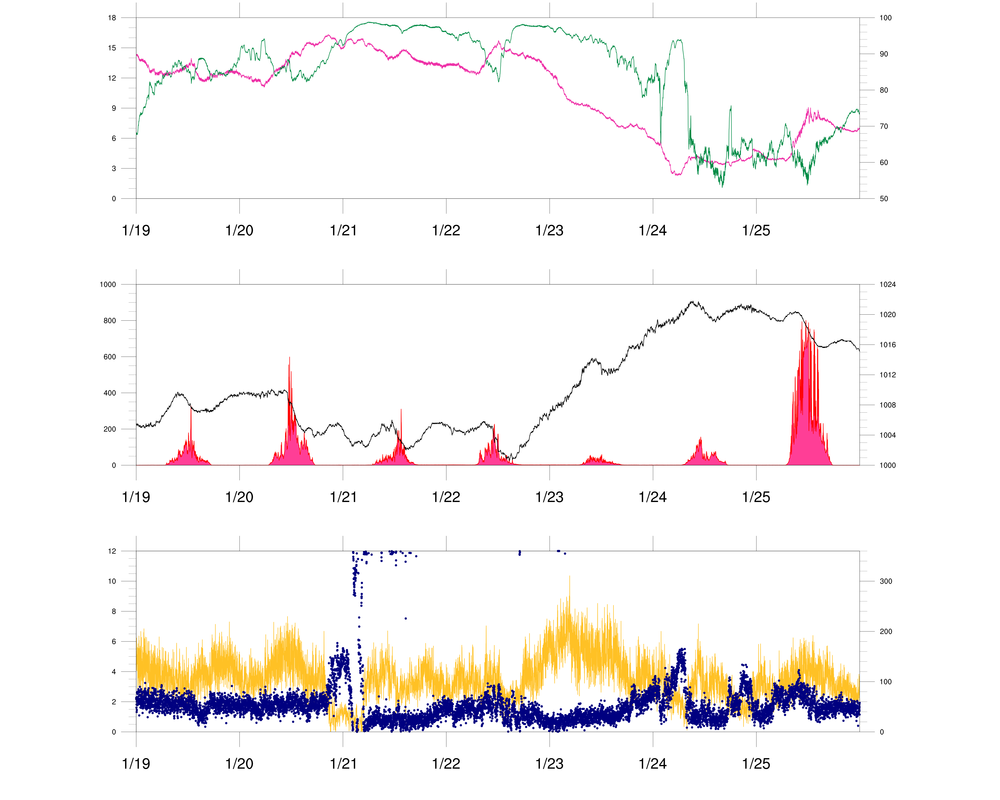
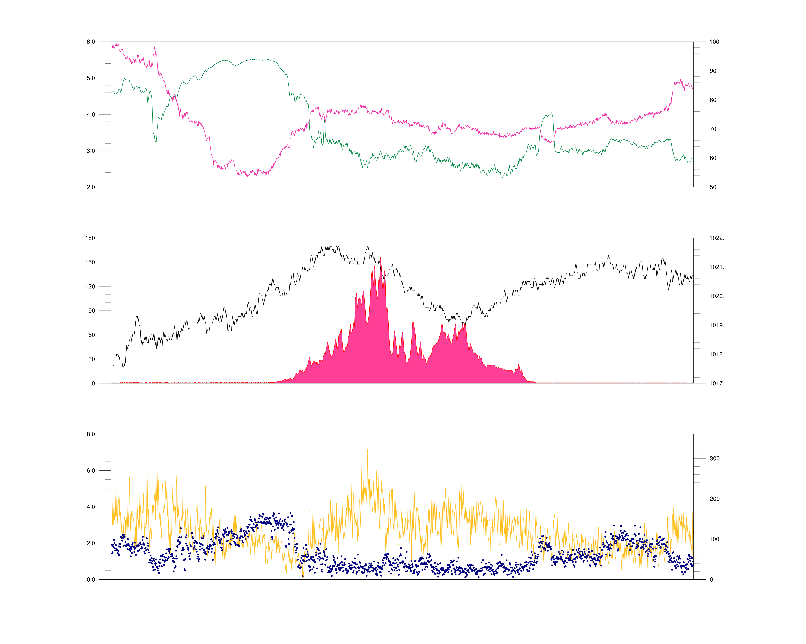

# Homework 5

## Analysis

- 粉紅色: 溫度，綠色: 相對濕度
- 黑色: 地面氣壓，紅色: 輻照率
- 黃色: 風速，藍色: 風向

| 本週時序圖 | 01/24 時序圖 | 本週平均溫度、氣壓 |
|--|--|--|
|  |  |  |
| 原本的天氣型態較為固定，不過 01/22 中午開始，溫度開始下滑，相對濕度同時也下滑，原因是高壓系統帶來乾冷空氣所影響，另外我們發現 01/25 的 radiation 筆錢六天還高，代表該天較為晴朗，有高壓籠罩。 | 清晨，濕度、溫度兩者有很大的差距，不過地面氣壓、風速等並無明顯變化 | 我們可看出 01/22 後，台灣開始受高壓影響，溫度開始下降 |

總結：看起來是冬季高壓入境，為台灣帶來大幅度降溫。

---

## Project Structure
```
PROJECT_ROOT
├── ncu10m/
│   ├── 160119.obs
│   ├── 160120.obs
│   ├── 160121.obs
│   ├── 160122.obs
│   ├── 160123.obs
│   ├── 160124.obs
│   └── 160125.obs
├── 1601.obs
├── main.ncl
├── main.py
└── README.md
```

## How to compile

```
python3 main.py
ncl main.ncl
```