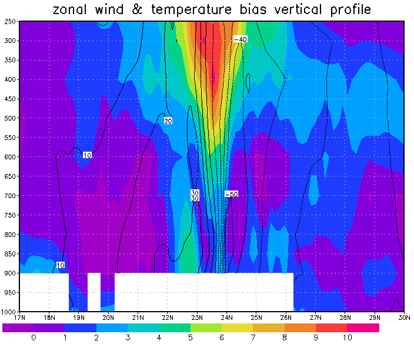

# 天氣學與天氣分析---作業六
#### 颱風分析  
### 資料檔說明：  
**檔案名稱：**`fanapid.dat`、`fanapid.ctl`  
**資料內容：**   
個案時間 2010/9/19/00Z  
定壓面為 1000、900、850、800、700、600、500、400、300、250mb  
變數有 U、V、W、T (T 為扣除每層溫度平均的偏差場)  
範圍 95E~145E、4N~43N  
網格數 252*252

**作業內容：**    
1. 繪製水平 850、500、300mb 的 (a)氣流線與等風速場，(b)風向量
場與垂直速度場
2. 繪製通過颱風中心的垂直剖面圖 (a)經向剖面：U 風場與溫度偏差
場，(b)緯向剖面：V 風場與溫度偏差場，(c)垂直速度
3. 找出各變數場(U、V、W、T)在水平與垂直結構上的極值位置
4. 利用以上結果討論颱風在水平、垂直結構上的特性與原因  
(P.S.繪圖區域以颱風中心為主)

| 850 mb streamline and wind speed field| 850 mb wind field and vertical velocity| zonal wind and temperature bais vertical profile |
|-|-|-|
|| | |

**繳交內容：**  
9 張圖 + 分析討論報告 + 讀檔與繪圖程式碼  
將檔案製成壓縮檔後再上傳 ee-class，壓縮檔檔名格式：`學號+姓名+作業代號.rar`  
繳交期限：2023/06/01