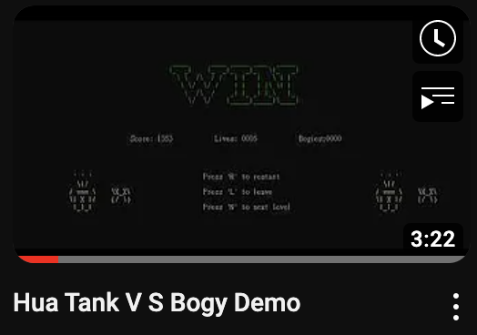
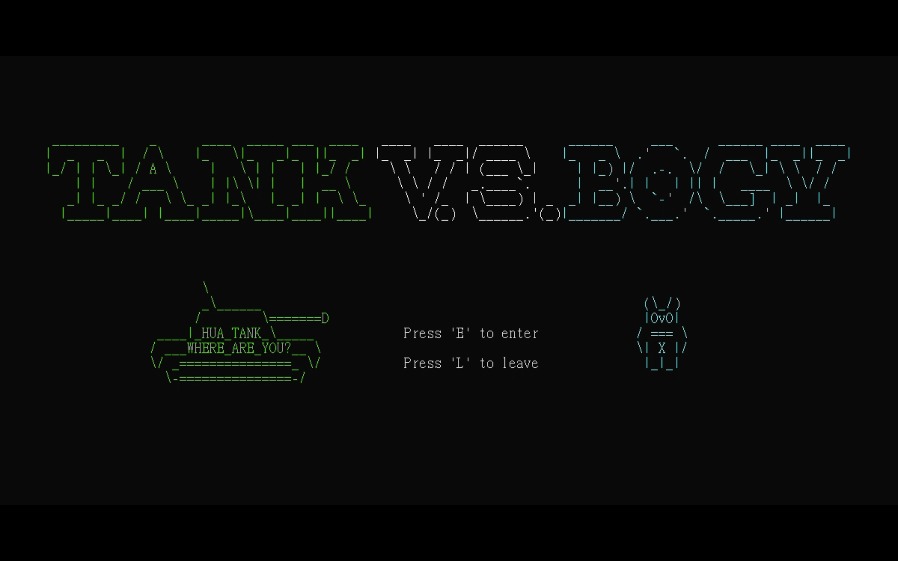
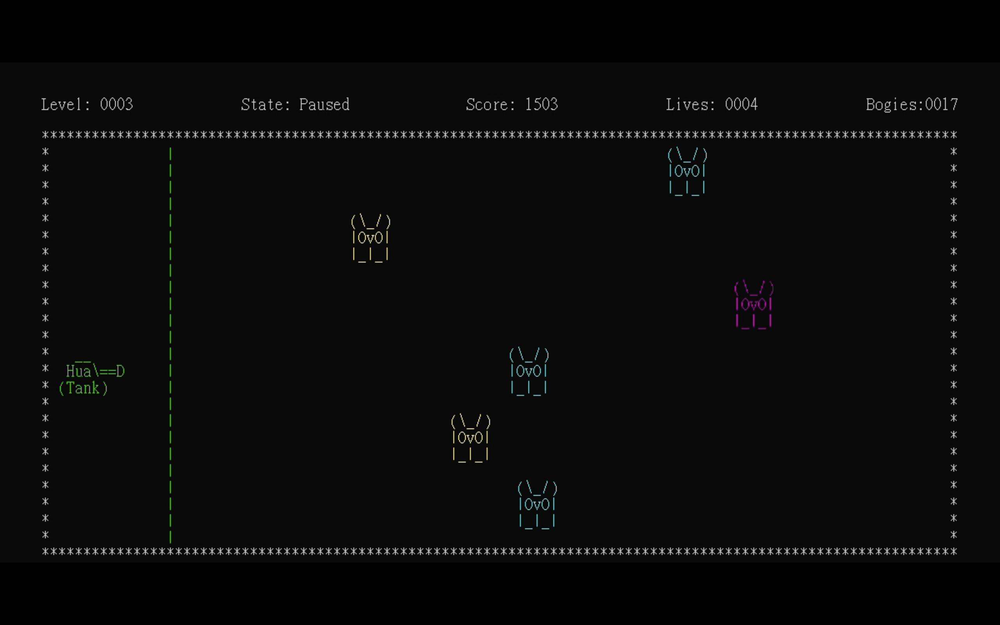
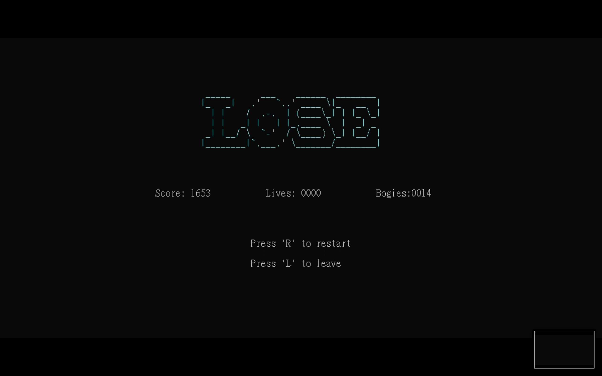

# Hua Tank V.S. Bogy

This is the project from the course **CE2012 - Assembly Language and System Programming** in NCU.

---

## Group: 12

## Team Members

|  Name  | Student Number |    Divide and Conquer       |
|--------|----------------|-----------------------------|
|  林群賀 |   109601003    | GUI and the basic functions |
|  謝文喨 |   109601005    | GUI and the basic functions |
|  陳俊宇 |   110502534    | GUI and the basic functions |
|  花靖傑 |   110502560    |     Hua Tank and No Work    |


---

## Developing Enviroment:

* ### Programming Language: Assembly x86
* ### Developing Tool: Visual Studio 2022

## How to use this project? (with ssh key)

``` shell
❯ $ git clone git@github.com:1chooo/Tank.git

❯ $ cd Tank/finalProjectPro/Debug
❯ $ ./finalProjectPro.exe
```

---

## Demo Video:

[](https://www.youtube.com/watch?v=LDo21oNI0Ws)


## Demo Docs:

* [Slide (Demo used)](assets/docs/[CE2012]_final_demo.pdf)
* [Docs (Report used)](assets/docs/[CE2012]_final_report.pdf)

---

<!-- <object data="http://yoursite.com/the.pdf" type="application/pdf" width="700px" height="700px">
    <embed src="http://yoursite.com/the.pdf">
        <p>This browser does not support PDFs. Please download the PDF to view it: <a href="http://yoursite.com/the.pdf">Download PDF</a>.</p>
    </embed>
</object> -->

## Game Scene


### Start Scene


### Rule Scene


### Game Stage


### Playing Scene


### Paused Scene


### Win Scene


### Lose Scene



## How to start the game
### Roles Intro


#### Tank 
```
       \                
       _\______         
      /        \=======D
 ____|_HUA_TANK_\_____  
/ ___WHERE_ARE_YOU?__ \     __    
\/ _===============_ \/    Hua\==D
  \-===============-/     (Tank)  
```

#### Bogy

```
 (\_/) 
 |OvO| 
/ === \  (\_/)
\| X |/  |OvO|
 |_|_|   |_|_|
```

#### Bogy Animation
```
 ' (\_/)  '    (\_/)  \ | / (\_/)  ' | '  '         ' ' '                             
' /X_X/  ' \|'/X_X/  ' \|/ '/X_X/ ' \|/ '  '\X_X\    \|/              '|'             
/ === \  / === \     / === \      / === \    (/ \) / === \    \X_X\ / === \           
\| X |/  \| X |/     \| X |/      \| X |/          \| X |/    (/ \) \| X |/      \X_X\
 |_|_|    |_|_|       |_|_|        |_|_|            |_|_|            |_|_|       (/ \) 
```

#### Bullets
```
NOWORK
```


#### Our Rules

```
*******************************************************************
*                       Game Introduction:                        *
*             Control the Hua Tank to kill the Bogy.              *
*              Don't let Bogy cross the green line,               *
*                 or your life will shock down!!                  *
*   Start with 10 lives, once the live reaches zero, you lose!!   *
*      Kill the last monsters, if you still alive, you win!!      *
*                                                                 *
*                    How to control the tank:                     *
*                + press 'up'    to move up                       *
*                + press 'down'  to move down                     *
*                + press 'right' to fire bullet                   *
*                                                                 *
*                          How to play:                           *
*                + press 'space' to start game                    *
*                + press 'P'     to pause game                    *
*******************************************************************
```

## LICENSE
[MIT License](LICENSE)