# Chapter 02 - Operating-System Structures <!-- omit in toc -->

**Table of Contents**
- [Operating-System Services](#operating-system-services)
  - [Functions that are helpful to the user provided by OS Services](#functions-that-are-helpful-to-the-user-provided-by-os-services)
- [User and Operating System-Interface](#user-and-operating-system-interface)
  - [Command Line Interface (CLI)](#command-line-interface-cli)
  - [User Operating System Interface](#user-operating-system-interface)
  - [Touch Screen](#touch-screen)
- [System Calls](#system-calls)
  - [Implementation of System Calls](#implementation-of-system-calls)
  - [System Call Parameter Passing](#system-call-parameter-passing)
  - [Types of System Calls](#types-of-system-calls)
  - [Ardunio](#ardunio)
  - [Free BSD](#free-bsd)
- [System Services](#system-services)
- [Linker and Loader](#linker-and-loader)
- [Why Applications are Operating System Specific](#why-applications-are-operating-system-specific)
- [Design and Implementation](#design-and-implementation)
  - [Policy and Mechanism](#policy-and-mechanism)
  - [Implementation](#implementation)
- [Operating System Structure](#operating-system-structure)
  - [Monolithic Structure – Original UNIX](#monolithic-structure--original-unix)
  - [Traditional UNIX System Structure](#traditional-unix-system-structure)
  - [Linux System Structure](#linux-system-structure)
  - [Layered Approach](#layered-approach)
  - [Microkernels](#microkernels)
  - [Modules](#modules)
  - [Hybrid Systems](#hybrid-systems)
  - [macOS and iOS Structure](#macos-and-ios-structure)
  - [Darwin](#darwin)
  - [iOS](#ios)
  - [Android](#android)
- [Building and Booting an Operating System](#building-and-booting-an-operating-system)
  - [Building and Booting Linux](#building-and-booting-linux)
  - [System Boot](#system-boot)
- [Operating System Debugging](#operating-system-debugging)
  - [Performance Tuning](#performance-tuning)
  - [Tracing](#tracing)
  - [BCC](#bcc)
  - [Linux bcc/BPF Tracing Tools](#linux-bccbpf-tracing-tools)

## Operating-System Services

Provide an environment for execution of programs and services to programs and users.

### Functions that are helpful to the user provided by OS Services

- **User Interface**: CLI, GUI, Batch, Touch Screen
- **Program Execution**: be able to **load a program into memory** and **ensure it can run successfully or handle any errors** that occur.
- **I/O Operations**: A running program may require I/O, which may involve a file or an I/O device.
- **File-system Manipulation**: Programs need to read and write files and directories, create and delete them, search them, list file Information, permission management.
- **Communications**: Processes may exchange information, on the same computer or between computers over a network or shared memmory or tgrough message passing.
- **Error detection**: OS needs to be constantly aware of possible errors.
  - May occur in the CPU and memory hardware, in I/O devices, in user program. 
  - For each type of error, OS should take the appropriate action to ensure correct and consistent computing.
  - Debugging facilities can greatly enhance the user’s and programmer’s abilities to efficiently use the system
- **Resource allocation**: When multiple users or multiple jobs running concurrently, resources must be allocated to each of them.
  - Many types of resources:  CPU cycles, main memory, file storage, I/O devices.
- **Logging:** To keep track of which users use how much and what kinds of computer resources
- **Protection and security:** The owners of information stored in a multiuser or networked computer system may want to control use of that information, concurrent processes should not interfere with each other
  - Protection involves ensuring that all access to system resources is controlled
  - Security of the system from outsiders requires user authentication, extends to defending external I/O devices from invalid access attempts

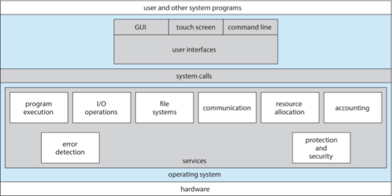

## User and Operating System-Interface

### Command Line Interface (CLI)

- CLI allows direct command entry
- Sometimes implemented in kernel, sometimes by systems program
- Sometimes multiple flavors implemented – shells
- Primarily fetches a command from user and executes it
- Sometimes commands built-in, sometimes just names of programs
  - If the latter, adding new features doesn’t require shell modification

### User Operating System Interface

- User-friendly desktop metaphor interface
  - Usually mouse, keyboard, and monitor
  - Icons represent files, programs, actions, etc
  - Various mouse buttons over objects in the interface cause various actions (provide information, options, execute function, open directory (known as a folder)
  - Invented at Xerox PARC
- Many systems now include both CLI and GUI interfaces
  - Microsoft Windows is GUI with CLI “command” shell
  - Apple Mac OS X is “Aqua” GUI interface with UNIX kernel underneath and shells available
  - Unix and Linux have CLI with optional GUI interfaces (CDE, KDE, GNOME)

### Touch Screen

- Touchscreen devices require new interfaces
  - Mouse not possible or not desired
  - Actions and selection based on gestures
  - Virtual keyboard for text entry
- Voice commands

## System Calls

- Programming interface to the services provided by the OS
- Typically written in a high-level language (C or C++)
- Mostly accessed by programs via a high-level Application Programming Interface (API) rather than direct system call use
- Three most common APIs are Win32 API for Windows, POSIX API for POSIX-based systems (including virtually all versions of UNIX, Linux, and Mac OS X), and Java API for the Java virtual machine (JVM)

> [!NOTE]
> the system-call names used throughout this text are generic

| Example of System Calls             | Example of Standard API         |
| ----------------------------------- | ------------------------------- |
|  | 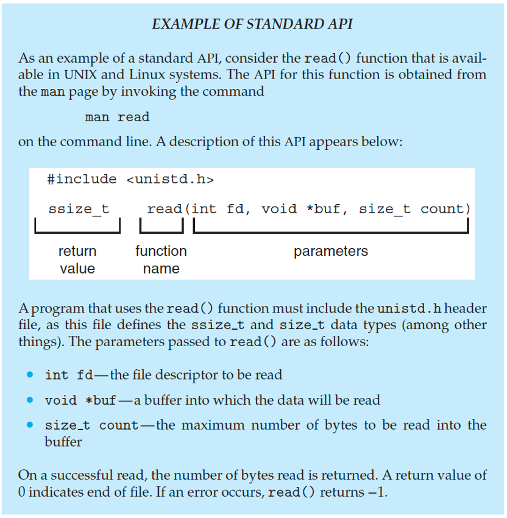 |

### Implementation of System Calls

- Typically, a number is associated with each system call
  - **System-call interface** maintains a table indexed according to these numbers
- The system call interface invokes the intended system call in OS kernel and returns status of the system call and any return values
- The caller need know nothing about how the system call is implemented
  - Just needs to obey API and understand what OS will do as a result call
  - Most details of  OS interface hidden from programmer by API  
    - Managed by run-time support library (set of functions built into libraries included with compiler)

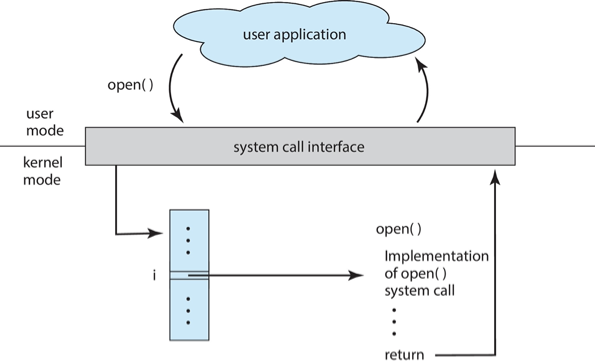

### System Call Parameter Passing

- Often, more information is required than simply identity of desired system call
  - Exact type and amount of information vary according to OS and call
- Three general methods used to pass parameters to the OS
  - Simplest:  pass the parameters in registers
    -  In some cases, may be more parameters than registers
  - Parameters stored in a block, or table, in memory, and address of block passed as a parameter in a register 
    - This approach taken by Linux and Solaris
  - Parameters placed, or pushed, onto the stack by the program and popped off the stack by the operating system
  - Block and stack methods do not limit the number or length of parameters being passed

Parameters Passing via Table:

### Types of System Calls

| Category   | Operations |
| ---------- | ---------- |
| Process control | <ul><li>end, abort</li><li>load, execute</li><li>create process, terminate process</li><li>get process attributes, set process attributes</li><li>wait for time</li><li>wait event, signal event</li><li>allocate and free memory</li><li>dump memory if error</li><li>debugger for determining bugs, single step execution</li><li>locks for managing access to shared data between processes</li></ul> |
| File management | <ul><li>create file, delete file</li><li>open, close file</li><li>read, write, reposition</li><li>get and set file attributes</li></ul> |
| Device management | <ul><li>request device, release device</li><li>read, write, reposition</li><li>get device attributes, set device attributes</li><li>logically attach or detach devices</li></ul> |
| Information maintenance | <ul><li>get time or date, set time or date</li><li>get system data, set system data</li><li>get and set process, file, or device attributes</li></ul> |
| Communications | <ul><li>create, delete communication connection</li><li>send, receive messages if message passing model to host name or process name</li><li>shared-memory model create and gain access to memory regions</li><li>transfer status information</li><li>attach and detach remote devices</li></ul> |
| Protection | <ul><li>control access to resources</li><li>get and set permissions</li><li>allow and deny user access</li></ul> |

| Example of Windows and Unix System call | Standard C Library Example |
| ----------------------------------- | ------------------------------- |
|  | 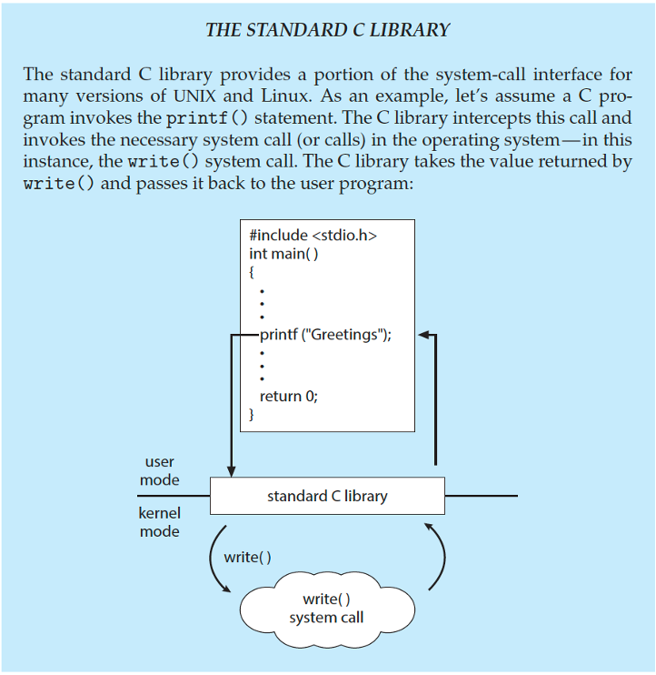 |

C program invoking `printf()` library call, which calls `write()` system call

### Ardunio

- Single-tasking
- No operating system
- Programs (sketch) loaded via USB into flash memory
- Single memory space
- Boot loader loads program
- Program exit -> shell reloaded

### Free BSD

- Unix variant
- Multitasking
- User login -> invoke user’s choice of shell
- Shell executes `fork()` system call to create process
  - Executes `exec()` to load program into process
  - Shell waits for process to terminate or continues with user commands
- Process exits with:
  - code = 0 – no error 
  - code > 0 – error code

## System Services
- System programs provide a convenient environment for program development and execution.  They can be divided into:
  - File manipulation 
  - Status information sometimes stored in a file
  - Programming language support
  - Program loading and execution
  - Communications
  - Background services
  - Application programs
- Most users’ view of the operation system is defined by system programs, not the actual system calls
- Provide a convenient environment for program development and execution
  - Some of them are simply user interfaces to system calls; others are considerably more complex
- File management - Create, delete, copy, rename, print, dump, list, and generally manipulate files and directories
- Status information
  - Some ask the system for info - date, time, amount of available memory, disk space, number of users
  - Others provide detailed performance, logging, and debugging information
  - Typically, these programs format and print the output to the terminal or other output devices
  - Some systems implement  a registry - used to store and retrieve configuration information
- File modification
  - Text editors to create and modify files
  - Special commands to search contents of files or perform transformations of the text
- Programming-language support - Compilers, assemblers, debuggers and interpreters sometimes provided
- Program loading and execution- Absolute loaders, relocatable loaders, linkage editors, and overlay-loaders, debugging systems for higher-level and machine language
- Communications - Provide the mechanism for creating virtual connections among processes, users, and computer systems
  - Allow users to send messages to one another’s screens, browse web pages, send electronic-mail messages, log in remotely, transfer files from one machine to another
- Background Services
  - Launch at boot time
    - Some for system startup, then terminate
    - Some from system boot to shutdown
  - Provide facilities like disk checking, process scheduling, error logging, printing
  - Run in user context not kernel context
  - Known as services, subsystems, daemons 
- Application programs
  - Don’t pertain to system
  - Run by users
  - Not typically considered part of OS
  - Launched by command line, mouse click, finger poke

## Linker and Loader

- Source code compiled into object files designed to be loaded into any physical memory location – relocatable object file
- Linker combines these into single binary executable file
  - Also brings in libraries
- Program resides on secondary storage as binary executable
- Must be brought into memory by loader to be executed
  - Relocation assigns final addresses to program parts and adjusts code and data in program to match those addresses
- Modern general purpose systems don’t link libraries into executables
  - Rather, dynamically linked libraries (in Windows, DLLs) are loaded as needed, shared by all that use the same version of that same library (loaded once)
- Object, executable files have standard formats, so operating system knows how to load and start them

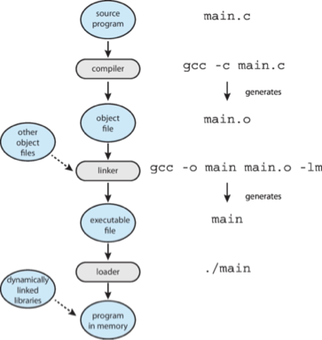

## Why Applications are Operating System Specific

- Apps compiled on one system usually not executable on other operating systems
- Each operating system provides its own unique system calls
  - Own file formats, etc.
- Apps can be multi-operating system
  - Written in interpreted language like Python, Ruby, and interpreter available on multiple operating systems
  - App written in language that includes a VM containing the running app (like Java)
  - Use standard language (like C), compile separately on each operating system to run on each
- Application Binary Interface (ABI) is architecture equivalent of API, defines how different components of binary code can interface for a given operating system on a given architecture, CPU, etc. 

## Design and Implementation

- Design and Implementation of OS is not "solvable", but some approaches have proven successful
- Internal structure of different Operating Systems  can vary widely
- Start the design by defining goals and specifications 
- Affected by choice of hardware, type of system
  - User goals and System goals
  - User goals – operating system should be convenient to use, easy to learn, reliable, safe, and fast
- System goals – operating system should be easy to design, implement, and maintain, as well as flexible, reliable, error-free, and efficient
- Specifying and designing an OS is highly creative task of software engineering

### Policy and Mechanism

- Policy:   What needs to be done? 
  - Example: Interrupt after every 100 seconds
- Mechanism:  How to do something?
  - Example: timer
- Important principle: separate policy from mechanism
- The separation of policy from mechanism is a very important principle, it allows maximum flexibility if policy decisions are to be changed later.
  - Example: change 100 to 200

### Implementation

- Much variation
  - Early OSes in assembly language
  - Then system programming languages like Algol, PL/1
  - Now C, C++
- Actually usually a mix of languages
  - Lowest levels in assembly
  - Main body in C
  - Systems programs in C, C++, scripting languages like PERL, Python, shell scripts
- More high-level language easier to port to other hardware
  - But slower
- Emulation can allow an OS to run on non-native hardware

## Operating System Structure

- General-purpose OS is very large program
- Various ways to structure ones
  - Simple structure – MS-DOS
  - More complex – UNIX
  - Layered – an abstraction
  - Microkernel – Mach

### Monolithic Structure – Original UNIX

- UNIX – limited by hardware functionality, the original UNIX operating system had limited structuring.  
- The UNIX OS consists of two separable parts
  - Systems programs
  - The kernel
    - Consists of everything below the system-call interface and above the physical hardware
    - Provides the file system, CPU scheduling, memory management, and other operating-system functions; a large number of functions for one level

### Traditional UNIX System Structure

Beyond simple but not fully layered

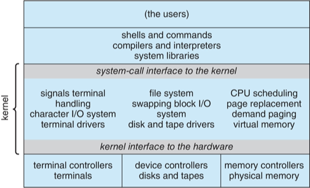

### Linux System Structure

Monolithic plus modular design

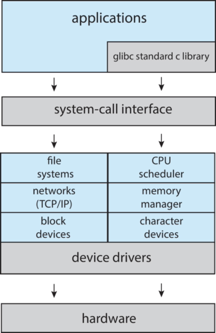

### Layered Approach

- The operating system is divided into a number of layers (levels), each built on top of lower layers.  The bottom layer (layer 0), is the hardware; the highest (layer N) is the user interface.
- With modularity, layers are selected such that each uses functions (operations) and services of only lower-level layers

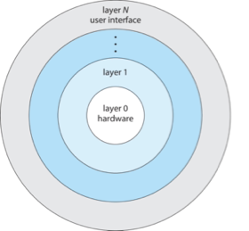

### Microkernels

- Moves as much from the kernel into user space
- Mach is an example of microkernel
  - Mac OS X kernel (Darwin) partly based on Mach
- Communication takes place between user modules using message passing
- Benefits:
  - Easier to extend a microkernel
  - Easier to port the operating system to new architectures
  - More reliable (less code is running in kernel mode)
  - More secure
- Detriments:
  - Performance overhead of user space to kernel space communication

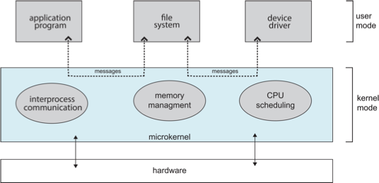

### Modules

- Many modern operating systems implement loadable kernel modules (LKMs)
  - Uses object-oriented approach
  - Each core component is separate
  - Each talks to the others over known interfaces
  - Each is loadable as needed within the kernel
- Overall, similar to layers but with more flexible
  - Linux, Solaris, etc.

### Hybrid Systems

- Most modern operating systems are not one pure model
  - Hybrid combines multiple approaches to address performance, security, usability needs
  - Linux and Solaris kernels in kernel address space, so monolithic, plus modular for dynamic loading of functionality
  - Windows mostly monolithic, plus microkernel for different subsystem personalities
- Apple Mac OS X hybrid, layered, Aqua UI plus Cocoa programming environment
  - Below is kernel consisting of Mach microkernel and BSD Unix parts, plus I/O kit and dynamically loadable modules (called kernel extensions)

### macOS and iOS Structure

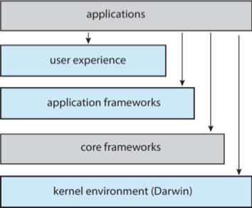

### Darwin

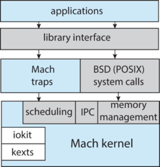

### iOS

- Apple mobile OS for iPhone, iPad
  - Structured on Mac OS X, added functionality
  - Does not run OS X applications natively
    - Also runs on different CPU architecture (ARM vs. Intel)
  - Cocoa Touch Objective-C API for developing apps
  - Media services layer for graphics, audio, video
  - Core services provides cloud computing, databases
  - Core operating system, based on Mac OS X kernel

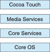

### Android

- Developed by Open Handset Alliance (mostly Google)
  - Open Source
- Similar stack to IOS
- Based on Linux kernel but modified
  - Provides process, memory, device-driver management
  - Adds power management 
- Runtime environment includes core set of libraries and Dalvik virtual machine
  - Apps developed in Java plus Android API
    - Java class files compiled to Java bytecode then translated to executable than runs in Dalvik VM
- Libraries include frameworks for web browser (webkit), database (SQLite), multimedia, smaller libc

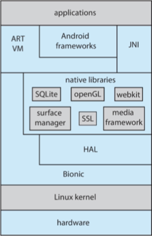

## Building and Booting an Operating System

- Operating systems generally designed to run on a class of systems with variety of perpherals
- Commonly, operating system already installed on purchased computer
  - But can build and install some other operating systems
  - If generating an operating system from scratch
    - Write the operating system source code
    - Configure the operating system for the system on which it will run
    - Compile the operating system
    - Install the operating system
    - Boot the computer and its new operating system

### Building and Booting Linux

- Download Linux source code (http://www.kernel.org)
- Configure kernel via “make menuconfig”
- Compile the kernel using “make”
  - Produces vmlinuz, the kernel image
  - Compile kernel modules via “make modules”
  - Install kernel modules into vmlinuz via “make modules_install”
  - Install new kernel on the system via “make install”

### System Boot

- When power initialized on system, execution starts at a fixed memory location
- Operating system must be made available to hardware so hardware can start it
  - Small piece of code – bootstrap loader, BIOS, stored in ROM or EEPROM locates the kernel, loads it into memory, and starts it
  - Sometimes two-step process where boot block at fixed location loaded by ROM code, which loads bootstrap loader from disk
  - Modern systems replace BIOS with Unified Extensible Firmware Interface (UEFI)
- Common bootstrap loader, GRUB, allows selection of kernel from multiple disks, versions, kernel options
- Kernel loads and system is then running
- Boot loaders frequently allow various boot states, such as single user mode

## Operating System Debugging

- Debugging is finding and fixing errors, or bugs
- Also performance tuning
- OS generate log files containing error information
- Failure of an application can generate core dump file capturing memory of the process
- Operating system failure can generate crash dump file containing kernel memory
- Beyond crashes, performance tuning can optimize system performance
  - Sometimes using trace listings of activities, recorded for analysis
  - Profiling is periodic sampling of instruction pointer to look for statistical trends
- Kernighan’s Law: “Debugging is twice as hard as writing the code in the first place. Therefore, if you write the code as cleverly as possible, you are, by definition, not smart enough to debug it.”

### Performance Tuning

- Improve performance by removing bottlenecks
- OS must provide means of computing and displaying measures of system behavior
- For example, “top” program or Windows Task Manager

### Tracing

- Collects data for a specific event, such as steps involved in a system call invocation
- Tools include
  - strace – trace system calls invoked by a process
  - gdb – source-level debugger
  - perf – collection of Linux performance tools
  - tcpdump – collects network packets

### BCC

- Debugging interactions between user-level and kernel code nearly impossible without toolset that understands both and an instrument their actions
- BCC (BPF Compiler Collection) is a rich toolkit providing tracing features for Linux
  - See also the original DTrace
- For example, disksnoop.py traces disk I/O activity
  
- Many other tools (next slide)

### Linux bcc/BPF Tracing Tools

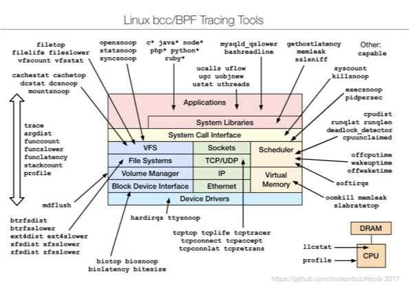
