# Chaper 03 - Processes

## Process Concept

- An operating system executes a variety of programs that run as a process.
- Process – a program in execution; process execution must progress in sequential fashion. No parallel execution of instructions of a  single process
- Multiple parts
  - The program code, also called text section
  - Current activity including program counter, processor registers
  - Stack containing temporary data
  - Function parameters, return addresses, local variables
  - Data section containing global variables
  - Heap containing memory dynamically allocated during run time
- Program is passive entity stored on disk (executable file); process is active 
  - Program becomes process when an executable file is loaded into memory
- Execution of program started via GUI mouse clicks, command line entry of its name, etc.
- One program can be several processes
  - Consider multiple users executing the same program

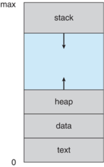

```c
#include <stdio.h>
#include <stdlib.h>

int x;
int y = 15;

int main(int argc, char *argv[]) {
    int *values;
    int i;

    values = (int *)malloc(10 * sizeof(int));

    for (i = 0; i < 5; i++) {
        values[i] = i;
    }
    return 0;
}
```

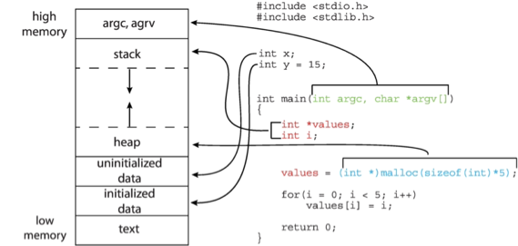

### Process State

- New: The process is being created
- Running: Instructions are being executed
- Waiting: The process is waiting for some event to occur
- Ready: The process is waiting to be assigned to a processor
- Terminated: The process has finished execution

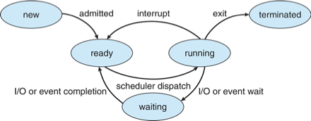

### Process Control Block (PCB)

| Process Control Block (PCB) | Description |
| --- | --- |
| Process state | New, ready, running, waiting, terminated |
| Program counter | Location of next instruction to execute |
| CPU registers | Contents of all process-centric registers |
| CPU scheduling information | Priorities, scheduling queue pointers |
| Memory-management information | Memory allocated to the process |
| Accounting information | CPU used, clock time elapsed since start, time limits |
| I/O status information | I/O devices allocated to process, list of open files |

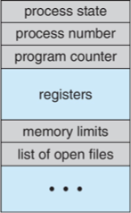


### Threads

- So far, process has a single thread of execution
  - Consider having multiple program counters per process
    - Multiple locations can execute at once
- Multiple threads of control -> threads
- Must then have storage for thread details, multiple program counters in PCB
- Explore in detail in Chapter 4

### Process Representation in Linux

Represented by the C structure `task_struct`

```c
pid t_pid; 			            /* process identifier */ 
long state; 			          /* state of the process */ 
unsigned int time_slice 	  /* scheduling information */ 
struct task_struct *parent; /* this process’s parent */ 
struct list_head children;  /* this process’s children */ 
struct files_struct *files; /* list of open files */ 
struct mm_struct *mm; 	    /* address space of this process */
```

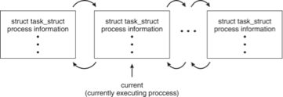

## Process Scheduling

- Process scheduler selects among available processes for next execution on CPU core
- Goal -- Maximize CPU use, quickly switch processes onto CPU core
- Maintains scheduling queues of processes
  - Ready queue – set of all processes residing in main memory, ready and waiting to execute
  - Wait queues – set of processes waiting for an event (i.e., I/O)
  - Processes migrate among the various queues

### Ready and Wait Queues

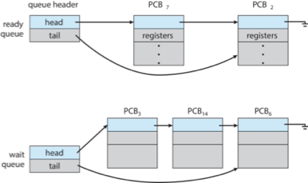

### Representation of Process Scheduling

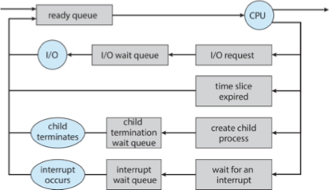

### CPU Switch From Process to Process

A context switch occurs when the CPU switches from one process to another.


### Context Switch

- When CPU switches to another process, the system must save the state of the old process and load the saved state for the new process via a context switch
- Context of a process represented in the PCB
- Context-switch time is pure overhead; the system does no useful work while switching
  - The more complex the OS and the PCB, the longer the context switch
- Time dependent on hardware support
  - Some hardware provides multiple sets of registers per CPU
  - multiple contexts loaded at once

### Multitasking in Mobile Systems

- Some mobile systems (e.g., early version of iOS) allow only one process to run, others suspended
- Due to screen real estate, user interface limits iOS provides for a 
  - Single foreground process - controlled via user interface
  - Multiple background processes – in memory, running, but not on the display, and with limits
  - Limits include single, short task, receiving notification of events, specific long-running tasks like audio playback
- Android runs foreground and background, with fewer limits
  - Background process uses a service to perform tasks
  - Service can keep running even if background process is suspended
  - Service has no user interface, small memory use


## Operations on Processes

### Process Creation

- Parent process create children processes, which, in turn create other processes, forming a tree of processes
- Generally, process identified and managed via a process identifier (`pid`)
- Resource sharing options
  - Parent and children share all resources
  - Children share subset of parent’s resources
  - Parent and child share no resources
- Execution options
  - Parent and children execute concurrently
  - Parent waits until children terminate
- Address space
  - Child duplicate of parent
  - Child has a program loaded into it
- UNIX examples
  - `fork()` system call creates new process
  - `exec()` system call used after a `fork()` to replace the process' memory space with a new program
  - Parent process calls `wait()` waiting for the child to terminate

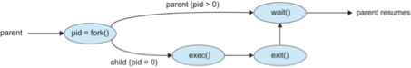


### A Tree of Processes in Linux

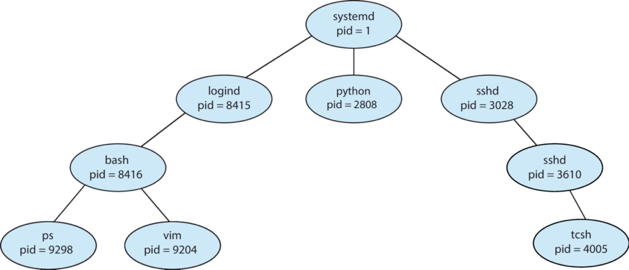

### C Program Forking Separate Process

```c
#include <sys/types.h>
#include <stdio.h>
#include <unistd.h>

int main() {
    pid_t pid;

    /* fork a child process */
    pid = fork();

    if (pid < 0) {
        /* error occurred */
        fprintf(stderr, "Fork failed");
        return 1;
    } else if (pid == 0) {
        /* child process */
        execlp("/bin/ls", "ls", NULL);
    } else {
        /* parent process */
        /* parent will wait for the child to complete */
        wait(NULL);
        printf("Child Complete\n");
    }

    return 0;
}
```

### Creating a Separate Process via Windows API


```c
#include <stdio.h>
#include <windows.h>

int main(void) {
    STARTUPINFO si;
    PROCESS_INFORMATION pi;

    /* allocate memory */
    ZeroMemory(&si, sizeof(si));
    si.cb = sizeof(si);
    ZeroMemory(&pi, sizeof(pi));

    /* create child process */
    if (!CreateProcess(
        NULL,   /* use command line */
        "C:\\Windows\\System32\\mspaint.exe",   /* command */
        NULL,   /* don't inherit process handle */
        NULL,   /* don't inherit thread handle */
        FALSE,  /* disable handle inheritance */
        0,      /* no creation flags */
        NULL,   /* use parent's environment block */
        NULL,   /* use parent's existing directory */
        &si,    /* pointer to STARTUPINFO structure */
        &pi     /* pointer to PROCESS_INFORMATION structure */
    )) {
        fprintf(stderr, "Create Process failed");
        return -1;
    }
    /* parent will wait for the child to complete */
    WaitForSingleObject(pi.hProcess, INFINITE);
    printf("Child Complete\n");

    /* close handles */
    CloseHandle(pi.hProcess);
    CloseHandle(pi.hThread);

    return 0;
}
```

### Process Termination

- Process executes last statement and then asks the operating system to delete it using the `exit()` system call.
  - Returns status data from child to parent (via `wait()`)
  - Process' resources are deallocated by operating system
- Parent may terminate the execution of children processes using the `abort()` system call. Some reasons for doing so:
  - Child has exceeded allocated resources
  - Task assigned to child is no longer required
  - The parent is exiting, and the operating systems does not allow  a child to continue if its parent terminates
- Some operating systems do not allow child to exists if its parent has terminated. If a process terminates, then all its children must also be terminated.
  - cascading termination. All children, grandchildren, etc., are terminated.
  - The termination is initiated by the operating system.
- The parent process may wait for termination of a child process by using the `wait()` system call. The call returns status information and the pid of the terminated process `pid = wait(&status);`
- If no parent waiting (did not invoke `wait()`) process is a zombie
- If parent terminated without invoking` wait()`, process is an orphan

### Android Process Importance Hierarchy

- Mobile operating systems often have to terminate processes to reclaim system resources such as memory. From most to least important:
  - Foreground process
  - Visible process
  - Service process
  - Background process
  - Empty process
- Android will begin terminating processes that are least important.

### Multiprocess Architecture – Chrome Browser

- Many web browsers ran as single process (some still do)
  - If one web site causes trouble, entire browser can hang or crash
- Google Chrome Browser is multiprocess with 3 different types of processes: 
  - Browser process manages user interface, disk and network I/O
  - Renderer process renders web pages, deals with HTML, Javascript. A new renderer created for each website opened
    - Runs in sandbox restricting disk and network I/O, minimizing effect of security exploits
  - Plug-in process for each type of plug-in


## Interprocess Communication (IPC)

- Processes within a system may be independent or cooperating
- Cooperating process can affect or be affected by other processes, including sharing data
- Reasons for cooperating processes:
  - Information sharing
  - Computation speedup
  - Modularity
  - Convenience	
- Cooperating processes need **interprocess communication (IPC)**
- Two models of IPC
  - (a) Shared memory
  - (b) Message passing


### Producer-Consumer Problem

- Paradigm for cooperating processes:
  - producer process produces information that is consumed by a consumer process
- Two variations:
  - unbounded-buffer places no practical limit on the size of the buffer:
    - Producer never waits
    - Consumer waits if there is no buffer to consume
  - bounded-buffer assumes that there is a fixed buffer size
    - Producer must wait if all buffers are full
    - Consumer waits if there is no buffer to consume


## IPC in Shared-Memory Systems

- An area of memory shared among the processes that wish to communicate
- The communication is under the control of the users processes not the operating system.
- Major issues is to provide mechanism that will allow the user processes to synchronize their actions when they access shared memory. 
- Synchronization is discussed in great details in Chapters 6 & 7.

### Bounded-Buffer – Shared-Memory Solution
- Shared data
    ```c
    #define BUFFER_SIZE 10
    typedef struct {
        ...
    } item;

    item buffer[BUFFER_SIZE];
    int in = 0;
    int out = 0;
    ```
- Solution is correct, but can only use `BUFFER_SIZE - 1` elements

### Producer Process – Shared Memory

```c
item next_produced; 
while (true) { 
    /* produce an item in next produced */ 
    while (((in + 1) % BUFFER_SIZE) == out) 
        ; /* do nothing */ 
    buffer[in] = next_produced; 
    in = (in + 1) % BUFFER_SIZE; 
} 
```

### Consumer Process – Shared Memory

```c
item next_consumed; 

while (true) {
	while (in == out) 
        ; /* do nothing */
    next_consumed = buffer[out]; 
    out = (out + 1) % BUFFER_SIZE;

    /* consume the item in next consumed */ 
} 
```
    
### What about Filling all the Buffers?

- Suppose that we wanted to provide a solution to the consumer-producer problem that fills all the buffers. 
- We can do so by having an integer counter that keeps track of the number of full buffers.  
- Initially, counter is set to 0. 
- The integer counter is incremented by the producer after it produces a new buffer.
- The integer counter is and is decremented by the consumer after it consumes a buffer.

### Producer 

```c
while (true) {
	/* produce an item in next produced */ 
    
    while (counter == BUFFER_SIZE)  
        ; /* do nothing */ 
    buffer[in] = next_produced; 
    in = (in + 1) % BUFFER_SIZE; 
    counter++; 
} 
```

### Consumer

```c
while (true) {
    while (counter == 0) 
        ; /* do nothing */ 
    next_consumed = buffer[out]; 
    out = (out + 1) % BUFFER_SIZE; 	
        counter--; 
    /* consume the item in next consumed */ 
} 
```

### Race Condition

- counter++ could be implemented as
    ```c
    register1 = counter
    register1 = register1 + 1
    counter = register1
    ```
- counter-- could be implemented as
    ```c
    register2 = counter
    register2 = register2 - 1
    counter = register2
    ```
- Consider this execution interleaving with "count = 5" initially:
    ```c
    S0: producer execute register1 = counter         {register1 = 5}
    S1: producer execute register1 = register1 + 1   {register1 = 6} 
    S2: consumer execute register2 = counter        {register2 = 5} 
    S3: consumer execute register2 = register2 – 1  {register2 = 4} 
    S4: producer execute counter = register1         {counter = 6 } 
    S5: consumer execute counter = register2        {counter = 4}
    ```
- Question – why was there no race condition in the first solution (where at most N – 1) buffers can be filled? -> More in Chapter 6.


## IPC in Message-Passing Systems

- Processes communicate with each other without resorting to shared variables
- IPC facility provides two operations:
  - send(message)
  - receive(message)
- The message size is either fixed or variable
- If processes P and Q wish to communicate, they need to:
  - Establish a communication link between them
  - Exchange messages via send/receive
- Implementation issues:
  - How are links established?
  - Can a link be associated with more than two processes?
  - How many links can there be between every pair of communicating processes?
  - What is the capacity of a link?
  - Is the size of a message that the link can accommodate fixed or variable?
  - Is a link unidirectional or bi-directional?

### Implementation of Communication Link

- Physical:
  - Shared memory
  - Hardware bus
  - Network
- Logical:
  - Direct or indirect
  - Synchronous or asynchronous
  - Automatic or explicit buffering

### Direct Communication

- Processes must name each other explicitly:
  - send (P, message) – send a message to process P
  - receive(Q, message) – receive a message from process Q
- Properties of communication link
  - Links are established automatically
  - A link is associated with exactly one pair of communicating processes
  - Between each pair there exists exactly one link
  - The link may be unidirectional, but is usually bi-directional

### Indirect Communication

- Messages are directed and received from mailboxes (also referred to as ports)
  - Each mailbox has a unique id
  - Processes can communicate only if they share a mailbox
- Properties of communication link
  - Link established only if processes share a common mailbox
  - A link may be associated with many processes
  - Each pair of processes may share several communication links
  - Link may be unidirectional or bi-directional
- Operations
  - Create a new mailbox (port)
  - Send and receive messages through mailbox
  - Delete a mailbox
- Primitives are defined as:
  - send(A, message) – send a message to mailbox A
  - receive(A, message) – receive a message from mailbox A
- Mailbox sharing
  - $P_1$, $P_2$, and $P_3$ share mailbox A
  - $P_1$, sends; $P_2$ and $P_3$ receive
  - Who gets the message?
- Solutions
  - Allow a link to be associated with at most two processes
  - Allow only one process at a time to execute a receive operation
  - Allow the system to select arbitrarily the receiver.  Sender is notified who the receiver was.

### Synchronization

Message passing may be either blocking or non-blocking

- Blocking is considered synchronous
  - Blocking send -- the sender is blocked until the message is received
  - Blocking receive -- the receiver is  blocked until a message is available
- Non-blocking is considered asynchronous
  - Non-blocking send -- the sender sends the message and continue
  - Non-blocking receive -- the receiver receives:
    - A valid message,  or 
    - Null message
- Different combinations possible
  - If both send and receive are blocking, we have a rendezvous

### Producer-Consumer: Message Passing

#### Producer

```c
message next_produced;
while (true) {
    /* produce an item in next_produced */

    send(next_produced); 
} 
```

#### Consumer

```c
message next_consumed;
while (true) {
    receive(next_consumed)
    /* consume the item in next_consumed */
}
```

### Buffering

- Queue of messages attached to the link.
- Implemented in one of three ways
1. Zero capacity – no messages are queued on a link. Sender must wait for receiver (rendezvous)
2. Bounded capacity – finite length of n messages Sender must wait if link full
3. Unbounded capacity – infinite length  Sender never waits


## Examples of IPC Systems

### POSIX

- POSIX Shared Memory
  - Process first creates shared memory segment
  - `shm_fd = shm_open(name, O CREAT | O RDWR, 0666);`
  - Also used to open an existing segment
  - Set the size of the object `ftruncate(shm_fd, 4096);`
  - Use `mmap()` to memory-map a file pointer to the shared memory object
  - Reading and writing to shared memory is done by using the pointer returned by `mmap()`.

#### IPC POSIX Producer

```c
#include <stdio.h>
#include <stdlib.h>
#include <string.h>
#include <fcntl.h>
#include <sys/shm.h>
#include <sys/stat.h>

int main() {
    /* the size (in butes) of shared memory object */
    const int SIZE = 4096;
    /* name of the shared memory object */
    const char *name = "OS";
    /* strings written to shared memory */
    const char *message_0 = "Hello";
    const char *message_1 = "World!";

    /* shared memory file descriptor */
    int shm_fd;
    /* pointer to shared memory object */
    void *ptr;

    /* create the shared memory object */
    shm_fd = shm_open(name, O_CREAT | O_RDWR, 0666);
    /* configure the size of the shared memory object */
    ftruncate(shm_fd, SIZE);

    /* memory map the shared memory object */
    ptr = mmap(0, SIZE, PROT_WRITE, MAP_SHARED, shm_fd, 0);

    /* write to the shared memory object */
    sprintf(ptr, "%s", message_0);
    ptr += strlen(message_0);
    sprintf(ptr, "%s", message_1);
    ptr += strlen(message_1);

    return 0;
}
```

#### IPC POSIX Consumer

```c
#include <stdio.h>
#include <stdlib.h>
#include <fcntl.h>
#include <sys/shm.h>
#include <sys/stat.h>

int main() {
    /* the size (in bytes) of shared memory object */
    const int SIZE = 4096;
    /* name of the shared memory object */
    const char *name = "OS";
    /* shared memory file descriptor */
    int shm_fd;
    /* pointer to shared memory object */
    void *ptr;

    /* open the shared memory object */
    shm_fd = shm_open(name, O_RDONLY, 0666);
    /* memory map the shared memory object */
    ptr = mmap(0, SIZE, PROT_READ, MAP_SHARED, shm_fd, 0);

    /* read from the shared memory object */
    printf("%s", (char *)ptr);

    /* remove the shared memory object */
    shm_unlink(name);

    return 0;
}
```

### Mach

#### Mach Messages

```c
#include<mach/mach.h> 

struct message {
	mach_msg_header_t header; 
    int data; 
};
mach port t client; 
mach port t server;
```

#### Mach Message Passing - Client

```c
/* lient Code */
struct message message;

// construct the header
message.header.msgh_size = sizeof(message);
message.header.msgh_remote_port = server;
message.header.msgh_local_port = client;

// send the message
mach_msg(
    &message.header,    // message header
    MACH_SEND_MSG,      // sending a message
    sizeof(message),    // size of message sent
    0,      // maximum size of received message - unnecessary
    MACH_PORT_NULL,     // name of receive port - unnecessary
    MACH_MSG_TIMEOUT_NONE,  // no time outs
    MACH_PORT_NULL      // no notify port
);
```

#### Mach Message Passing - Server

```c
/* Server Code */

struct message message;

// receive the message
mach_msg(
    &message.header,    // message header
    MACH_RCV_MSG,       // sending a message
    0,      // size of message sent
    sizeof(message),    // maximum size of received message
    server,     // name of receive port
    MACH_MSG_TIMEOUT_NONE,  // no time outs
    MACH_PORT_NULL      // no notify port
);
```

### Examples of IPC Systems – Windows

- Message-passing centric via advanced local procedure call (LPC) facility
  - Only works between processes on the same system
  - Uses ports (like mailboxes) to establish and maintain communication channels
  - Communication works as follows:
    - The client opens a handle to the subsystem’s connection port object.
    - The client sends a connection request.
    - The server creates two private communication ports and returns the handle to one of them to the client.
    - The client and server use the corresponding port handle to send messages or callbacks and to listen for replies.


#### Local Procedure Calls in Windows

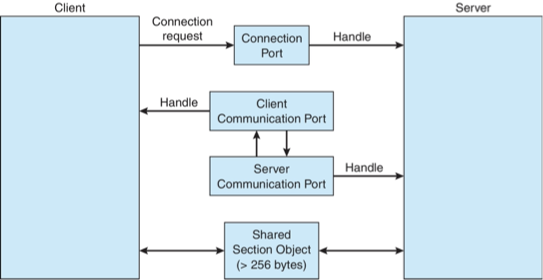

#### Pipes

- Acts as a conduit allowing two processes to communicate
- Issues:
  - Is communication unidirectional or bidirectional?
  - In the case of two-way communication, is it half or full-duplex?
  - Must there exist a relationship (i.e., parent-child) between the communicating processes?
  - Can the pipes be used over a network?
- Ordinary pipes – cannot be accessed  from outside the process that created it. Typically, a parent process creates a pipe and uses it to communicate with a child process that it created. 
- Named pipes – can be accessed without a parent-child relationship.

#### Ordinary Pipes

- Ordinary Pipes allow communication in standard producer-consumer style
- Producer writes to one end (the write-end of the pipe)
- Consumer reads from the other end (the read-end of the pipe)
- Ordinary pipes are therefore unidirectional
- Require parent-child relationship between communicating processes
    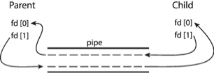
- Windows calls these anonymous pipes

#### Named Pipes

- Named Pipes are more powerful than ordinary pipes
- Communication is bidirectional
- No parent-child relationship is necessary between the communicating processes
- Several processes can use the named pipe for communication
- Provided on both UNIX and Windows systems


## Communication in Client-Server Systems

### Sockets

- A socket is defined as an endpoint for communication
- Concatenation of IP address and port – a number included at start of message packet to differentiate network services on a host
- The socket 161.25.19.8:1625 refers to port 1625 on host 161.25.19.8
- Communication consists between a pair of sockets
- All ports below 1024 are well known, used for standard services
- Special IP address 127.0.0.1 (loopback) to refer to system on which process is running

#### Socket Communication

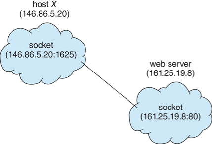

#### Sockets in Java

- Three types of sockets
  - Connection-oriented (TCP)
  - Connectionless (UDP)
  - MulticastSocket class– data can be sent to multiple recipients

Consider this "Date" server in Java:

```java
import java.net.*;
import java.io.*;

public class DateServer {
    public static void main(String[] args) {
        try {
            ServerSocket sock = new ServerSocket(6013);

            // now listen for connections
            while (true) {
                Socket client = sock.accept();
                PrintWriter pout = new PrintWriter(client.getOutputStream(), true);
                // write the Date to the socket
                pout.println(new java.util.Date().toString());
                // close the socket and resume listening for connections
                client.close();
            }
        } catch (IOException ioe) {
            System.err.println(ioe);
        }
    }
}
```

The equivalent Date client: 

```java
import java.net.*;
import java.io.*;

public class DateClient {
    public static void main(String[] args) {
        try {
            // make connection to server socket
            Socket sock = new Socket("127.0.0.1", 6013);

            InputStream in = sock.getInputStream();
            BufferedReader bin = new BufferedReader(new InputStreamReader(in));

            // read the date from the socket
            String line;
            while ((line = bin.readLine()) != null)
                System.out.println(line);

            // close the socket connection
            sock.close();
        } catch (IOException ioe) {
            System.err.println(ioe);
        }
    }
}
```

### Remote Procedure Calls

- Remote procedure call (RPC) abstracts procedure calls between processes on networked systems
  - Again uses ports for service differentiation
- Stubs – client-side proxy for the actual procedure on the server
- The client-side stub locates the server and marshalls the parameters
- The server-side stub receives this message, unpacks the marshalled parameters, and performs the procedure on the server
- On Windows, stub code compile from specification written in Microsoft Interface Definition Language (MIDL)
- Data representation handled via External Data Representation (XDL) format to account for different architectures
  - Big-endian and little-endian
- Remote communication has more failure scenarios than local
  - Messages can be delivered exactly once rather than at most once
- OS typically provides a rendezvous (or matchmaker) service to connect client and server

#### Execution of RPC

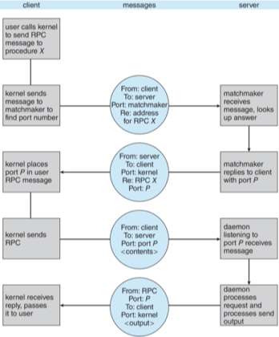

