# Chapter 04 - Threads and Concurrency <!-- omit in toc -->

**Table of Contents**
- [Overview](#overview)
  - [Motivation](#motivation)
  - [Benefits](#benefits)
- [Multicore Programming](#multicore-programming)
  - [Concurrent execution on single-core system](#concurrent-execution-on-single-core-system)
  - [Parallelism on a multi-core system](#parallelism-on-a-multi-core-system)
  - [Data parallelism – distributes subsets of the same data across multiple cores, same operation on each](#data-parallelism--distributes-subsets-of-the-same-data-across-multiple-cores-same-operation-on-each)
  - [Task parallelism – distributing threads across cores, each thread performing unique operation](#task-parallelism--distributing-threads-across-cores-each-thread-performing-unique-operation)
  - [Amdahl’s Law](#amdahls-law)
  - [User Threads and Kernel Threads](#user-threads-and-kernel-threads)
- [Multithreading Models](#multithreading-models)
  - [Many-to-One](#many-to-one)
  - [One-to-One](#one-to-one)
  - [Many-to-Many Model](#many-to-many-model)
  - [Two-level Model](#two-level-model)
- [Thread Libraries](#thread-libraries)
  - [Pthreads](#pthreads)
    - [Example](#example)
  - [Pthreads Code for Joining 10 Threads](#pthreads-code-for-joining-10-threads)
  - [Windows Multithreaded C Program](#windows-multithreaded-c-program)
  - [Java Threads](#java-threads)
    - [Implementing Runnable interface:](#implementing-runnable-interface)
    - [Creating a thread](#creating-a-thread)
    - [Waiting on a thread](#waiting-on-a-thread)
    - [Rather than explicitly creating threads, Java also allows thread creation around the Executor interface:](#rather-than-explicitly-creating-threads-java-also-allows-thread-creation-around-the-executor-interface)
    - [The Executor is used as follows:](#the-executor-is-used-as-follows)
  - [Java Executor Framework](#java-executor-framework)
- [Implicit Threading](#implicit-threading)
  - [Thread Pools](#thread-pools)
  - [Java Thread Pools](#java-thread-pools)
  - [Fork-Join Parallelism](#fork-join-parallelism)
    - [Fork-Join Parallelism in JAVA](#fork-join-parallelism-in-java)
  - [OpenMP](#openmp)
  - [Grand Central Dispatch](#grand-central-dispatch)
  - [Intel Threading Building Blocks (TBB)](#intel-threading-building-blocks-tbb)
- [Threading Issues](#threading-issues)
  - [Semantics of fork() and exec()](#semantics-of-fork-and-exec)
  - [Signal Handling](#signal-handling)
  - [Thread Cancellation](#thread-cancellation)
    - [Thread Cancellation in Java](#thread-cancellation-in-java)
  - [Thread-Local Storage](#thread-local-storage)
  - [Scheduler Activations](#scheduler-activations)
- [Operating System Examples](#operating-system-examples)
  - [Windows Threads](#windows-threads)
    - [Data Structure](#data-structure)
  - [Linux Threads](#linux-threads)

## Overview

### Motivation

- Most modern applications are multithreaded
- Threads run within application
- Multiple tasks with the application can be implemented by separate threads
  - Update display
  - Fetch data
  - Spell checking
  - Answer a network request
- Process creation is heavy-weight while thread creation is light-weight
- Can simplify code, increase efficiency
- Kernels are generally multithreaded


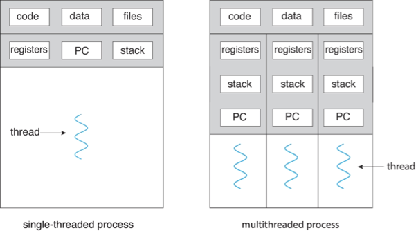

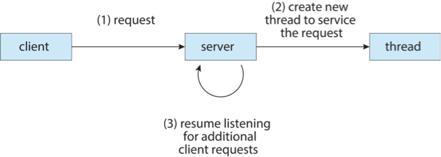

### Benefits
- Responsiveness – may allow continued execution if part of process is blocked, especially important for user interfaces
- Resource Sharing – threads share resources of process, easier than shared memory or message passing
- Economy – cheaper than process creation, thread switching lower overhead than context switching
- Scalability – process can take advantage of multicore architectures


## Multicore Programming

- Multicore or multiprocessor systems putting pressure on programmers, challenges include:
  - Dividing activities
  - Balance
  - Data splitting
  - Data dependency
  - Testing and debugging
- Parallelism implies a system can perform more than one task simultaneously
- Concurrency supports more than one task making progress
  - Single processor / core, scheduler providing concurrency

### Concurrent execution on single-core system

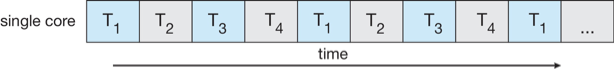


### Parallelism on a multi-core system

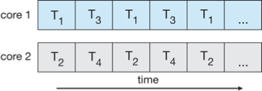

### Data parallelism – distributes subsets of the same data across multiple cores, same operation on each


### Task parallelism – distributing threads across cores, each thread performing unique operation

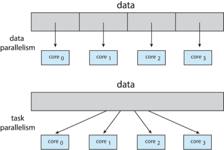

### Amdahl’s Law

- Identifies performance gains from adding additional cores to an application that has both serial and parallel components
- S is serial portion
- N processing cores

$$speedup \leq \frac{1}{S + \frac{1 - S}{N}}$$

- That is, if application is 75% parallel / 25% serial, moving from 1 to 2 cores results in speedup of 1.6 times
- As N approaches infinity, speedup approaches 1 / S
- Serial portion of an application has disproportionate  effect on performance gained by adding additional cores
- But does the law take into account contemporary multicore systems?


### User Threads and Kernel Threads

- User threads - management done by user-level threads library
- Three primary thread libraries:
  - POSIX Pthreads
  - Windows threads
  - Java threads
- Kernel threads - Supported by the Kernel
- Examples – virtually all general -purpose operating systems, including:
  - Windows 
  - Linux
  - Mac OS X
  - iOS
  - Android

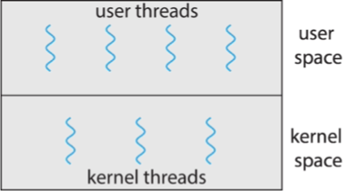


## Multithreading Models

### Many-to-One

- Many user-level threads mapped to single kernel thread
- One thread blocking causes all to block
- Multiple threads may not run in parallel on muticore system because only one may be in kernel at a time
- Few systems currently use this model
- Examples:
  - Solaris Green Threads
  - GNU Portable Threads

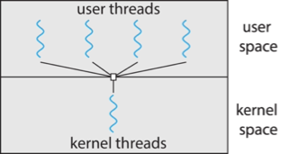

### One-to-One

- Each user-level thread maps to kernel thread
- Creating a user-level thread creates a kernel thread
- More concurrency than many-to-one
- Number of threads per process sometimes restricted due to overhead
- Examples
  - Windows
  - Linux

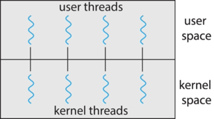

### Many-to-Many Model

- Allows many user level threads to be mapped to many kernel threads
- Allows the  operating system to create a sufficient number of kernel threads
- Windows  with the ThreadFiber package
- Otherwise not very common

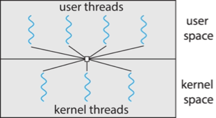

### Two-level Model

Similar to M:M, except that it allows a user thread to be bound to kernel thread

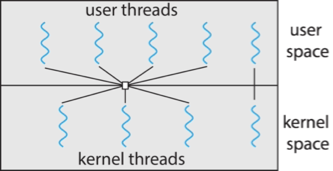

## Thread Libraries

Thread library provides programmer with API for creating and managing threads

- Two primary ways of implementing
  - Library entirely in user space
  - Kernel-level library supported by the OS

### Pthreads

- May be provided either as user-level or kernel-level
- A POSIX standard (IEEE 1003.1c) API for thread creation and synchronization
- Specification, not implementation
- API specifies behavior of the thread library, implementation is up to development of the library
- Common in UNIX operating systems (Linux & Mac OS X)

#### Example


```c
#include <pthread.h>
#include <stdio.h>
#include <stdlib.h>

int sum; /* this data is shared by the thread(s) */
void *runner(void *param); /* threads call this function */

int main(int argc, char *argv[]) {
    pthread_t tid; /* the thread identifier */
    pthread_attr_t attr; /* set of thread attributes */

    /* set the default attributes of the thread */
    pthread_attr_init(&attr);
    /* create the thread */
    pthread_create(&tid, &attr, runner, argv[1]);
    /* wait for the thread to exit */
    pthread_join(tid, NULL);
    printf("sum = %d\n", sum);

    return 0;
}

/* The thread will execute in this function */
void *runner(void *param) {
    int i, upper = atoi(param);
    sum = 0;

    for (i = 1; i <= upper; i++)
        sum += i;

    pthread_exit(0);
}
```

### Pthreads Code for Joining 10 Threads


```c
#define NUM_THREADS 10

/* an array of threads to be joined upon */
pthread_t workers[NUM_THREADS];

for (int i = 0; i < NUM_THREADS; i++)
    pthread_join(workers[i], NULL);
```

### Windows Multithreaded C Program


```c
#include <windows.h>
#include <stdio.h>

DWORD Sum /* data is shared by the thread(s) */

/* The thread will execute in this function */
DWORD WINAPI Summation(LPVOID Param) {
    DWORD Upper = *(DWORD*)Param;
    for (DWORD i = 1; i <= Upper; i++)
        Sum += i;
    return 0;
}

int main(int argc, char *argv[]) {
    DWORD ThreadId;
    HANDLE ThreadHandle;
    int Param;

    Param = atoi(argv[1]);

    /* create the thread */
    ThreadHandle = CreateThread(
        NULL, /* default security attributes */
        0, /* default stack size */
        Summation, /* thread function */
        &Param, /* parameter to thread function */
        0, /* default creation flags */
        &ThreadId); /* returns the thread identifier */
    
    /* now wait for the thread to finish */
    WaitForSingleObject(ThreadHandle, INFINITE);

    /* close the thread handle */
    CloseHandle(ThreadHandle);

    printf("sum = %d\n", Sum);
}
```

### Java Threads

- Java threads are managed by the JVM
- Typically implemented using the threads model provided by underlying OS
- Java threads may be created by:
  - Extending Thread class
  - Implementing the Runnable interface
    ```java
    public interface Runnable {
        public abstract void run();
    }
    ```
  - Standard practice is to implement Runnable interface

#### Implementing Runnable interface:

```java
class Task implements Runnable {
    public void run() {
        System.out.println("I am a thread.");
    }
}
```

#### Creating a thread

```java
Thread worker = new Thread(new Task());
worker.start();
```

#### Waiting on a thread
```java
try {
    worker.join();
}
catch (InterruptedException ie) {}
```

#### Rather than explicitly creating threads, Java also allows thread creation around the Executor interface:

```java
public interface Executor {
    void execute(Runnable command);
}
```

#### The Executor is used as follows:

```java
Executor service = new Executor;
service.execute(new Task());
```

### Java Executor Framework

```java
import java.util.concurrent.*;

class Summation implements Callable<Integer> {
    private int upper;
    public Summation(int upper) {
        this.upper = upper;
    }

    /* The thread will execute in this method */
    public Integer call() {
        int sum = 0;
        for (int i = 1; i <= upper; i++)
            sum += i;

        return new Integer(sum);
    }
}

public class Driver {
    public static void main(String[] args) {
        int upper = Integer.parseInt(args[0]);

        ExecutorService pool = Executors.newSingleThreadExecutor();
        Future<Integer> result = pool.submit(new Summation(upper));

        try {
            System.out.println("sum = " + result.get());
        } catch (interrruptedException | ExecutionException ie) {}
    }
}
```

## Implicit Threading

- Growing in popularity as numbers of threads increase, program correctness more difficult with explicit threads
- Creation and management of threads done by compilers and run-time libraries rather than programmers
- Five methods explored
  - Thread Pools
  - Fork-Join
  - OpenMP
  - Grand Central Dispatch
  - Intel Threading Building Blocks

### Thread Pools

- Create a number of threads in a pool where they await work
- Advantages:
  - Usually slightly faster to service a request with an existing thread than create a new thread
  - Allows the number of threads in the application(s) to be bound to the size of the pool
  - Separating task to be performed from mechanics of creating task allows different strategies for running task
    - i.e.,Tasks could be scheduled to run periodically
- Windows API supports thread pools:
  ```c
  DWORD WINAPI PoolFunction(AVOID Param) {
      /*
      * this function runs as a separate thread. 
      */
  }
  ```
- Three factory methods for creating thread pools in Executors class:
  - `static ExecutorService newSingleThreadExecutor()`
  - `static ExecutorService newFixedThreadPool(int size)`
  - `static ExecutorService newCachedThreadPool()`

### Java Thread Pools

```java
import java.util.concurrent.*;

public class ThreadPoolExample {
    public static void main(String[] args) {
        int numTasks = Integer.parseInt(args[0].trim());

        /* create a thread pool */
        ExecutorService pool = Executors.newCachedThreadPool();

        /* Run each task using a thread in the pool */
        for (int i = 0; i < numTasks; i++)
            pool.execute(new Task());
        
        /* Shut down the pool once all threads have completed */
        pool.shutdown();
    }
}
```

### Fork-Join Parallelism

- Multiple threads (tasks) are forked, and then joined.

    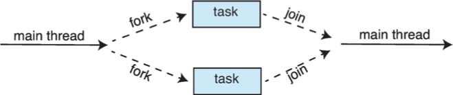

- General algorithm for fork-join strategy:

```c
Task(problem)
    if problem is small enough
        solve the problem directly
    else
        subtask1 = fork(new Task(subnet of proble))
        subtask2 = fork(new Task(subnet of proble))

        result1 = join(subtask1)
        result2 = join(subtask2)

        return combined results
```

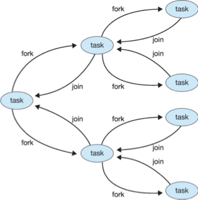

#### Fork-Join Parallelism in JAVA

```java
ForkJoinPool pool = new ForkJoinPool();
// array contains the integers to be summed
int[] array = new int[SIZE];

SumTask task = new SumTask(0, SIZE - 1; array);
int sum = pool.invoke(task);
```

```java
import java.util.concurrent.*;

public class SumTask extends RecursiveTask<Integer> {
    static final int THRESHOLD = 1000;

    private int begin;
    private int end;
    private int[] array;

    public SumTask(int begin, int end, int[] array) {
        this.begin = begin;
        this.end = end;
        this.array = array;
    }

    protected Integer compute() {
        if (end - begin < THRESHOLD) {
            int sum = 0;
            for (int i = begin; i <= end; i ++)
                sum += array[i];

            return sum;
        } else {
            int mid = (begin + end) / 2;

            SumTask leftTask = new SumTask(begin, mid, array);
            SumTask rightTask = new SumTask(mid + 1, end, array);

            leftTask.fork();
            rightTask.fork();

            return rightTask.join() + leftTask.join();
        }
    }
}
```
- The `ForkJoinTask` is an abstract base class
- `RecursiveTask` and `RecursiveAction` classes extend `ForkJoinTask`
- `RecursiveTask` returns a result (via the return value from the `compute()` method) 
- `RecursiveAction` does not return a result

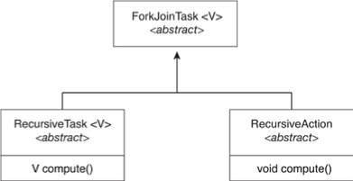

### OpenMP

- Set of compiler directives and an API for C, C++, FORTRAN 
- Provides support for parallel programming in shared-memory environments
- Identifies parallel regions – blocks of code that can run in parallel

`#pragma omp parallel `

Create as many threads as there are cores

```c
#include <omp.h>
#include <stdio.h>

int main(int argc, char *argv[]) {
    /* sequential code */

    #pragma omp parrallel {
        printf("I am a parallel region.");
    }

    /* sequential code */

    return 0;
}
```

Run the for loop in parallel

```c
#pragma omp parallel for
for (i = 0; i < N; i++)
    c[i] = a[i] + b[i];
```

### Grand Central Dispatch

- Apple technology for macOS and iOS operating systems
- Extensions to C, C++ and Objective-C languages, API, and run-time library
- Allows identification of parallel sections
- Manages most of the details of threading
- Block is in `"^{ }"` :
    `ˆ{ printf("I am a block"); }`
- Blocks placed in dispatch queue
  - Assigned to available thread in thread pool when removed from queue
- Two types of dispatch queues:
  - serial – blocks removed in FIFO order, queue is per process, called main queue
    - Programmers can create additional serial queues within program
  - concurrent – removed in FIFO order but several may be removed at a time
    - Four system wide queues divided by quality of service:
    - `QOS_CLASS_USER_INTERACTIVE`
    - `QOS_CLASS_USER_INITIATED`
    - `QOS_CLASS_USER_UTILITY`
    - `QOS_CLASS_USER_BACKGROUND`
- For the Swift language a task is defined as a closure – similar to a block, minus the caret
- Closures are submitted to the queue using the `dispatch_async()` function:

```c
let queue = dispatch_get_global_queue(QOS_CLASS_USER_INITIATED, 0)

dispatch_async(queue, {print("I am a closure.")})
```

### Intel Threading Building Blocks (TBB)

- Template library for designing parallel C++ programs
- A serial version of a simple for loop
    ```c
    for (int i = 0; i < n; i++)
        apply(v[i]);
    ```
- The same for loop written using TBB with `parallel_for` statement:
    ```c
    parrallel_for(size_t(0), n, [=](size_t i) {apply(v[i]);});
    ```


## Threading Issues

- Semantics of `fork()` and `exec()` system calls
- Signal handling
  - Synchronous and asynchronous
- Thread cancellation of target thread
  - Asynchronous or deferred
- Thread-local storage
- Scheduler Activations

### Semantics of fork() and exec()

- Does fork()duplicate only the calling thread or all threads?
  - Some UNIXes have two versions of fork
- exec() usually works as normal – replace the running process including all threads

### Signal Handling

- Signals are used in UNIX systems to notify a process that a particular event has occurred.
- A signal handler is used to process signals
    1. Signal is generated by particular event
    2. Signal is delivered to a process
    3. Signal is handled by one of two signal handlers:
       1. default
       2. user-defined
- Every signal has default handler that kernel runs when handling signal
    - User-defined signal handler can override default
    - For single-threaded, signal delivered to process
- Where should a signal be delivered for multi-threaded? 
  - Deliver the signal to the thread to which the signal applies
  - Deliver the signal to every thread in the process
  - Deliver the signal to certain threads in the process
  - Assign a specific thread to receive all signals for the process

### Thread Cancellation

- Terminating a thread before it has finished
- Thread to be canceled is target thread
- Two general approaches:
  - Asynchronous cancellation terminates the target thread immediately
  - Deferred cancellation allows the target thread to periodically check if it should be cancelled
- Pthread code to create and cancel a thread:
    ```c
    pthread_t tid;

    /* create the thread */
    pthread_create(&tid, 0, worker, NULL);

    ...

    /* cancel the thread */
    pthread_cancel(tid);

    /* wait for the thread to terminate */
    pthread_join(tid, NULL);
    ```
- Invoking thread cancellation requests cancellation, but actual cancellation depends on thread state
    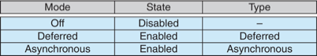
- If thread has cancellation disabled, cancellation remains pending until thread enables it
- Default type is deferred
  - Cancellation only occurs when thread reaches cancellation point
    - i.e., pthread_testcancel()
    - Then cleanup handler is invoked
- On Linux systems, thread cancellation is handled through signals

#### Thread Cancellation in Java

Deferred cancellation uses the interrupt() method, which sets the interrupted status of a thread. 

```java
Thread worker;

...

/* set the interruption status of the thread */
worker.interrupt();
```

A thread can then check to see if it has been interrupted:

```java
whilt(!Thread.currentThread().isInterrupted()) {
    ...
}
```

### Thread-Local Storage

- Thread-local storage (TLS) allows each thread to have its own copy of data
- Useful when you do not have control over the thread creation process (i.e., when using a thread pool)
- Different from local variables
  - Local variables visible only during single function invocation
  - TLS visible across function invocations
- Similar to static data
  - TLS is unique to each thread

### Scheduler Activations

- Both M:M and Two-level models require communication to maintain the appropriate number of kernel threads allocated to the application
- Typically use an intermediate data structure between user and kernel threads – lightweight process (LWP)
  - Appears to be a virtual processor on which process can schedule user thread to run
  - Each LWP attached to kernel thread
  - How many LWPs to create?
- Scheduler activations provide upcalls - a communication mechanism from the kernel to the upcall handler in the thread library
- This communication allows an application to maintain the correct number kernel threads

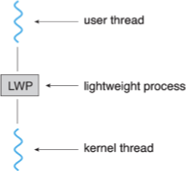

## Operating System Examples

### Windows Threads

- Windows API – primary API for Windows applications
- Implements the one-to-one mapping, kernel-level
- Each thread contains
  - A thread id
  - Register set representing state of processor
  - Separate user and kernel stacks for when thread runs in user mode or kernel mode
  - Private data storage area used by run-time libraries and dynamic link libraries (DLLs)
- The register set, stacks, and private storage area are known as the context of the thread
- The primary data structures of a thread include:
  - ETHREAD (executive thread block) – includes pointer to process to which thread belongs and to KTHREAD, in kernel space
  - KTHREAD (kernel thread block) – scheduling and synchronization info, kernel-mode stack, pointer to TEB, in kernel space
  - TEB (thread environment block) – thread id, user-mode stack, thread-local storage, in user space

#### Data Structure

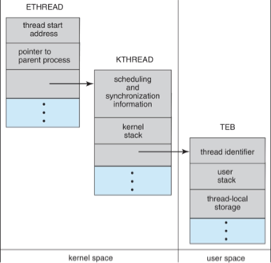


### Linux Threads

- Linux refers to them as tasks rather than threads
- Thread creation is done through clone() system call
- clone() allows a child task to share the address space of the parent task (process)
  - Flags control behavior
    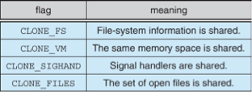
- struct task_struct points to process data structures (shared or unique)


