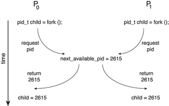
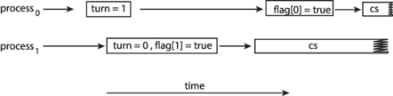
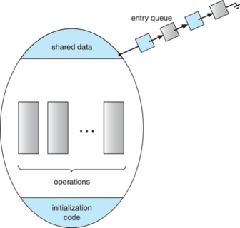

# Chapter 06 - Synchronization Tools

## Background

- Processes can execute concurrently
  - May be interrupted at any time, partially completing execution
- Concurrent access to shared data may result in data inconsistency
- Maintaining data consistency requires mechanisms to ensure the orderly execution of cooperating processes
- We illustrated in chapter 4 the problem when we considered the Bounded Buffer problem with use of a counter that is updated concurrently by the producer and consumer,. Which lead to race condition.

### Race Condition

- Processes P0 and P1 are creating child processes using the `fork()` system call
- Race condition on kernel variable `next_available_pid` which represents the next available process identifier (pid)
  
- Unless there is a mechanism to prevent P0 and P1 from accessing  the variable `next_available_pid`  the same pid could be assigned to two different processes!


## The Critical-Section Problem

- Consider system of n processes {p0, p1, … pn-1}
- Each process has critical section segment of code
  - Process may be changing common variables, updating table, writing file, etc.
  - When one process in critical section, no other may be in its critical section
- Critical section problem is to design protocol to solve this
- Each process must ask permission to enter critical section in entry section, may follow critical section with exit section, then remainder section


Requirements for solution to critical-section problem

1. Mutual Exclusion - If process Pi is executing in its critical section, then no other processes can be executing in their critical sections
2. Progress - If no process is executing in its critical section and there exist some processes that wish to enter their critical section, then the selection of the process that will enter the critical section next cannot be postponed indefinitely
3. Bounded Waiting - A bound must exist on the number of times that other processes are allowed to enter their critical sections after a process has made a request to enter its critical section and before that request is granted 
   - Assume that each process executes at a nonzero speed 
   - No assumption concerning relative speed of the n processes

### Critical Section

General structure of process $P_i$  

```c
while (true) {
    /* Entry section */
    ...
    /* Critical section */
    ...
    /* Exit section */
    ...
    /* Remainder section */
    ...
}
```

### Interrupt-based Solution

- Entry section:  disable interrupts
- Exit section:  enable  interrupts
- Will this solve the problem?
    - What if the critical section is code that runs for an hour?
    - Can some processes starve – never enter their critical section.
    - What if there are two CPUs?
    
#### Software Solution 1

- Two process solution
- Assume that the load and store machine-language instructions are atomic; that is, cannot be interrupted
- The two processes share one variable:
  - `int turn;` 
- The variable turn indicates whose turn it is to enter the critical section
- initially, the value of turn is set to i 

#### Algorithm for Process Pi

```c
while (true){ 

    while (turn = = j);

    /* critical section */
    turn = j;
    /* remainder section */
}
```

#### Correctness of the Software Solution 

- Mutual exclusion is preserved
    - Pi enters critical section only if:
        turn = i and turn cannot be both 0 and 1 at the same time
- What about the Progress requirement?
- What about the Bounded-waiting requirement?

## Peterson’s Solution

- Two process solution
- Assume that the load and store machine-language instructions are atomic; that is, cannot be interrupted
- The two processes share two variables:
  - `int turn;` 
  - `boolean flag[2]`
- The variable turn indicates whose turn it is to enter the critical section
- The flag array is used to indicate if a process is ready to enter the critical section. 
  - flag[i] = true  implies that process Pi is ready!

### Algorithm for Process Pi

```c
while (true){ 

    flag[i] = true; 
    turn = j; 
    while (flag[j] && turn = = j)
        ;

        /* critical section */
 
    flag[i] = false;
 
    /* remainder section */
 
}
```

### Correctness of Peterson’s Solution 

- Provable that the three  CS requirement are met:
    1. Mutual exclusion is preserved
        - Pi enters CS only if:
            either flag[j] = false or turn = i
    2. Progress requirement is satisfied
    3. Bounded-waiting requirement is met

### Peterson’s Solution and Modern Architecture

- Although useful for demonstrating an algorithm, Peterson’s Solution is not guaranteed to work on modern architectures.
  - To improve performance, processors and/or compilers may reorder operations that have no dependencies
- Understanding why it will not work is useful for better understanding race conditions.
- For single-threaded this is ok as the result will always be the same.
- For multithreaded the reordering may produce inconsistent or unexpected results!

#### Modern Architecture Example

- Two threads share the data:
    ```c
    boolean flag = false;
    int x = 0;
    ```
- Thread 1 performs
    ```c
    while (!flag)
	    ;
    print x
    ```
- Thread 2 performs
    ```c
    x = 100;
    flag = true
    ```
- What is the expected output?
    `100`
- However, since the variables flag and x are independent of each other, the instructions:
    ```c
    flag = true;
    x = 100;
    ```
    for Thread 2 may be reordered
- If this occurs, the output may be 0!
 
### Peterson’s Solution Revisited
            
- The effects of instruction reordering in Peterson’s Solution
    
- This allows both processes to be in their critical section at the same time!
- To ensure that Peterson’s solution will work correctly on modern computer architecture we must use Memory Barrier.
          
### Memory Barrier

- Memory model are the memory guarantees a computer architecture makes to application programs.
- Memory models may be either:
  - Strongly ordered – where a memory modification of one processor is immediately visible to all other processors.
  - Weakly ordered  – where a memory modification of one processor may not be immediately visible to all other processors.
- A memory barrier is an instruction that forces any change in memory to be propagated (made visible) to all other processors.

### Memory Barrier Instructions

- When a memory barrier instruction is performed, the system ensures that all loads and stores are completed before any subsequent load or store operations are performed.
- Therefore, even if instructions were reordered, the memory barrier ensures that the store operations are completed in memory and visible to other processors before future load or store operations are performed.

#### Memory Barrier Example

- Returning to the example of slides 6.17 - 6.18
- We could add a memory barrier to the following instructions to ensure Thread 1 outputs 100:
- Thread 1 now performs
    ```c
    while (!flag)
    	memory_barrier();
    print x
    ```
- Thread 2 now performs
    ```c
    x = 100;
    memory_barrier();
    flag = true
    ```
- For Thread 1 we are guaranteed that  that the value of flag is loaded before the value of `x`.
- For Thread 2 we ensure that the assignment to x occurs before the assignment `flag`.


## Hardware Support for Synchronization

- Many systems provide hardware support for implementing the critical section code.
- Uniprocessors – could disable interrupts
  - Currently running code would execute without preemption
  - Generally too inefficient on multiprocessor systems
    - Operating systems using this not broadly scalable
- We will look at three forms of hardware support:
    1.  Hardware instructions
    2.  Atomic variables 

### Hardware Instructions

- Special hardware instructions that allow us to either test-and-modify the content of a word, or to swap the contents of two words atomically (uninterruptedly.)
  - Test-and-Set instruction
  - Compare-and-Swap instruction

### The test_and_set  Instruction 

- Definition
    ```c
    boolean test_and_set (boolean *target)
    {
        boolean rv = *target;
        *target = true;
        return rv:
    }
    ```
- Properties
  - Executed atomically
  - Returns the original value of passed parameter
  - Set the new value of passed parameter to true

### Solution Using test_and_set()

- Shared boolean variable lock, initialized to false
- Solution:
    ```c
    do {
        while (test_and_set(&lock)) 
          ; /* do nothing */ 

            /* critical section */ 

        lock = false; 
            /* remainder section */ 
    } while (true);
    ```
- Does it solve the critical-section problem?

### The compare_and_swap  Instruction        

- Definition
    ```c
    int compare_and_swap(int *value, int expected, int new_value)
    {                  
        int temp = *value; 
        if (*value == expected) 
            *value = new_value; 
        return temp; 
    } 
    ```
- Properties
  - Executed atomically
  - Returns the original value of passed parameter value
  - Set  the variable value the value of the passed parameter new_value but only if *value == expected is true. That is, the swap takes place only under this condition.

### Solution using compare_and_swap

- Shared integer  lock  initialized to 0; 
- Solution:
    ```c
    while (true){
        while (compare_and_swap(&lock, 0, 1) != 0) 
            ; /* do nothing */ 

        /* critical section */ 

        lock = 0; 

        /* remainder section */ 
    } 
    ```
- Does it solve the critical-section problem?

### Bounded-waiting with compare-and-swap

```c
while (true) {
   waiting[i] = true;
   key = 1;
   while (waiting[i] && key == 1) 
      key = compare_and_swap(&lock,0,1); 
   waiting[i] = false; 
   /* critical section */ 
   j = (i + 1) % n; 
   while ((j != i) && !waiting[j]) 
      j = (j + 1) % n; 
   if (j == i) 
      lock = 0; 
   else 
      waiting[j] = false; 
   /* remainder section */ 
}
```

### Atomic Variables

- Typically, instructions such as compare-and-swap are used as building blocks for other synchronization tools.
- One tool is an atomic variable that provides atomic (uninterruptible) updates on basic data types such as integers and booleans.
- For example:
  - Let sequence be an atomic variable 
  - Let  increment() be operation on the atomic variable sequence 
  - The Command:
    `increment(&sequence);` ensures sequence is incremented without interruption:
- The increment() function can be implemented as follows:
    ```c
    void increment(atomic_int *v)
    {
        int temp;
        do {
            temp = *v;
        }
        while (temp != (compare_and_swap(v,temp,temp+1));
    } 
    ```


## Mutex Locks

- Previous solutions are complicated and generally inaccessible to application programmers
- OS designers build software tools to solve critical section problem
- Simplest is mutex lock
  - Boolean variable indicating if lock is available or not
- Protect a critical section  by 
  - First acquire() a lock 
  - Then release() the lock
- Calls to acquire() and release() must be atomic
  - Usually implemented via hardware atomic instructions such as compare-and-swap.
- But this solution requires busy waiting
  - This lock therefore called a spinlock

### Solution to CS Problem Using Mutex Locks

```c
while (true) { 
    acquire lock 
            
        critical section 

    release lock 
    
remainder section 
} 
```


## Semaphores

- Synchronization tool that provides more sophisticated ways (than Mutex locks)  for processes to synchronize their activities.
- Semaphore S – integer variable
- Can only be accessed via two indivisible (atomic) operations
  - wait() and signal()
    - Originally called P() and V()
- Definition of  the wait() operation
    ```c
    wait(S) { 
        while (S <= 0)
        ; // busy wait
        S--;
    }
    ```
- Definition of  the signal() operation
    ```c
    signal(S) { 
        S++;
    }
    ```
- Counting semaphore – integer value can range over an unrestricted domain
- Binary semaphore – integer value can range only between 0 and 1
  - Same as a mutex lock
- Can implement a counting semaphore S as a binary semaphore
- With semaphores we can solve various synchronization problems

#### Semaphore Usage Example

- Solution to the CS Problem
  - Create a semaphore “mutex” initialized to 1 
    ```c
    wait(mutex);
    CS
    signal(mutex);
    ```
- Consider P1  and P2 that with two statements S1 and S2    and the requirement  that S1 to happen before S2
  - Create a semaphore “synch” initialized to 0 
    ```c
    P1:
    S1;
    signal(synch);
    P2:
    wait(synch);
    S2;
    ```

### Semaphore Implementation

- Must guarantee that no two processes can execute  the wait() and signal() on the same semaphore at the same time
- Thus, the implementation becomes the critical section problem where the wait and signal code are placed in the critical section
- Could now have busy waiting in critical section implementation
  - But implementation code is short
  - Little busy waiting if critical section rarely occupied
- Note that applications may spend lots of time in critical sections and therefore this is not a good solution
 
### Semaphore Implementation with no Busy waiting 

- With each semaphore there is an associated waiting queue
- Each entry in a waiting queue has two data items:
  -  Value (of type integer)
  -  Pointer to next record in the list
- Two operations:
  - block – place the process invoking the operation on the appropriate waiting queue
  - wakeup – remove one of processes in the waiting queue and place it in the ready queue
- Waiting queue
    ```c
    typedef struct { 
        int value; 
        struct process *list; 
    } semaphore;

    wait(semaphore *S) { 
        S->value--; 
        if (S->value < 0) {
            add this process to S->list; 
            block(); 
        } 
    }
    
    signal(semaphore *S) { 
        S->value++; 
        if (S->value <= 0) {
            remove a process P from S->list; 
            wakeup(P); 
        } 
    } 
    
    ```

### Problems with Semaphores
                        
- Incorrect use of semaphore operations:
  - signal(mutex)  ….  wait(mutex)
  - wait(mutex)  …  wait(mutex)
  - Omitting  of wait (mutex) and/or signal (mutex)
- These – and others – are examples of what can occur when semaphores and other synchronization tools are used incorrectly.


## Monitors

- A high-level abstraction that provides a convenient and effective mechanism for process synchronization
- Abstract data type, internal variables only accessible by code within the procedure
- Only one process may be active within the monitor at a time
- Pseudocode syntax of a monitor:
    ```c
    monitor monitor-name
    {
        // shared variable declarations
        procedure P1 (…) { …. }

        procedure P2 (…) { …. }
        procedure Pn (…) {……}

    initialization code (…) { … }
    }
    ```

### Schematic view of a Monitor



### Monitor Implementation Using Semaphores

- Variables 
    ```c
    semaphore mutex 
    mutex = 1
    ```
- Each procedure P  is replaced by
    ```c
    wait(mutex);
            ...			 
        body of P;
            ...			 
    signal(mutex);
    ```
- Mutual exclusion within a monitor is ensured

### Condition Variables

- condition x, y;
- Two operations are allowed on a condition variable:
  - x.wait() –  a process that invokes the operation is suspended until x.signal() 
  - x.signal() – resumes one of processes (if any) that  invoked x.wait()
    - If no x.wait() on the variable, then it has no effect on the variable

###  Monitor with Condition Variables


###  Usage of Condition Variable  Example

- Consider P1  and P2 that that need to execute two statements S1 and S2   and the requirement  that S1 to happen before S2
- Create a monitor with two procedures F1  and F2  that are invoked by P1  and P2  respectively
- One condition variable “x” initialized to 0 
- One Boolean variable “done”
- F1:
    ```c
    S1;
    done = true;
    x.signal();
    ```
- F2:
    ```c
    if done = false
        x.wait()
    S2;
    ```

### Monitor Implementation Using Semaphores

- Variables 
    ```c
    semaphore mutex;  // (initially  = 1)
    semaphore next;   // (initially  = 0)
    int next_count = 0; // number of processes waiting inside the monitor
    ```
- Each function P  will be replaced by
    ```c
    wait(mutex);
            ...	 
        body of P;
            ...
    if (next_count > 0)
        signal(next)
    else 
        signal(mutex);
    ```
- Mutual exclusion within a monitor is ensured

###  Implementation – Condition Variables

- For each condition variable x, we  have:
    ```c
    semaphore x_sem; // (initially  = 0)
    int x_count = 0;
    ```
- The operation x.wait() can be implemented as:
    ```c
    x_count++;
    if (next_count > 0)
         signal(next);
    else
        signal(mutex);
    wait(x_sem);
    x_count--;
    ```
- The operation x.signal() can be implemented as:
    ```c
    if (x_count > 0) {
        next_count++;
        signal(x_sem);
        wait(next);
        next_count--;
    }
    ```

### Resuming Processes within a Monitor

- If several processes queued on condition variable x, and x.signal() is executed, which process should be resumed?
- FCFS frequently not adequate 
- Use  the conditional-wait construct of the form x.wait(c)
  where:
    - c is an integer (called the priority number)
    - The process with lowest number (highest priority) is scheduled next

### Single Resource allocation 

- Allocate a single resource among competing processes using priority numbers that specifies  the maximum time a process  plans to use the resource
    ```c
    R.acquire(t);
         ...
      access the resurce;
         ...

    R.release;
    ```
- Where R is an instance of  type ResourceAllocator

### Single Resource allocation 


- Allocate a single resource among competing processes using priority numbers that specifies  the maximum time a process  plans to use the resource
- The process with the shortest time is allocated the resource first
- Let R is an instance of  type ResourceAllocator (next slide)
- Access to ResourceAllocator is done via:
    ```c
    R.acquire(t);
         ...
        access the resurce;
         ...
    R.release;
    ```
- Where t is the maximum time a process plans to use the resource

### A Monitor to Allocate Single Resource

```c
monitor ResourceAllocator 
{ 
    boolean busy; 
    condition x; 
    void acquire(int time) { 
        if (busy) 
            x.wait(time); 
        busy = true; 
    } 
    void release() { 
        busy = false; 
        x.signal(); 
    } 
   initialization code() {
     busy = false; 
    }
}			
```

### Single Resource Monitor (Cont.)

- Usage:
    ```c
    acquire
        ...
    release
    ```
- Incorrect use of monitor operations
    -  release()  …  acquire()
    -  acquire()  …  acquire())
    -  Omitting  of acquire() and/or release()


## Liveness

- Processes may have to wait indefinitely while trying to acquire a synchronization tool such as a mutex lock or semaphore.
- Waiting indefinitely violates the progress and bounded-waiting criteria discussed at the beginning of this chapter.
- Liveness refers to a set of properties that a system must satisfy to ensure processes make progress.
- Indefinite waiting is an example of a liveness failure.
- Deadlock – two or more processes are waiting indefinitely for an event that can be caused by only one of the waiting processes
- Let S and Q be two semaphores initialized to 1
    ```
                P0	                            P1
              wait(S); 	              wait(Q);
               wait(Q); 	              wait(S);
         ...		     ...
               signal(S);                 signal(Q);
              signal(Q);                 signal(S);
    ```
- Consider if P0 executes wait(S) and P1 wait(Q). When P0 executes wait(Q), it must wait until P1 executes signal(Q)
- However, P1 is waiting until P0 execute signal(S).
- Since these signal() operations will never be executed, P0 and P1 are deadlocked.
- Other forms of deadlock:
- Starvation – indefinite blocking  
  - A process may never be removed from the semaphore queue in which it is suspended
- Priority Inversion – Scheduling problem when lower-priority process holds a lock needed by higher-priority process
  - Solved via priority-inheritance protocol


## Evaluation

