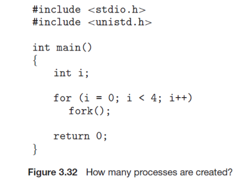
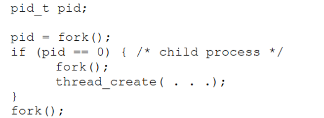
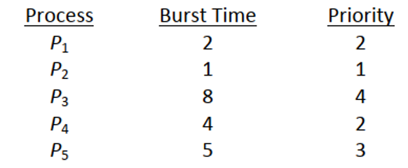

# [CE3002] Operating System -- Homework 01

## 1. Choice of Questions (40%)

1. Which of the following would lead you to believe that a given system is an SMP-type system? (C)
   - [ ] Each processor is assigned a specific task.
   - [ ] There is a boss–worker relationship between the processors.
   - [ ] Each processor performs all tasks within the operating system.
   - [ ] None of the above

2. A ____ can be used to prevent a user program from never returning control to the operating system.
   - [ ] portal	
   - [ ] program counter	
   - [ ] firewall	
   - [ ] timer

3. Two important design issues for cache memory are ____.
   - [ ] speed and volatility
   - [ ] size and replacement policy
   - [ ] power consumption and reusability
   - [ ] size and access privileges

4. What statement concerning privileged instructions is considered false?
   - [ ] They may cause harm to the system.
   - [ ] They can only be executed in kernel mode.
   - [ ] They cannot be attempted from user mode.
   - [ ] They are used to manage interrupts.

5. The two separate modes of operating in a system are
   - [ ] supervisor mode and system mode
   - [ ] kernel mode and privileged mode
   - [ ] physical mode and logical mode
   - [ ] user mode and kernel mode

6. If a program terminates abnormally, a dump of memory may be examined by a ____ to determine the cause of the problem.
   - [ ] module	
   - [ ] debugger		
   - [ ] shell		
   - [ ] control card

7. Policy ____.
   - [ ] determines how to do something
   - [ ] determines what will be done
   - [ ] is not likely to change across places
   - [ ] is not likely to change over time

8. A microkernel is a kernel ____.
   - [ ] containing many components that are optimized to reduce resident memory size
   - [ ] that is compressed before loading in order to reduce its resident memory size
   - [ ] that is compiled to produce the smallest size possible when stored to disk
   - [ ] that is stripped of all nonessential components

9. To the SYSGEN program of an operating system, the least useful piece of information is _____.
   - [ ] the CPU being used
   - [ ] amount of memory available
   - [ ] what applications to install
   - [ ] operating-system options such as buffer sizes or CPU scheduling algorithms

10. _____ provide(s) an interface to the services provided by an operating system.
    - [ ] Shared memory		
    - [ ] System calls	
    - [ ] Simulators		
    - [ ] Communication

## 二、問答題 (60%)

11.  What is the purpose of interrupts? (4%) What are the differences between a trap and an interrupt? (4%)

12. Describe three general methods for passing parameters to the operating system. (6%)

13. What are the two models of interprocess communication? (3%) What are the strengths and weaknesses of the two approaches? (3%)

14. Describe the differences among short-term, medium-term, and long-term scheduling. (5%)

15. Including the initial parent process, how many processes are created by the program shown in Figure 3.32? (6%)
 
    

16. Which of the following components of program state are shared across threads in a multithreaded process? (4%)
a. Register values 
b. Heap memory 
c. Global variables 
d. Stack memory

17. Consider the following code segment: 

    

    - a. How many processes are created? (include main process) (4%)
    - b. How many threads are created? (4%)

18. Consider the following set of processes, with the length of the CPU burst time given in milliseconds:

    
 
    The processes are assumed to have arrived in the order P1, P2, P3, P4, P5 all at time 0. 

    - a. Draw four Gantt charts that illustrate the execution of these processes using the following scheduling algorithms: FCFS, SJF, nonpreemptive priority (a smaller priority number implies a higher priority), and RR (quantum = 1). (4%)
    - b. What is the turnaround time of each process for each of the scheduling algorithms in part a? (4%)
    - c. What is the waiting time of each process for each of these scheduling algorithms?  (4%)
    - d. Which of the algorithms results in the minimum average waiting time (over all processes)? (2%)

19. Which of the following scheduling algorithms could result in starvation? (3%)
    - a. First-come, first-served 
    - b. Shortest job first 
    - c. Round robin 
    - d. Priority

