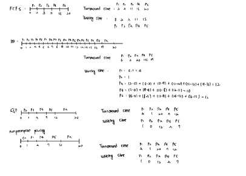

# [CE3002] Operating System -- Homework 01

## 1. Choice of Questions (40%)

### 1. Which of the following would lead you to believe that a given system is an SMP-type (Symmetric multiprocessing) system?

- [ ] A) Each processor is assigned a specific task.
- [ ] B) There is a boss–worker relationship between the processors.
- [x] C) Each processor performs all tasks within the operating system.
- [ ] D) None of the above

### 2. A ____ can be used to prevent a user program from never returning control to the operating system.

- [ ] A) portal	
- [ ] B) program counter	
- [ ] C) firewall	
- [x] D) timer


### 3. Two important design issues for cache memory are ____.

- [ ] A) speed and volatility
- [x] B) size and replacement policy
- [ ] C) power consumption and reusability
- [ ] D) size and access privileges


### 4. What statement concerning privileged instructions is considered false?

- [ ] A) They may cause harm to the system.
- [ ] B) They can only be executed in kernel mode.
- [x] C) They cannot be attempted from user mode.
- [ ] D) They are used to manage interrupts.

### 5. The two separate modes of operating in a system are

- [ ] A) supervisor mode and system mode
- [ ] B) kernel mode and privileged mode
- [ ] C) physical mode and logical mode
- [x] D) user mode and kernel mode

### 6. If a program terminates abnormally, a dump of memory may be examined by a ____ to determine the cause of the problem.

- [ ] A) module
- [x] B) debugger
- [ ] C) shell
- [ ] D) ontrol card

### 7. Policy ____.

- [ ] A) determines how to do something
- [x] B) determines what will be done
- [ ] C) is not likely to change across places
- [ ] D) is not likely to change over time

### 8. A microkernel is a kernel ____.

- [ ] A) containing many components that are optimized to reduce resident memory size
- [ ] B) that is compressed before loading in order to reduce its resident memory size
- [ ] C) that is compiled to produce the smallest size possible when stored to disk
- [x] D) that is stripped of all nonessential components

### 9. To the SYSGEN program of an operating system, the least useful piece of information is _____.

- [ ] A) the CPU being used
- [ ] B) amount of memory available
- [x] C) what applications to install
- [ ] D) operating-system options such as buffer sizes or CPU scheduling algorithms

### 10. _____ provide(s) an interface to the services provided by an operating system.

- [ ] A) Shared memory		
- [x] B) System calls	
- [ ] C) Simulators		
- [ ] D) ommunication

## 二、問答題 (60%)

### 11. What is the purpose of interrupts? (4%) What are the differences between a trap and an interrupt? (4%)

An interrupt is a hardware-generated change-of-flow within the system. An interrupt handler is summoned to deal with the cause of the interrupt; control is then returned to the interrupted context and instruction

A trap is a software-generated interrupt. An interrupt can be used to signal the completion of an I/O to obviate the need for device polling. A trap can be used to call operating system routines or to catch arithmetic errors.

### 12. Describe three general methods for passing parameters to the operating system. (6%)

- a. Pass parameters in registers 
- b. Registers pass starting addresses of blocks of parameters 
- c. Parameters can be placed, or pushed, onto the stack by the program, and popped off the stack by the operating system


### 13. What are the two models of interprocess communication? (3%) What are the strengths and weaknesses of the two approaches? (3%)

The two models of interprocess communication are message-passing model and the shared-memory model. Message passing is useful for exchanging smaller amounts of data, because no conflicts need be avoided. It is also easier to implement than is shared memory for intercomputer communication. Shared memory allows maximum speed and convenience of communication, since it can be done at memory transfer speeds when it takes place within a computer. However, this method compromises on protection and synchronization between the processes sharing memory.

### 14. Describe the differences among short-term, medium-term, and long-term scheduling. (5%)

- a. Short-term (CPU scheduler)—selects from jobs in memory those jobs that are ready to execute and allocates the CPU to them. 
- b. Medium-term—used especially with time-sharing systems as an intermediate scheduling level. A swapping scheme is implemented to remove partially run programs from memory and reinstate them later to continue where they left off. 
- c. Long-term (job scheduler)—determines which jobs are brought into memory for processing. 


### 15. Including the initial parent process, how many processes are created by the program shown in Figure 3.32? (6%)

```c
// Figure 3.32 How many processes are created?
#include <stdio.h>
#include <unistd.h>

int main() {
    int i;
    for (i = 0; i < 4; i++)
        fork();
    return 0;
}
```

16

### 16.  Which of the following components of program state are shared across threads in a multithreaded process? (4%)

- [ ] A) Register values 
- [x] B) Heap memory 
- [ ] C) Global variables 
- [ ] D) Stack memory

The threads of a multithreaded process share heap memory and global variables. Each thread has its separate set of register values and a separate stack.

### 17. Consider the following code segment: 

```c
pid_t pid;

pid = fork();
if (pid == 0) { /*child process*/
    fork();
    thread_create( ... );
}
fork();
```


- a. How many processes are created? (include main process) (4%) 
  - 6 processes are created.
- b. How many threads are created? (4%)
  - 2 threads are created.

### 18. Consider the following set of processes, with the length of the CPU burst time given in milliseconds:

| Process | Burst Time | Priority |
|---------|------------|----------|
| P1      | 2         | 2        |
| P2      | 1          | 1        |
| P3      | 8          | 4        |
| P4      | 4          | 2        |
| P5      | 5          | 3        |

The processes are assumed to have arrived in the order P1, P2, P3, P4, P5 all at time 0. 

- a. Draw four Gantt charts that illustrate the execution of these processes using the following scheduling algorithms: FCFS, SJF, nonpreemptive priority (a smaller priority number implies a higher priority), and RR (quantum = 1). (4%)
- b. What is the turnaround time of each process for each of the scheduling algorithms in part a? (4%)
- c. What is the waiting time of each process for each of these scheduling algorithms?  (4%)
- d. Which of the algorithms results in the minimum average waiting time (over all processes)? (2%)



SJF and Nonpreemptive priority

### 19. Which of the following scheduling algorithms could result in starvation? (3%)
- [ ] A) First-come, first-served 
- [x] B) Shortest job first 
- [ ] C) Round robin 
- [ ] D) Priority

Shortest job first and priority-based scheduling algorithms could result in starvation.

### 20. How do clustered systems differ from multiprocessor systems? What is required for two machines belonging to a cluster to cooperate to provide a highly available service? (3% 3%)
