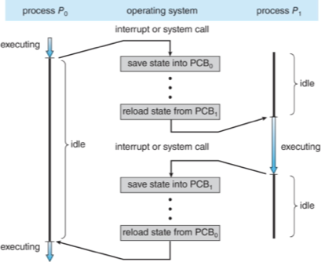

# 2020

### Q1. Please answer the following questions.

- (A) What is the purpose of system calls?
  - (A) 指運行在 user space 的程式向 OS kernel 請求需要更高全線運行的服務。
- (B) What is the definition of OS?
  - (B) OS 需要處理如管理與組態記憶體、決定系統資源供需的優先次序、控制輸入與輸出裝置、操作網路與管理檔案系統等基本事務。作業系統也提供一個讓使用者與系統互動的操作介面。

### Q2. Please answer the following questions.

- (A) Describe the purpose of Dual-mode.
  - (A) 為了避免 user 無意、惡意的操作系統，導致系統崩快的一種保護機制。
- (B) Wht Dual-mode can archieve the purpose?
  - (B) 利用 Dual-mode 將某些可能使系統不正確運作的功能實作在 kernel mode 再用 system call 的方式提供 user interface 去正確操作系統。

### Q3.  Please answer the following questions.

- (A) What is context switching
  - (A) Suspend the execution of the process running on the CPU and resume execution of some other process previously suspended.
- (B) How context switch be processed by OS?
  - (B) 將目前 Process 資訊保存起來並載入到下個要運作的 process 資訊。
  

### Q4. Please answer the following questions.

- (A) What is purpose of interrupt?
  - (A) 中斷適用以提高電腦工作效率、增強電腦功能的一項重要技術。若電腦系統沒有中斷，則處理器與外部裝置通信時，他必須在向該裝置發出指令後進行 busy waiting，polling 該裝置是否完成了動作並返回結果。這就造成了大量處理器週期被浪費。
- (B) What are the differences between a trap and an interrupt?
  - 依執行程式區分：  
    - interrupt 又稱為非同步中斷 (Asynchronous)：與正在執行的程式無關的中斷信號，通常不可預期。e.g. I/O 完成或錯誤訊號。
    - Trap 又稱為同步中斷 (Synchronous)：由執行程式所產生的中斷信號。e.g. 除以 9 的錯誤、使用到非記憶體位址。
  - 依軟硬體區分：
    - interrupt：由週邊硬體元件要求使用，在任意時間藉由系統匯流排，送給 CPU 一個 signal 所觸發的中斷。e.g. 接收網路封包
    - Trap：目前正執行的程式執行 system call (monitor call) 或指令有 exception 引起。e.g. 除以 0 的錯誤、要求 OS 提供服務處理。

### Q5. Illustrate the diagram of process state and explain each state transition in detail.


- New: The process is being created.
- Running: Instructions are being executed.
- Waiting: The process is waiting for some event to occur.
- Ready: The process is waiting to be assigned to a processor.
- Terminated: The process has finished execution.\

### Q6. Explain the terms "at most once" and "exactly once" and indicate how they relate to remote procesure calls.

Because a remote procedure can fall in any number of ways, it is important to be able to handle such errors in the messaging system. The term "at most once" refers to ensuring that the server processes a particular message sent by the client only once and not multiple times. This is implemented by merely checking the timestamp of the message. The term "exactly once" refers to making sure that the message is executed on the server once and only once so that there is a guarantee that the server received and process the message.

- At Most Once  
  Client 會向 Server 發出 request，但他不確定 server 是否有收到，所以會發出多次的 request。而 server 收到多次的 request 後，會判斷此次呼叫是否跟之前的一樣，也就是 Server 可以判斷是否重複呼叫，如果是，就直接返回暫存的結果，而不重新執行 function。同一個呼叫不會被重複呼叫兩次，所以稱為 At Most Once。
- Exactly Once  
  exactly once 是確保 server 收到 request 後一定會執行一次。

### Q7. How many processes including the parent process would be created by the following code?

```c
int main() {
    for (int i = 0; i < 2; i++) {
      fork();
      fork();
    }

    return 0;
}
```

16


### Q8. Please answer the following questions.

- (A) What resources are shared by threads of multi-threaded process?
  - Code Section, Data Section, OS resources
- (B) List four benefits of multi-threading.
  - Resource sharing
  - Economy
  - Scalability
  - Responsiveness


### Q9. What is the difference between user-level threads and kernel-level threads?

| S.No | User-Level Threads | Kernel-Level Threads |
|------|--------------------|----------------------|
| 1 | User-level threads are faster to create and manage. | Kernel-level threads are slower to create and manage. |
| 2 | Implementation is by a thread library at the user level. | Operating system supports creation of kernel threads. |
| 3 | User-level is generic and can run on any operating system. | Kernel-level is specific to the operating system. |
| 4 | Mult-threaded applications cannot take advantage of mult-processing | Kernel routines themselves can be mult-threaded |


### Q10. Describe the differences between processes and threads according to the following three viewpoints: otverhead of context switching, management cost and shared data access control. Show your answer by a table.

| | Process | Thread |
|---|---------|--------|
| Overhead of context switching | High | Low |
| Management cost | High | Low |
| Shared data access control | Process 之間無共享 | 共享 Code Section, Data Section, OS Resources |

