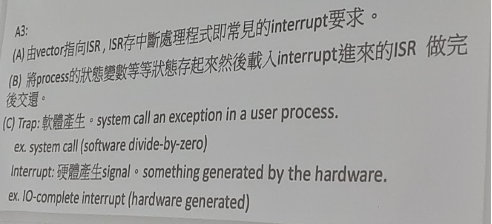
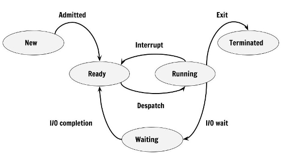
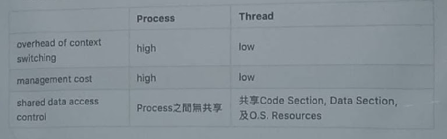

2022作業系統（曾黎明卿）期中考考題簡述版與參考答案

題號順序配分不論，但內容幾乎一樣。
以下參考答案非官方正解，若有錯誤可自行標註修正，感謝。

### 1. 名詞解釋(10%)

- process control  block
- system call 
- cpu bound process

Ans:
- Process Control Block (PCB) is a data structure maintained by the operating system to store information of each process. 
- System calls provide an essential interface between a process and the operating system.
- 大的 CPU burst，處理程序使用 CPU 較長的時間，也就是使用更多的時間進行運算而不是 I/O。

參考資料：
- https://www.scaler.com/topics/operating-system/process-control-block-in-os/
- https://en.wikipedia.org/wiki/System_call
- https://mnya.tw/cc/word/1369.html

### 2. (10%)
- interrupt的目的是甚麼
- interrupt service routine 是啥
- interrupt 跟trap的差異

Ans:


 

參考資料： 2021年中央資工OS曾黎明期中考
  
### 3. (10%) 請畫出program life cycle state diagram 
Ans:
 



### 4. (6%) 請敘述 two model of IPC

Shared Memory, Message Passing


### 5. (14%) 行程畫圖（作業題）
Consider the following set of processes, with the length of the CPU burst time given in milliseconds:
 
The processes are assumed to have arrived in the order P1, P2, P3, P4, P5 all at time 0. 

a. Draw four Gantt charts that illustrate the execution of these processes using the following scheduling algorithms: FCFS, SJF, nonpreemptive priority (a smaller priority number implies a higher priority), and RR (quantum = 1). (4%)
b. What is the turnaround time of each process for each of the scheduling algorithms in part a? (4%)
c. What is the waiting time of each process for each of these scheduling algorithms?  (4%)
d. Which of the algorithms results in the minimum average waiting time
 (over all processes)? (2%)

Ans:

#### FCFS
```
+----+--+-----------+----+----+
| P1 |P2|     P3    | P4 | P5 |
+----+--+-----------+----+----+
0    2  3           11   15   20
```
#### SJF

```
+----+--+-----------+----+----+
| P2 |P1|     P4    | P5 | P3 |
+----+--+-----------+----+----+
0    2  3           7    12   20
```
#### Non Preemptive priority

```
+--+----+------+----------+--------------+
|P2| P1 |  P4  |    P5    |      P3      |
+--+----+------+----------+--------------+
0    1  3           7    12   20
```
#### Round Robin

```
+----+----+----+----+----+----+----+----+----+----+----+----+----+----+----+----+----+----+----+----+
| P1 | P2 | P3 | P4 | P5 | P1 | P3 | P4 | P5 | P3 | P4 | P5 | P3 | P4 | P5 | P3	| P5 | P3 | P3 | P3 |
+----+----+----+----+----+----+----+----+----+----+----+----+----+----+----+----+----+----+----+----+
0    1    2    3    4    5    6    7    8    9    10   11   12   13   14   15   16   17   18   19   20
```
 
#### b.
| FCFS | SJF | Nonpreemptive priority | RR |
|------|-----|-------------------------|----|
| P1 | 2 | 3 | 3 | 6 |
| P2 | 3 | 1 | 1 | 2 |
| P3 | 11 | 20 | 20 | 20 |
| P4 | 15 | 7 | 7 | 14 |
| P5 | 20 | 12 | 12 | 17 |

#### c.
| FCFS | SJF | Nonpreemptive priority | RR |
|------|-----|-------------------------|----|
| P1 | 0 | 1 | 1 | 4 |
| P2 | 2 | 0 | 0 | 1 |
| P3 | 3 | 12 | 12 | 12 |
| P4 | 11 | 3 | 3 | 10 |
| P5 | 15 | 7 | 7 | 12 |
 
#### d.
- FCFS = (0+2+3+11+15)/5 = 6.2
- SJF = (1+0+12+3+7)/5 = 4.6
- Nonpreemptive priority = (1+0+12+3+7)/5 = 4.6
- RR = (4+1+12+10+12)/5=7.8

So, the `SJF` and `Nonpreemptive priority` results in the minimum average waiting time.

 
### 6.(4%) 哪些排程演算法會引發 starvation？（其實我忘記是不是考這題了，但反正跟starvation 有關。）

- [ ] a. First-come, first-served 
- [ ] b. Shortest job first 
- [ ] c. Round robin 
- [x] d. Priority


### 7.(4%) fork 計算（作業題）Including the initial parent process, how many processes are created by the program shown in Figure 3.32? 

```c
// Figure 3.32 How many processes are created?
#include <stdio.h>
#include <unistd.h>

int main() {
    int i;
    for (i = 0; i < 4; i++)
        fork();
    return 0;
}
```

Ans:

If the program have n `Fork()` call then it will have `2＾n-1` child processes, Here n=4 therefore child process 24-1 = 15, so total process by `program = child process + one main process` = 15 + 1 =16  

### 8.(4%) 請解釋解決starvation的 aging方式是怎麼運作的。(要提到時間不然會扣分)

Ans:

1. **Aging:** fixed priority scheduling is a scheduling discipline, in which tasks queued for utilizing a system resource are assigned a priority each.
2. Set the **TIME QUANTUM** for each process avoid to unfairly utilize CPU time.
 
### 9.(9%) short term medium-term long-term scheduler的差異
Ans:
- short-term (CPU scheduler) — selects from jobs in memory those jobs that are ready to execute and allocates the CPU to them.
- medium-term — used especially with time-sharing systems as an intermediate scheduling level. A swapping scheme is implemented to remove partially run programs from memory and reinstate them later to continue where they left off.
- long-term (job scheduler) — determines which jobs are brought into memory for processing.

參考資料：
作業系統 筆記 (1) | Morris' Blog (morris821028.github.io)

### 10.(9%) process 跟thread 的差異，就 overhead of context switching, management cost, shared resources 來看
Ans:


 
參考資料：2020中央資工OS曾黎明期中考
 
### 11.(5%) n race condition problem 是甚麼，可以舉例。

Ans:

A race condition is an undesirable situation that occurs when a device or system attempts to perform two or more operations at the same time, but because of the nature of the device or system, the operations must be done in the proper sequence to be done correctly.

Race conditions are most commonly associated with computer science and programming. They occur when two computer program processes, or threads, attempt to access the same resource at the same time and cause problems in the system.

Race conditions are considered a common issue for multithreaded applications.

參考資料：
[What is a Race Condition?](https://www.techtarget.com/searchstorage/definition/race-condition)

### 12.(8%) context switch 是甚麼 還有請說明他怎麼運作的。
Ans:

當 CPU 切換至其他行程，透過 context switch，系統會儲存當前形成狀態並仔入新行程狀態。Context switch 發生，將當前 process 相關資訊、狀態 (context) 存於 PCB 中 (process 及其 CPU 存入 memory)，並將下一個 schedule 的形成及其 PCB 載入 kernel 執行。
 

### 13.(7%) multithreading 的好處，至少列三個

Ans:
- Responsiveness
- Resource sharing
- Economy
- Scalability
 
