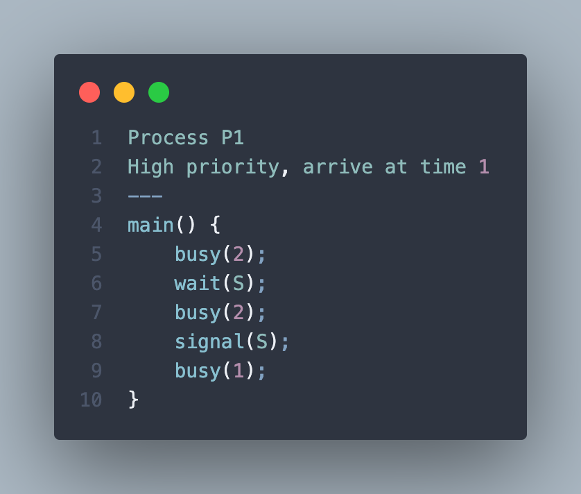
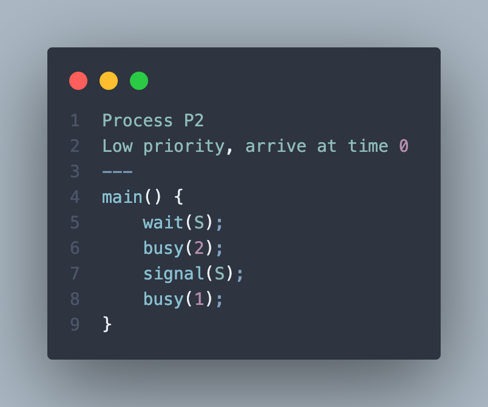

# 2023 Midterm Exam

## Single Choice Questions

### 1. Policy ______.

- [ ] A) determines how to do something
- [x] B) determines what will be done
- [ ] C) is not likely to change across places
- [ ] D) is not likely to change over time

### 2. A microkernel is a kernel ______.

- [ ] A) containing many components that are optimized to reduce resident memory size
- [ ] B) that is compressed before loading in order to reduce its resident memory size
- [ ] C) that is compiled to produce the smallest size possible when stored to disk
- [x] D) that is stripped of all nonessential components

### 3. ______ provide(s) an interface to the services provided by an operating system.

- [ ] A) Shared memory
- [x] B) System calls
- [ ] C) Simulators
- [ ] D) Communication

### 4. Mechanism ______.

- [x] A) determines how to do something
- [ ] B) determines what will be done
- [ ] C) is not likely to change across places
- [ ] D) is not likely to change over time

### 5. Assume that preemptive scheduling is adopted. What is the average waiting time for these processes with the SJF scheduling algorithm?

| Process | Arrival Time | Burst Time |
|---------|--------------|------------|
| P1      | 0            | 8          |
| P2      | 2            | 4          |
| P3      | 4            | 2          |

- [ ] A) 4
- [ ] B) 5
- [x] C) 8/3
- [ ] D) 11/3

### 6. According to the following program with `fork()` system call, explain what output will be at Line A. (Suppose all `fork()` system calls are succeed.)

```c
#include <sys/types.h>
#include <sts/wait.h>
#include <stdio.h>
#include <unistd.h>


int main() {
    int value = 5;
    pid_t pid;
    pid = fork();
    value += 10;
    pid = fork();
    value += 10;

    if (pid == 0) {
        value += 15;
        return 0;
    } else if (pid > 0) {
        wait(NULL);
        printf("%d\n", value);  /* LINE A */
        return 0;
    }
}
```

- [ ] A) 5
- [ ] B) 15
- [x] C) 25
- [ ] D) 40

### 7. Which one of the following is an incorrect transition of process states?

- [ ] A) running -> waiting
- [x] B) waiting -> running
- [ ] C) ready -> running
- [ ] D) waiting -> ready 

### 8. Which is not the main advantage of multiprocessor systems?

- [ ] A) Increased throughput
- [ ] B) Economy of scale
- [ ] C) Increased reliability
- [x] D) high CPU utilization

### 9. The CPU busy for x units of time. Now let P1 and P2 arrive at the system at time 1 and 0, respectively. S is a semaphore whose initial value is 1. Let the CPU scheduler be preemptive and priority-driven, and the priority of p1 is higher than that of p2.

| Process P1 High priority, arrive at time 1 | Process P2 Low priority, arrive at time 0 |
|-|-|
|| |

Ignore the time overhead of semaphore operations and context switches. What the turnaround time of the two processes?

- [ ] A) Turnaround time P1 is 5 and P2 is 8
- [x] B) Turnaround time P1 is 6 and P2 is 8
- [ ] C) Turnaround time P1 is 7 and P2 is 9
- [ ] D) Turnaround time P1 is 6 and P2 is 9

### 10. How many processes including the original process will the following C programs with the Unix system call `fork()` create? Suppose all `fork()` system calls are succeed.

```c
int main() {
    int i;
    for (i = 0; i < 3; i++) {
        if (fork() == 0) {
            fork();
            fork();
            fork();
        }
    }
}

- [ ] A) 128
- [ ] B) 637
- [x] C) 729
- [ ] D) 7414

### 11. What would be the output of the following C program that uses the Pthreads API?

```c
#include <stdio.h>
#include <stdlib.h>
#include <unistd.h>
#include <pthread.h>
#include <sys/types.h>
#include <sys/wait.h>

static void *runner(void *param) {
    (*(int*)param)--;
    pthread_exit(0);
}

int main(int argc, char **argv) {
    int value = 11;
    pid_t pid = fork();
    if (pid > 0) {
        int status;
        waitpid(-1, &status, 0);
        printf("A=%d\n", value--);
    } else if (pid == 0) {
        pid_t pid = fork();
        if (pid > 0) {
        
        }
    }


            else {
                printf("D=%d\n", ++value);
            }
        } else {
            return 1;
        }
    } else {
        return 1;
    }
    return 0;
}
```

- [x] A) A=11, B=10, C=10, D=11
- [ ] B) A=13, B=11, C=11, D=13
- [ ] C) A=9, B=10, C=11, D=12
- [ ] D) A=9, B=11, C=13, D=9

### 12. Which of the following was not given as a necessary condition for a deadlock to occur?

- [x] A) Avoidance
- [ ] B) Hold and Wait
- [ ] C) Mutual Exclusion
- [ ] D) Circular wait

### 13. Deadlocks can be prevented only if ______.

- [ ] A) all four necessary conditions cannot hold.
- [x] B) at least one of the four necessary condition cannot hold.
- [ ] C) at least one of the four necessary ondition cannot hold.
- [ ] D) circular wait condition cannot hold.

### 14. Which of the following statements is trye regarding the Interprocess Communication?

- [x] A) Shared memory is typically faster than message passing.
- [ ] B) Message passing is most useful for exchanging large amounts of data.
- [ ] C) Message passing is typically faster than shared memory.
- [ ] D) Shared memory is far more common in operating systems than message passing.

### 15. A race condition ______.

- [ ] A) results when several threads try to access the same data concurrently
- [x] B) results when several threads try to access the modify the same data concurrently
- [ ] C) will result only if the outcome of execution does not depend on the order in which instruction are executed.
- [ ] D) None of the above

### 16. COnsider a system with five processes P0 ~ P4 and four resource type, A, B, C, and D. Suppose at time T0, the reource allocation state is:

```
|    |   Allocation  | |       Max     | |   Available   |
|    | A | B | C | D | | A | B | C | D | | A | B | C | D |
| P0 | 2 | 1 | 1 | 0 | | 3 | 1 | 3 | 3 | | 1 | 1 | 2 | 0 |
| P1 | 0 | 1 | 1 | 2 | | 3 | 2 | 1 | 2 | |               |
| P2 | 1 | 0 | 0 | 3 | | 1 | 0 | 4 | 3 | |               |
| P3 | 0 | 1 | 2 | 0 | | 2 | 1 | 2 | 0 | |               |
| P4 | 1 | 0 | 0 | 2 | | 1 | 1 | 0 | 2 | |               |
```

- [x] A) `<P4,P3,P2,P0,P1>` is a safe sequence.
- [ ] B) `<P4,P3,P1,P0,P2>` is a safe sequence.
- [ ] C) `<P2,P1,P0,P3,P4>` is a safe sequence.
- [ ] D) `<P3,P4,P2,P1,P0>` is a safe sequence.

### 17. The following code fragments decsribe a solution of the bounded-buffer problem. The three variables S1, S2, S3 are all semaphores. Suppose that the buffer initially has 10 empty slot. What are the correct initial values of the semaphores?

```c
Producer processes:

    do {
        // produce an item
        wait(S2);
        wait(S1);
        // add the item to the buffer
        signal(S1);
        signal(S3);
    } while (true);
```

```c
Consumer processes:

    do {
        // remove an item from buffer
        wait(S3);
        wait(S1);
        // consumer the removed item
        signal(S1);
        signal(S3);
    } while (true);
```

- [ ] A) S1=1, S2=1, S3=1
- [ ] B) S1=1, S2=0, S3=0
- [x] C) S1=1, S2=10, S3=0
- [ ] D) S1=0, S2=10, S3=10

## Multiple Choice Questions

### 1. Which events can cause a trap (or software interrupt)?

- [x] A) Division by zero
- [ ] B) I/) completion
- [ ] C) clock interrupt
- [x] D) System call

### 2. Which are privileged instructions?

- [x] A) I/O instructions
- [ ] B) trap or software - generated interrupt
- [ ] C) WAIT instruction
- [x] D) the base and limit registers (for memory space) loading

### 3. Which scheduling criteria can be used to compare CPU-scheduling algorithms?

- [x] A) waiting time
- [x] B) turnaround time
- [ ] C) I/O access time
- [x] D) response time

### 4. Which of the following scheduling algorithms could result in starvation?

- [ ] A) First-come, first-served
- [ ] B) Round-robin
- [x] C) Shortest job first
- [x] D) Priority

### 5. CPU scheduling decistions may take place when a process:

- [x] A) switches from running to waiting state
- [x] B) Switches from the waiting state to the ready state
- [ ] C) Switches from the ready state to the running state
- [ ] D) Switches from the running state to the decision state
