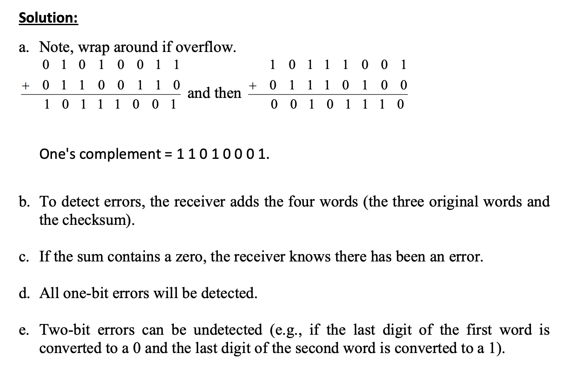
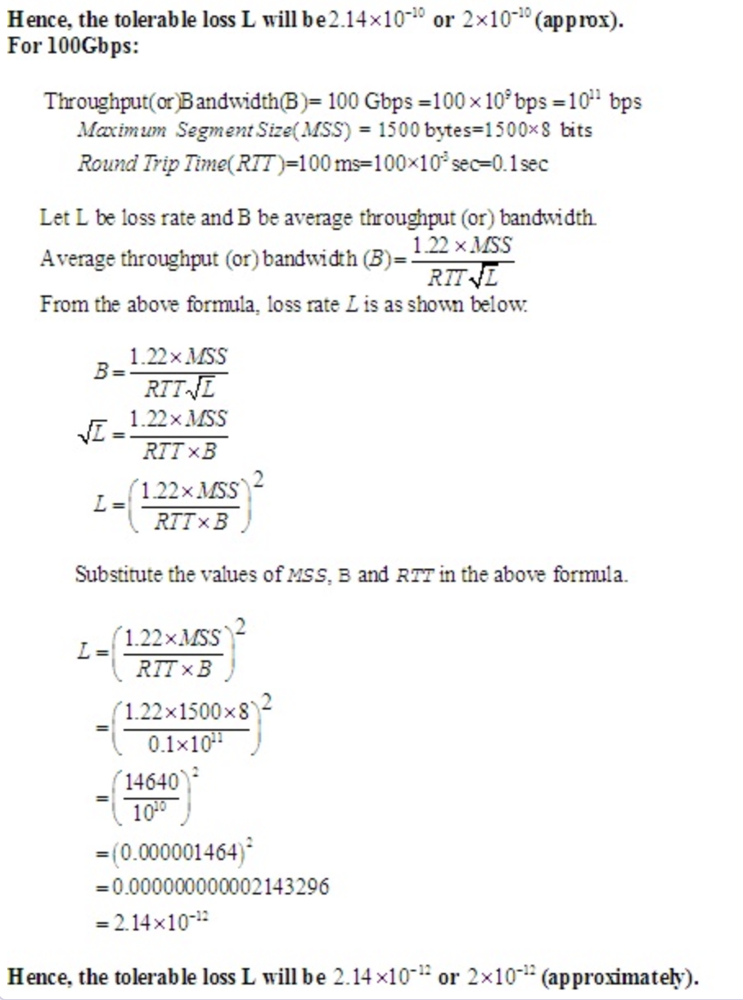
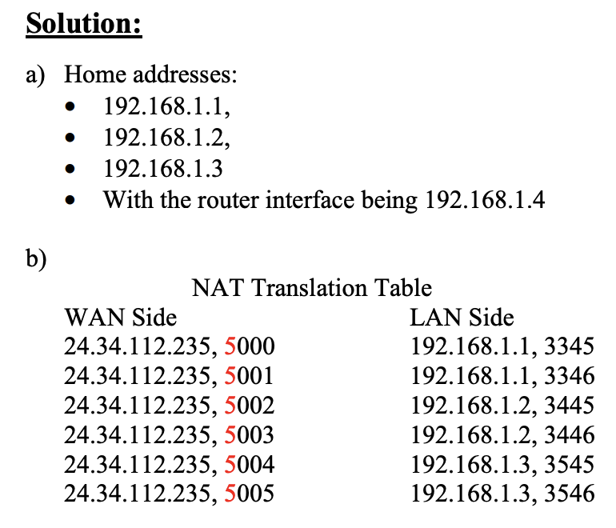
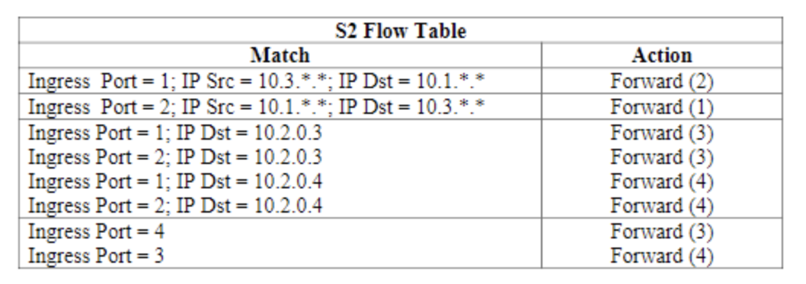

### Q1

1. In our RDT protocols, why did we need to introduce checksums?
   - Solution To detect packet corruption during transmission.
2. In our RDT protocols, why did we need to introduce sequence numbers?
   - Solution Sequence numbers are required for a receiver to determine whether an arriving packet contains new data or is a retransmission, to support re-ordering, and provide some information about potentially dropped packets.
3. In our RDT protocols, why did we need to introduce acknowledgements?
   - Solution Acknowledgements of some form are necessary to provide feedback to the sending host, so the sending host can know whether packets were successfully received.
4. In our RDT protocols, why did we need to introduce timers?
   - Solution Timers were introduced to detect lost packets. If the ACK for a transmittedpacket is not received within the duration of the timer for the packet, the packet (or its ACK or NACK) is assumed to have been lost. Hence, the packet is retransmitted.

### Q2
1. Answer each of the following as True or False:
a) Host A is sending Host B a large file over a TCP connection. Assume Host B has no
data to send to Host A. Host B will not send acknowledgements to Host A because
Host B cannot piggyback the acknowledgements on data.
Solution False
b) The size of the TCP rwnd never changes throughout the duration of the connection.
Solution False
c) Suppose Host A is sending Host B a large file over a TCP connection. The number
of un-ACKed bytes that A sends cannot exceed the size of the receive buffer.
Solution True except for when the receive buffer has an advertised size of 0, in which
case, Host A will send 1 byte to avoid deadlock.
d) Suppose Host A is sending Host B a large file over a TCP connection. If the sequence
number for a segment of this connection is m, then the sequence number for the
subsequent segment must be m + 1.
Solution False
e) The TCP segment has a field in its header for the receive window.
Solution True
f) Suppose the last SampleRTT in a TCP connection is equal to 1 second. The current
value of TimeoutInterval for the connection will necessarily by ≥ 1 sec.
Solution False, as SampleRTT and EstimatedRTT could be set such that EstimatedRTT is much lower than SampleRTT, so 0.875 x EstimatedRTT + 0.125 SampleRTT could be much less than (1-4DevRTT), which would create a TimeoutInterval < 1.
g) Suppose Host A sends one segment with the sequence number 38 and 4 bytes of
data over a TCP connection to Host B. In this same segment, the acknowledgement
number is necessarily 42.
Solution False

### Q4
The short answer: Yep! By "1500 byte segments" we infer MSS = 1500 bytes. Maximum Segment Size (MSS) is the largest amount of bits we are going to write into a single packet (not counting headers). If we want to send more information than this, we will break it up into multiple pieces and send them all. The receiver will be able to tell the order because we attach a sequence number (which is the total number of bits sent so far, not counting headers).

The longer answer:

I usually start these problems by converting everything into standard units:

100ms = .1 seconds

10 Gbps = 10*109 bits / second

1500 byte segement = 1500* 8 = 12000 bit segment

Potentially unnecessary if you can keep a lot in your head at the same time, but slow and steady is the way to go.

Next, we just plug everything in:

10*109 = (1.22 * 1500 * 8) / (.1 * sqrt(L))

683060 = 1 / (.1 * sqrt(L))

1/683060 = .1 * sqrt(L)

10/683060 = sqrt(L)

L = 2.143 * 10-10

Which is about the loss probability given (2 * 10-10). I realize I didn't help with too much more than plugging in, but maybe that helped out.

The second part will be very similar, so I assume you can get there with algebra. Let me know if you need help.

edit: I didn't factor in congestion window size. Take with a grain of salt.


### Q9

**Step1**  
A flow table is a more comprehensive routing table. A flow table allows more variables to determine the outbound interface of a packet.

It also allows dropping of a packet and modifying packet header values.

The match of a flow table is the matching of the packet header values to the table entry values.

The action of a flow table is the dropping, modify or forwarding of the packet.

**Step2:**

The first requirement is for packets from h3 to s2 should be sent clockwise. From s2 clockwise would be to send the packet to s1, meaning that it should be sent to port 2.

Hosts h1 and h2 belong to the same network, so they will both have destination address 10.1.x.x. Similarly hosts 5 and 6 will both have destination address 10.3.x.x.

Any packet sent from h3 to s2 will be received by s2 on port 3, so the INGR port value will be 3.

The first 2 entries are then:

| Match | Action |
| --- | --- |
| INGR port: 3,Dst IP: 10.1.x.x | Forward(2) |
| INGR port: 3,Dst IP: 10.3.x.x | Forward(2) |

**Step3:** 

Now, packet from h4 to h1, h2, h5 and h6 should be sent in a counter clockwise direction, meaning the output port will be 1.

The entries are then:

| Match | Action |
| --- | --- |
| INGR port: 4,Dst IP: 10.1.x.x | Forward(1) |
| INGR port: 4,Dst IP: 10.3.x.x | Forward(1) |​


**Step4:** 

| Match | Action |
| --- | --- |
| INGR port: 3,Dst IP: 10.1.x.x | Forward(2) |
| INGR port: 3,Dst IP: 10.3.x.x | Forward(2) |
| INGR port: 4,Dst IP: 10.1.x.x | Forward(1) |
| INGR port: 4,Dst IP: 10.3.x.x | Forward(1) |​


### Q1. [^1]

In our `rdt` protocols, why did we need to introduce sequence numbers?

Sequence numbers are required for a receiver to find out whether an arriving packet contains new data or is a retransmission.

In our `rdt` protocols, why did we need to introduce timers?

Timers were introduced to detect lost packets. If the ACK for a transmittedpacket is not received within the duration of the timer for the packet, the packet (or its ACK or NACK) is assumed to have been lost. Hence, the packet is retransmitted.

### Q2. [^1]

True or False

1. Host A is sending Host B a large file over a TCP connection. Assume Host B has no data to send Host A. Host B will not send acknowledgments to Host A because Host B cannot piggyback the acknowledgments on data.
2. The size of the TCP rwnd never changes throughout the duration of the connection.
3. Suppose Host A is sending Host B a large file over a TCP connection. The number of unacknowledged bytes that A sends cannot exceed the size of the receive buffer.
4. Suppose Host A is sending a large file to Host B over a TCP connection. If the sequence number for a segment of this connection is m, then the sequence number for the subsequent segment will necessarily be m+1.
5. The TCP segment has a field in its header for rwnd.

### Q3 [^2], [^3]

UDP and TCP use 1s complement for their checksums. Suppose you have the following three 8-bit bytes: 01010011, 01100110, 01110100. What is the 1s complement of the sum of these 8-bit bytes? (Note that although UDP and TCP use 16-bit words in computing the checksum, for this problem you are being asked to consider 8-bit sums.) Show all work. Why is it that UDP takes the 1s complement of the sum; that is, why not just use the sum? With the 1s complement scheme, how does the receiver detect errors? Is it possible that a 1-bit error will go undetected? How about a 2-bit error?



Calculate the sum of the given 3 bytes.

Add first two bytes: 10111001
Now add the result with the 3rd byte: 100101101

Wrap around the extra bit: 00101110
Check sum: 11010001

The 1’s compliment of (sum) 00101110 is 11010001.

It is clear that the 1’s compliment and the checksum are the same.

User Datagram Protocol (UDP) uses the 1’s complement as it is same as the checksum of the sum.The checksum is used by the receiver to identify the errors in the segment. The receiver performs the following steps at the receiver end to identify the errors in the segment.

Add all the bytes including checksum.
Observe the sum.
If it contains all 1’s then the segment has errors.
If it contains 1 or more 0’s then the segment contains errors.

### Q4 [^3]

In our discussion of TCP futures in Section 3.7, we noted that to achieve a throughput of 10 Gbps, TCP could only tolerate a segment loss probability of 2 · 10 -10 (or equivalently, one loss event for every 5,000,000,000 segments). Show the derivation for the values of 2 · 10 -10 (1 out of 5,000,000) for the RTT and MSS values given in Section 3.7. If TCP needed to support a 100 Gbps connection, what would the tolerable loss be?





### Q5 [^4]

Consider a datagram network using 32-bit host addresses. Suppose a router has four links, numbered 0 through 3, and packets are to be forwarded to the link interfaces as follows:


- Provide a forwarding table that has four entries, uses longest prefix matching, and forwards packets to the correct link interfaces.
- Describe how your forwarding table determines the appropriate link interface for datagrams with destination addresses:
```
11001000 10010001 01010001 01010101
11100001 01000000 11000011 00111100
11100001 10000000 00010001 01110111
```


### Q6 [^4], [^5]

Consider a subnet with prefix 128.119.40.128/26. 

Give an example of one IP address (of form xxx.xxx.xxx.xxx) that can be assigned to this network. 

Any IP address in range 128.119.40.128 to 128.119.40.191.

Suppose an ISP owns the block of addresses of the form 128.119.40.64/25. Suppose it wants to create four subnets from this block, with each block having the same number of IP addresses. What are the prefixes (of form a.b.c.d/x) for the four subnets?

Four equal size subnets: 128.119.40.64/28, 128.119.40.80/28, 128.119.40.96/28,
128.119.40.112/28.

### Q7 [^5]

Consider the network setup shown in the figure. Suppose that the ISP instead assigns the router the address 24.34.112.235 and that the network address of the home network is 192.168.1.0/24.

1. Assign addresses to all interfaces in the home network.
2. Suppose each host has two ongoing TCP connections, all to port 80 at host 128.119.40.86. Provide the six corresponding entries in the NAT translation table.




### Q8 [^6]

Consider the SDN OpenFlow network shown in Figure 4.30 . Suppose that the desired forwarding behavior for datagrams arriving at s2 is as follows:
- any datagrams arriving on input port 1 from hosts h5 or h6 that are destined to hosts h1 or h2 should be forwarded over output port 2;
- any datagrams arriving on input port 2 from hosts h1 or h2 that are destined to hosts h5 or h6 should be forwarded over output port 1;
- any arriving datagrams on input ports 1 or 2 and destined to hosts h3 or h4 should be delivered to the host specified;
- hosts h3 and h4 should be able to send datagrams to each other.


Specify the flow table entries in s2 that implement this forwarding behavior.



***Answer:*** The s2 flow table is as followed:

|                          Match                          |   Action   |
| :-----------------------------------------------------: | :--------: |
| Ingress Port: 1; IP Src: 10.3.\*.\*; IP Dst: 10.1.\*.\* | Forward(2) |
| Ingress Port: 2; IP Src: 10.1.\*.\*; IP Dst: 10.3.\*.\* | Forward(1) |
|            Ingress Port: 1; IP Dst: 10.2.0.3            | Forward(3) |
|            Ingress Port: 2; IP Dst: 10.2.0.3            | Forward(3) |
|   Ingress Port: 4; IP Src=10.2.0.4; IP Dst: 10.2.0.3    | Forward(3) |
|            Ingress Port: 1; IP Dst: 10.2.0.4            | Forward(4) |
|            Ingress Port: 2; IP Dst: 10.2.0.4            | Forward(4) |
|   Ingress Port: 3; IP Src=10.2.0.3; IP Dst: 10.2.0.4    | Forward(4) |

### Q9 [^7], [^8], [^9]

Consider again the SDN OpenFlow network shown in Figure 4.30 . Suppose we want switch s2 to function as a firewall. Specify the flow table in s2 that implements the following firewall behaviors (specify a different flow table for each of the four firewalling behaviors below) for delivery of datagrams destined to h3 and h4. You do not need to specify the forwarding behavior in s2 that forwards traffic to other routers.

- Only traffic arriving from hosts h1 and h6 should be delivered to hosts h3 or h4 (i.e., that arriving traffic from hosts h2 and h5 is blocked).
- Only TCP traffic is allowed to be delivered to hosts h3 or h4 (i.e., that UDP traffic is blocked).
- Only traffic destined to h3 is to be delivered (i.e., all traffic to h4 is blocked).
- Only UDP traffic from h1 and destined to h3 is to be delivered. All other traffic is blocked.


**Step1**  
A flow table is a more comprehensive routing table. A flow table allows more variables to determine the outbound interface of a packet.

It also allows dropping of a packet and modifying packet header values.

The match of a flow table is the matching of the packet header values to the table entry values.

The action of a flow table is the dropping, modify or forwarding of the packet.

**Step2:**

The first requirement When a packet is destined for h3 destination IP address 10.2.0.3. When a packet is destined for h4 destination IP address 10.2.0.4. When a packet is sent from h1 it will have IP address 10.1.0.1 and should be forwarded. When a packet is sent from h6 it will have IP address 10.3.0.6 and should be forwarded.

If the packet doesn't find a match in the flow table, it will be dropped. In order for the packets from h5 and h1 to be dropped, they should simply not be included in the table.

The table is then:

| Match | Action |
| --- | --- |
| Src IP: 10.1.0.1,Dst IP: 10.2.0.3 | Forward(3) |
| Src IP: 10.1.0.1,Dst IP: 10.2.0.4 | Forward(4) |
| Src IP: 10.3.0.6,Dst IP: 10.2.0.3 | Forward(3) |
| Src IP: 10.3.0.6,Dst IP: 10.2.0.4 | Forward(4) |

**Step3:** 

The second requirement To identify the traffic protocol, the source port field can be used. If the source port field is set to TCP, then the traffic is TCP traffic.

The table is then:

| Match | Action |
| --- | --- |
| SRC port = TCP,Dst IP: 10.2.0.3 | Forward(3) |
| SRC port = TCP,Dst IP: 10.2.0.4 | Forward(4) |​


**Step4:** 

The third requirement: If the table entries are only for h3, all traffic to h4 will be dropped.

The table is then:


| Match | Action |
| --- | --- |
| Dst IP: 10.2.0.3 | Forward(3) |

The fourth table:


| Match | Action |
| --- | --- |
| SRC port = UDP,Src IP: 10.1.0.1,Dst IP: 10.2.0.3 | Forward(3) |
  
### Q10 [^10]

Compare and contrast link-state and distance-vector routing algorithms.


Link-state routing algorithms use global network information, meaning that the entire network topology and all link costs can be passed as input. Distance-vector algorithms only have access to local information communicated by neighbors, making them iterative, asynchronous, and distributed

[^1]: http://cody.bunta.in/assets/classes/2017_fall_umd_inst346/hws/hw03_solutions.pdf
[^2]: https://coursys.sfu.ca/2017su-cmpt-371-d1/pages/Assignment3_Sol/view
[^3]: https://hackmd.io/@IGlmVDiyQpqjU6o39i396Q/rkU0jJEKs
[^4]: https://www.cmlab.csie.ntu.edu.tw/~chenyuyang/CN2019/homeworks/hw5_sol.pdf
[^5]: https://coursys.sfu.ca/2017su-cmpt-371-d1/pages/assignment4_sol/view
[^6]: https://hackmd.io/@ComputerScienceNote/rksCKAr2L
[^7]: https://blog.csdn.net/weixin_46183779/article/details/121130515
[^8]: https://quizlet.com/explanations/questions/consider-again-the-sdn-openflow-network-shown-in-figure-suppose-that-the-desired-forwarding-behavior-for-datagrams-arriving-from-hosts-h3-or-9b6e9b23-6cf06944-99c5-4cb8-825a-b53d29e0e695
[^9]: https://quizlet.com/explanations/questions/consider-again-the-sdn-openflow-network-shown-in-figure-suppose-we-want-switch-s2-to-function-as-a-firewall-specify-the-flow-table-in-s2-tha-bf55efbb-ee5c6e38-0800-4d0f-8147-2eabb35b8639
[^10]: https://quizlet.com/293108152/csce-416-chapter-5-6-flash-cards/