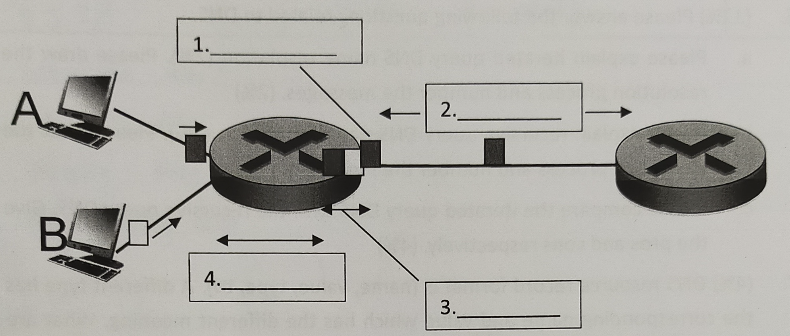
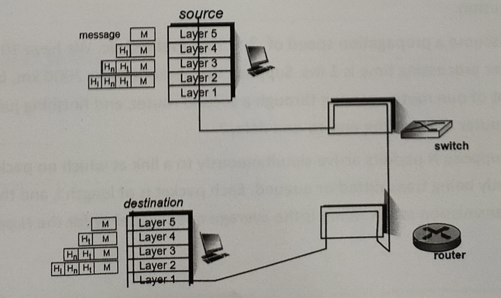
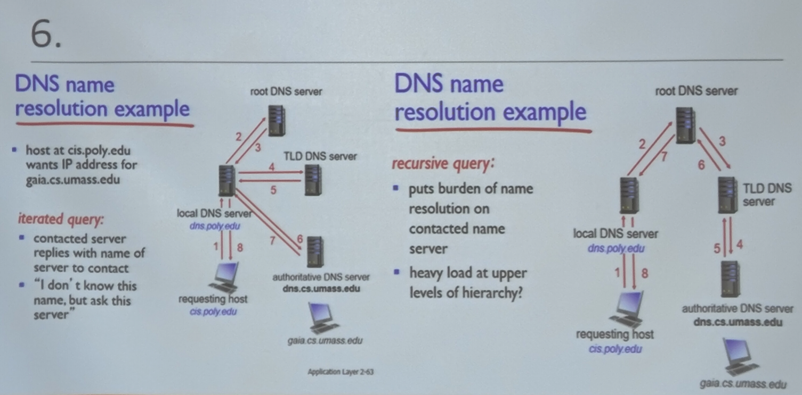
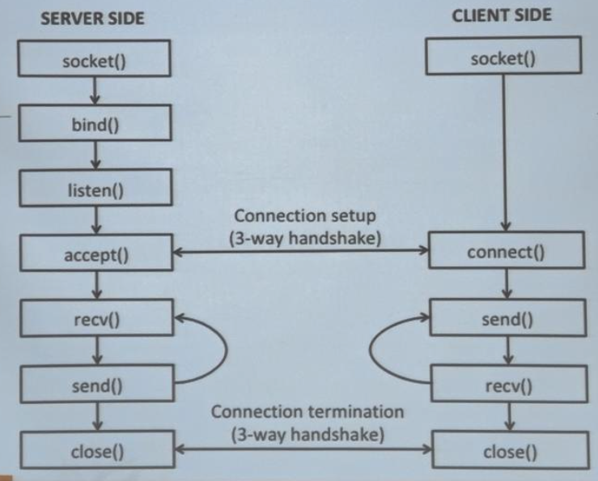

# 2020

### Q1
The queueing delay is an illustration of four sourcess of packet delay.
-  (4 marks) Please fill four sources of packet delay in the blanks.
-  (2 marks) In average, which delay takes the longest time?

   

**Answer:**
1. Transmitting Delay ($L/R$)
2. Propogation Delay ($d/s$)
3. Queueing Delay ($L * a / R$)
4. Nodal Processing Delay

- Queueing Delay

### Q2
Please answer the following questions.
- (5 marks) Please explain every layer in TCP/IP model.
- (1 mark) Which layer of the TCP/IP model is equivalent to the session layer and the presentation layer of the OSI model?

**Answer:**

- In TCP/IP model, there are 5 layers.
    ```
    Application Layer
    -----------------
    Transport Layer
    -----------------
    Network Layer
    -----------------
    Data Link Layer
    -----------------
    Physical Layer
    ```
  
- Application Layer

### Q3
Please describe the following terms.
- (2 marks) Distributed Denial of Service (DDoS) attack.
- (2 marks) IP spoofing.
- (2 marks) Packet sniffing.

**Answer:**
- 透過大量合法或偽造的請求佔用大量網路以及器材資源，已達到癱瘓網路以及系統的目的。
- 帶有假的來源 IP 位址，目的是冒充另一個計算系統的身份。
- 擷取封包，並對他做分析。是一種網路流量數據分析的手段。

### Q4
A message has been sent from source to destination passed by a switch and a router.
- (3 marks) When a protocol on the sending host(source) adds data to the packet header, the process is called data encapsulation. Moreover, each layer has a different term for the altered packet, as shown in the following figure. Please list the term of the packet in Layer2, Layer3, Layer4.
- (4 marks) Briefly explain the encapsulation/decapsulation procedure on the switch and the router.

  

**Answer:**
- Layer1: Message
- Layer2: Frame
- Layer3: DataGram
- Layer4: Segment

<br>

- 只要有提到 switch 解封裝到 Link Layer（查看 header 的 mac addres）、router 解封裝到 Network Layer（查看 header 的 ip addres）即可。

### Q5
(5 marks) Suppose two hosts, A and B, are separated by $12,500 kilometers$ and are connected by a direct link of R = $100 Mbps$. Suppose the propagation speed over the link is $2.5 × 10^{8} meters/sec$. Calculate the bandwidth-delay product.


**Answer:**

$d_{prop} = \frac{1.25 \times 10^4 \times 10^3}{2 \times 10^8} = 0.0625 (s)$

$R \times d_{prop} = 100 \times 2^{20} \times 0.0625 = 6553600 (bits)$

其中 M 要帶入 $10^6$ 或 $2^{20}$ 都可以。

### Q6
(12 marks) Please answer the following questions related to DNS.
- (2 marks) Please explain iterated query DNS name reolution. (2 marks) Please draw the resolution process and number the messages.
- (2 marks) Please explain recursive query DNS name reolution. (2 marks) Please draw the resolution process and number the messages.
- (4 marks) Please compare the iterated query DNS with the recursive query DNS. Give the **pros and cons** respectively.

**Answer:**




### Q7
(4 marks) DNS resource record format is (name, value, type, ttl). A diferent type has the corresponding name and value which has the different meaning. What are the meanings of name and value when the types is "A" and "NS" respectively?

**Answer:**

- A: name = domain name, value = IP address
- NS: name = domain, value = hostname of authoritative name server for this domain


### Q8
(6 marks) There are two IPs: `140.115.59.60` and `140.115.44.147`. Which CIDR(Classless Inter-Domain Routing) value can make these two IPs in the same subnetwork and minimize the number of IP addresses? And how many available IPs does it have?

**Answer:**

```
140.115.59.60
140.115.44.147

因為都是 140.155 開頭，所以 MASK 前 8 x 2 bits 為 1
```

| | |
| --- | --- |
| 59 | 60 |
| 00111011 | 00111100 | 
| 44 | 147 |
| 00101100 | 10010011 | 

`59`, `44` 前三個 bit 相同， $8 \times 2 + 3 = 19 (bits)$ -> $CIDR VALUE = 19$ MASK = `255.255.224.000`

$32-19=13$

$13-8=5$

$2^5 \times (2^8 - 2) = 8128$


### Q9
(12 marks) Please write down the full name (1 mark) of each abbreviation and introduce it (2 marks).
1. DNS
2. HTTP
3. CDN
4. DASH

**Answer:**
1. DNS(Domain Name System): Dynamic name serverm hostname to IP address translation.
2. HTTP(HyperText Transfer Protocol): Web's application layer protocol client using `get`, `post` to get information from server.
3. CDN(Content Delivery Network): stores copies of content at CDN nodes and subscriber request content form DCN.
4. DASH(Dynamic Adaptive Streaming over HTTP): Adaptive streaming over HTTP.

### Q10
(6 marks) Please draw the flow chart in socket programming with TCP.

**Answer:**



### Q11
(4 marks) How is a TCP socket identified?

**Answer:**

- Source IP address
- Source port number
- Destination IP address
- Destination port number

### Q12
(4 marks) What is the main purpose of setting up the web caches (proxy server)? (Given 2 points)

**Answer:**

1. Satisfy client request without involving origin server.
2. reduce response time for client request.
3. reduce traffic on an institution's access link.
4. Internet dense with caches: enables **"poor"** content providers to effectively deliver content(so too does P2P file sharing).

### Q13
(10 marks) Consider distributing a file of $F = 15 Gbits$  to $N$ peers. The server has an upload rate of $u_s = 30 Mbps$, and each peer has a download rate of $d_{min} = 2 Mbps$ and an upload rate of $u$, For $N = 100$ and $u = 2Mbps$. Calculate the minimum distribution time for both client-server distribution and P2P distribution. 

**Answer:**

$D_{CS} = max\{ \frac{NF}{u_S}, \frac{F}{d_{min}}\} = max\{51200, 7680\} = 51200$

$D_{P2P} = max\{ \frac{F}{u_S}, \frac{F}{d_{min}}, \frac{NF}{u_S + \sum_{i=1}^{n} u_i}\} = max\{512, 7680, 6678\} = 7680$

其中 M 要帶 $10^6$ 或 $2^{20}$ 都可以。

### Q14
(6 marks) Assume a propagation speed of $2 \times 10^8 metes/sec$. We have 10 packets. A router processing time is $1 ms$. Suppose the packet travels $2000 km$, beginning in front of one router, passing through a second router, and finishing just after a third router. What is the end-to-end delay?

**Answer:**

# Q15
(6 marks) Suppose $N$ packets arrive simultaneously to a link at which no packets are currently being transmitted of queued. Each packet is of length $L$ and the link has transmission rate $R$. What is the average queuing delay for the $N$ packets?

**Answer:**

$\frac{(N - 1)L}{2R}$

