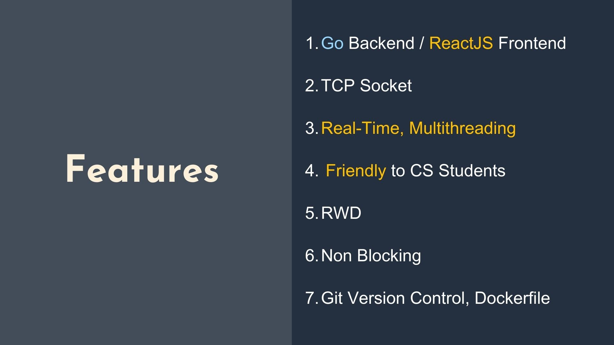
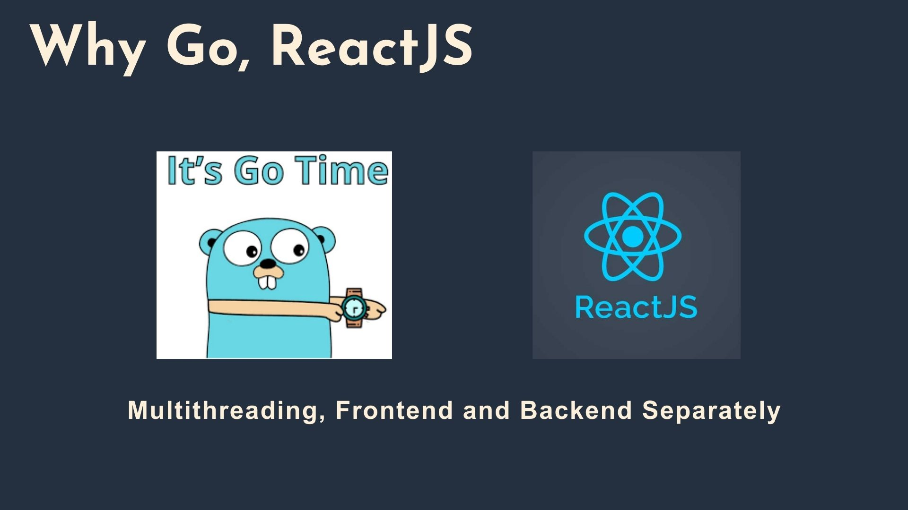

# Online Anonymous Multi-User Message Board


[](https://github.com/1chooo/multi-message-board)
[](https://golang.org "Go to Go homepage")
[](https://reactjs.org "Go to ReactJS homepage")
[](../LICENSE "Go to license section")

**Table of Contents**
- [Online Anonymous Multi-User Message Board](#online-anonymous-multi-user-message-board)
  - [Get Started](#get-started)
    - [Frontend with ReactJS](#frontend-with-reactjs)
    - [Backend with GO](#backend-with-go)
  - [Introduction](#introduction)
  - [Features](#features)
  - [Languages and Tools](#languages-and-tools)
  - [Project Structure](#project-structure)
    - [Backend](#backend)
    - [Frontend](#frontend)
  - [Code Description](#code-description)
    - [`main.go`](#maingo)
    - [`pkg/websocket/client.go`](#pkgwebsocketclientgo)
    - [`pkg/websocket/pool.go`](#pkgwebsocketpoolgo)
    - [`pkg/websocket/pool.go`](#pkgwebsocketpoolgo-1)
  - [License](#license)

<br>
<br>
<br>
<br>

## Get Started

### Frontend with ReactJS
```shell
$ mkdir frontend
$ cd frontend
$ npm install -g create-react-app
$ npx create-react-app .
$ yarn add node-sass
```

### Backend with GO
```shell
$ mkdir backend
$ cd backend
$ go mod init github.com/1chooo/socket-programming
$ go get github.com/gorilla/websocket
```

## Introduction


## Features



<br>
<br>
<br>
<br>


## Languages and Tools



## Project Structure

### Backend
```
backend/
├── pkg/websocket
│   ├── client.go
│   ├── pool.go
│   └── websocket.go
├── Dockerfile
├── go.mod
├── go.sum
└── main.go
```

### Frontend
```
frontend/
├──   :
├──   :
├── src/
│   ├── api/
│   │   └── index.js
│   ├── components/
│   │   ├── ChatHistory/
│   │   │   ├── ChatHistory.jsx
│   │   │   ├── ChatHistory.scss
│   │   │   └── index.js
│   │   ├── ChatInput/
│   │   │   ├── ChatInput.jsx
│   │   │   ├── ChatInput.scss
│   │   │   └── index.js
│   │   ├── Footer/
│   │   │   ├── Footer.jsx
│   │   │   ├── Footer.scss
│   │   │   └── index.js
│   │   ├── Header/
│   │   │   ├── Header.jsx
│   │   │   ├── Header.scss
│   │   │   └── index.js
│   │   ├── Message/
│   │   │   ├── Message.jsx
│   │   │   ├── Message.scss
│   │   │   └── index.js
│   │   ├── App.css
│   │   ├── App.js
│   │   ├──   :
│   │   └──   :
├──   :
└──   :
```

## Code Description

### `main.go`
```go
package main

import (
    "fmt"
    "net/http"

    "github.com/1chooo/socket-programming/pkg/websocket"
)

func serveWs(pool *websocket.Pool, w http.ResponseWriter, r *http.Request) {
    fmt.Println("WebSocket Endpoint Hit")
    conn, err := websocket.Upgrade(w, r)
    if err != nil {
        fmt.Fprintf(w, "%+v\n", err)
    }

    // Create a new client using the WebSocket connection and pool
    client := &websocket.Client{
        Conn: conn,
        Pool: pool,
    }

    // Register the new client to the pool
    pool.Register <- client
    // Start reading messages from the WebSocket connection
    client.Read()
}

func setupRoutes() {
    // Create a new WebSocket pool
    pool := websocket.NewPool()
    // Start the WebSocket pool in a separate goroutine
    go pool.Start()

    // Define a WebSocket endpoint and specify the handler function
    http.HandleFunc(
        "/ws", 
        func(w http.ResponseWriter, r *http.Request) {
            serveWs(pool, w, r)
        },
    )
}

func main() {
    fmt.Println("Online Anonymous Multi-User Chat App v0.01")
    fmt.Println("Server Running on Port 8080...")
    setupRoutes()
    http.ListenAndServe(":8080", nil)
}
```


### `pkg/websocket/client.go`
```go
package websocket

import (
    "fmt"
    "log"
    // "sync"

    "github.com/gorilla/websocket"
)

type Client struct {
    ID   string          // Unique identifier for the client
    Conn *websocket.Conn // WebSocket connection of the client
    Pool *Pool           // Pool reference where the client is registered
}


type Message struct {
    Type int    `json:"type"` // Type of the message
    Body string `json:"body"` // Body content of the message
}


func (c *Client) Read() {
    defer func() {
        c.Pool.Unregister <- c // Unregister client from the pool
        c.Conn.Close()         // Close the client's WebSocket connection
    }()

    for {
        messageType, p, err := c.Conn.ReadMessage() // Read the incoming WebSocket message
        if err != nil {
            log.Println(err)
            return
        }

        message := Message{Type: messageType, Body: string(p)} // Create a message from the received data
        c.Pool.Broadcast <- message                           // Broadcast the received message to all clients
        fmt.Printf("Message Received: %+v\n", message)        // Print the received message
    }
}
```

### `pkg/websocket/pool.go`

```go
package websocket

import "fmt"

type Pool struct {
    Register   chan *Client     // Channel to register new clients
    Unregister chan *Client     // Channel to unregister clients
    Clients    map[*Client]bool // Map of connected clients
    Broadcast  chan Message     // Channel to broadcast messages to all clients
}

func NewPool() *Pool {
    return &Pool{
        Register:   make(chan *Client),
        Unregister: make(chan *Client),
        Clients:    make(map[*Client]bool),
        Broadcast:  make(chan Message),
    }
}

func (pool *Pool) Start() {
    for {
        select {
        case client := <-pool.Register:
            // Add the newly registered client to the pool
            pool.Clients[client] = true
            
            // Log pool size and notify all clients about the new user
            fmt.Println("Size of Connection Pool: ", len(pool.Clients))
            for client := range pool.Clients {
                client.Conn.WriteJSON(
                    Message{Type: 1, Body: "New User Joined..."},
                )
            }
            
        case client := <-pool.Unregister:
            // Remove the client from the pool upon unregistration
            delete(pool.Clients, client)
            
            // Log pool size and notify all clients about the disconnected user
            fmt.Println("Size of Connection Pool: ", len(pool.Clients))
            for client := range pool.Clients {
                client.Conn.WriteJSON(
                    Message{Type: 1, Body: "User Disconnected..."},
                )
            }
            
        case message := <-pool.Broadcast:
            // Broadcast the received message to all clients in the pool
            fmt.Println("Sending message to all clients in Pool")
            for client := range pool.Clients {
                if err := client.Conn.WriteJSON(message); err != nil {
                    fmt.Println(err)
                    return
                }
            }
        }
    }
}
```

### `pkg/websocket/pool.go`

```go
package websocket

import (
    "log"
    "net/http"

    "github.com/gorilla/websocket"
)

var upgrader = websocket.Upgrader{
    ReadBufferSize:  1024, // Size of the read buffer
    WriteBufferSize: 1024, // Size of the write buffer
    CheckOrigin: func(r *http.Request) bool { 
        return true 
    }, // Function to check request origin
}

func Upgrade(w http.ResponseWriter, r *http.Request) (*websocket.Conn, error) {
    conn, err := upgrader.Upgrade(w, r, nil)
    if err != nil {
        log.Println(err)
        return nil, err
    }

    return conn, nil
}
```

## License
Released under [MIT](../LICENSE) by [Hugo ChunHo Lin](https://github.com/1chooo).

This software can be modified and reused without restriction.
The original license must be included with any copies of this software.
If a significant portion of the source code is used, please provide a link back to this repository.
