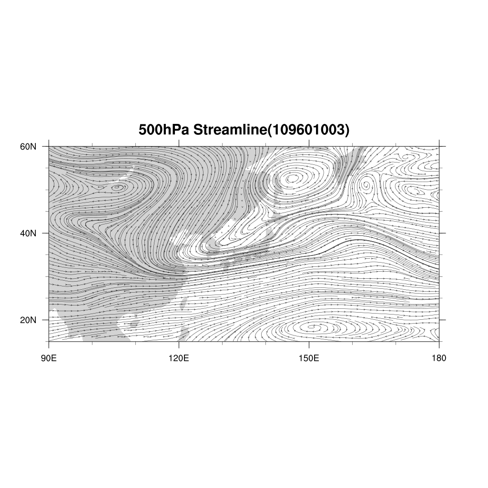
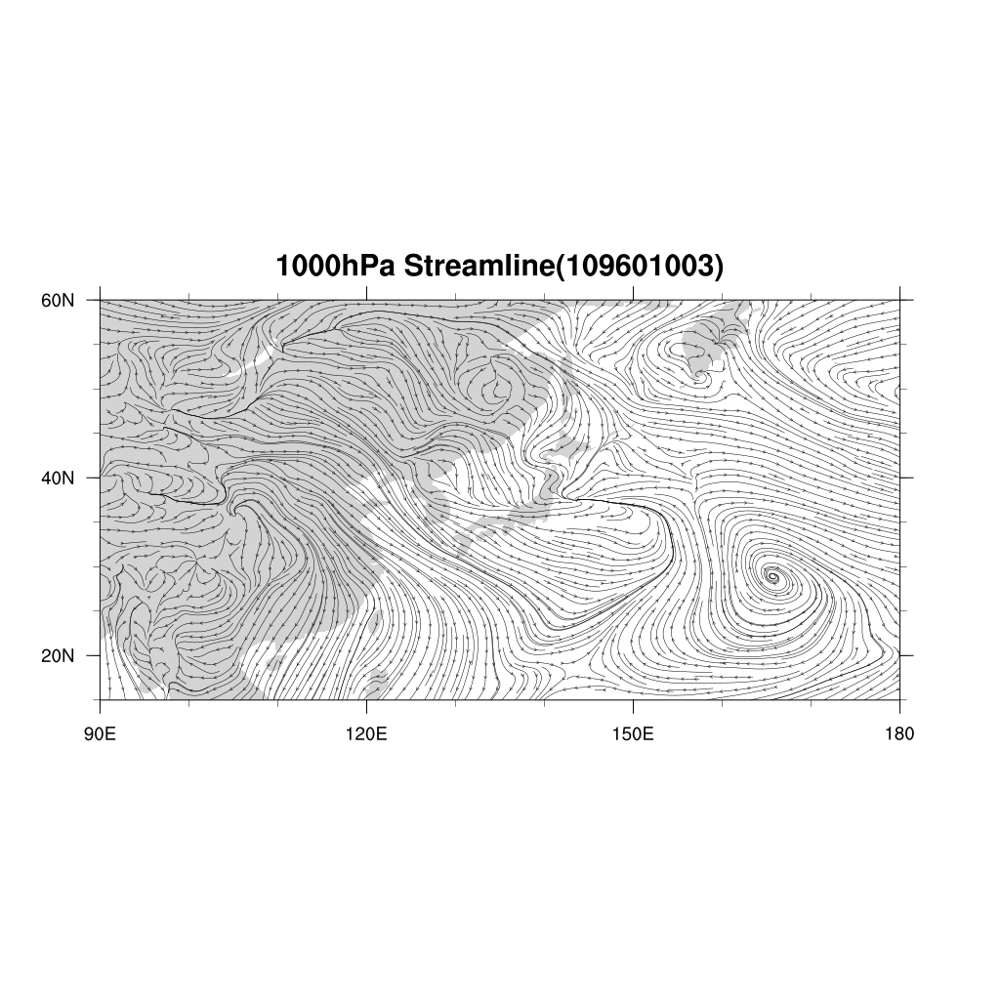
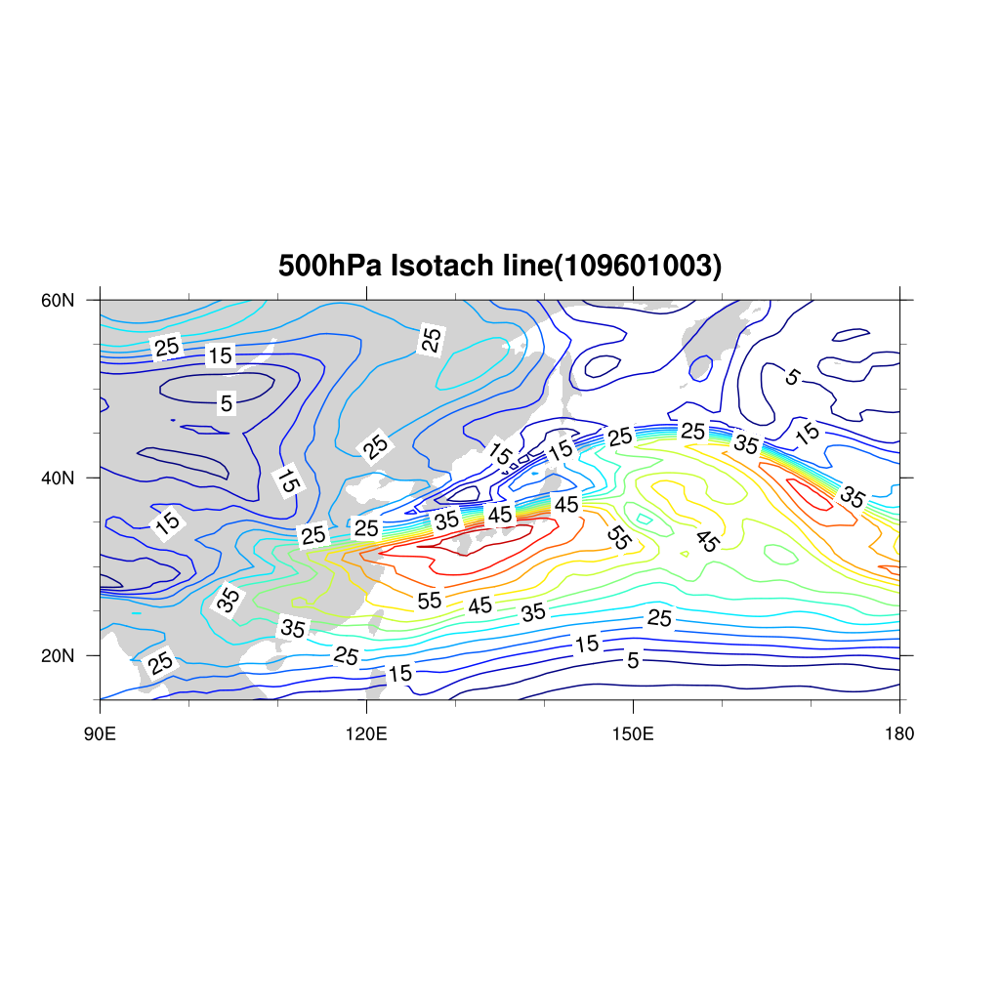
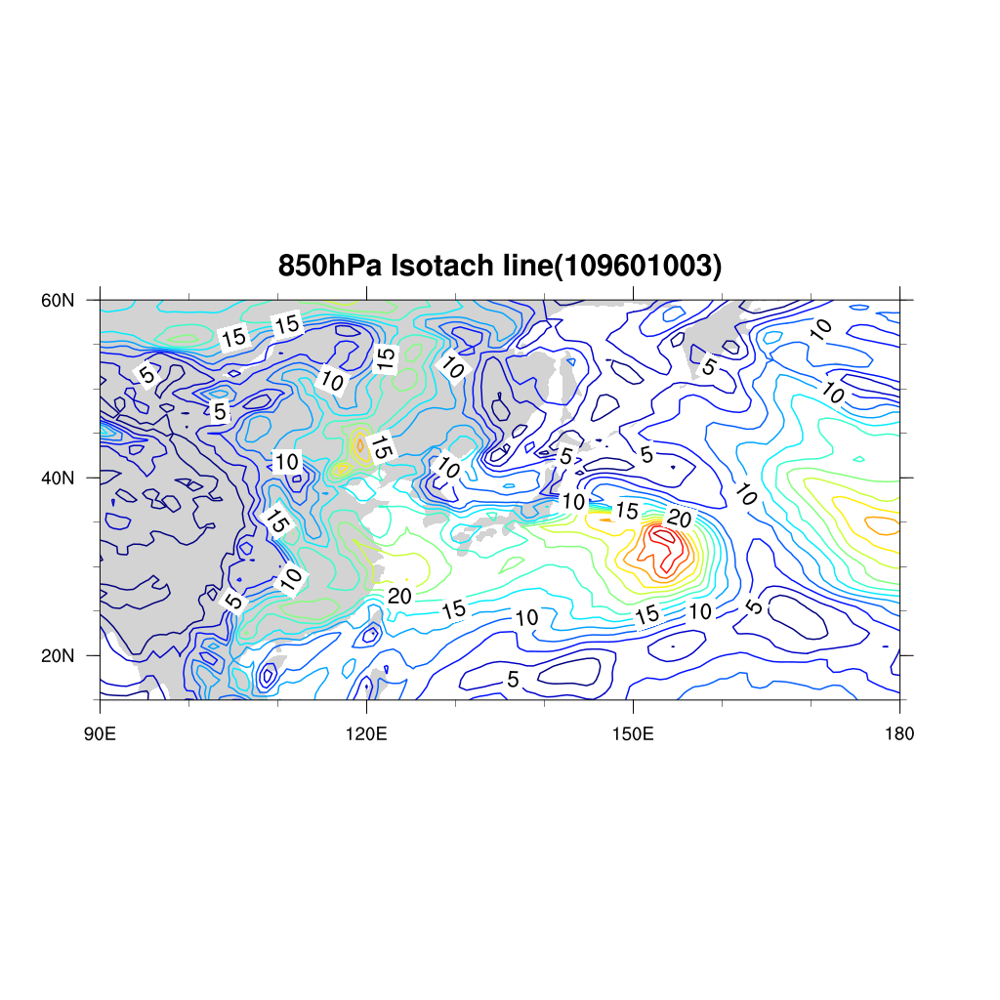
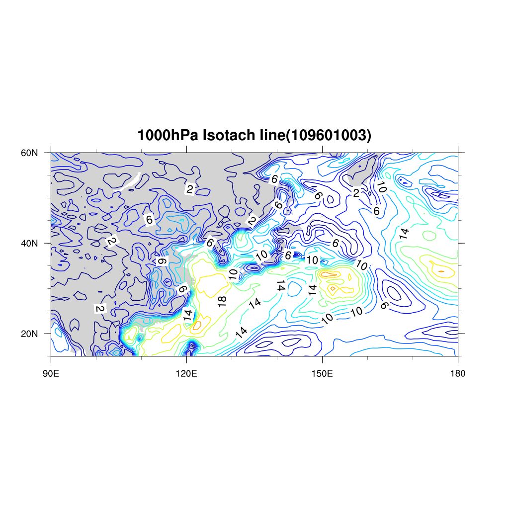
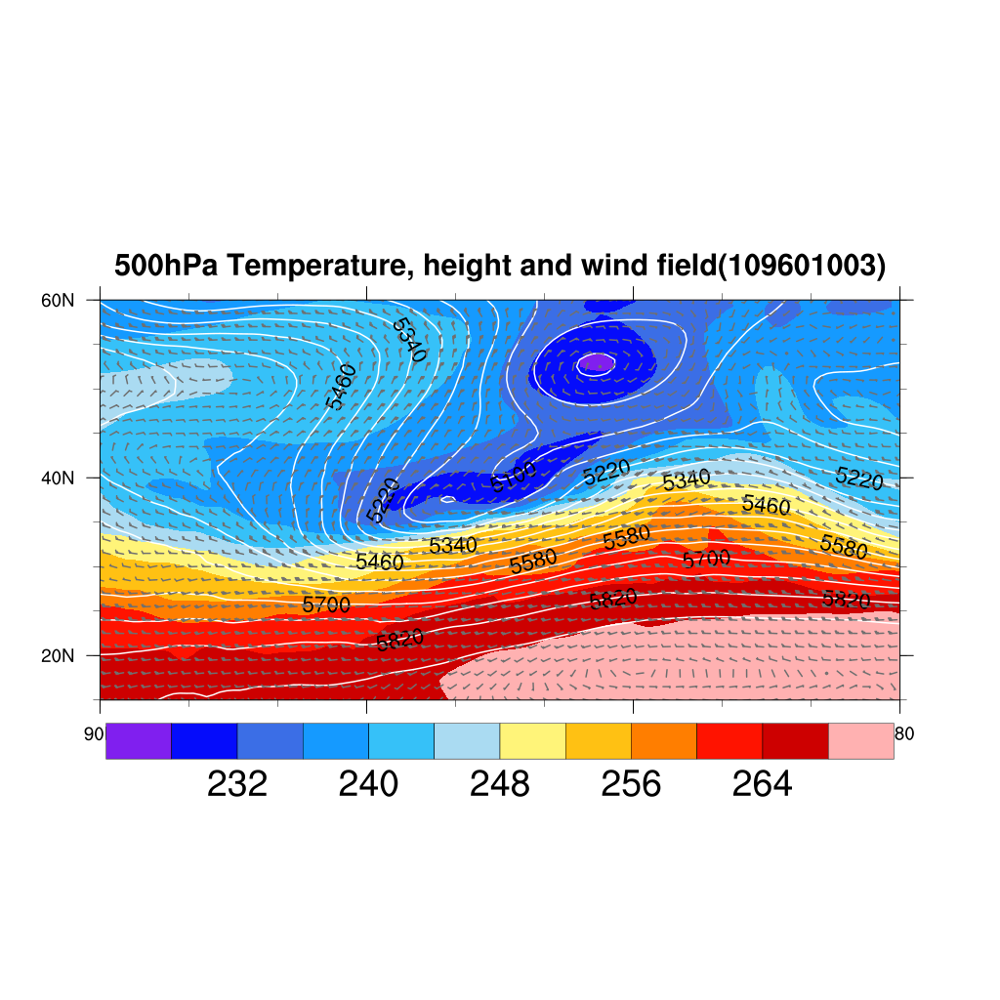
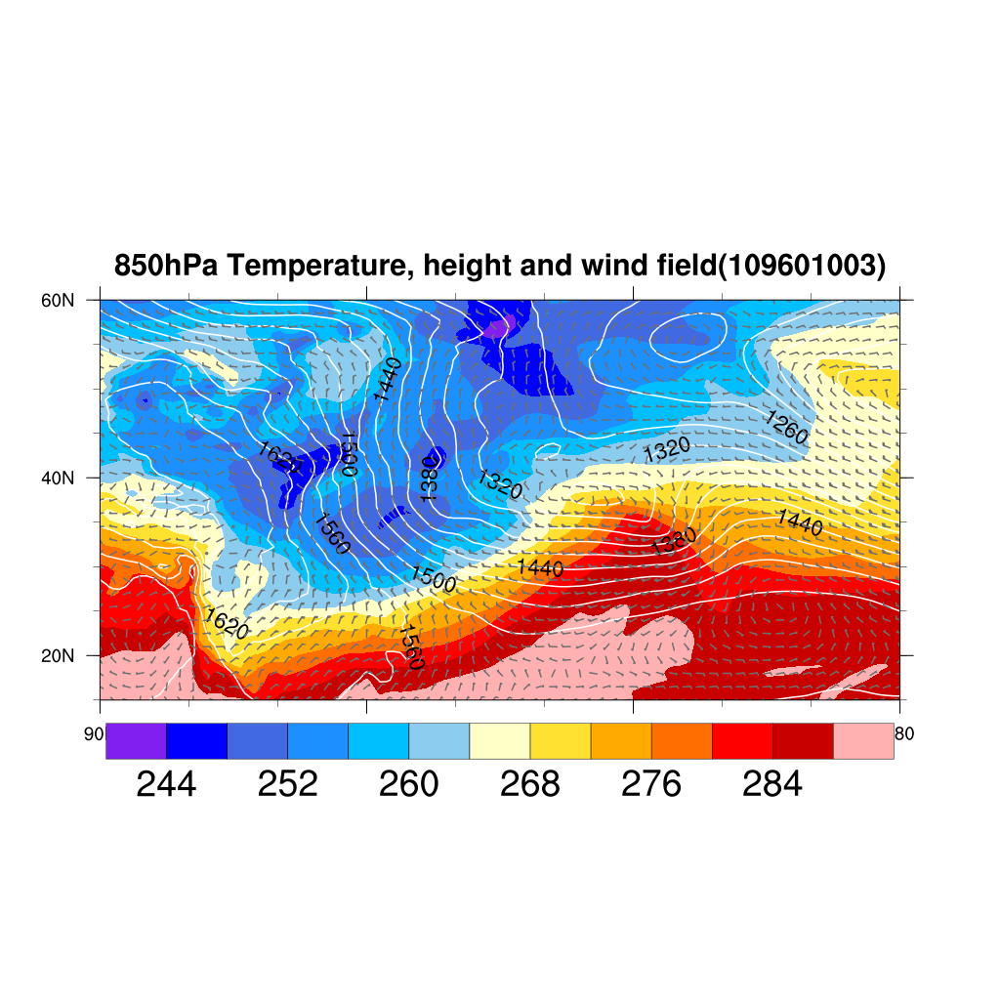
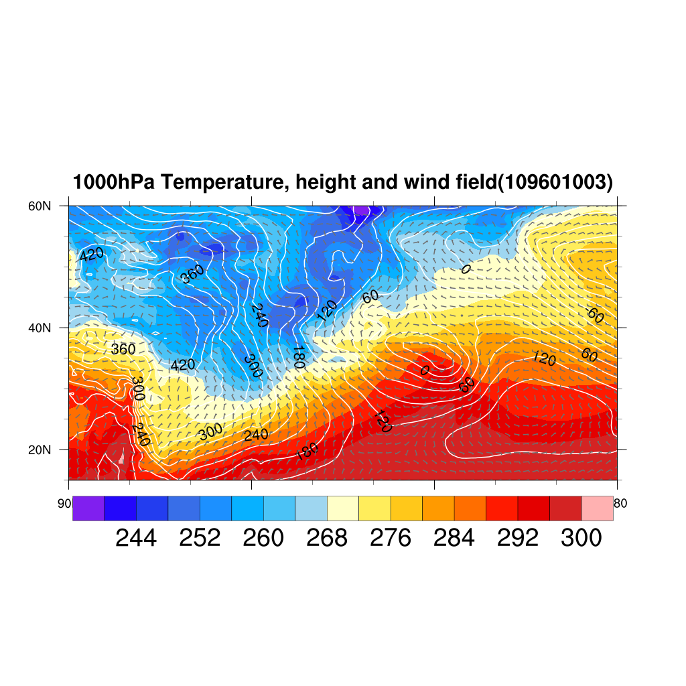

# 天氣學與氣象分析
##### HW4 - 電腦繪圖
##### 林群賀
##### 109601003


## Stream Line
| Stream Line    | 說明                         | 繪圖                                  |
| ------- | ---------------------------- | ------------------------------------- |
| 500 hPa | 根據角動量守恆定律，氣塊移動到極地，緯度增加，旋轉半徑變小，所以氣快角動量會上升，導致西風噴流形成。當冬天時，極地對流層頂與熱帶對流層頂的氣溫溫差變大，更加增強西風帶的速度。 |   |
| 850 hPa | 同 500 hPa |   |
| 1000 hPa | 明顯看出台灣的平流，西伯利亞高壓南下，正影響台灣，台灣此時可能有寒流！ |  |

## Isotach Line
| Isotach Line    | 說明                         | 繪圖                                  |
| ------- | ---------------------------- | ------------------------------------- |
| 500 hPa | 與氣流線差異不大 |   |
| 850 hPa | 與氣流線差異不大 |   |
| 1000 hPa | 海面風速通常較大，因為近地面風速與地形關係較大，海面摩擦力較小。 |  |

## Temperature, Height, Wind Field
| Temperature, Height, Wind Field    | 說明                         | 繪圖                                  |
| ------- | ---------------------------- | ------------------------------------- |
| 500 hPa | 在日本海處可以看到有一個槽線延伸，此高度下重力位高度與溫度大抵上重合，北邊低壓；南邊高壓。 |  |
| 850 hPa, 1000 hPa | 可以看出有滿強烈的冷瓶留在台灣附近，並且可以看到台灣在清晨六點為本日最低溫，不過目前台灣還是在槽前 |   |

## 總分析

從上述的觀察中，感覺冷高壓準備進台灣，並且會連帶台灣溫度下降。


## 程式碼

```ncl
; Assignment 4
; Name: Hugo ChunHo Lin
; Student Id: 109601003


function setMapsResource(resource: logical)
local localResource
begin
  localResource = resource

  localResource@mpLimitMode = "LatLon" 
  localResource@mpMinLatF   =  15.     
  localResource@mpMaxLatF   =  60.     
  localResource@mpMinLonF   =  90.     
  localResource@mpMaxLonF   = 180.     
  
  return localResource
end

function setIsothermalContourResource(resource: logical)
local localResource
begin
  localResource = resource

  localResource@gsnAddCyclic     = False
  
  localResource@cnFillOn         = True       ; areas between contour levels are filled with a solid color
  localResource@cnLinesOn        = False      ; turn off contour lines
  ;localResource@cnLineLabelsOn  = False      ; tuen off line labels
  localResource@lbLabelBarOn     = True       ; will draw a panel label bar
  
  return localResource
end

function setIsobaricContourResource(resource: logical)
local localResource
begin
  localResource = resource

  localResource@gsnAddCyclic     = False

  localResource@cnLevelSpacingF  = 5
  localResource@tiMainOn         = False         ; turns the Main title off.
  localResource@cnFillPalette    = "gui_default" ; set color map
  localResource@cnLineLabelBackgroundColor = -1
  localResource@cnInfoLabelOn    = False         ; Robin ask: what is this?
  localResource@lbLabelBarOn     = False         ; will draw a panel label bar instead
  localResource@cnLineColor      = "white"
  localResource@cnLineThicknessF = 3.0
  
  return localResource
end


function setWindbarVector(resource: logical)
local localResource
begin
  localResource = resource

  localResource@gsnAddCyclic             = False

  localResource@vcGlyphStyle             = "WindBarb"     ; select wind barbs
  localResource@vcRefLengthF             = 0.008          ; define length of vec ref
  localResource@vcRefAnnoOn              = False          ; turn off ref wind barb
  localResource@vcMinDistanceF           = 0.012          ; thin out windbarbs
  localResource@vcWindBarbLineThicknessF = 3.             ; set the wind barb thickness
  localResource@trYReverse               = True           ; reverse the Y-axis
  localResource@vcWindBarbColor          = (/111, 111, 111/) / 255.

  return localResource
end


function setIsotachContourResource(resource: logical)
local localResource
begin

  localResource = resource
  localResource@gsnAddCyclic     = False

  localResource@cnFillOn         = False
  localResource@cnInfoLabelOn    = False         ; Robin ask: what is this?
  localResource@cnMonoLineColor  = False         ; control the color of each line individually
  localResource@cnLineColors     = span_color_rgba("NCV_jet",15)   ; 256 colors, span it to get 11 colors
  localResource@cnLineThicknessF = 3.0

  return localResource
end


; Main program strat -----------------------
begin
path = "./"

; If -1 is given for the dimensions parameter,
; all values in the file will be read into a one-dimensional variable.
lines  = asciiread(path+"012400.txt", -1, "string")

; The dimension size of this variable will be equal to the number of elements in the file.
nlines = dimsizes(lines)

;;print(nlines)
;;print(lines)

mlon  = 121 ; range: 90~180, step: 0.75
nlat  = 61  ; range: 15~60, step: 0.75
levs  = 5   ; 300, 500, 700, 850, 1000
vars  = 4   ; H, U, V, T

; 'var': Processing the data in 'lines', store 4-dimension data about:
; vars=0: values of Geopotential meters height (H), unit: GPM, in latitude and longitude grid
; vars=1: values of Meridional wind speed (U), in latitude and longitude grid
; vars=2: values of Zonal wind speed (V), in latitude and longitude grid
; vars=3: values of Temperature (T), unit: Kelvin, in latitude and longitude grid
var = new((/vars, levs, nlat, mlon/), float)

pressure_levels = (/300, 500, 700, 850, 1000/)

nl   = 0    ; Count line
nvar = 0    ; Record data types in (H=0, U=1, V=2, T=3)
nlev = 0    ; Record isobaric surfaces in (300hPa=0, 500hPa=1, 700hPa=2, 850hPa=3, 1000hPa-4)
do while(nl .lt. nlines)
;---Read the first character of this line, return substring: (string, start, end)
  first = str_get_cols(lines(nl), 0, 0)
;---If it's a "%", then increment to next line.
  if(first .eq. "D") then
    nl = nl + 1           ; increment line counter, skip 'DATE=160124  HOUR=00  PLEVEL= ...'
    continue
  else
;---Otherwise, get the number of rows and read the data.
    
    ; In 012400.txt, every 739 lines contains a complete set of data
    ; of latitude and longitude grid, (121*61 = 739*10-1 = 7381 values).
    nrows = 739
    
    if(nvar .gt. vars-1)then
       nvar = 0           ; resourceet the type of variable to Geopotential meters height (H)
       nlev = nlev + 1    ; switch to different isobaric surface, ex: 300, 500, 700, 850, 1000
    end if
    nl = nl + 1           ; increment line counter, skip '**** ...  ****'
    ;;print("==================================================")
    ;;print("Reading " + nrows + " rows of data.")

    ; Clean up the strings so there's only one space between each string,
    ; and no extra space at beginning or end.
    ; This allows us to use str_split_csv to parse this chunk of data.
    ; str_split_csv expects a single character delimiter (a space in this case).
    lines(nl:nl+nrows-1) = str_sub_str(lines(nl:nl+nrows-1),"    "," ")
    lines(nl:nl+nrows-1) = str_sub_str(lines(nl:nl+nrows-1),"   "," ")
    lines(nl:nl+nrows-1) = str_sub_str(lines(nl:nl+nrows-1),"  "," ")
    
    ; Returns an array of strings with leading and ending spaces and TABs removed.
    lines(nl:nl+nrows-1) = str_strip(lines(nl:nl+nrows-1))

    ; Parse the data into a 2D integer array.
    x2D = tofloat(str_split_csv(lines(nl:nl+nrows-1), " ", 0))

    ; Converts a multi-dimensional array to a one-dimensional array.
    x1D =  ndtooned(x2D)
    ;;print(x1D(0:121*61-1))
    ;;print(nvar+" "+nlev)
    
    ; Reshapes a multi-dimensional array to another multi-dimensional array.
    var(nvar, nlev, :, :) = reshape(x1D(0:mlon*nlat-1), (/nlat, mlon/))
    ;;print(x1D(0)+"  "+x1D(mlon*nlat-1))   
    
    nl = nl + nrows     ; Jump to next set of data (latitude and longitude grid).
    nvar = nvar + 1     ; switch to different types of variable, ex: H, U, V, T
  end if
end do

lat_coor = fspan(15, 60, nlat)
lon_coor = fspan(90, 180, mlon)

H = var(0, :, :, :) ; Geopotential meters height
H!0 = "lev"
H!1 = "lat"
H!2 = "lon"
H&lat = lat_coor
H&lon = lon_coor
H&lat@units = "degrees_north"
H&lon@units = "degrees_east"

U = var(1, :, :, :) ; Meridional wind speed
V = var(2, :, :, :) ; Zonal wind speed
T = var(3, :, :, :) ; Temperature

; Copies all named dimensions and coordinate variables from one variable to another.
copy_VarCoords(H, U)
copy_VarCoords(H, V)
copy_VarCoords(H, T)

resource                   = True           ; plot mods desired
resource@gsnDraw           = False          ; don't draw graphics when the gsn function is called
resource@gsnFrame          = False          ; don't advance frame when the gsn function is called

do level = 0, levs-1
  wks = gsn_open_wks("png", "hw4_109601003_total_"+pressure_levels(level)+"hPa")  ; send graphics to PNG file

  map_resource = setMapsResource(resource)
  map_resource@tiMainString = pressure_levels(level) + "hPa Temperature, height and wind field(109601003)" ; add titles
  ;print(map_resource)
  map = gsn_csm_map(wks, map_resource)

  temperature_resource = setIsothermalContourResource(resource)
  ;print(temperature_resource)
  isotherm_contour = gsn_csm_contour(wks, T(level, :, :), temperature_resource)

  gpm_resource = setIsobaricContourResource(resource)
  gpm_resource@cnFillOn                = False
  ;gpm_resource@cnLineLabelPerimOn     = False
  if (pressure_levels(level) .le. 500)then
    gpm_resource@cnLevelSpacingF = 60
  else
    gpm_resource@cnLevelSpacingF = 30
  end if
  ;print(gpm_resource)
  isobaric_contour = gsn_csm_contour(wks, H(level, :, :), gpm_resource)

  vector_resource = setWindbarVector(resource)
  ;print(vector_resource)
  windbars = gsn_csm_vector(wks, U(level, :, :), V(level, :, :), vector_resource)
  
  overlay(map, isotherm_contour)
  overlay(map, isobaric_contour)
  overlay(map, windbars)
  draw(map)
  frame(wks)
end do

do level = 0, levs-1
  wks = gsn_open_wks("png", "hw4_109601003_streamline_"+pressure_levels(level)+"hPa")

  map_resource = setMapsResource(resource)
  map_resource@tiMainString = pressure_levels(level) + "hPa Streamline(109601003)" ; add titles
  map = gsn_csm_map(wks, map_resource)

  streamLine = gsn_csm_streamline(wks, U(level, :, :), V(level, :, :), resource)
  
  overlay(map, streamLine)
  draw(map)
  frame(wks)
end do

Wind_speed_scalar = new((/levs, nlat, mlon/), float)
; Calculate wind speed scalar
do level = 0, levs-1
  do lat = 0, nlat-1
    do lon = 0, mlon-1
      Wind_speed_scalar(level, lat, lon) = (U(level, lat, lon)^2 + V(level, lat, lon)^2)^0.5
    end do
  end do
end do
copy_VarCoords(H, Wind_speed_scalar)

do level = 0, levs-1
  wks = gsn_open_wks("png", "hw4_109601003_isotach_contour"+pressure_levels(level)+"hPa")
  
  map_resource = setMapsResource(resource)
  map_resource@tiMainString = pressure_levels(level) + "hPa Isotach line(109601003)" ; add titles
  map = gsn_csm_map(wks, map_resource)

  windspeed_resource = setIsotachContourResource(resource)
  isotach_contour = gsn_csm_contour(wks, Wind_speed_scalar(level, :, :), windspeed_resource)

  overlay(map, isotach_contour)
  draw(map)
  frame(wks)
end do

end


```