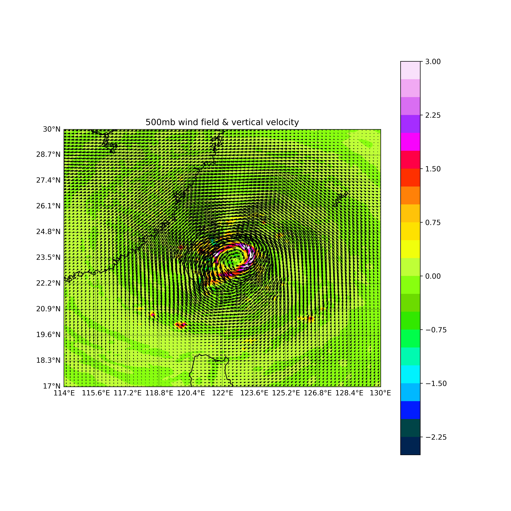
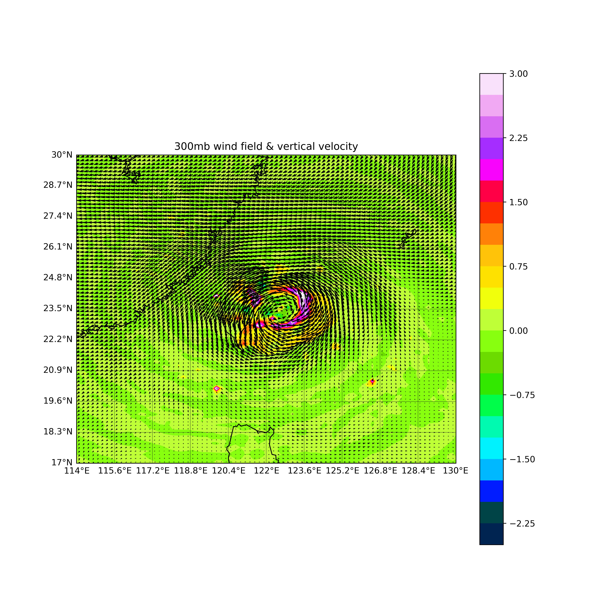
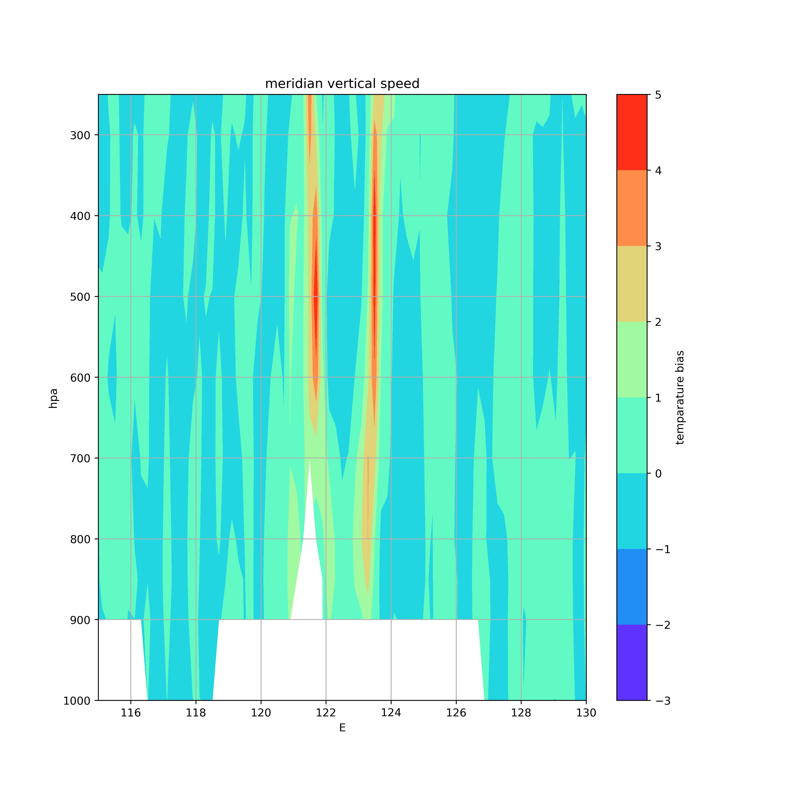

# Synoptic Meteorology and Weather Analysis - HW6
##### Tags: `Typhoon`, `Stram Line`, `Wind Speed Field`, `Zonal`, `Medridian`

> Dept: ATM  
> Student Number: 109601003  
> Name: 林群賀

## Descriptions
**作業內容：**    
1. 繪製水平 850、500、300mb 的 (a)氣流線與等風速場，(b)風向量
場與垂直速度場
2. 繪製通過颱風中心的垂直剖面圖 (a)經向剖面：U 風場與溫度偏差
場，(b)緯向剖面：V 風場與溫度偏差場，(c)垂直速度
3. 找出各變數場(U、V、W、T)在水平與垂直結構上的極值位置
4. 利用以上結果討論颱風在水平、垂直結構上的特性與原因  
(P.S.繪圖區域以颱風中心為主)  

**繳交內容：**  
1. 9 張圖 + 分析討論報告 + 讀檔與繪圖程式碼

## Plot Display

**Stream Line and Wind Speed Field, Wind Field and Vertical Velocity**

|  Type |  850 mb | 500 mb | 300 mb |
| :-: | :-------: | :------: | :------: |
| Stream Line and Wind Speed Field |  |  |  |
| Wind Field and Vertical Velocity |  |  |  |

**Zonal Cross Section and Meridian Cross Section**

|  Cross Section |  Wind Temperature and Bias Vertical Profile | Vertical Velocity |
| :-: | :-------------------------------------------: | :-----------------: |
| Zonal Cross Section |  | |
| Meridian Cross Section |  |  |

## My Analysis

從水平風場來看，我們可以清晰地觀察到一個氣旋式的環流，中心位置大概在東經 121.5；北緯 23.65 附近，並且因為在北半球，所以是呈現順時針旋轉的。  
由於颱風從東向西移動，我們可以看出北側的風速明顯高於南側，這是由於移動速度與風速相互增加的效應。此外，在低層大氣中，水平風速高於高層。此颱風的西側受到山脈阻擋而產生加速效應。從垂直方向的上升運動來看，我們可以觀察到颱風逐漸向外傾斜，這符合大氣動力學中描述的眼牆結構。在經向剖面中，我們可以看到颱風中心具有下沉作用，而眼牆則有明顯的上升運動。此外，在颱風的東側有向北的風分量，而在西側則有向南的風分量，這符合氣旋式的環流特徵。從緯向剖面中也可以觀察到類似的垂直運動分布，其中北側有東風，南側有西風，呈現氣旋式的環流。從上升運動中還可以觀察到螺旋狀的雨帶現象。總體而言，颱風中心具有明顯的暖心現象，低層氣流輻合而高層氣流輻散。