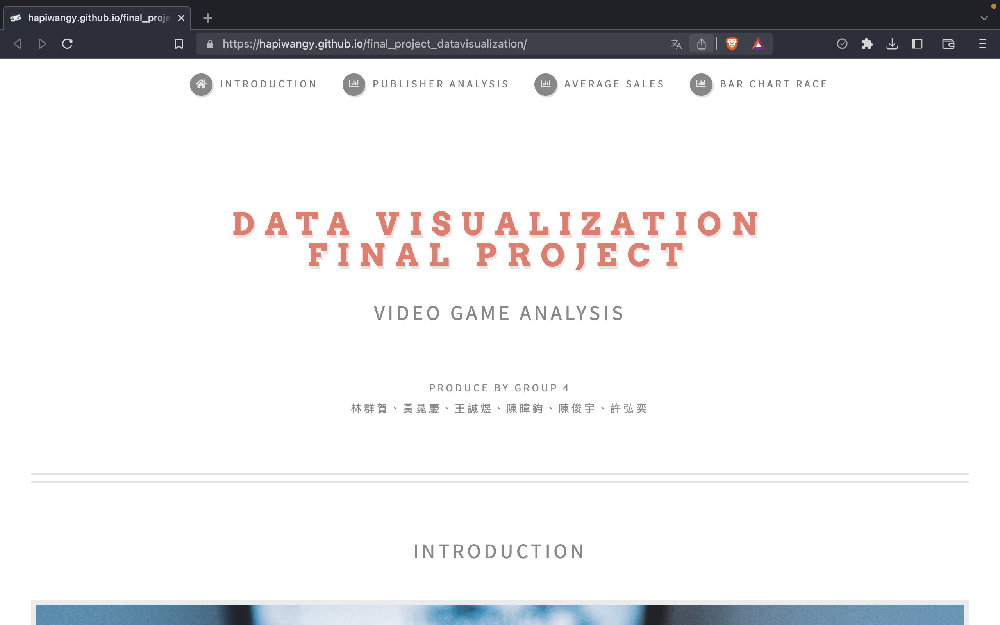

# final_project_datavisualization

## Project Information
- Course Name: Data Visualization
- Course Schedule: Summer 2023
- Assignment Format: Group Project (6-person groups)
- Topic: Game Data Analysis

 
    

## Who are we?

我們是來自不同科系的學生，包含了資工、生醫、機械、大氣科學領域。我們想透過我們原先的背景知識，並且結合課堂所學完成一份資料視覺化的期末專案。  

## Why to Choose this dataset?
經過討論我們決定接續組內同學的期中報告 —「電玩遊戲」做更多的探討以及分析。這份資料集是來自於 [Kaggle](https://www.kaggle.com/datasets/sidtwr/videogames-sales-dataset) 的資料集。在這份資料集裡面有非常多年度的資料，並且記錄著 13 個種類別的遊戲，以及 31 種平台提供的遊戲。

## Divide and Conquer
<table style="margin-top: 5%; margin-left: 2.5%; margin-right: 2.5%; width: 95%;">
	<thead>
		<tr>
			<th colspan="3" style="text-align: center; background-color: #e2ab9c; font-size: larger;">
				Work Contribution
			</th>
		</tr>
	</thead>
	<tbody>
		<tr>
			<td>Student Name</td>
			<td>Student ID</td>
			<td>Contribution</td>
		</tr>
		<tr>
			<td><b>林群賀（組長）</b></td>
			<td>109601003</td>
			<td>Bar Chart Race, Web Page Beautification, Project Management<td>
		</tr>
		<tr>
			<td>許弘奕</td>
			<td>110502009</td>
			<td>Line Chart、Bar Chart</td>
		</tr>
		<tr>
			<td>陳俊宇</td>
			<td>110502534</td>
			<td>Stack Bar Chart、Bar Chart、Web Page Beautification</td>
		</tr>
		<tr>
			<td>王誠煜</td>
			<td>109502570</td>
			<td>負責前三張圖的基本繪製和更換選單，網頁排版，網頁的bug修復，圖片結論歸(1), Project Management</td>
		</tr>
		<tr>
			<td>黃晁慶</td>
			<td>109303009</td>
			<td>前三張圖的額外資訊顯示(mouseover時會顯示的額外資訊)、圖片結論的歸納(2)</td>
		</tr>
		<tr>
			<td>陳暐鈞</td>
			<td>109802521</td>
			<td>第四張圖的基本繪製、更換選單、額外資訊顯示，圖片結論的歸納(1)</td>
		</tr>
	</tbody>
</table>

## Website Demo 

    

## Contributors
<table>
  <tr>
    <td align="center"><a href="https://sites.google.com/g.ncu.edu.tw/1chooo"> <b>1chooo</b></a> <a href="https://github.com/hapiwangy/final_project_datavisualization/commits?author=1chooo" title="Code">💻</a></td>
    <td align="center"><a href="https://github.com/hapiwangy"> <b>hapiwangy</b></a> <a href="https://github.com/hapiwangy/final_project_datavisualization/commits?author=hapiwangy" title="Code">💻</a></td>
    <td align="center"><a href="https://github.com/HapiO3O"> <b>HapiO3O</b></a> <a href="https://github.com/hapiwangy/final_project_datavisualization/commits?author=HapiO3O" title="Code">💻</a></td>
  </tr>
</table>