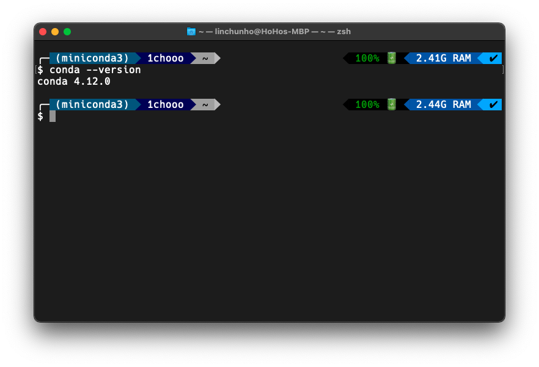
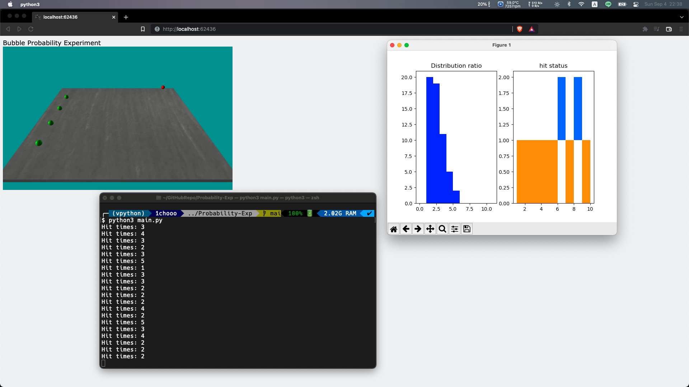

# Bubble Probability Experiment

這個專案是來自物理課程的 Python 專案，想要透過 vpython 的可視覺化來模擬彈珠實驗，實驗是透過每十次隨機發射的彈珠，加以查看能擊中固定位置的彈珠幾次，藉此來觀察機率分布的情形是呈現何種圖形。

This project is from the physics course, the main goal of this project is that we want to check the ratio of the status, and the status is set to emit the main bubble occasionally, then there are four stand-still bubbles to be hitted. Through these initial statuses, we want to observe the distribution of the ratio.


<br>

###

## Create Environment

To simulate this physics experiment, we use conda to build the python environment.

My conda version: `conda 4.12.0`



* ### First step: 

    Build the virtual environment which called vpython, then install python version 3.5 or later. This project I pick the python version `3.8.13`

    ``` vim
    $ conda create --name vpython python=3.8.13
    $ conda activate vpython
    ```

* ### Second step: Install vpython and Matplotlib

    Install the package we need because we need to let the experiment visualize. That's we need vpython and matplotlib.

    ``` vim
    $ conda install -c vpython vpython
    $ conda install matplotlib
    ```

* ### Well Done.

    Enjoy this project.


<br>

## Initilize the parameter in the experiment.

We have to initialize the circumstance that we want to proof.

``` python
# initialize

h, r, dt, v, T, H = 0.5, 0.3, 0.001, 500, 0, 0
```

``` python
# draw the canvas.

scene = canvas(title="Bubble Probability Experiment", background=vec(0, 0.6, 0.6))
scene.forward = vec(-7, -6, 0)

floor = box(pos=vec(0, 0, 0), size=vec(16, h, 20), texture=textures.metal)
```

``` python
# Create ball objects.

mainBall = sphere(radius=r, color=color.red, pos=vec(0, h / 2 + r, -8))

stillBall1 = sphere(radius=r, color=color.green, pos=vec(-4.5, h / 2 + r, 8))
stillBall2 = sphere(radius=r, color=color.green, pos=vec(-1.5, h / 2 + r, 8))
stillBall3 = sphere(radius=r, color=color.green, pos=vec(1.5, h / 2 + r, 8))
stillBall4 = sphere(radius=r, color=color.green, pos=vec(4.5, h / 2 + r, 8))
```

``` python
# Make experiment visualize.

a = [0, 1, 2, 3, 4, 5, 6, 7, 8, 9, 10, 11]
b = []
c = [0, 2]
d = [1, 2, 3, 4, 5, 6, 7, 8, 9, 10]

plt.ion()

fig = plt.figure()

ax1 = fig.add_subplot(1, 2, 1)
ax1.set_title('Distribution ratio')

ax2 = fig.add_subplot(1, 2, 2)
ax2.set_title("hit status")

ax1.hist(b, bins=a, color=(0, 0, 1))
ax2.hist(c, bins=d, color='#FF8800')
plt.pause(0.01)
```

``` python
# Simulate the real exercise status and plot to the graph that we can easy to observe.

mainBall.pos.x = (randint(-800, 800)) / 100
theta = (randint(100, 200)) * np.pi / 300

while True:

    rate(500)
    mainBall.pos.z += v * np.sin(theta) * dt
    mainBall.pos.x += v * np.cos(theta) * dt

    if mag(mainBall.pos - stillBall1.pos) < 2 * r or mag(mainBall.pos - stillBall2.pos) < 2 * r or mag(
            mainBall.pos - stillBall3.pos) < 2 * r or mag(mainBall.pos - stillBall4.pos) < 2 * r:

        ax2.set_title("hit status")
        mainBall.pos = vec((randint(-800, 800)) / 100, h / 2 + r, -8)
        theta = (randint(100, 200)) * np.pi / 300
        T += 1
        H += 1
        b.append(H)
        ax2.hist([T, T], bins=d, color='#0055FF')
        ax2.hist([T], bins=d, color=(1, 1, 1))
        plt.pause(0.001)


    elif mainBall.pos.z >= 8 or mainBall.pos.x >= 8 or mainBall.pos.x <= -8:

        ax2.set_title("hit status")
        mainBall.pos = vec((randint(-800, 800)) / 100, h / 2 + r, -8)
        theta = (randint(100, 200)) * np.pi / 300
        T += 1
        ax2.hist([T], bins=d, color='#FF8800')
        plt.pause(0.001)

    if T == 10:
        print("Hit times:", H)
        ax1.hist(b, bins=a, color=(0, 0, 1))
        T = 0
        H = 0
        plt.pause(0.001)
        plt.cla()
```

<br>

## Run the experiment and observe.

``` vim
$ python3 main.py
```


