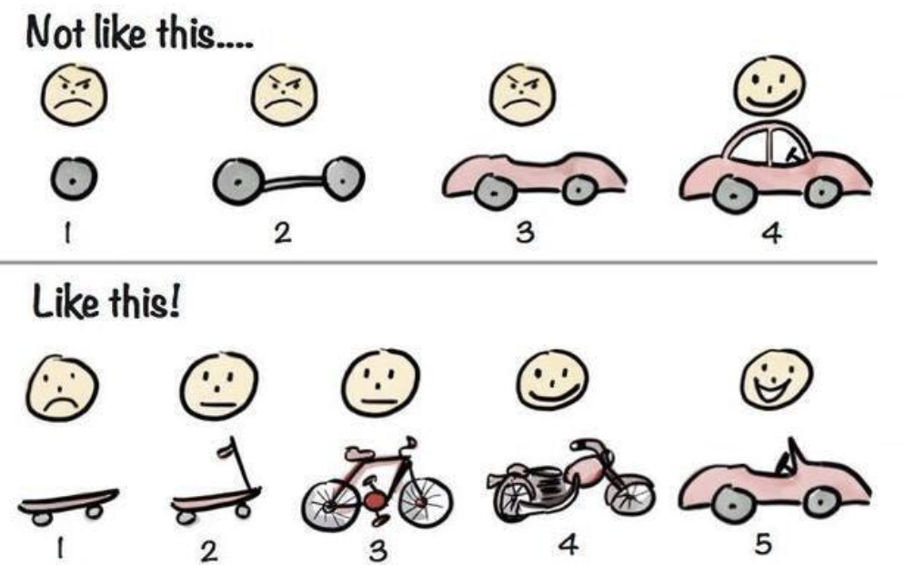

# Week 4 (CH3 Traditional Software Processes)

> [SE6005] Software Engineering
> 
> Year: 2024 Spring   
> Lecturer: 鄭永斌 (YPC), 梁德容 (DRL), 莊永裕 (YYZ) 業界師資 (EL) 等教授  
> Department of Atmospheric Sciences  
> Student: 林群賀  
> Student ID: 109601003

在這週的作業中，我選擇了第四個討論題目，命題為：「P.6 圖示 "waterfall model", 其中在 "operation and maintenance" 階段另有線段指向前幾個階段, 這是否也算是 evolutionary process？」來進行以下討論。

<!-- 
    
  

 -->

在開始這個題目的討論前我想先引用其中一位報告者投影片的圖片，並且我想先透過這張圖片來玩個「看圖說故事」的遊戲。

首先我們可以先透過表情的變化來做探討，在上方圖，我們可以看到在完整的車子完全做出來之前，表情都是保持臭臉的；然而下方圖，我們反而觀察到表情是在每個產品迭代後都變得更加開心了。

再來，我們可以從圖片的產品繼續觀察，上方圖的產品，一開始跟最終產品無關，甚至每個後來階段做出來的產品，都只能是產品的一部分，如果今天突然叫上用場，可說是完全英雄無用武之地。再者下方圖的產品，每個都是可以使用的工具，而且後來發展的產品都是基於前一代做出更升級的功能。甚至每個都是「獨立」能用的產品。

所以透過以上的分析我們就可以看到了，上方圖是 waterfall model，而下方圖是 evolutionary process。並且這兩者有著非常的差異，waterfall 的目標就是一步一步的完成，從小零件開始製造一直到拼裝成最終產品；而 evolutionary process 則是從一個小產品開始，然後不斷的進行迭代，每次迭代都是一個獨立的產品，並且每次迭代都是基於前一代的產品進行升級。

## Waterfall

### Phases of Waterfall Model

- Requirements definition: 收集、分析和確定項目的需求，建立詳細的需求文檔，確定產品或系統應該做什麼
- System and software design: 基於需求文檔制定系統的整體架構，包括硬體和軟體組件的設計
- Implementation and unit testing: 編寫代碼實現系統的功能，以及在編碼完成後,進行單元測試,以確保功能正常運行
- Integration and system testing: 軟體模組或元件結合在一起,以保證同時工作不會引起異常；系統測試，確保整個系統在滿足專案需求的情況下正常運行
- Operation and maintenance: 持續監控、維護和升級系統，以確保其長期正常運行

> [!NOTE]
> Each phase is completed before the next one begins

瀑布模型是一種軟體開發模型，通常分為**需求分析、設計、實作、整合及維護等階段**，其特點是各階段線性且順序地進行。

**特點：**

每個階段完成後才開始下一個階段。
在傳統瀑布模型中，通常不回溯。
需要在開始開發前確定清晰、詳細的需求。

### Waterfall Model Problems

- 沒有辦法靈活地為專案的不同階段做調整 -> 難以反映在顧客想要的變化
- 在需求不明確的情況下，瀑布模型不適用 -> 適用於已經明確瞭解的專案中
- 很少有商業系統有穩定的需求
- 瀑布模型主要用於大型系統工程項目，其中系統在幾個地點開發

可見瀑布模型是無法在快速的變化中適應的，而且在需求不明確的情況下，瀑布模型也是無法適用的。

## Evolutionary Process

**Exploratory development:**
- Objective is to work with customers and to evolve a final system from an initial outline specification.
- Should start with well-understood requirements and add new features as proposed by the customer.

**Throw-away prototyping:**
- Objective is to understand the system requirements.
- Should start with poorly understood requirements and evolve a final system from an initial outline specification.

在聽講 Evolutionary Process 的時候，我當時聽的感覺是產品的每一代都是獨立的產品，而且是很多個小部分去組成，當今天我們需要的內容可以重點開發，不重視的內容可以快速被遺棄，如此可以更快地迭代到下一個產品之中。

此外，也可以在專案初步的討論中，快速確認什麼是需要，什麼是不需要的，並且在後續的迭代中，可以更快地進行開發，並且可以更快地回應客戶的需求。

## Conclusion

綜合上述的討論，以及資訊中，我們可以得知，Waterfall Model 看似很有彈性地可以去恢復沒做好的專案部分，但是恢復的內容我覺得還是有限的，因為在做到完之前，整個專案是無法使用的，反之 Evolutionary Process 可以在每一個迭代中都是獨立的產品，並且可以在每一個迭代中都是基於前一代的產品進行升級，這樣可以更快地回應客戶的需求，並且可以更快地進行開發。

因此，「P.6 圖示 "waterfall model", 其中在 "operation and maintenance" 階段另有線段指向前幾個階段, 這是否也算是 evolutionary process？」這個命題，我認為不算是 evolutionary process，因為在 Waterfall Model 中，每一個階段都是線性的，並且每一個階段都是完成後才開始下一個階段，因此在 operation and maintenance 階段另有線段指向前幾個階段，這樣的設計並不是 evolutionary process。

