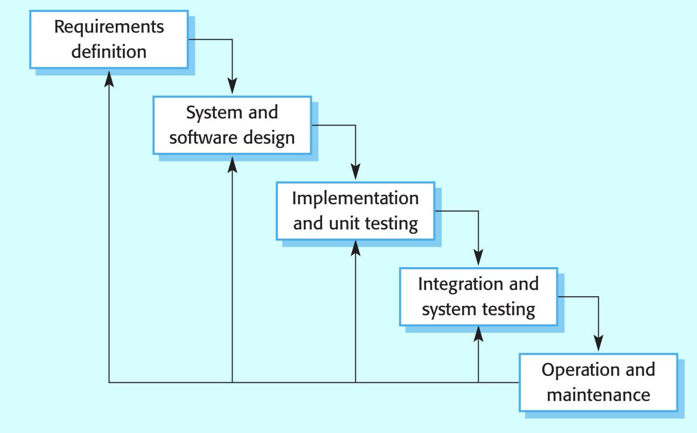
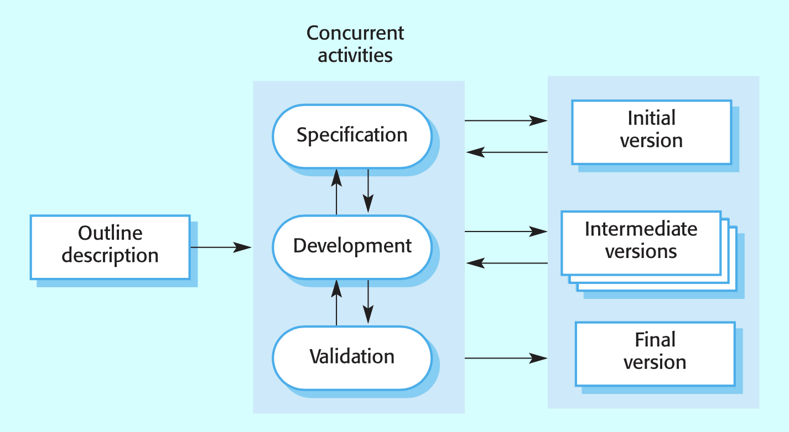
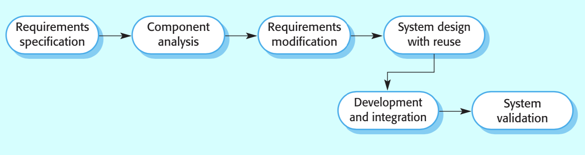
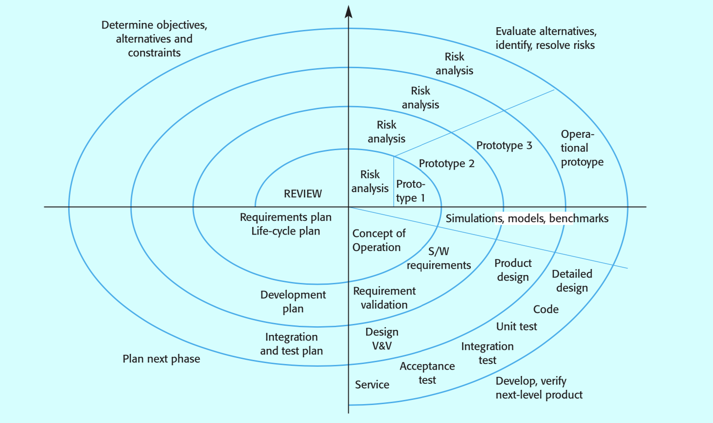
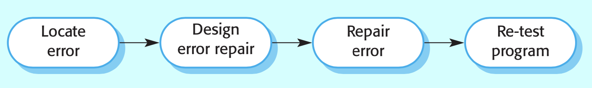
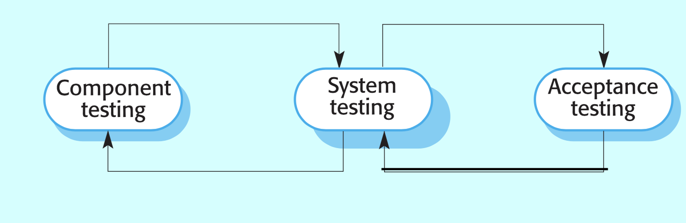
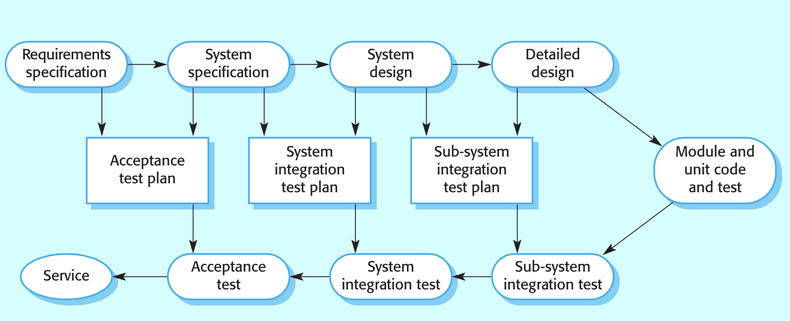
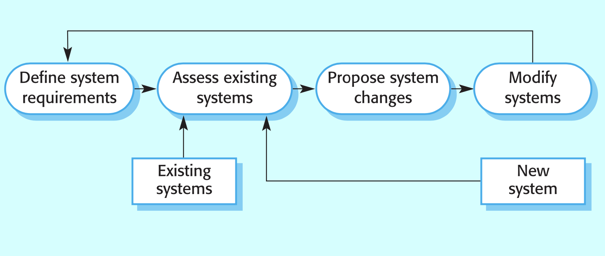

# Week 4 (CH3 Traditional Software Processes)

### Week 4 作業說明：

以下是 Week4 的四個討論題目 (topics for Week 4)：
| Chapter | Topic | Content |
| --- | --- | --- |
| CH3  | Topic 1 | 教材 P.14 談到的 "process iteration", 並舉出 incremental model and spiral model 為例. 這 "iterative process" 是否等同於 "evolutionary process"? |
| | Topic 2 | incremental model 與 spiral model 之間的異同, 請討論. |
| | Topic 3 | P.6 圖示 "waterfall model", 其中在 "operation and maintenance" 階段另有線段指向前幾個階段, 這是否也算是 evolutionary process? |

請同學看完當週上課影片後任選其中一個討論題目，參考前期同學的報告以及
回應，撰寫心得及自身的想法完成當周作業。前期在職班同學的報告以及回覆
可以參考底下 Google 連結：
https://drive.google.com/drive/folders/1kGOyhf7w6KVzWHRFhkAAHoqVxwGEQNPp

作業的形式可以是將數份報告與回覆彙整成一份單一報告、可以依據自身的經驗或是其他來源新增/修正原有報告的論點、也可以提出證據反駁教材或是報告中的論點、或是任何你自己覺得的恰當形式。

上傳至教學網站的作業檔名須為「`*你的學號*_week2_*選哪個 topic*.pdf`」例如「`112522107_week2_topic1.pdf`」繳交至 ee-class，繳交期限為上課當週週五的中午 12:00 前！

### Objectives
- To introduce software process models
- To describe three generic process models and when they may be used
To describe outline process models for requirements engineering, software development, testing and evolution

A structured set of activities required to develop a software system
- Specification
- Design
- Validation
- Evolution

### Waterfall Model

Separate and distinct phases of specification and development

#### Phases
- Requirements Analysis and Definition
- System and Software Design
- Implementation and Unit Testing
- Integration and System Testing
- Operation and Maintenance
- Each phase is completed before the next one begins

#### Problems
- Inflexible partitioning of the project into distinct stages
- This makes it difficult to respond to changing customer requirements
- Therefore, this model is only appropriate when the requirements are well-understood
- Few business systems have stable requirements
- The waterfall model is mostly used for **large systems** engineering projects where a system is developed at several sites

### Evolutionary Development

**Exploratory development:**
- Objective is to work with customers and to evolve a final system from an initial outline specification.
- Should start with well-understood requirements and add new features as proposed by the customer.

**Throw-away prototyping:**
- Objective is to understand the system requirements.
- Should start with poorly understood requirements and evolve a final system from an initial outline specification.

#### Problems
- Lack of process visibility
- Systems are often poorly structured
- Special skills (e.g. in languages for rapid prototyping) may be required

#### Applicability
- For small or medium-size interactive systems
- For parts of large systems (e.g. the user interface)
- For short-lifetime systems

### Component Based Software Engineering

The system is assembled from existing components

#### Process Stages
- Component analysis
- Requirements modification
- System design with reuse
- Development and integration

This approach is becoming incrreasingly used as component standards have emerged

### Reuse-oriented Development

### Process iteration
- system requirements ALWAYS evolve in the course of a project so process iteration where earlier stages are reworked is always part of the process for large systems
- Iteration can be applied to any of the generic process models

### Incremental Delivery

- Rather than deliver the system as a single delivery, the development and delivery is broken down into increments with each increment delivering part of the required functionality
- User requirements are prioritised and the highest priority requirements are included in early increments
- Once the development of an increment is started, the requirements are frozen though requirements for later increments can continue to evolve

#### Advantages
- Customer value can be delivered with each increment so system functionality is available earlier
- Early increments act as a prototype to help elicit requirements for later increments
- Lower risk of overall project failure
- The highest priority system services tend to receive the most testing

### Spiral Development

- Process is represented as a spiral rather than as a sequence of activities with backtracking
- Each loop in the spiral represents a phase in the process
- No fixed phases such as specification or design - loops in the spiral are chosen depending on what is required
- Risks are explicitly assessed and resolved throughout the process

#### Spiral Model Sectors
- Objective setting
  - Specific objectives for the phase are identified
- Risk assessment and reduction
  - Risks are assessed and activities put in place to reduce the key risks
- Development and validation
  - A development model for the system is chosen which can be any of the generic models
- Planning
  - The project is reviewed and the next phase of the spiral is planned

### Software Specification

- The process of establishing what services are required and the constraints on the system’s operation and development
- Requirements engineering process
  - Feasibility study
  - Requirements elicitation and analysis
  - Requirements validation
  - Requirements management

### Software Design and Implementation

- The process of converting the system specification into an executable system
- Software design
  - Design a software structure that realises the specification
- Implementation
  - The translation of a system design into an operational system

The activities of design and implementation are closely related and may be inter-leaved

### Design Process Activities

- Architectural design
  - The system is decomposed into principal subsystems
- Abstract specification
  - An abstract specification is produced from the architectural design
- Interface design
  - Define the interfaces between system components
- Component design
  - The design of components that realize the system specification
- Data structure design
  - The design of system data structures
- Algorithm design
  - The design of system algorithms

### Structured Methods

- A method that uses a systematic step-by-step approach to the analysis and design of information systems
- Possible models:
  - Data flow model
  - Object model
  - Sequence model
  - State transition model
  - Structural model

### Programming and Debugging

- Translating a design into a program and removing errors from that program
- Programming is a personal activity - there is no generic programming process
- Programmers carry out some program testing to discover faults in the program and remove these faults in the debugging process

### Software Validation

- Verification and validation (V & V) is intended to show that a system conforms to its specification and meets the requirements of the system customer
- Involves checking and review processes and system testing
- System testing involves executing the system with test cases that are derived from the specification of the real data to be processed by the system

### Testing Stages

- Component testing
  - Individual components are tested independently
  - Components may be functions or objects or coherent groupings of these
- System testing
  - Testing of the system as a whole
  - Testing of emergent properties is particularly important
- Acceptance testing
  - Testing with customer data to check that the system meets the customer’s needs

### Software Evolution

- Software is inherently flexible and can change
- As requirements change through changing business circumstances, the software that supports the business must also evolve and change
- Although there has been a demarcation between development and evolution (maintenance) this is increasingly irrelevant as fewer and fewer systems are completely new

