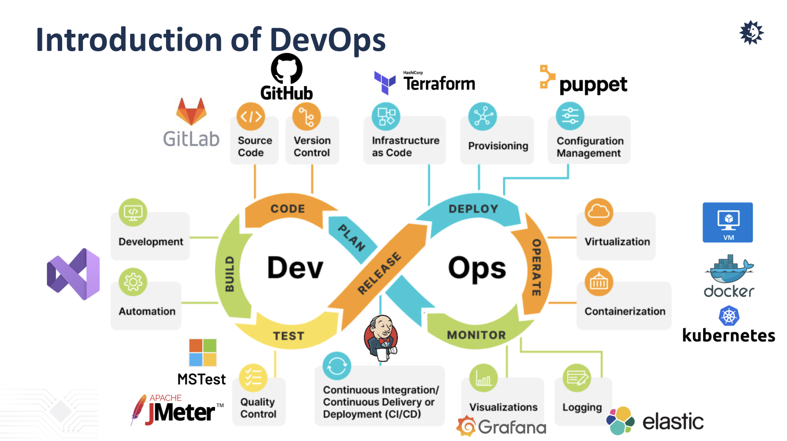

# Week 4 (CH3 Traditional Software Processes)

> [SE6005] Software Engineering
> 
> Year: 2024 Spring   
> Lecturer: 鄭永斌 (YPC), 梁德容 (DRL), 莊永裕 (YYZ) 業界師資 (EL) 等教授  
> Department of Atmospheric Sciences  
> Student: 林群賀  
> Student ID: 109601003

在這週的作業中，我選擇了第五個討論題目，命題為：「Topic 1-4 4. DevOps」來進行以下討論。

我之所以會想要選擇這個主題就是因為目前我在雲端產業的公司實習，而我們最常使用的雲服務是 AWS 以及 Azure，因此開始接觸到了大量的 DevOps 以及 MLOps 的相關知識。

起初聽到 DevOps 時其實沒有很理解在做什麼，只知道會需要做很多自動化地腳本以及測試，不過開始實習之後我開始改觀了，其實 DevOps 我覺得是兩個很大的結合體，DevOps = Development + Operations，也就是開發與運維的結合，也就是說我們要兼具開發的特性，同時也有兼顧產品的維護與運營。

然而 DevOps 之所以會需要這麼大量的腳本就是因為，在產品上線的時候我們需要有大量的時間去確保我們的產品能夠去運作，以過去的方法我們當然可以手動地去完成一些工作流的內容，不過這樣的方式會讓我們的產品上線時間變得非常的長，另外工程師的時間是非常寶貴以及有限的，因此我們需要有一個自動化的流程來幫助我們完成這些工作。

因此這樣的工作模式就誕生了，在一個自動化的流程之中，我們中途會有許多 Build, Test, Monitor, Deploy 的流程，甚至是遇到了問題我們也要能夠去做修改，也就是我想引用簡報的圖片的關係，其實 DevOps 很多的工作會重複循環，因此要怎麼在這樣的工作流程縮減我們的時間就會是非常重要的課題。

我最近的工作就有被要求 Container, Kubernetes, GitLab, Docker, AWS SAM, AWS EKS 等等的技術，這些技術無非要確保我們能夠把產品如實的交付，並且還要確保使用上沒問題，也要確認在不同環境中都能夠正常地去運作，這些都是我們在 DevOps 中會需要去檢測的事情，並且程式可能一個小改動就會造成不同系統間運作的差異。

最後的結論我想說的是，在 DevOps 中總有非常多的知識以及工具要去學習，因為常常很多新的產品就是為了過去的不足，甚至是使用的工具去應應做變化，因此我認為在 DevOps 中要有一個好的學習能力是非常重要的，也要有一個好的團隊合作能力，因為在這樣的工作流程中，我們需要有一個團隊去協助我們完成這樣的工作。我也希望在實習的時候可以多接觸一些 DevOps 的開發以及知識，可以多嘗試一些 Toy Example，把踩坑給記錄下來，這樣我想對於未來的工作會有很大的幫助。