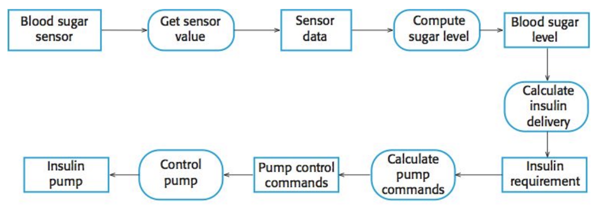
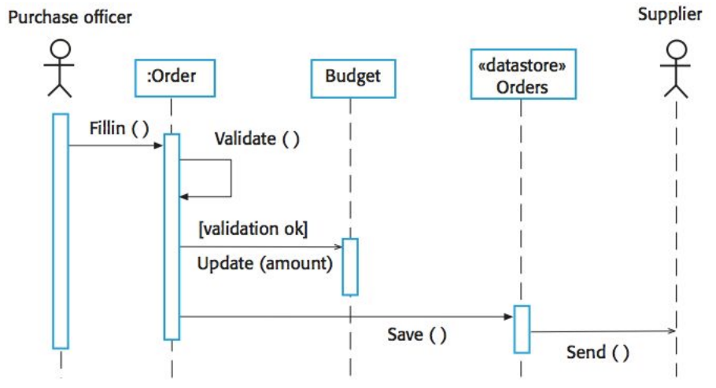
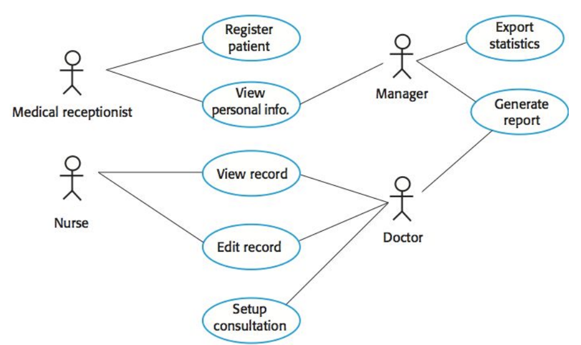

# Week 8 (Chapter 8 System Models)

> [SE6005] Software Engineering
> 
> Year: 2024 Spring   
> Lecturer: 鄭永斌 (YPC), 梁德容 (DRL), 莊永裕 (YYZ) 業界師資 (EL) 等教授  
> Department of Atmospheric Sciences  
> Student: 林群賀  
> Student ID: 109601003

在這週的作業中，我選擇了第一個討論題目，命題為：「軟體模型有多種類型，包括結構、行為、資料、需求和流程等。在什麼情況下需要使用那些特定的模型？並且在設計完成後，應該如何有效地運用這些設計模型？」來進行以下討論。

## 結構模型 - 強調系統或應用程式的結構、組成和元件之間的關係。

- 描述系統的結構和元素之間的關係，例如 UML 中的類圖或物件圖。
- 在開發初期明確系統中的元素和它們之間的關係，有助於理解整個系統的基本結構。

### 使用時機

- 系統設計架構：當設計複雜的系統或軟體時，結構模型可以用來顯示系統不同組件之間的關係,包括它們的結構和如何相互連接。
- 系統重構：在進行程式碼重構時，結構模型可以幫助開發人員更好地了解程式碼結構,確定模組之間的相依關係，並使其更易於維護。
- 系統分析：在軟體開發的早期階段，結構模型可以用於描述系統的整體結構、組件和它們之間的相互作用，有助於團隊理解和溝通專案設計，事後的維護與維運也可參考此模型查找問題。
- 系統整合：當整合多個系統或軟體模組時，結構模型可以顯示不同組件之間的關係，幫助確保模組間能夠有效地互相配合。
- 幫助開發有效溝通：結構模型可以作為軟體架構的視覺化表示，幫助團隊成員理解和討論系統結構。
- 結構模型可以是以圖表、圖形、結構圖或其他視覺化形式呈現，以幫助開發人員和相關的客戶更好地理解系統結構和其細節應用之間的關係。

### 如何實踐模型？

- 程式碼實作: 結構模型是設計的指導方針。開發人員可以根據這些模型開始實現代碼。諸如類圖、組件圖、資料庫模型等結構模型都提供了開發所需的結構框架和指導原則。
- 系統架構和整合 : 結構模型有助於確定系統的整體結構。在整合不同模組或系統時，這些模型提供了指導和理解如何將它們整合在一起。
- 測試計劃: 根據結構模型，可以制定測試計劃。模型指導了系統的結構，因此測試計劃應該針對這些結構進行驗證。
- 文件撰寫: 根據結構模型，可撰寫軟體相關的文件。這些文件需涵蓋系統結構、模組之間的關係，以及如何根據模型進行開發的指引。
- 系統維護: 結構模型有助於未來系統的維護。確定和了解系統結構可以幫助處理日後的變更和修改。
- 團隊溝通: 使用結構模型作為溝通工具，幫助團隊成員理解系統結構。這有助於確保所有人都在同一個理解水平上。
- 有效運用設計模型需要定期檢視和更新。結構模型並不是靜態的，它們應隨著系統開發的進展和需求的變化而持續更新和調整。這樣能確保模型的準確性並使其保持與實際系統一致。

## 行為模型 - 用以顯示系統及應用程式執行時，對其環境刺激產生的行為、狀態及應該會有的反應活動。

- 描述系統中各個元件之間的互動和行為。例如狀態圖、活動圖等。
- 適詳細說明系統元件之間的動態行為和互動，有助於了解系統運作時的情形。

### 使用時機

- 功能需求分析：行為模型在軟體開發的早期階段用於捕捉和描述系統的功能需求。它們可以幫助理解系統應該執行的各種操作和行為。
- 系統設計：在設計階段，行為模型用於描述系統中各個元件的預期行為，包括它們如何互相作用以實現特定功能。
- 測試計劃和執行：行為模型可以作為測試計劃的基礎，幫助確定預期行為並設計測試案例。測試人員可以根據這些模型來驗證系統是否符合預期行為。
- 程式碼撰寫和編碼：行為模型可以作為設計的指南，幫助開發人員實現系統功能，並提供對預期行為的清晰認識。
- 系統分析：行為模型可以用於解決系統中的問題，幫助找出特定行為的根本原因或系統內部的錯誤。
- 系統升級和修改：當系統需要進行升級或修改時，行為模型可以幫助開發人員理解現有行為，並確定需要進行的變更。
- 行為模型可以以多種形式呈現，包括用例圖、狀態圖、活動圖、序列圖等。這些模型有助於理解系統中的各種活動、流程和行為，從而更好地規劃、設計和實施軟體系統。

### 如何實踐模型？

- 程式碼開發和實作: 行為模型是設計指導的依據，開發人員可以根據這些模型開始編寫程式碼。模型提供了行為、流程和操作的指引。
- 測試計劃: 根據行為模型，制定測試計劃。模型確定了預期行為和流程，因此測試計劃應該針對這些行為進行驗證。
- 系統分析和設計: 行為模型有助於分析和設計系統。它們提供了系統操作和互動的視覺化描述，幫助確定系統的功能性和操作性。
- 系統整合: 在整合不同模塊或系統時，行為模型提供了系統之間交互的理解，有助於確保整個系統的協調運作。
- 系統維護: 行為模型有助於未來系統的維護。清楚了解系統的預期行為和流程，有助於更輕鬆地進行修改和擴展。
- 使用者教學與文件撰寫: 根據行為模型，可以撰寫用戶培訓材料和相關文檔。這些文件應該涵蓋系統的操作流程，從而使用戶更容易理解和學習。
- 溝通和協作: 行為模型也可以作為溝通和協作的工具。團隊成員可以通過這些模型更清楚地理解系統操作和互動。
- 定期檢視和更新是至關重要的，以確保行為模型與實際系統行為保持一致。這些模型應隨著系統開發和需求的變化而持續調整和更新。

## 資料模型 - 描述數據的結構、類型、屬性以及數據之間的關係，也可以使用 UML 序列圖來建立。

- 關注在系統中使用的資料結構和資料流。例如資料流程圖、實體關係圖等。
- 理解資料在系統中的資料流和轉換,有助於確定資料的存儲和使用方式。

### 使用時機

- 數據庫設計: 在開發數據庫時，資料模型是非常重要的。它定義了數據庫中表格的結構、字段和它們之間的關係，比如實體關係模型(ER 模型)或其他模式，有助於建立和管理數據庫。
- 數據分析和設計: 在進行數據分析和設計階段，資料模型有助於理解不同數據實體之間的關係，以及如何組織和處理這些數據。
- 系統集成: 當整合多個系統或數據源時，資料模型可以幫助確定不同系統中的數據如何映射和轉換，以確保有效的數據交換和互通。
- 數據可視化和報告: 資料模型可用於建立報表、數據可視化和分析，幫助用戶更好地理解和利用數據。
- 系統安全和合規性: 透過資料模型，可以確保數據安全和合規性，包括數據的存儲、訪問權限和數據傳輸的安全性。
- 資料模型可以以多方式存在，比如屬性圖、實體關係圖、UML 類圖等。這些模型有助於明確描述數據的結構和相互關係，從而更好地設計、管理和利用數據。

### 如何實踐模型？

- 數據庫實現: 資料模型提供了數據結構和關係的指導。開發人員可以根據這些模型在數據庫中建立表格、字段和關聯，從而實現資料模型的設計。
- 系統整合和資料交換: 當整合不同系統或資料來源時，資料模型有助於確定資料如何映射和轉換。這保證了系統間的資料交換和互通。
- 數據分析和設計: 資料模型有助於分析數據實體之間的關係。它提供了理解和組織數據的框架，有助於進行數據分析和設計。
- 系統安全和合規性: 透過資料模型，可以確保數據安全和合規性，包括數據的存儲、訪問權限和數據傳輸的安全性。
- 系統維護: 資料模型有助於未來系統的維護。了解系統中的數據結構和關係，有助於更容易地進行修改和擴展。
- 文檔撰寫和溝通: 使用資料模型撰寫相關文檔，例如數據庫文檔、資料字典，這些文件有助於溝通和理解系統的數據結構。
- 數據可視化和報告: 資料模型有助於設計報表和數據可視化，幫助用戶更好地理解和利用數據。
- 定期檢視和更新是必不可少的，以確保資料模型與實際系統的數據結構保持一致。這些模型應隨著系統發展和需求的變化而持續調整和更新。

## 需求模型 - 捕捉、分析和描述系統的需求。

- 用於收集、分析和描述系統需求,通常包括用例圖、需求文檔等。
- 明確系統所需功能和非功能性需求,有助於溝通和理解客 戶需求。

### 使用時機

- 需求分析: 在軟體開發過程中，需求模型被用於分析系統的需求，這些模型有助於確定系統應該具備的功能、性能和限制。
- 需求驗證: 需求模型可用於確保系統需求的完整性和一致性。這有助於確定需求是否符合用戶和利益相關者的期望。
- 溝通和交流: 需求模型提供一種視覺化的方式，以便利益相關者之間更好地溝通和理解需求。這有助於確保整個團隊對系統所需功能和特性的一致理解。
- 設計和規劃: 需求模型是設計的基礎，它確定了系統應該實現的功能和特性，為軟體設計和開發提供指導。
- 需求管理: 使用需求模型能夠追踪和管理需求的變更，確保在系統開發過程中需求的可追蹤性和完整性。
- 需求模型可以以用例圖、需求文檔、用例描述、流程圖、原型等形式存在。這些模型幫助確定系統的功能和特性，幫助確保團隊和利益相關者對系統需求有清晰、具體的理解。

### 如何實踐模型？

- 數據庫實現: 資料模型提供了數據結構和關係的指導。開發人員可以根據這些模型在數據庫中建立表格、字段和關聯，從而實現資料模型的設計。
- 系統整合和資料交換: 當整合不同系統或資料來源時，資料模型有助於確定資料如何映射和轉換。這保證了系統間的資料交換和互通。
- 數據分析和設計: 資料模型有助於分析數據實體之間的關係。它提供了理解和組織數據的框架，有助於進行數據分析和設計。
- 系統安全和合規性: 透過資料模型，可以確保數據安全和合規性，包括數據的存儲、訪問權限和數據傳輸的安全性。
- 系統維護: 資料模型有助於未來系統的維護。了解系統中的數據結構和關係，有助於更容易地進行修改和擴展。
- 文檔撰寫和溝通: 使用資料模型撰寫相關文檔，例如數據庫文檔、資料字典，這些文件有助於溝通和理解系統的數據結構。
- 數據可視化和報告: 資料模型有助於設計報表和數據可視化，幫助用戶更好地理解和利用數據。
- 定期檢視和更新是必不可少的，以確保資料模型與實際系統的數據結構保持一致。這些模型應隨著系統發展和需求的變化而持續調整和更新。

## 流程模型 - 系統或應用程式的流程、操作序列和流程之間的關係。

- 系統中各個過程和操作的流程和步驟。例如流程圖、活動圖等。
- 理解系統中的各種流程和操作步驟,有助於優化過程和確定執行效率。

### 使用時機

- 流程設計和優化: 在軟體開發過程中，流程模型可以用於設計和優化系統的操作流程。這有助於確定最佳的流程來實現系統功能。
- 工作流程管理: 對於需要明確流程管理的系統(例如，工作流程管理系統或業務流程管理系統)，流程模型可描述各種活動和其相互關係。
- 系統分析和改進: 透過流程模型，可以分析現有系統中的流程，發現瓶頸或效率問題，并提出改進措施。
- 系統集成: 當整合多個系統或模塊時，流程模型可以顯示各個系統如何交互和協同工作，從而確保整個系統的流暢運行。
- 使用者體驗設計: 流程模型有助於設計和改進使用者體驗，確保用戶在使用軟體時的流程是直觀和高效的。
- 流程模型可以以流程圖、活動圖、時序圖、網絡圖等形式呈現。這些模型能夠清楚地描述操作流程、活動和相互作用，從而有助於設計、管理和優化系統中的各種操作流程。

### 如何實踐模型？

- 流程管理和優化: 將流程模型作為流程管理的基礎，確保流程的有效執行和優化。這有助於確定最佳流程以實現系統的功能和目標。
- 系統開發和實現: 開發人員可以根據流程模型開始實現系統，從而確保系統的操作流程和功能按照預期進行。
- 測試計劃和執行: 根據流程模型制定系統測試計劃，以驗證系統的操作流程是否符合預期。
- 工作流程管理: 如果系統需要特定的工作流程管理，流程模型提供了理解和設計這些流程的基礎。
- 系統分析和優化: 流程模型有助於分析現有系統中的流程，以找出瓶頸和效率問題，從而提出改進方案。
- 系統整合和協作: 在整合多個系統或模塊時，流程模型提供了系統之間交互和協作的理解，有助於確保整個系統的協調運作。
- 用戶體驗設計: 流程模型有助於設計和改進使用者體驗，確保系統操作流程是直觀和高效的。
- 定期檢視和更新是必要的，以確保流程模型與實際系統運行的流程保持一致。這些模型應隨著系統開發和需求的變化而持續調整和更新。

## Conclusion

以上內容有透過 ChatGPT 輔助生成文字，幫我把簡報的內容統整成文字，我們可以看出不同模型之間會有不同的使用時機，並且實踐的方式也會有所不同。在軟體開發過程中，這些模型可以幫助團隊更好地理解系統的結構、行為、資料、需求和流程，從而更好地設計、開發和維護軟體系統。這些模型不僅可以用於設計和開發，還可以用於系統分析、測試、系統整合、系統升級和修改等方面。因此，有效地運用這些設計模型是非常重要的，這需要團隊成員之間的有效溝通和協作，以確保模型的準確性和實用性。

另外我想呼應第五個 Topic：「System Models 可以幫助軟體工程師在寫 code 的時候有個依據，如果未來我們只需要設計這些 models AI 就能幫我們產生 code，你認為哪些 model 是重要的呢？這些 model 的詳細程度是足夠的嗎？」有了 models 的輔助確實可以讓我們的工作流程變得更為快速，不過 Models 的準確性以及專業素養是否真的可以完成交付任務，甚至是幫助 System 層面的工作，這遠不僅止於寫一段 code 這麼簡單，而是要能夠關聯，畢竟 System 的 Code 通常不會只有一點點，我覺得以目前的技術，要真的能輔助 System 級別，我覺得還有很長的路要走，不過對於一些簡單的 Code 產生，這樣的技術應該是可以做到的。

## Referenc by ChatGPT

> ○ 功能需求分析: 行為模型在軟體開發的早期階段用於捕捉和描述系統的功能需求。它們
> 可以幫助理解系統應該執行的各種操作和行為。
> ○ 系統設計: 在設計階段,行為模型用於描述系統中各個元件的預期行為,包括它們如何互
> 相作用以實現特定功能。
> ○ 測試計劃和執行 : 行為模型可以作為測試計劃的基礎,幫助確定預期行為並設計測試案
> 例。測試人員可以根據這些模型來驗證系統是否符合預期行為。
> ○ 程式碼撰寫和編碼 : 行為模型可以作為設計的指南,幫助開發人員實現系統功能,並提供
> 對預期行為的清晰認識。
> ○ 系統分析: 行為模型可以用於解決系統中的問題,幫助找出特定行為的根本原因或系統
> 內部的錯誤。
> ○ 系統升級和修改 : 當系統需要進行升級或修改時,行為模型可以幫助開發人員理解現有
> 行為,並確定需要進行的變更。
> ○ 行為模型可以以多種形式呈現,包括用例圖、狀態圖、活動圖、序列圖等。這些模型有助
> 於理解系統中的各種活動、流程和行為,從而更好地規劃、設計和實施軟體系統。
> 
> 幫我把這些變成 markdown 並且標點符號變成全形