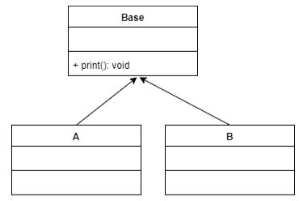
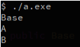

# Material 03 Lab - PolyMorphism  <!-- omit from toc --> 

**Table of Contents**
- [Course](#course)
  - [Lab 01](#lab-01)
  - [Lab 02](#lab-02)
  - [Lab 05](#lab-05)
  - [Lab 06](#lab-06)
  - [\[NEED TO SEARCH\] Lab 07](#need-to-search-lab-07)
  - [\[NEED TO SEARCH\] Lab 08](#need-to-search-lab-08)
    - [Indirect CALL \[^1\]](#indirect-call-1)
  - [Lab 09](#lab-09)
  - [Lab 10](#lab-10)
- [Take Home](#take-home)
  - [Homework - Lab 04](#homework---lab-04)
  - [Homework - Lab 11](#homework---lab-11)
  - [Homework - Lab 14](#homework---lab-14)
  - [Homework - Lab 15](#homework---lab-15)
  - [Homework - Lab 16](#homework---lab-16)

## Course

### Lab 01

Some programmer wrote the following code:

```cpp
class base_model {
   ...
};

class model: base_model {
   ...
};

// Other places which use the classes above
   ...
   model m = new model();
   ...
```

He explains that he is doing great in inheritance and polymorphism.What do you think? (請你給他洗臉一下)


> Answer:
> 
> ```cpp
> model m = new model();
> ```
> 
> 宣告一個 `model m` 並且還用 `new model()` 並不是個好的做法，也沒有達到多型的目的，可以針對特定目標做出不同操作
> 
> Polymorphism in C++ is exhibited by the ability of a pointer or reference to a base class type to behave in different ways when it is used to manipulate objects of different subtypes of that base class. 
> 
> 多形就是當你可以用基底 class 的指標或參考來進行處理時，卻可以依照其 subtype 來進行不一樣的事情（其實多形是很難用解釋的）


### Lab 02

Why destructor in C++ must be declared as virtual?

> Answer:
> 
> 因為當我們繼承原本的 base class 的時候我們是用原本的記憶體繼續增加，因此當我們今天要 destructor 新繼承的 class 的時候，我們的 destructor 是要用掉新建立的記憶體


### Lab 05

Why not make an abstract class to have all the methods to be abstract and enforce its subclasses to implement each method? 

Such as:
```cpp
class Human {
      public:
         virtual void walk() = 0 ;
         virtual void breath() = 0 ;
         virtual void speak()=0;
};
```

Please describe the pros and cons if you choose to do so. (本題分數為其它題目的 3 倍)

> Answer:
> 
> - profs: 很明確地可以做出變異化，且不用擔心突如其來的變異，並且可以提高重複使用！
> - cons:  當我們今天 subclass 要再去新繼承下一個 subclass2 的時候，會被受限制，反而跟原本的 base class 會變得沒有意義

### Lab 06

What is dynamic binding?

> 我們今天在 class 的記憶體中，會有個 pointer  幫我們指向虛擬的函式表，當我們今天要用的資源在 dynmic 的地方時可以幫我們指過去使用


### [NEED TO SEARCH] Lab 07

Please explain:

1. compilation time binding
2. linking binding
3. loading time binding

> Answer:
> 
> 1. 在編譯的時候就確定要綁定哪一個 -> static
> 2. 編譯的時候知道要使用的函示 address，透過只過去使用的編譯的時候就會知道
> 3. 載入的時候，也就是開始運行時動態地去調用


### [NEED TO SEARCH] Lab 08

What is an indirect call in assembly? Please explain and give an example.


> Answer:
> 
> 當我們今天要呼叫目標函數的時候，也就是 `CALL`
> 
> ```assembly
> GOAL_FUNCTION :
> ... adress
> 
> mov eax, GOAL_FUNCTION
> call eax
> ```
> 
> 我們會先載入目標函數，透過呼叫的方式去執行

#### Indirect CALL [^1]

The main difference between the direct and the indirect call, is that:

- the direct call uses an instruction call with a fixed address as argument. After the linker has done its job, this address will be included in the opcode.
- the indirect call uses an instruction call with a register as argument (here rax). The register is previously loaded either directly with the fixed address of the subroutine that is to be called, or with a value fetched from somewhere else, such as another register or a place in memory where the subroutine’s address was previously stored.

As a consequence, the direct call will always call the same subroutine, whereas the indirect call could call different subroutines, depending of what was loaded in the register before the call is made. Depending on the cpu, the indirect call might be a little slower since the indirection requires an extra effort.

A typical use case for the indirect call in assembly would be to implement what would be a call to a function pointer in C or a virtual member function in C++. In your example it’s the use of the function pointer f_sub in the C source code. The key take-away here is that the same code (use of function pointer in C or indirect call in assembler) could call any C function or assembly subroutine that has the same interface and the choice is made at runtime.

The other differences between the two files are cosmetic, except for the load of the subroutine’s address into rax.


### Lab 09

In C++ You can use `sizeof()` to print the memory size of an object.

```cpp
class base {
   public:
   int x ;
   int y ;
   virtual void dosomething() { } ;
};
```

Typically, an integer is 4 bytes. What is the size of an object from base?

Why?


> Answer:
> 
> `16 bytes`
> 
> `int x, y` 總共 `8 bytes` 
> 
> 不過 dosomething 時我們用的是 virtual function 因此有個 8 個 bytes 因此要放 pointer 指到 virtual function table。


### Lab 10

填充題：

物件導向最重要的核心意義就是將系統中 _____________ 的部分包裝到子類別中，然後利用 ______________將系統中的 high-level components (core components) 寫成與子類別 _______________的程式碼。所以當未來進行擴充或修改時， high-level components (core components) 可以幾乎都不用打開來修改。


> Answer:
> 
> 1. 未來或者頻繁變異、擴充
> 2. 多型 Polymorphism
> 3. 無關 inrelevant, independent
> 
> 物件導向最重要的核心意義就是將系統中**未來或者頻繁變異、擴充**的部分包裝到子類別中，然後利用**多型 Polymorphism** 將系統中的 high-level components (core components) 寫成與子類別**無關 inrelevant, independent** 的程式碼。所以當未來進行擴充或修改時， high-level components (core components) 可以幾乎都不用打開來修改。


--- 

## Take Home

### Homework - Lab 04

What is the output of the program!! And please explain what is going on.

```cpp
#include <iostream>

class Base {
  public:
    virtual void foo() const {
        std::cout << "A's foo!" << std::endl;
    }
};

class Derived : public Base {
  public:
    virtual void foo() const {
        std::cout << "B's foo!" << std::endl;
    }
};

int main() {
    Base *o1 = new Base();
    Base *o2 = new Derived();
    Derived *o3 = new Derived();

    o1->foo();
    o2->foo();
    o3->foo();

    return 0;
}
```

> Answer:
> 
> ```bash
> $ ./a.out
> A's foo!
> B's foo!
> B's foo!
> ```
> 
> class Base 裡的 foo() 被宣告為 virtual function，因此 Derived 在做繼承的時候，會 override 掉 Base 裡的 foo()，另外我們也使用 Base 這個基底 class 去操作，因此會有 `Base *o2 = new Derived();` 這樣的多型的操作。


### Homework - Lab 11

請以多型完成下列程式碼，演奏弦樂四重奏。

```java
public class V {
   public static void main(String[] args) {
       // 弦樂四重奏
       Instrument[] stringQuartet = { new Violin(), new Violin(), new Viola(), new Cello() };
       // play the music for me
       // implement HERE !!!
   }
}

abstract class Instrument {
   abstract public void play();
}

// 小提琴
class Violin extends Instrument {
   @Override
   public void play() {
       System.out.println("旋律");
   }
}

// 中提琴
class Viola extends Instrument {
   @Override
   public void play() {
       System.out.println("合旋");

   }
}

// 大提琴
class Cello extends Instrument {
   @Override
   public void play() {
       System.out.println("低音");

   }
}
```

> Answer:
> 
> ```java
> public class V {
>     public static void main(String[] args) {
>         // 弦樂四重奏
>         Instrument[] stringQuartet = { new Violin(), new Violin(), new Viola(), new Cello() };
>         // play the music for me
>         for (Instrument instrument : stringQuartet) {
>             instrument.play();
>         }
>     }
> }
> 
> abstract class Instrument {
>     abstract public void play();
> }
> 
> // 小提琴
> class Violin extends Instrument {
>     @Override
>     public void play() {
>         System.out.println("旋律");
>     }
> }
> 
> // 中提琴
> class Viola extends Instrument {
>     @Override
>     public void play() {
>         System.out.println("合旋");
> 
>     }
> }
> 
> // 大提琴
> class Cello extends Instrument {
>     @Override
>     public void play() {
>         System.out.println("低音");
> 
>     }
> }
> ```


### Homework - Lab 14

Please implement (use polymorphism) the following code to make the result generate the same output.

```cpp
#include <iostream>
#include <vector>

using namespace std;

class Base {
public:
    virtual void print() { cout << "Base" << endl; }
    virtual ~Base() {}
};

int main(void) {
    vector<Base*> bases = { new Base(), new A(), new B() };
    for (Base* b : bases) {
        b->print();
    }

    for (Base* b : bases) {
        delete b;
        b = nullptr;
    }
    bases.clear();
}
```

Please make inherit fit following class diagram.

| Graph | Output |
| --- | --- |
|  |  |

expected output:
```bash
$ ./a.exe
Base
A
B
```

> Answer:
> 
> ```cpp
> #include <iostream>
> #include <vector>
> 
> using namespace std;
> 
> class Base {
>   public:
>     virtual void print() {
>         cout << "Base" << endl;
>     }
>     virtual ~Base() {}
> };
> 
> class A : public Base {
>   public:
>     void print() {
>         cout << "A" << endl;
>     }
> };
> 
> class B : public Base {
>   public:
>     void print() {
>         cout << "B" << endl;
>     }
> };
> 
> int main(void) {
>     vector<Base *> bases = {new Base(), new A(), new B()};
>     for (Base *b : bases) {
>         b->print();
>     }
> 
>     for (Base *b : bases) {
>         delete b;
>         b = nullptr;
>     }
>     bases.clear();
> 
>     return 0;
> }
> ```

> [!NOTE]
> Difference between `void print() {}` and `void print() override {}`:


Reference: [C++ Function Overriding](https://www.programiz.com/cpp-programming/function-overriding)

### Homework - Lab 15

Modify the attachment by using polymorphism.

```cpp
#include <stdio.h>
#include <assert.h>

#define SIZE 3

typedef enum {
    Comic,
    Novel,
    Magazine} book_type;


typedef struct Book {
    book_type type;
} Book;

void print_book_type(Book*);

int main(void) {
    Book books[SIZE];
    books[0].type = Comic;
    books[1].type = Novel;
    books[2].type = Magazine;

    for (int i = 0; i < SIZE; i++) {
        print_book_type(&books[i]);
    }

    return 0;
}

void print_book_type(Book* book) {
    assert(book);

    switch (book->type) {
    case Comic:
        printf("Comic\n");
        break;
    case Novel:
        printf("Novel\n");
        break;
    case Magazine:
        printf("Maganize\n");
        break;
    }
}
```

> Answer:
> 
> ```cpp
> #include <iostream>
> 
> #define SIZE 3
> 
> class Book {
> public:
>     virtual void print_book_type() = 0;
> };
> 
> class ComicBook : public Book {
> public:
>     void print_book_type() {
>         std::cout << "Comic" << std::endl;
>     }
> };
> 
> class NovelBook : public Book {
> public:
>     void print_book_type() {
>         std::cout << "Novel" << std::endl;
>     }
> };
> 
> class MagazineBook : public Book {
> public:
>     void print_book_type() {
>         std::cout << "Magazine" << std::endl;
>     }
> };
> 
> int main() {
>     Book* books[SIZE];
> 
>     ComicBook comicBook;
>     NovelBook novelBook;
>     MagazineBook magazineBook;
> 
>     books[0] = &comicBook;
>     books[1] = &novelBook;
>     books[2] = &magazineBook;
> 
>     for (int i = 0; i < SIZE; ++i) {
>         books[i]->print_book_type();
>     }
> 
>     return 0;
> }
> ```

> [!NOTE]
> Difference between `void print_book_type() {}` and `void print_book_type() override const {}`:


### Homework - Lab 16

Please write a main function (with polymorphism way) to make the result generate the same output.

```cpp
#include <iostream>

using namespace std;

class Animal {
public:
    virtual void speak() = 0;
    virtual ~Animal() {}
};

class Cat : public Animal {
public:
    void speak() {
        cout << "meow" << endl;
    }
};

class Cow : public Animal {
public:
    void speak() {
        cout << "moo" << endl;
    }
};
```

expected output:

```bash
$ ./animal.exe

meow
moo
```

> Answer:
> 
> ```cpp
> #include <iostream>
> #include <vector>
> 
> using namespace std;
> 
> class Animal {
>   public:
>     virtual void speak() = 0;
>     virtual ~Animal() {}
> };
> 
> class Cat : public Animal {
>   public:
>     void speak() {
>         cout << "meow" << endl;
>     }
> };
> 
> class Cow : public Animal {
>   public:
>     void speak() {
>         cout << "moo" << endl;
>     }
> };
> 
> int main(void) {
>     vector<Animal *> animals = {new Cat(), new Cow()};
>     for (Animal *animal : animals) {
>         animal->speak();
>     }
> 
>     for (Animal *animal : animals) {
>         delete animal;
>         animal = nullptr;
>     }
>     animals.clear();
> 
>     return 0;
> }
> ```


[^1]: [Difference between direct and indirect function() calls](https://softwareengineering.stackexchange.com/questions/401110/difference-between-direct-and-indirect-function-calls)