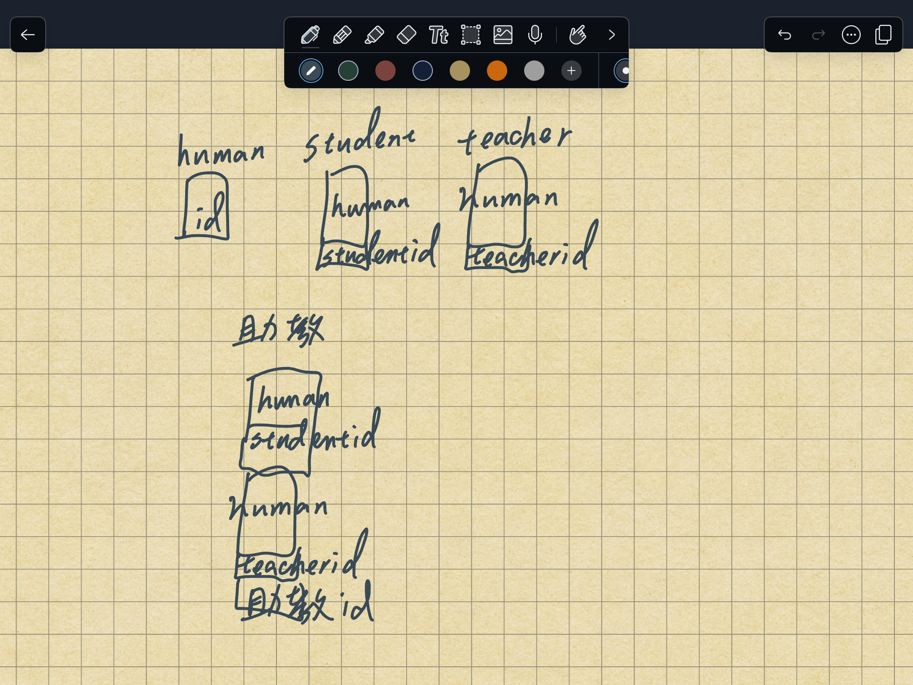
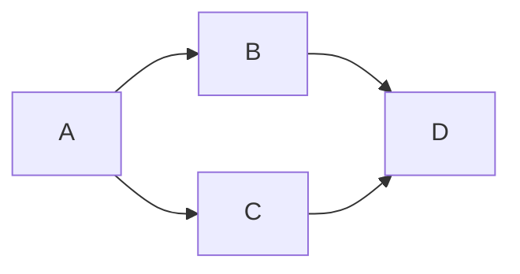

# Material 04 Lab - Multiple Inheritance     <!-- omit from toc -->

**Table of Contents**
- [Course](#course)
  - [Lab 02](#lab-02)
  - [Lab 04](#lab-04)
  - [Lab 05](#lab-05)
  - [Lab 06](#lab-06)
  - [Lab 07](#lab-07)
  - [Lab 08](#lab-08)
  - [Lab 09](#lab-09)
  - [Lab 10](#lab-10)
  - [Lab 12](#lab-12)
  - [Lab 14](#lab-14)
  - [Lab 15](#lab-15)
  - [Lab 16](#lab-16)

## Course

### Lab 02

請解釋鑽石繼承在甚麼情況下會有甚麼問題?

> My Answer:
> 
> 基底還是共用同一個 Base class 沒宣告好會有記憶體錯亂


### Lab 04

What is casting up and casting down? When do we use each of them?

> My Answer:
> 
> - Casting up: `Car *p = (Car *) new JetCar();` 
> - Casting Down: `ptr = dynamic_cast<JetCar *>(testVehicle);` We want to cast a base class pointer down its hierarchy into a subclass pointer. 
> 
> 當我們今天需要把 class 變成原先繼承來的 Base class 又或是要把 class 變成繼承後的樣子。

> Casting up 把物件丟給 base class 的 pointer
> Casting down 把原本指到的物件丟給 base class 的 pointer

- https://www.bogotobogo.com/cplusplus/upcasting_downcasting.php
- https://www.javatpoint.com/upcasting-and-downcasting-in-cpp
- https://stackoverflow.com/questions/35102079/c-upcasting-and-downcasting


### Lab 05

請詳述JAVA如何解決C++中多重繼承產生的歧異問題？

> My Answer:
>
> 設計出了 interface 來解決 C++ 的多重繼承問題，讓新繼承的 class 可以有 interface 裡設計的特徵。

> [!NOTE]
> interface 不能宣告變數，只能有空的 method


### Lab 06

多重繼承其實在很多時機是必要的，為什麼JAVA不用它?
請描述你的觀點

> My Answer:
>
> 多重繼承 C++ 引進之後有太多的 Ambiguity，所以 JAVA 用 interface 來解決這個問題。


### Lab 07

What is percolating up? Please explain in one sentence

> My Answer:
>
> 是一種從小開始向上影響的狀況，也就是說由小細節的問題，往上擴散到更大的問題。


### Lab 08

Percolating up 通常絕大部會有什麼問題? 請用影片的例子解說就好。

> My Answer:
>
> percolating up 我們乍看下能夠編譯成功拿到了正確的解答，但是我們卻造成了荒謬至極的錯誤，因為我們為了讓 JetCar 的 fly() 可以用，我們在 Car 加上了 virtual fly() 的 method，然而以我們正常常識而言 Car 根本不會飛，因此我們從 Base Class 的設計上就出現了問題，一直蔓延到我們新繼承的 Class 上。


### Lab 09

There are some percolating up in the following example.
What’s wrong with it?

```cpp
class human {
   void walk();
   void breath();
   void study() { }
   void teach() { }
}
class student: human {
   void study() { cout << “study in NCU” << endl ; }
}
class professor: human {
   void teach() { cout << “teach in NCU” << endl ; }
}
```

> My Answer:
>
> 在這個 example 中，我們可以看到不是每個 Human 都在 study(), teach() 我們為了能夠讓 student, professor 可以成功繼承 Human，也就是從 Human 做特異化，而在 Human 這個 Class 中做了奇怪且違反常理的設計，也就是說我們應該設計的是真的只有 Human 才會有的特徵才會寫入 Class Human，其他屬於特異化的內容不用寫進去。

> [!NOTE]
> 把 professor 給提到 Human 去，人類的確會走路，人類的確會呼吸，但是 study, teach 這兩個不見得。


### Lab 10

When I wrote a Java code, I needed to use an instance of the keyword. 

What’s wrong with that?

> My Answer:
>
> 在 Java 中使用 "instance of" 關鍵字通常表示程式碼中的類型檢查，可能會導致較複雜的程式邏輯或設計問題。


理論上一段程式碼，要寫到跟 base class 無關，因此不用一直去檢查型別的問題，因為當初設計就要做好。


### Lab 12

請你把一個助教物件的記憶體配置畫出來。

```cpp
Class human {
   int id:  
};
Class student: human {
   int studentid;
}
Class teacher: human {
   int teacherid;
}

Class 助教: student, teacher {
   int 教師學習ID ;
}
```

> My Answer:
>
> 

### Lab 14

我如果想要進行鑽石型的繼承 (diamond-shaped inheritance) in C++

請寫下 C++ 的class A,B,C,D 的宣告，來達到這個繼承。



```cpp
class A {
};

class B : public virtual A {
};

class C : public virtual A {
};

class D : public B, public C {
};
```


### Lab 15

Java 其實引進了 interface 來巧妙的避開了多重繼承的 ambiguity 的問題。
Why and how?

> My Answer:
>
> 因為 Java 的每個 class 裡的 function 都是 virtual 的，並且 interface 裡只會有 function 不會有變數，因此可以方便地在多重繼承時被使用！（沒有變數的干擾）

### Lab 16

When we have the following Java class declaration (請填空)

Class A extends B implements C

So, according to the OO principle, A is B and A ____________ C

> My Answer:
>
> can be
