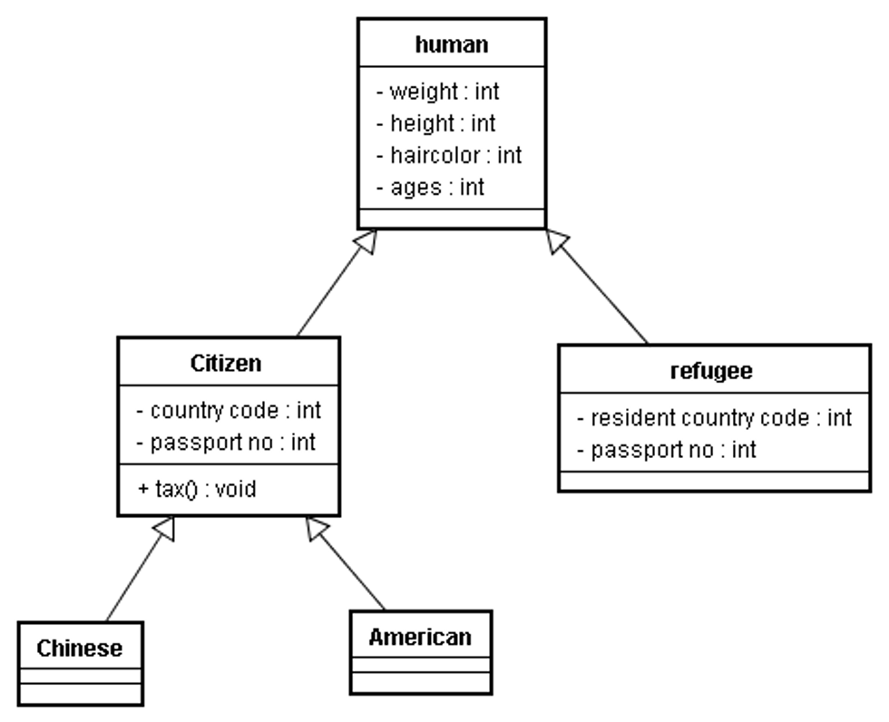
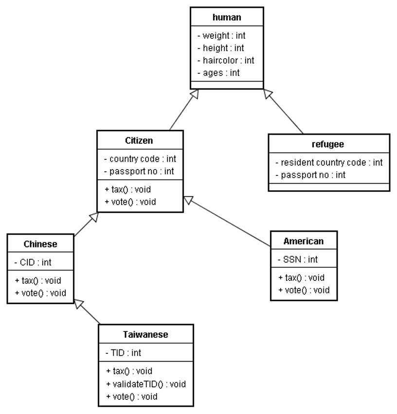
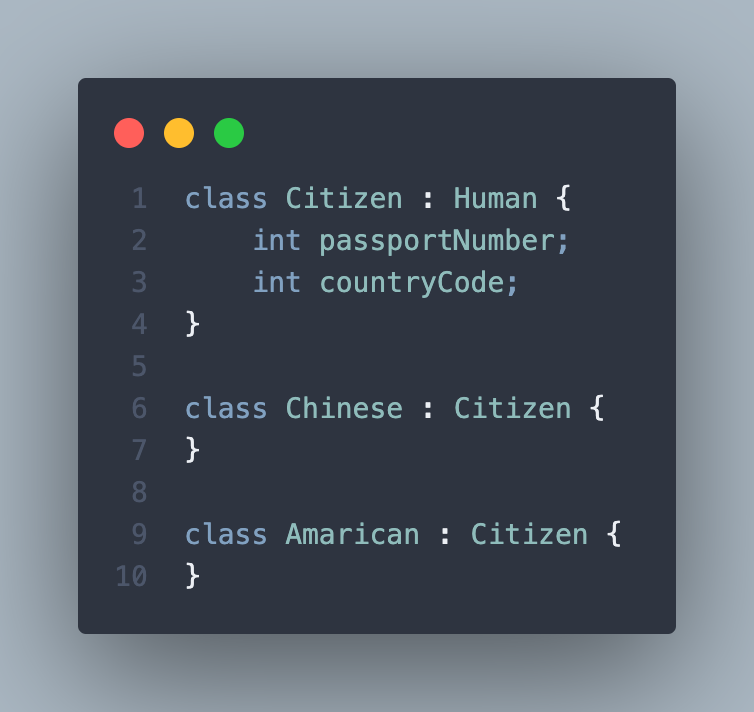

# Material 02 - Inheritance   <!-- omit from toc --> 

**Table of Contents**
- [Specialization](#specialization)
- [Overriding and Overloading](#overriding-and-overloading)
  - [A complete list of invoked constructors](#a-complete-list-of-invoked-constructors)
  - [Overriding Method](#overriding-method)
  - [What is Overriding?](#what-is-overriding)
  - [What is Overloading?](#what-is-overloading)
- [The Principle of Inheritance](#the-principle-of-inheritance)
  - [To subclass or not to subclass](#to-subclass-or-not-to-subclass)
  - [More Example of Overriding](#more-example-of-overriding)

```cpp
class Pet {
  public:
    // Constructors, Destructors
    Pet() : weight(1), food("Pet Chow") {}
    ~Pet() {}
    // Accessors
    void setWeight(int w) { weight = w; }
    int getWeight() { return weight; }
    void setfood(string f) { food = f; }
    string getFood() { return food; }
    // General methods
    void eat();
    void speak();

  protected: // subclasses can access these
    int weight;
    string food;
};

void Pet::eat() {
    cout << "Eating " << food << endl;
}

void Pet::speak() {
    cout << "Growl" << endl;
}

class Rat : public Pet {    // use inheritance to solve the reused problem
  public:
    Rat() {}
    ~Rat() {}
    // Other methods
    void sicken() {
        cout << "Spreading Plague" << endl;
    }
};

class Cat : public Pet {
  public:
    Cat() : numberToes(5) {}
    ~Cat() {}
    // Other accessors
    void setNumberToes(int toes) { numberToes = toes; }
    int getNumberToes() { return numberToes; }

  private:
    int numberToes;
};

int main() {
    Rat charles;
    Cat fluffy;

    charles.setWeight(25);
    cout << "Charles weighs " << charles.getWeight() << " lbs. " << endl;
    charles.speak();
    charles.eat();
    charles.sicken();

    fluffy.speak();
    fluffy.eat();
    cout << "Fluffy has " << fluffy.getNumberToes() << " toes " << endl;
    
    return 0;
}
```

- data members of the Pet base class are declared as `protected` -> subtypes of the base class will be directly access these variables
- `private` -> only the Pet class could directly access them; subclasses could not
- `public` -> any class or part of code could accessed them. This would defeat a key goal of object-oriented design: encapsulating data within a class and exposing the data only through the public interface.
- Each subtype of the base class has its own constructor and destructor. -> copy constructors and destructors are not inherited.

Rat, Cat inherit from Pet with `eat` and `speak` methods. Rat has a new method `sicken` and Cat has a new data member `numberToes` and methods `setNumberToes` and `getNumberToes`.

- Rat and Cat objects inherit the methods of the base class, Pet. We can call the speak method and the eat method on objects of type Rat and Cat. These methods were defined only in Pet and not in the subclasses.  
- Also, notice the each subclass extends the base class by adding methods and members. The Rat class has the "sicken" method. The Cat class has methods and members related to the number of toes an individual cat object has. 

> [!IMPORTANT] 
> This is the most common software reuse by extending additional behaviors in OO system development 

- The base class contains common members and methods used by the subclasses 
- The subtypes are more specialized than the base class. 

## Specialization

```cpp
class Pet {
  public:
    // Constructors, Destructors
    Pet() : weight(1), food("Pet Chow") {
        cout << "Pet Constructor" << endl;
    }
    ~Pet() {
        cout << "Pet Destructor" << endl;
    }
    // Accessors
    void setWeight(int w) { weight = w; }
    int getWeight() { return weight; }
    void setfood(string f) { food = f; }
    string getFood() { return food; }
    // General methods
    void eat();
    void speak();

  protected: // subclasses can access these
    int weight;
    string food;
};

void Pet::eat() {
    cout << "Eating " << food << endl;
}

void Pet::speak() {
    cout << "Growl" << endl;
}

class Rat : public Pet {
  public:
    Rat() { cout << "Rat Constructor" << endl; }
    ~Rat() { cout << "Rat Destructor" << endl; }
    // Other methods
    void sicken() {
        cout << "Spreading Plague" << endl;
    }
};

class Cat : public Pet {
  public:
    Cat() : numberToes(5) { cout << "Cat Constructor" << endl; }
    ~Cat() { cout << "Cat Destructor" << endl; }
    // Other accessors
    void setNumberToes(int toes) { numberToes = toes; }
    int getNumberToes() { return numberToes; }

  private:
    int numberToes;
};

int main() {
    Rat charles;
    Cat fluffy;

    return 0;
}
```

Output:

```bash
Pet Constructor    // Charles Pet Constructor
Rat Constructor    // Charles Rat Constructor
Pet Constructor    // Fluffy Pet Constructor
Cat Constructor    // Fluffy Cat Constructor
Cat Destructor     // Fluffy Cat Destructor
Pet Destructor     // Fluffy Pet Destructor
Rat Destructor     // Charles Rat Destructor
Pat Destructor     // Charles Pat Destructor
```

in user system stack, it looks like this:
```
+--------+     <-- Pet init Constructor    Base
| weight |                                  |
| food   |      (Pet)                       |
+-----------+                               |
| numoftoes |   (Cat)                       V
+-----------+  <-- Cat init Constructor  Specialized
```

- The **base class** part of an object is **always constructed first and destroyed last**. The **subclass** part of an object is **constructed last and destroyed first**. 
- The reason for this is that each object of a subtype consists of multiple parts, a base class part and a subclass part. The base class constructor forms the base class part. The subclass constructor forms the subclass part. Destructors clean up their respective parts. 

> [!IMPORTANT] 
> 每一個 subclass 要自行負責建構與清除自己的特異化的的部分

In the previous example, all the classes used default constructors. That is, the constructors took no arguments. Suppose that there were constructors that took arguments. How would this be handled? Here's a simple example. 


## Overriding and Overloading

```cpp
class Pet {
  public:
    // Constructors, Destructors
    Pet() : weight(1), food("Pet Chow") {}
    Pet(int w) : weight(w), food("Pet Chow") {}
    Pet(int w, string f) : weight(w), food(f) {}
    ~Pet() {}

    ...
};

class Rat : public Pet {
  public:
    Rat() {}
    Rat(int w) : Pet(w) {}
    Rat(int w, string f) : Pet(w, f) {}
    ~Rat() {}

    ...
};

class Cat : public Pet {
  public:
    Cat() : numberToes(5) {}
    Cat(int w) : Pet(w), numberToes(5) {}
    Cat(int w, string f) : Pet(w, f), numberToes(5) {}
    Cat(int w, string f, int toes) : Pet(w, f), numberToes(toes) {}
    ~Cat() {}

    ...
};
```

In `C++` there is the writing about `Class : arguments { }` to call the base class constructor with arguments. Then it will use the base class constructor with the same arguments.

- `Rat` and `Cat` constructors that take `arguments`, which are in turn passed to the appropriate `Pet` constructor. The base class, `Pet`, constructor is added to the **member initialization list** of the derived class constructors. 
- Also notice that for the derived class (`Rat` and `Cat`) default constructors, the `Pet` default constructor does not need to be explicitly called. 


### A complete list of invoked constructors
```cpp
Rat charles(25,"Rat Chow");
Pet(int w, string f)
Rat(int w, string f)

Rat john;
Pet()
Rat()

Cat fluffy(10,"rats");
Pet(int w, string f)
Cat(int w, string f)

Cat buffy(10,"fish",6);
Pet(int w, string f)
Cat(int w, string f, int toes) 
```

### Overriding Method

- A **derived class (subclass)** can use the methods of its **base class(es)**, or it can **override** them. 
- The method in the derived class must have the same **signature** and return type as the base class method to override. 
- The signature is number and type of arguments and the constantness (const, non-const) of the method. When an object of the base class is used, the base class method is called. 
- Note that overriding is different from **overloading**. With overloading, many methods of the same name with different signatures (different number and/or types of arguments) are created. 
- With overriding, a subclass implements its own version of a base class method. The subclass can selectively use some base class methods as they are, and override others. 

### What is Overriding?

```cpp
class Pet {
  void dosSomething(int x, string b);
}

class Cat : Pet {
  void dosSomething(int x, string b);
}
```

### What is Overloading?

```cpp
class XXX {
  void dosSomething(int x, string b);
  void dosSomething(int x, string b, char c);
}
```

> [!NOTE]
> Overloading V.S. Polymorphism


- remember that the `return type` and `signature` of the subclass method must match the base class method exactly **to override**. 


> [!WARNING]
> Another important point is that if the base class had overloaded a particular method, **overriding a single one of the overloads will hide the rest.**

For instance, suppose the Pet class had defined several speak methods.

```cpp
void speak();
void speak(string s);
void speak(string s, int loudness);

Cat::void speak();
```

If the subclass, `Cat`, defined only `void speak();`

Then `speak()` would be **overridden**. `speak(string s)` and `speak(string s, int loudness)` would **be hidden**. This means that if we had a `cat` object, `fluffy`, we could call: 

```cpp
Cat fluffy;

fluffy.speak();
// But the following would cause compilation errors.
fluffy.speak("Hello");
fluffy.speak("Hello", 10);
```

Generally, if you override an overloaded base class method you should either override every one of the overloads, or carefully consider why you are not.It is a safety protocol enforced by compiler to prevent you from doing such error


## The Principle of Inheritance


```cpp
class EmployeeCensus: public ListContainer {

public:
    ...
    // public routines
    void AddEmployee ( Employee employee ); 
    void RemoveEmployee ( Employee employee );
    Employee NextItemInList();
    Employee FirstItem;
    Employee LastItem;
    ...
private:
    ...
}
```

> [!TIP]
> Is `EmployeeCensus` a `ListContainer`?

The below is horror code, in this situation, we don't need to use inheritance, we should use composition instead.


C++ Example of a Class interface with Consistent Levels of Abstraction
```cpp
class EmployeeCensus {

public:
    ...
    // public routines
    // The abstraction of all these routines is now at `Employee` Level.
    void AddEmployee ( Employee employee ); 
    void RemoveEmployee ( Employee employee );
    Employee NextItemInList();
    Employee FirstItem;
    Employee LastItem;
    ...
private:
    // That the class uses the ListContainer library is now hidden.
    ListContainer m_EmployeeList;   // composition
    ...
}
```

This class is representing two ADTs: an employee and a ListContainer.

### To subclass or not to subclass

Consider you are a UN(United Nation) staff:

| Figure | Explanation |
| --- | --- |
|  | <ul><li>Is citizen a human?</li><li>Is refugee a human?</li></ul> |
|  |  No. <br> The country code is already capable of distinguishing citizenships of country. This subclassing is meaningless until |
|  | Until object’s behaviors must be specialized and distinguished  |

> [!TIP]
> #### Thumb Rule
> - A citizen is a human?
> - An American is a citizen?
>   - An american is a human?
>   - Inheritance relation is transitive
> - A Chinese is a citizen?
> - A citizen is a human?
> - A Chinese is a human?


The UN staff wants to follow one-China policy


| Figure | Explanation |
| --- | --- |
|  | <ul><li>Taiwanese all inherit <code>CID</code></li><li>Taiwanese overrides the <code>tax()</code> and <code>vote()</code> method</li><li>Taiwanese has a specialized attributes called <code>TID</code></li><li>Taiwanese has a new method to validate if a <code>TID</code> is valid.</li></ul> |

By so inheritance, the UN staff means:

- Taiwanese is a Chinese, is a citizen, and is a human
- Chinese is not necessary a Taiwanese
- Taiwanese has an attribute called CID, but is never used **(this is something wrong)**


OK..This is very heavy

| Figure | Explanation |
| --- | --- |
|  | <ul><li>Taiwanese is not a Chinese</li><li>But Taiwanese and Chinese are both citizens and human.</li><li>Taiwanese does not inherit CID attributes</li></ul> |


### More Example of Overriding

```cpp
class pet {

  public:
    pet() { cout << "pet constructor" << endl; }
    ~pet() { cout << "pet destructor" << endl; }
    void speak() { cout << "Growl " << endl; }
};

class cat : public pet {

  public:
    cat() { cout << "cat constructor" << endl; }
    ~cat() { cout << "cat destructor" << endl; }
    void speak() { cout << "meow" << endl; }
};


main() {
    pet insect;
    cat pussy;
    pet *nose = (pet *)new cat();   // polymorphism

    insect.speak();
    pussy.speak();
    ((pet)pussy).speak();  // no feature of polymorphism
    nose->speak();
}
```

(UNKNOWN) Output:
```cpp
pet constructor     // insect
pet constructor     // pussy
cat constructor     // pussy
pet constructor     // nose
cat constructor     // nose
Growl               // insect
meow                // pussy
Growl               // (pet)pussy (troncated)
pet destructor      // (UNKNOW)
Growl               // (UNKNOW)
cat destructor      // (UNKNOW)
pet destructor      // (UNKNOW)
pet destructor      // (UNKNOW)
```


`((pet)pussy).speak();   // change pussy to pet`

```
        -> +--------------+
       |   |      Pet     | 
 pussy |   +--------------+  
       |   | Cat (remove) |  <- (cast) 
        -> +--------------+ 
```

> [!CAUTION]
> When you use a subclass to override a base class’s method, C++ will use the current type to determine the method
> 
> This is not the polymorphism you expect.

> [!NOTE]
> 在運用多型的時候，你會不想要讓這樣的事情發生，要怎麼辦？


