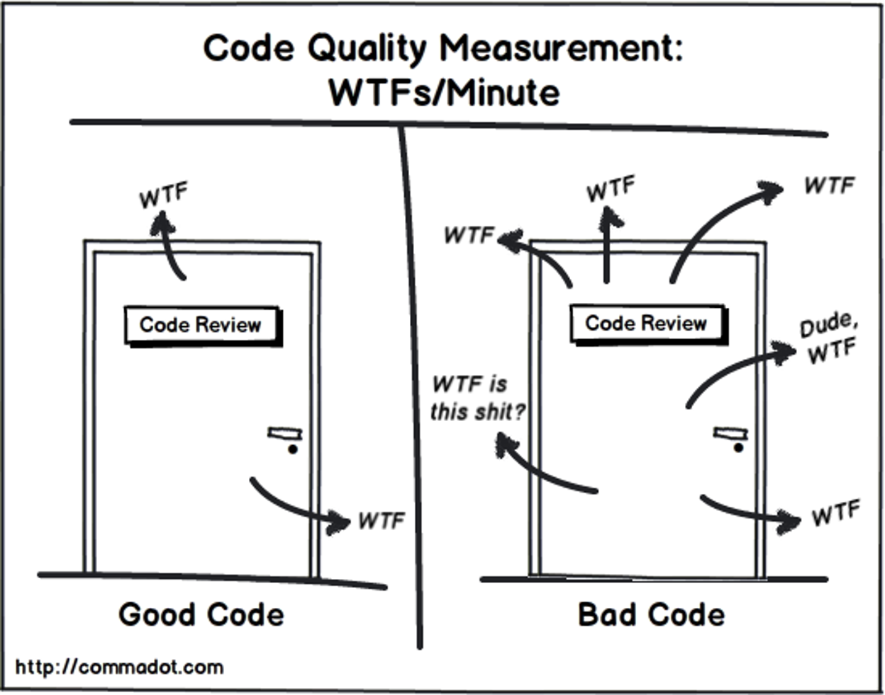

# Material 06 - Source Code Quality

- Software has essence of being abstract
- Software has essence of being invisible
- software has essence of being hard to describe

> Do you think code contains ART?
> 
> YES.

What is the difference between ART and Science?
- ART -- no objective criteria
- Science -- based on objective criteria 
  - Repeatable experiments
  - Describable by explicit formalism such as maths 
How do you judge a painting or art pieces?

## Code Review

Software Engineering studies show that the quality of the code between a peak performer and an mediocre programmer is an order of magniture ($10^1$) -- SACKMAN, EROKSON, and GRANT

> [!IMPORTANT]
> Another Study shows that the number of years in experience is not a key factor to peak performer and mediocre programmer.

- A process to check and examine submitted code 
- Before the integration (sometimes called code inspection)
- After the test (mostly is called code review)

