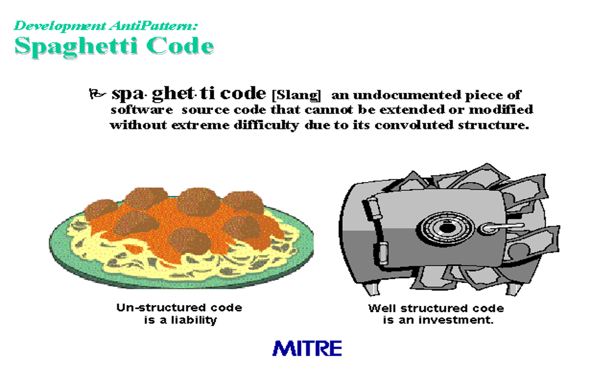

# Material 06 - Source Code Quality <!-- omit in toc -->

**Table of Content**
- [Code Review](#code-review)
- [Typical symptoms of bad code](#typical-symptoms-of-bad-code)
- [Coupling](#coupling)
- [Reasons for writing bad code](#reasons-for-writing-bad-code)
- [Spaghetti Code](#spaghetti-code)
  - [Symptoms](#symptoms)
  - [Object-Oriented Spaghetti Code](#object-oriented-spaghetti-code)
- [Lasagna code](#lasagna-code)
- [Ravioli code](#ravioli-code)

> Do you think code contains ART?
> 
> YES.

What is the difference between ART and Science?
- ART -- no objective criteria
- Science -- based on objective criteria 
  - Repeatable experiments
  - Describable by explicit formalism such as maths 
How do you judge a painting or art pieces?

## Code Review

Software Engineering studies show that the quality of the code between a peak performer and an mediocre programmer is an order of magniture ($10^1$) -- SACKMAN, EROKSON, and GRANT

> [!IMPORTANT]
> Another Study shows that the number of years in experience is not a key factor to peak performer and mediocre programmer.

- A process to check and examine submitted code 
- Before the integration (sometimes called code inspection)
- After the test (mostly is called code review)

## Typical symptoms of bad code

- Difficult to understand
- Difficult to change (changing at one place results in changes in many other places) 
- Hardwire the solutions (for example, instead of coming out a nice algorithms and data structures, many if is used)
- Source code is tightly coupled because the excessive use of global variables.
- Poor design that is difficult to extend.

In CS major, main focuses are problem solving such as algorithms, techniques (networking, multimedia). Writing high quality code is not encouraged or viewed as an important topic among students

We teach students how to assemble gears to solve a problem but do not educate them how to produce quality gears and measure quality of the gears.

> [!TIP] 
> Clean and simple interface, replaceability, modularity, composablity

Their importance is not obvious in Software development, particularly if you never has chance to maintain a software

## Coupling

- Most software engineering methods (e.g., OO) focus on create beautiful design so that 
  - Change one thing  does not involving changing many other things
  - Replace/substitute one thing does not involving modifying many other things
  - Extend one thing does not involving rewriting many other things
- High coupling is bad 
- We pursuit low coupling
- OO is a technique to **decouple** the system architecture
- The concept of coupling will be introduced in the future.

> [!NOTE]
- Why writing low-coupled source code is not as easy as other engineering?
  - Software is invisible  and source code is not geometric related that you can judge from your eyes
  - The dependency and coupling  are not obvious and easy to identify.  Consider a poor programmer writing thousand lines of code for you.
  - Software behaviors are dynamic

## Reasons for writing bad code

- Experienced programmers may write bad code
  - Tight schedule and limited budget
  - Demo-oriented programming
  - Not enough time to do design 
  - They accustomed themselves to write bad code if no adequate software engineering processes has been established in their working environment
- What is a bad code smell?
  - No formal definitions and descriptions have been established so far
  - Sometimes, it is not easy to explain why a piece of code is bad to beginners
  - This means “bad” is not measurable quantitatively 
  - Understand what is bad can lead to a better understanding of  what is good. For example, why using some design pattern is good  and what can be improved?

## Spaghetti Code

一個沒有很好不能自我說明、無法被擴充修改的程式碼。

### Symptoms
- Quick demonstration code that became operational
- "Lone Ranger" programming (who was that masked man?)
- Obsolete or scanty documentation
- 50% of maintenance spent on system rediscovery
- Hesitant Programmer Syndrome
  - More likelt to break it than extend it
  - Easier to just rewrite it
- Cannot be reused
  - System software and COTS packages can't be upgraded
  - Performance cannot be optimized
- User work arounds

### Object-Oriented Spaghetti Code

- Many object methods with no parameters
- Suspicious class or global variables
- Intertwind and unforeseen relationships between objects
- Process-oritented methods, objects with process-oriented names.
- OO advantage lost -- inheritance cannot be used to extend the system, polymorphism not effective either.

Bottom Line: Software has reached point of diminishing returns here the effort involved to maintain existing code exceeds the cost of developing a new "groud up" solution.

## Lasagna code

Lasagna code is used to describe software that has a simple, understandable, and layered structure. Lasagna code, although structured, is unfortunately monolithic and not easy to modify. An attempt to change one layer conceptually simple, is often very difficult in actual practice. 

## Ravioli code
- In ravioli code, each of the components, or objects, is a package containing some meat or other nourishment for the system; any component can be modified or replaced without significantly affecting other components. 
- The ideal software structure is one having components that are small and loosely coupled; this ideal structure is called ravioli code. 

