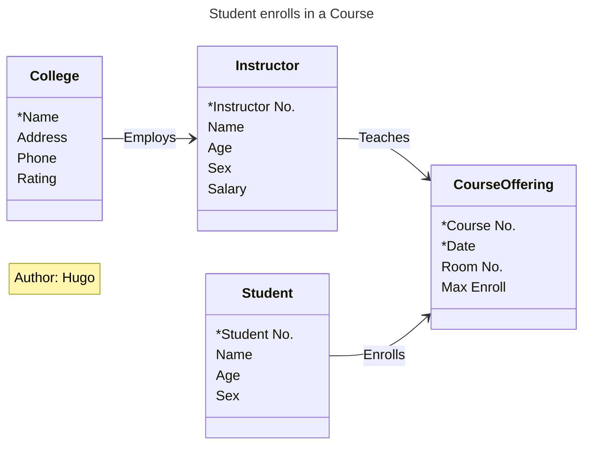
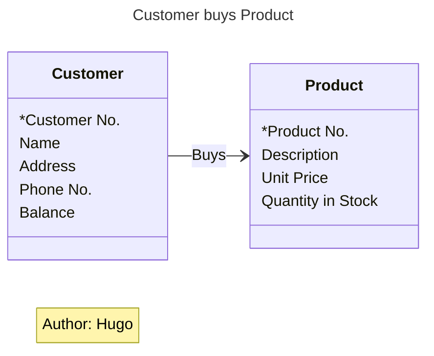
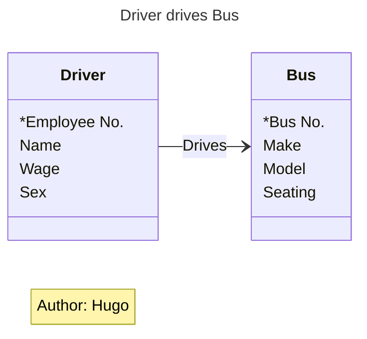
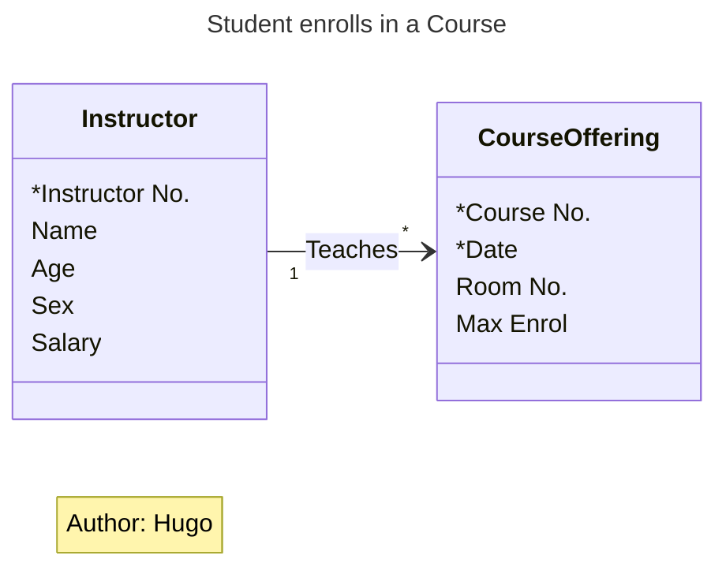
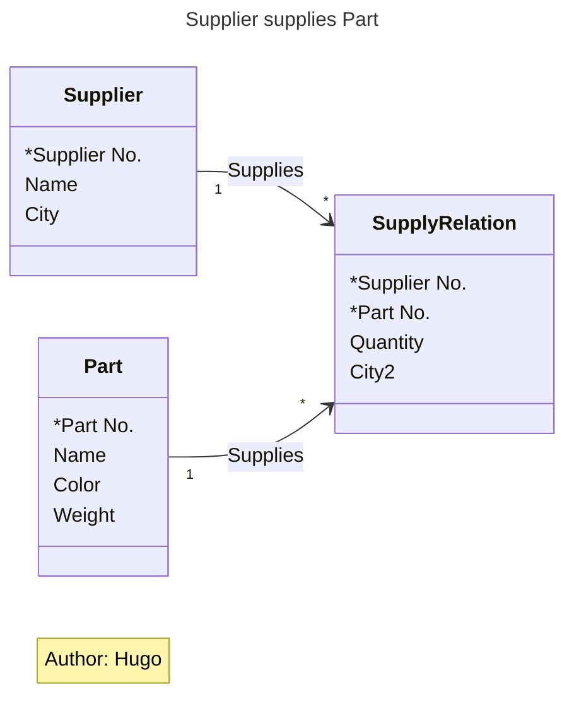

# Material 08 - Data Oriented Model

> [!NOTE]
> We need a methology !!!

## Entity-Relationship Diagram (ERD)

- The Entity-Relationship Principle
- The Entity-Relationship Notation

These further issues were also investigated by Chen and others:
- E-R models for database design
- The significance of the data of an enterprise
- Data as a corporate asset.
- The stability of the data of an enterprise

### The Entity-Relationship Principle

#### Sales Operation

To manage a sales operation, we need to keep data about:

Sales
- Customers
- Products
- Sales clerks

#### Phone Company

To run a phone company, we would need to keep data about:

Phone
- Customers
- Numbers
- Lines
- Calls
- Services

#### Booking Agency

To run a booking agency we must record information about:

Booking
- Venues
- Artists
- Agents
- Concerts
- Performances
- Customers
- Seats

> [!IMPORTANT]
> Notice there is no Date in this list. Why Not?

> [!NOTE]
> A date is data that describes a Concert
> - A date can describe many things
> - The key word here is **Things**

Each of these lists is a list of things

### Comments

The E-R principle focuses on the things we need to keep data about.

- Earlier methods emphasized what the users need to know to do their job.
- Here we emphasize what things the users need to know about.
- The word Entity means a thing.
- Later we worry about what items they need to know about each entity.

```cpp
class Date {

}

Date date = new Date("2012/02/15");
Date datePrime = new Date("2012/12/15");
```

- Webster:  An entity is "something" that has separate and distinct existence
- You can see it is something we need to know about (i.e., keep data about) to do our job

A Data Entity is something that has separate and distinct existence in the world of the users and is of interest to the users in that they need to keep data about it in order to do their job.

> [!TIP]
> - Entity type -> Class
> - Entity -> Object
> - Occurrence -> instance


Grammatically, the term Entity refers to a single specific Customer or Product or Sale or Call or Artist.

What we need to talk about mostly is the class of all Customers, or in other words the type of thing called a Customer.

> [!IMPORTANT]
> An "Entity Type" is a class or category expressing the common properties that allow a number of entities to be treated similarly.
>
> An individual Customer or Product or Sale or Call or Artist is then an Occurrence of the Entity Type.

#### Scenario

- I am an occurrence of the entity type "Employee"
- You are an occurrence of the entity type "Student"
- We each live in an occurrence of the entity type "Dwelling"
- The last time you caught an occurrence of the entity type "Bus," it followed an occurrence of the entity type "Route" while executing an occurrence of the entity type "Trip."

Attributes are the data elements carried by an entity that describe it and record its state.

Attributes are the things we need to know about an Entity.

#### Still Not Yet

So we have: 
- Hundreds of Customers
- Thousands of Products
- Dozens of Sales Clerks

Do we have a business?

NOT YET!

Not until:
- A Customer buys a Product
- A Sales Clerk sells a Product
- A Sales Clerk sells to a Customer
  
> [!NOTE]
> These are the interactions that occur between entities.
> 
> Note each involves a "verb".

An Association is the interaction of two entities and is represented by a verb.

## E-R models for database design.

For database design:

- Each Entity Type becomes a file or table.
- Each Attribute becomes a field (i.e., a column)
- Each Association becomes an access pathway (i.e., a foreign key)

## UML (Unified Modeling Language)

### Student enrolls in a Course



### Customer buys Product



### Driver drives Bus



### One-to-Many Association, or 1:M

```cpp
class Instructor {
    int instructor_id;
    string name;
    int age;
    vector<course *> courses;
}

class Course {
    Instructor * teacher;
    ...
}
```




### Many-to-Many Association, or M:M

```cpp
class Product {
    int productNumber;

    vector<Customer *> customers;
}

class Customer {
    int customerNumber;
    string name;
    vector <Product *> products;
}
```

## Exercise in the Last Material

```
S#:     零件供應商的編號 (Supplier no)
SNAME:  零件供應商的姓名 (supplier name)
CITY1   零件供應商的城市 (The city of a supplier) 
P#      零件編號  (part no.)
PNAME	零件名稱 (part name)
COLOR   零件色彩 (part color)
WEIGHT  零件重量  (part weight)
CITY2   零件所儲存的城市 (city where the parts are stored)
QTY     零件的存量 (The quantity of the parts)
```

一個零件可能有多個供應商可以供應, 例如正新輪胎與南港輪胎都可以提供米其林 10039 號輪胎,而正新輪胎可以存放在板橋,但是南港輪胎則庫存在內湖


```cpp
class Supplier {
    string city1;
    string id;

    vector<SupplyRelation *> supplyRelations;
}

class Part {
    string id;
    string color;
    float weight;

    vector<SupplyRelation *> supplyRelations;
}

class SupplyRelation {
    string supplierId;
    string partId;
    int quantity;
    string city2;

    Supplier * supplier;
    Part * part;
}
```



```
Table 1 Supplier
    S#      CITY2

Table 2 Part
    P#  Weight  COLOR

Table 3 Supplier Relation

    S#    P#         CITY2   QTY
    正新  米其林 1000  中壢    1000
    南港  米其林 1000  大直    500
    正新  米其林 1000  高雄    2000
    正新  米其林 1000  中壢    500
```

## Exercise

你現在是一個系統分析師,你的任務是分析ㄧ個校務行政系統.請畫出此系統的UML 圖, 以下是概略的需求分析

- 一個老師可以敎許多門課,
- 每一個學生可以自行選修課來修,
- 目前的開授的科目有英文,數學,物理,化學,國文.
- 每一個開課的科目包含授課時數,授課教室,授課時段,授課年級與班級以及授課老師等資訊.
- 學生的學籍包含身分證號碼,學號,年級,姓名,住址
- 每個學生都會被編到一個班級上課,由一位老師擔任導師

You are a system analyst and you are responsible for analyze an e-school system. Please draw UML diagram for the following requirement 

- A teacher can teach many courses
- A student can enroll in several courses
- The course subject include Chinese, English, Math, Chemistry
- A course has hours, classroom, time slots, grades, class, teacher
- A student has ID, name, grade, address
- Each student will be assigned to a class. There is one teacher will be assigned to the class as an advisor.

> [!TIP]
> Do you need to make subject into a table?
> 
> - If for a hundred year, your subject name change little, a table can be skipped. A string field can be used in the course table. But somehow your program need to maintain a list of these subjects (strings) as well.
> - However, if you have additional attributes needed to be added to a subject. Such as course description, course textbook, etc. Making it into a table is a better solution.
>
> What if don't normalize?
> 
> You may write
> ```cpp
> Class student {
>    int sid ;
>    vector<course*> my_courses;
> }
> 
> Class  course {
>    int cid ;
>    vector<students*> students ;
> }
> ```
> 
> What’s wrong?
> 
> 如果上級長官有要求，要求你紀錄每個學生修課時的到課時數 (註:任何新的屬性與兩者都相關)


