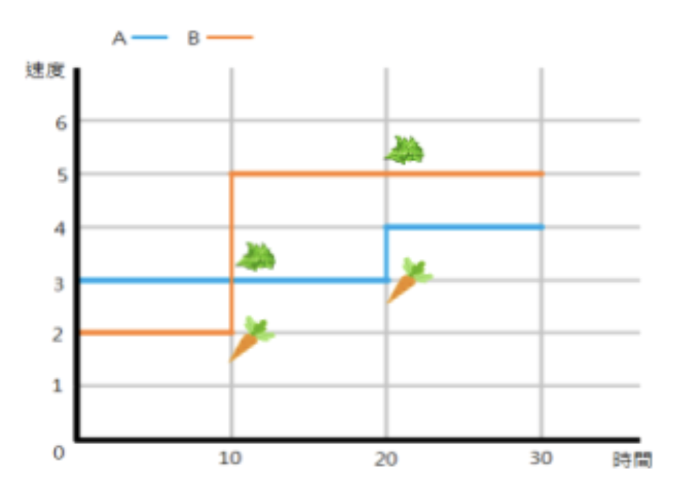
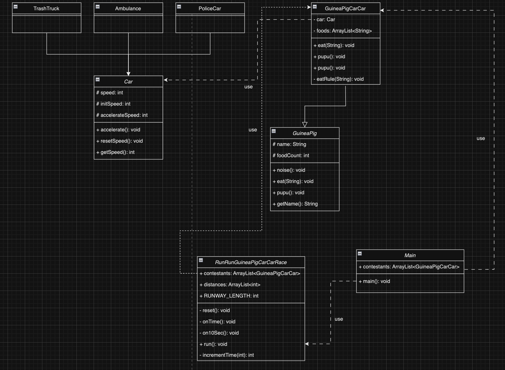
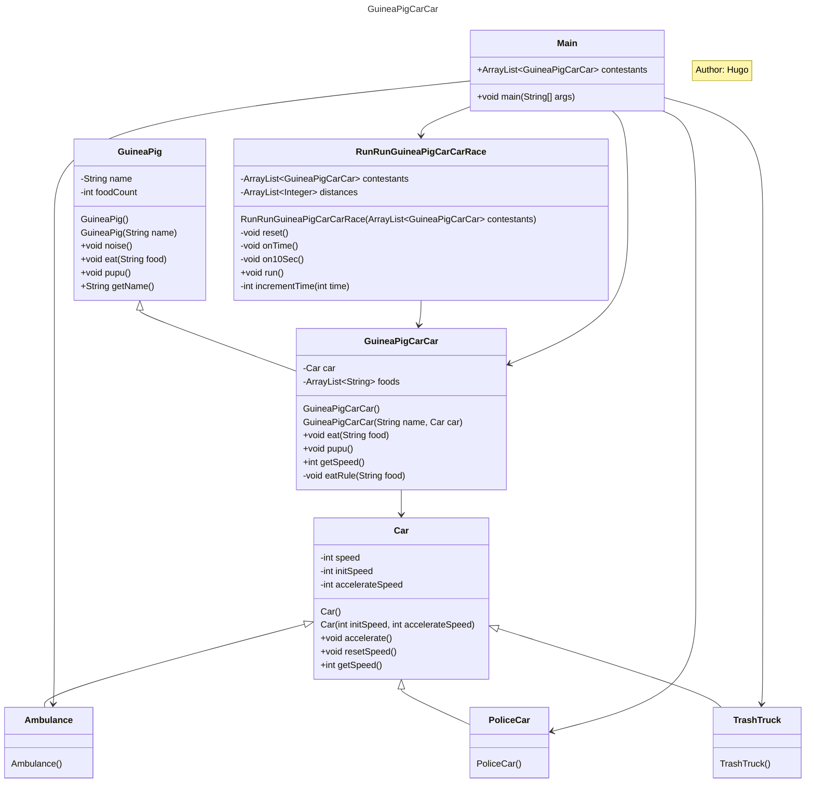

# 跑跑天竺鼠車車 For Mob Programming

> 以下所有距離單位皆為公尺、時間單位皆為秒、速度單位皆為公尺/秒

天竺鼠車車 ── 本來丸丸正計劃以「車車、腋毛，以及香脆脆油渣渣」製作出 NYKD-54，但在製作途中意外地加入「天竺鼠」而誕生。 牠們和丸丸住在一個 叫「無名小鎮」的地方，而你就是丸丸。

天竺鼠車車擁有一般天竺鼠的特性，也擁有和汽車一樣的功能，牠們會進行 天竺鼠的行為如 PUI PUI 叫、進食、棒賽 (PUPU)、也會有車車的行為，如加速。

車車有多種車種，但目前天竺鼠車車只會有三種，分別是警車、救護車以及 垃圾車。根據牠們的車種，每輛天竺鼠車車會有不同的初速度，警車初速度為 14；救護車初速度為 11；垃圾車初速度為 8。

天竺鼠車車和天竺鼠一樣會有進食的行為。每吃到一次紅蘿蔔，如果是警車 速度會加 5；如果是救護車速度會加 2；如果是垃圾車速度會加 4。當棒賽之後，就會回到初速度。若是吃到紅蘿蔔以外的食物，則只是會在棒賽的時候一起排掉。與天竺鼠不同的是，天竺鼠棒賽是會棒出 pupu，而天竺鼠車車則是吃什麼棒什麼。

每一隻天竺鼠車車都有屬於自己的名字，也都會屬於警車、救護車、垃圾車之一。

2021 年 5 月 6 日，今天是一年一度的跑跑天竺鼠車車大賽，規則如下
1. 賽道是筆直的，長度為4000，最先抵達終點的天竺鼠車車獲得第一名，當第一名得主出現時比賽結束。
2. 出發時間為0，每當經過的時間為 10 的倍數 (10,20,30....)，當下最落後的天竺鼠車車可以吃一個紅蘿蔔，當下最領先的天竺鼠車 車則可以吃一個生菜。
3. 當天竺鼠車車肚子裡超過 5 (不含) 個食物，天竺鼠車車馬上就會棒賽，回到初速度。

### Use Case A: 建立一個 GuineaPig (name) 的 class

- Definition: 天竺鼠(GuineaPig) 可以發出聲音 (noise)、進食 (eat)、棒賽 (pupu)。
- What to do:
  - 定義一個 GuineaPig class。
  - 定義相關 methods。

### Use Case B: 建立一個 Car () 的 class

- Definition: 車子 (Car) 可以加速 (accelerate)、重置速度 (resetSpeed)。
- What to do:
    - 定義一個 Car class。
    - 定義相關 method。
- 不同的車種會有不同的初速度與加速度
- 警車 (PoliceCar): 初速度為 14、加速度為 5。
- 救護車 (Ambulance): 初速度為 11、加速度為 2。
- 垃圾車 (TrashTruck): 初速度為 8、加速度為 4。

### Use Case C: 建立一個 GuineaPigCarCar (name, vehicles) 的 class

- Definition: 天竺鼠車車 (GuineaPigCarCar) 擁有一般天竺鼠的特性，也擁有和汽車一樣的功能。
- What to do:
  - 定義一個GuineaPigCarCar class。 
  - 定義相關method。
  - 建立三隻天竺鼠車車："西羅摩 (Shiromo)" - 警車、"阿比 (Abbey)" - 救護車、"泰迪 (Teddy)" - 垃圾車

### Use Case D: 比賽開始 Definition:

一年一度的跑跑天竺鼠車車大賽 (RunRunGuineaPigCarCarRace) 要開始了。

- What to do:
    讓西羅摩、阿比和泰迪進行比賽。比賽從0秒開始，當經過的時間為10的倍數時:
    1. 讓當下最落後的天竺鼠車車吃一個紅蘿蔔。
    2. 讓當下最領先的天竺鼠車車吃一個生菜。
    3. 當天竺鼠車車吃下的食物超過 5 (不含) 個，天竺鼠車車馬上就會棒賽，印出這隻鼠的名稱 + 牠的賽。
   
    > [!NOTE]
    > 不用考慮同時有不只 1 個第一名，或不只 1 個最後一名的情況。任何時間點一定只存在 1 個第一名和 1 個最後一名。

例如:

A的初速度為3、加速度為1; B的初速度為2、加速度為3 時間經過30，他們跑的距離為:

- A:3*10 + 3*10 + 4*10 = 100
- B:2*10 + 5*10 + 5*10 = 120



賽道是長度4000的筆直跑道，一旦有參賽鼠通過終點，比賽結束。 當比賽結束時:

1. 印出跑跑大賽的冠軍得主名稱
2. 印出跑跑大賽結束瞬間，每隻參賽鼠的名稱與跑的距離 秒數請以1秒為單位計算，當第n秒時有任何天竺鼠車車跑的距離大於 等於4000，則比賽立即結束。 例如:(以下數字是隨機舉例，不代表真實比賽情況)

- 第50秒時，三個天竺鼠車車跑的距離分別為: 
  - 西羅摩:3990
  - 阿比:3845
  - 泰迪:3971 
- 第51秒時，三個天竺鼠車車跑的距離分別為:
  - 西羅摩:4172
  - 阿比:3997
  - 泰迪:4121 
- 則比賽立即結束，西羅摩為第一名，阿比為最後一名。

### 評分標準(依據物件導向程度評分)

1. 建立三隻天竺鼠車車 (10%)
2. 印出跑跑大賽中，每隻參賽鼠棒的賽 (10%)
3. 印出跑跑大賽結束時每隻參賽鼠的名稱與跑的距離 (10%) 4. 印出跑跑大賽的冠軍得主名稱 (10%)
5. 物件導向 (30%)
6. 個人分數 (30%)

> [!IMPORTANT]
> 本題目一定有需要使用多型的地方，請同學分析架構時仔細想想

### Discussion
4. 天竺鼠車車是車的一種嗎？
5. 天竺鼠車車是天竺鼠的一種嗎？


### `Car`

```java
package Car;

public class Car {
    private int initSpeed;
    private int speed;
    private int accelerateNum;

    public Car() {
        this(0, 0);
    }

    public Car(int initSpeed, int speed) {
        this.initSpeed = initSpeed;
        this.speed = speed;
    }

    public int getSpeed() {
        return this.speed;
    }

    public void accelerate() {
        this.speed += this.accelerateNum;
    }

    public void resetSpeed() {
        this.speed = this.initSpeed;
    }
}
```

### `Ambulance`, `PoliceCar`, `TrashTruck`

```java
package Car;

public class Ambulance extends Car {

    public Ambulance() {
        super(11, 0);
    }
}
```

```java
package Car;

public class PoliceCar extends Car {

    public PoliceCar() {
        super(14, 0);
    }
}
```

```java
package Car;

public class TrashTruck extends Car {

    public TrashTruck() {
        super(8, 0);
    }
    
}
```


#### Terms

`Car`

- `Car/Car.java`
- `Car/Ambulance.java`
- `Car/PoliceCar.java`
- `Car/TrashTruck.java`

`GuineaPig`

- `GuineaPig/GuineaPig.java`
- `GuineaPig/GuineaPigCarCar.java`

`RunRunGuineaPigCarCarRace`

- `RunRunGuineaPigCarCarRace.java`

#### Cases

1. GuineaPig 可以發出聲音 (noise)、進食 (eat)、棒賽 (pupu)。
2. 車子 (Car) 可以加速 (accelerate)、重置速度 (resetSpeed)。
    - 不同的車種會有不同的初速度與加速度
    - 警車 (PoliceCar): 初速度為 14、加速度為 5。
    - 救護車 (Ambulance): 初速度為 11、加速度為 2。
    - 垃圾車 (TrashTruck): 初速度為 8、加速度為 4。
3. 天竺鼠車車 (GuineaPigCarCar) 擁有一般天竺鼠的特性，也擁有和汽車一樣的功能。


#### Discussion

1. 天竺鼠車車是車的一種嗎？
2. 天竺鼠車車是天竺鼠的一種嗎？





#### Reference

- [簡單理解 UML 類別圖](https://misomiso43.medium.com/%E7%B0%A1%E5%96%AE%E7%90%86%E8%A7%A3-uml-%E9%A1%9E%E5%88%A5%E5%9C%96-f0b32a3272c)
- [UML Class Diagram Tutorial](https://www.visual-paradigm.com/guide/uml-unified-modeling-language/uml-class-diagram-tutorial/)
- [How to show abstract class containing other classes in Java UML class diagrams?](https://stackoverflow.com/questions/72402730/how-to-show-abstract-class-containing-other-classes-in-java-uml-class-diagrams)
