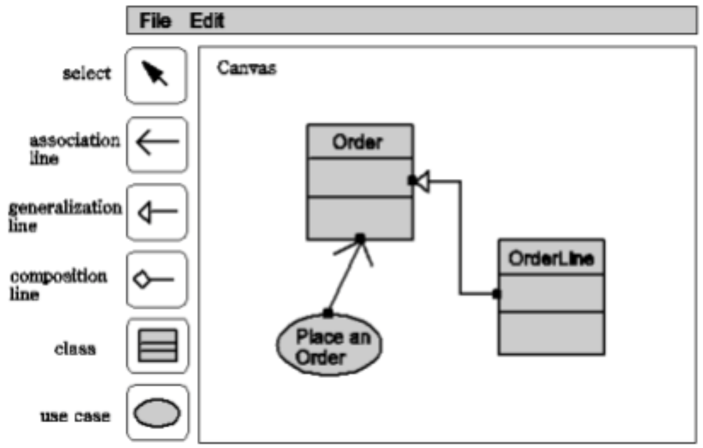
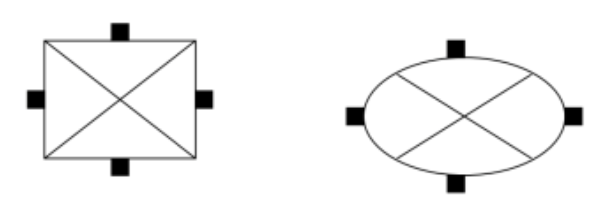

# Mob Programming: UML Editor

在這個 case study 中，你的工作是從一份 requirement 文件中，蒐集以及辨認出必要的 classes 然後尋找出 classes 之間的 association 關係（可能也是 aggregation 或 composition 類的關係）。然後將這個關係，用 UML 的 class diagram 繪製出來。

## The Spec

以下這一份需求文件，也正是本課程學期末你們的 project 所要完成的最基本的功能——**一個 UML 編輯器**。

本 UML 編輯器總共分成 3 個部分，第一個部分是編輯的區域稱之為 Canvas area 也就是所謂的畫布。編輯區域左邊有一排按鈕。你要完成的按鈕最少為如圖所顯示的 6 個按鈕。從上到下分別是

- select
- association
- generalization
- composition
- class
- use case

這些按鈕除了 select 之外都是用來在編輯區內，創造一個 UML 物件。本 UML 編輯 器得使用與一般你所熟知的繪圖軟體類似。不過，些微的操作差異（例如，為了更 user friendly），可能會導致很複雜的實做差異。為了減低你們實做的困擾，特地將規 格撰寫如下。請你們照著完成本規格所描述的功能即可。

## Requirement and Spec (in UML syntax and format)

本需求文件採用 UML 的 Use Case 來描述系統需求與規格。我們將使用此 UML editor 的 scenarios 先分類成幾大類

- A. 建立物件
- B. 連結物件 
- C. 選取物件 
- D. 群組物件

### Definitions:
- 基本物件 (basic object): 如 class 或 use case 物件
- 連結物件 (connection line): 如各種 association lines
- composite 物件: composite 物件由多個基本物件經過 group 的功能組合而
成。composite 物件是一種樹狀的 container，也就是說 composite 物件本身 又可以包含 composite 物件。composite 物件的範圍可以定義為最小的正方 形區域完全包含它的所有組成物件。
- 物件深度 (depth): 每個物件相對於其他的物件都有一個深度值 0-99,若某 個 物件的深度值比其他物件深度值少，在繪圖時，該物件應該覆蓋其他物 件， 而且先接收與攔截落於該物件的 mouse 事件。也就是說，當兩個物件 重疊 時有mouse事件被觸發，則只有最上層的物件會接收到該 mouse 事 件。

### UseCase A.1 Creating a UML object

**precondition:**

本 use case 適用 class 以及 use case 兩個按鈕

1. 按下按鈕之後按鈕的顏色變黑，以告知使用者目前欲建立的物件的 mode。
2. 使用者移動游標至編輯區域。
3. 於座標 (x,y) 按下左鍵，則以 x,y 為左上角建立所選定的物件(在編輯
區中，繪製一個空白的物件)
4. 使用者可重複 2-3 一直在編輯區域內建立同樣的物件，直到 mode 被改
變

**Alternatives 1.a** 使用者按其他按鈕，則切換到其他按鈕的 mode

### UseCase B.1 Creating a UML connection line

**precondition:**

本 use case 適用 association line, generalization line 以及 composition line

1. 使用者在編輯地區的某個 class 或 use case 物件範圍內按下 mouse 的 左鍵，但是不放開(mouse pressed)
2. 使用者不放開左鍵，進行拖曳 (drag) 的動作。
3. 使用者拖曳到另外一個 class 或 use case 物件範圍內，放開左鍵 (mouse released)
4. 在編輯區內，建立一個 line 的物件。連接兩個物件。依照 connection line 的種類，將各種箭頭繪製於終點的物件。

**Alternative 1.a** 使用者 mouse pressed 的座標，不在任何 class 或 use case 物 件，則 從 mouse pressed -> mouse drag -> mouse released 都不會 有任何作 用。

**Alternative 3.a** 使用者 mouse released 的座標，不在任何 class 或 use case 物 件， 則不建立任何 connection line 物件。

**Definition:** connection line 的建立是連結在基本物件的 4 個 connection ports 上。 基本物件 ，如 class 或 use case 都各 有東南西北各四個 connection ports。 每一個 connection port 所負責的點選範圍如下圖。

也就是說，當使用者於步驟 1 或步驟 3 按下或放開 mouse 左鍵時，請判斷該座 標位 於基本物件的那個範圍內。請注意，本規則不試用 composite 物件。

### UseCase C.1 Select/Unselect a single objects

**precondition:**

本 use case 適用按鈕 select 被按下的情況。 

**Definition:** 當一個基本物件被處於被 select 的狀態，我們會將四個 connection ports 明確顯示出來，如上圖，以表示基本物件處於被 select 的狀 態。 相反的若基本物件處於不被 select 的狀態，則四個 connection ports 是隱藏的。

1. 使用者點選某基本物件
2. 若有其他物件處於被 select 的狀態，取消它們被 select 的狀態。
3. 將此基本物件的 4 個 connection ports 做明確的顯示

**Alternative 1.a** 使用者點選的座標，不在任何基本物件內

**Alternative 2.a** 若有其他物件處於被 select 的狀態，取消它們被 select 的狀態。

### UseCase C.2 Select/Unselect a group of objects

**Precondition:** 本 use case 適用按鈕 select 被按下的情況。

**Definition:** 當一個基本物件被處於被 select 的狀態，我們會將四個 connection ports 明 確顯示出來，如上圖，以表示基本物件處於被 select 的狀態。相反的 若基本物件處 於不被 select 的狀態，則四個 connection ports 是隱藏的。

1. 使用者在編輯區座標 x1,y1 按住 mouse 左鍵不放，x1,y1 不屬於任何基 本物件的範圍內。
2. 若原本其他物件處於被 select 的狀態，取消它們被 select 的狀態。
3. 使用者不放開左鍵，進行拖曳(drag)的動作。
4. 使用者拖曳到另外一個座標 x2,y2，放開左鍵 (mouse released) 5. (x1,y1,x2,y2) 形成一個四方形的區域。在該區域內的基本物件若完全落於 此 四方形區域，則處於被 select 的狀態

**Alternative 4.a** (x1,y1,x2,y2) 形成一個四方形的區域。在該區域內的沒有 基本物件完全落於此四方形區域。則本情境等於 unselect 所有之前處於被 select 的狀態。

### UseCase D.1 Group objects

**precondition:** 當多於 1 個基本物件處於被 select 的狀態時，試用本 use case. 按鈕 select 被按下的情況。

1. 使用者到 Edit Menu 選取 Group 的功能
2. 將處於被選取狀態的基本物件合併成一個 composite 基本物件

### UseCase D.2 UnGroup objects

**precondition:** 當唯一 1 個 composite 物件處於被 select 的狀態時

1. 使用者到 Edit Menu 選取 UnGroup 的功能 2. composite 物件解構一層

### UseCase E.1 Move objects

**precondition:** 按鈕 select 被按下的情況。

1. 使用者在編輯地區的某個基本物件(包含 composite 物件)範圍內按 下 mouse 的左鍵，但是不放開(mouse pressed)
2. 使用者不放開左鍵，進行拖曳(drag)的動作。
3. 使用者拖曳到另外一個座標 x,y 放開左鍵 (mouse released)
4. 該基本物件被移動到新座標 x,y 。
5. 所有連結到該基本物件的 connection lines 全部重新繪製。 

> [!NOTE] 
> x, y 座標有可能落在某個物件的範圍內，這種情況該基本物件在 x, y 的座標上繪製會重疊其他物件。基本上物件重疊時，請按照物件深度的次序來繪製。

### UseCase F.1 Change Object Name

**precondition:** 當某一個基本物件處於被 select 的狀態時

1. 使用者到 Edit Menu 選取 change object name 的功能
2. 產生另外一個小視窗，包含一個 text area 以及 OK 鍵與 Cancel 鍵 3. 使用 者在 text area 可以輸入新的名字，然後按 OK 鍵，更改基本物件的名 稱，然 後小視窗消失

**Alternative 3.a** 取消更改

1. 使用者按下 cancel 鍵，然後小視窗消失。
