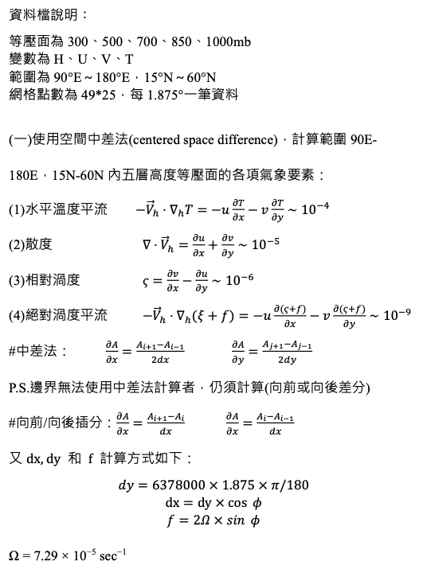
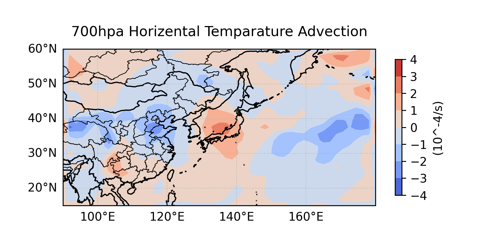
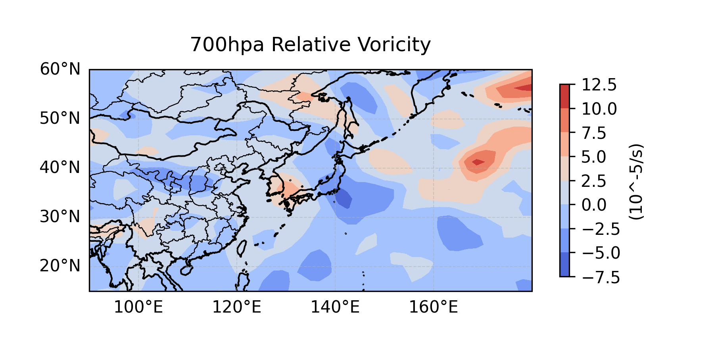
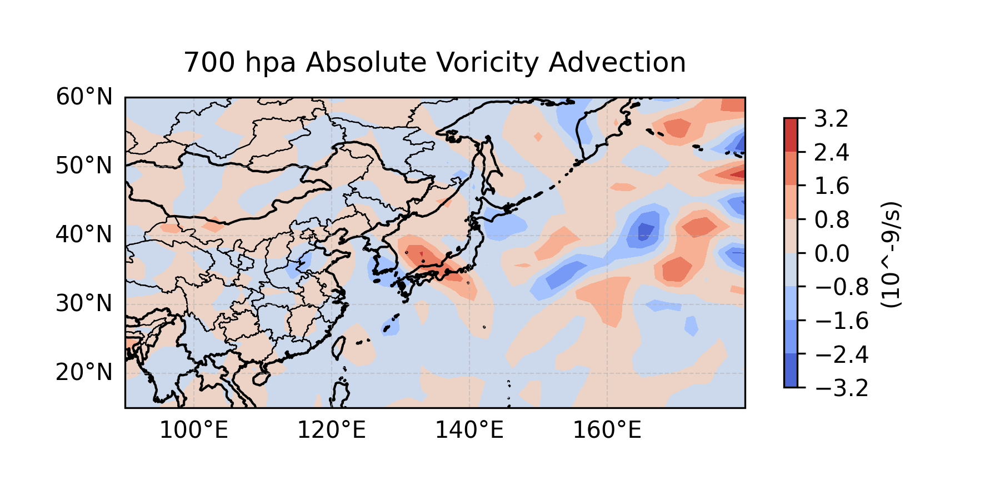
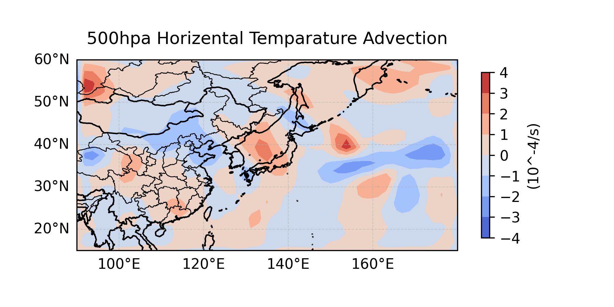
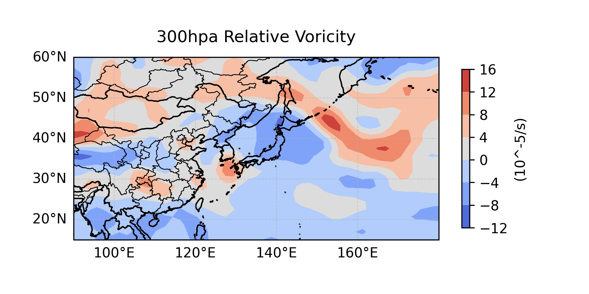

# 1121 天氣學與天氣分析（下） --- 作業一

> - 姓名：林群賀
> - 系級：大氣四
> - 學號：109601003




## 執行程式碼
```shell
$ cd q01_horizental_temparature_advection
$ python3 main.py

$ cd ../q02_divergence
$ python3 main.py

$ cd ../q03_relative_voricity
$ python3 main.py

$ cd ../q04_absolute_voricity_advection
$ python3 main.py
```

## 各高度層氣象參數結果圖 (5 x 4 = 20 張)

| hPa(mb) | 水平溫度平流 | 散度 | 相對渦度 | 絕對渦度平流 | 
| :-: | :-: | :-: | :-: | :-: |
| 1000 |  |  |  |  |
| 850 |  |  |  |  |
| 700 |  |  |  |  |
| 500 |  |  |  |  |
| 300 |  |  |  |  |


## 程式碼說明


基本上就是將助教給的公式轉換成 python 的 function ，因為都是數學算式，註解也不太有寫的必要，另外變數名稱已經代表物理參數的名稱，故附上實作程式碼。

### 讀取資料

```python
def load_data(
        file_name,
        var, 
        nlev,
        nlat,
        mlon,
    ) -> np.ndarray[Any]:
    data = np.fromfile(
        file_name, 
        dtype='<f4',
    )
    data = data.reshape(
        var, 
        nlev,
        nlat,
        mlon,
    )

    return data

def configure_parameters(
        mlon, 
        nlat, 
        data
    ) -> tuple[
        np.linspace,
        np.linspace,
        Any,    
        Any,    
        Any,    
        Any,
    ]:
    lon = np.linspace(90, 180, mlon)
    lat = np.linspace(15, 60, nlat)
    h = data[0, :, :, :]
    u = data[1, :, :, :]
    v = data[2, :, :, :]
    t = data[3, :, :, :]

    return (
        lon,
        lat,
        h,
        u,
        v,
        t,
    )
```
### 水平溫度平流 

```python
def count_horizental_temparature_advection(
        u,
        v,
        t,
        dy,
        nlev,
        nlat,
        mlon,
        lat,
    ) -> np.ndarray[np.float64]:
    horizental_temparature_advection = np.zeros(
        [nlev, nlat, mlon]
    )
    
    for i in range(nlev):
        for j in range(nlat):
            for k in range(mlon):
                # 計算經度間距
                dx = dy * np.cos(lat[j] * np.pi / 180)

                # 檢查經度和緯度的範圍
                if 1 <= j < nlat - 1 and 1 <= k < mlon - 1:
                    # 計算 x 方向上的差分
                    x_value = (
                        u[i, j, k] * (t[i, j, k + 1] - t[i, j, k - 1]) / 
                        (2 * dx)
                    )  
                    # 計算 y 方向上的差分
                    y_value = (
                        v[i, j, k] * (t[i, j + 1, k] - t[i, j - 1, k]) / 
                        (2 * dy)
                    )  
                    
                    horizental_temparature_advection[i, j, k] = -x_value - y_value
                else:
                    # 單邊插植
                    # 計算 x 方向上的差分
                    if k == 0:
                        x_value = (
                            u[i, j, k] * (t[i, j, k + 1] - t[i, j, k]) / 
                            dx
                        )  
                    elif k == mlon - 1:
                        x_value = (
                            u[i, j, k] * (t[i, j, k] - t[i, j, k - 1]) / 
                            dx
                        )
                    else:
                        x_value = (
                            (u[i, j, k + 1] - u[i, j, k - 1]) / 
                            (2 * dx)
                        )

                    # 計算 y 方向上的差分
                    if j == 0:
                        y_value = (
                            v[i, j, k] * (t[i, j + 1, k] - t[i, j, k]) / 
                            dy
                        )  
                    elif j == nlat - 1:
                        y_value = (
                            v[i, j, k] * (t[i, j, k] - t[i, j - 1, k]) / 
                            dy
                        )
                    else:
                        y_value = (
                            v[i, j, k] * (t[i, j + 1, k] - t[i, j - 1, k]) / 
                            (2 * dy)
                        )

                    horizental_temparature_advection[i, j, k] = x_value + y_value

    return horizental_temparature_advection
```

### 散度 
```python
def count_divergence(
        u,
        v,
        dy,
        nlev,
        nlat,
        mlon,
        lat,
    ) -> np.ndarray[np.float64]:
    divergence = np.zeros(
        [nlev, nlat, mlon]
    )
    
    for i in range(nlev):  # 遍歷垂直層
        for j in range(nlat):  # 遍歷緯度
            for k in range(mlon):  # 遍歷經度
                dx = dy * np.cos(lat[j] * np.pi / 180)  # 計算經度間距
                if 1 <= j < nlat - 1 and 1 <= k < mlon - 1:
                    # 計算x方向上的差分
                    x_value = (u[i, j, k + 1] - u[i, j, k - 1]) / (2 * dx)
                    # 計算y方向上的差分
                    y_value = (v[i, j + 1, k] - v[i, j - 1, k]) / (2 * dy)
                    
                    divergence[i, j, k] = x_value + y_value
                else:
                    # 單邊插植
                    # 計算 x 方向上的差分
                    if k == 0:
                        x_value = (u[i, j, k + 1] - u[i, j, k]) / dx
                    elif k == mlon - 1:
                        x_value = (u[i, j, k] - u[i, j, k - 1]) / dx
                    else:
                        x_value = (u[i, j, k + 1] - u[i, j, k - 1]) / (2 * dx)

                    # 計算 y 方向上的差分
                    if j == 0:
                        y_value = (v[i, j + 1, k] - v[i, j, k]) / dy 
                    elif j == nlat - 1:
                        y_value = (v[i, j, k] - v[i, j - 1, k]) / dy 
                    else:
                        y_value = (v[i, j + 1, k] - v[i, j - 1, k]) / (2 * dy)  

                    divergence[i, j, k] = x_value + y_value

    return divergence
```

### 相對渦度 
```python
def count_relative_voricity(
        u,
        v,
        dy,
        nlev,
        nlat,
        mlon,
        lat,
    ) -> np.ndarray[np.float64]:
    relative_voricity = np.zeros(
        [nlev, nlat, mlon]
    )
    for i in range(nlev):  # 遍歷垂直層
        for j in range(nlat):  # 遍歷緯度
            for k in range(mlon):  # 遍歷經度，
                if 1 <= j < nlat - 1 and 1 <= k < mlon - 1:  # 檢查經度和緯度的範圍
                    dx = dy * np.cos(lat[j] * np.pi / 180)  # 計算經度間距
                    x_value = (v[i, j, k + 1] - v[i, j, k - 1]) / (2 * dx)  # 計算x方向上的差分
                    y_value = (u[i, j + 1, k] - u[i, j - 1, k]) / (2 * dy)  # 計算y方向上的差分
                    relative_voricity[i, j, k] = x_value - y_value  # 計算相對渦度
                else:
                    # 單邊插植
                    dx = dy * np.cos(lat[j] * np.pi / 180)  # 計算經度間距
                    if k == 0:
                        x_value = (v[i, j, k + 1] - v[i, j, k]) /  dx  # 計算x方向上的差分
                    elif k == mlon - 1:
                        x_value = (v[i, j, k] - v[i, j, k - 1]) / dx  # 計算x方向上的差分
                    else:
                        x_value = (v[i, j, k + 1] - v[i, j, k - 1]) / (2 * dx)  # 計算x方向上的差分
                    
                    if j == 0:
                        y_value = (u[i, j + 1, k] - u[i, j, k]) / dy  # 計算y方向上的差分
                    elif j == nlat - 1:
                        y_value = (u[i, j, k] - u[i, j - 1, k]) / dy  # 計算y方向上的差分
                    else:
                        y_value = (u[i, j + 1, k] - u[i, j - 1, k]) / (2 * dy)  # 計算y方向上的差分
                    
                    relative_voricity[i, j, k] = x_value - y_value  # 計算相對渦度

    return relative_voricity
```

### 絕對渦度平流
```python
def count_absolute_vorticity_advection(
        relative_voricity,
        u,
        v,
        dy,
        nlev,
        nlat,
        mlon,
        lat,
    ):
        absolute_vorticity_advection = np.zeros([nlev,  nlat,mlon])
        for i in range(nlev):
            for j in range(nlat):
                for k in range(mlon):
                    dx = dy * np.cos(lat[j] * np.pi / 180)

                    if 1 <= j < nlat - 1 and 1 <= k < mlon - 1:
                        # 計算x方向上的差分
                        x_value = u[i, j, k] * (relative_voricity[i, j, k + 1] - relative_voricity[i, j, k - 1]) / (2 * dx)
                        # 計算y方向上的差分
                        y_value = v[i, j, k] * (relative_voricity[i, j + 1, k] - relative_voricity[i, j - 1, k] + 2 * 7.29 * (10 ** -5) * np.sin(lat[j + 1] * np.pi / 180) - 2 * 7.29 * (10 ** -5) * np.sin(lat[j - 1] * np.pi / 180)) / (2 * dy)
                    else:
                        # 單邊插植
                        # 計算x方向上的差分
                        if k == 0:
                            x_value = (u[i, j, k] * (relative_voricity[i, j, k + 1] - relative_voricity[i, j, k])) /  dx  
                        elif k == mlon - 1:
                            x_value = (u[i, j, k] * (relative_voricity[i, j, k] - relative_voricity[i, j, k - 1])) / dx
                        else:
                            x_value = u[i, j, k] * (relative_voricity[i, j, k + 1] - relative_voricity[i, j, k - 1]) / (2 * dx)
                        
                        if j == 0:
                            y_value = v[i, j, k] * (relative_voricity[i, j + 1, k] - relative_voricity[i, j, k] + 2 * 7.29 * (10 ** -5) * np.sin(lat[j + 1] * np.pi / 180) - 2 * 7.29 * (10 ** -5) * np.sin(lat[j] * np.pi / 180)) / dy  # 計算y方向上的差分
                        elif j == nlat - 1:
                            y_value = v[i, j, k] * (relative_voricity[i, j, k] - relative_voricity[i, j - 1, k] + 2 * 7.29 * (10 ** -5) * np.sin(lat[j] * np.pi / 180) - 2 * 7.29 * (10 ** -5) * np.sin(lat[j - 1] * np.pi / 180)) / dy  # 計算y方向上的差分
                        else:
                            y_value = v[i, j, k] * (relative_voricity[i, j + 1, k] - relative_voricity[i, j - 1, k] + 2 * 7.29 * (10 ** -5) * np.sin(lat[j + 1] * np.pi / 180) - 2 * 7.29 * (10 ** -5) * np.sin(lat[j - 1] * np.pi / 180)) / (2 * dy)  # 計算y方向上的差分
                    
                    absolute_vorticity_advection[i, j, k] = -x_value - y_value  # 計算絕對渦度平流
        return absolute_vorticity_advection
```

### 視覺化 (以 `absolute_vorticity_advection` 為例)
```python
def check_output_dir() -> None:
    os.makedirs("imgs", exist_ok=True)

def visualize_results(
        isobaric_surface_levels: list,
        absolute_vorticity_advection: np.ndarray[np.float64], 
        lon,
        lat,
    ):
        check_output_dir()

        for level in range(absolute_vorticity_advection.shape[0]):
            plt.figure(
                figsize=(6, 3), 
                dpi=300,
            )
            ax = plt.axes(
                projection=ccrs.PlateCarree()
            )
            ax.set_extent(
                [90, 180, 14.99, 60.01], 
                crs=ccrs.PlateCarree()
            )
            ax.add_feature(
                cfeature.LAND
            )
            ax.add_feature(
                cfeature.COASTLINE
            )
            ax.add_feature(
                cfeature.BORDERS
            )
            ax.add_feature(
                cfeature.STATES, 
                linewidth=0.5,
            )

            var = absolute_vorticity_advection[level, :, :]
            contour = ax.contourf(
                lon, 
                lat, 
                var, 
                cmap='coolwarm',
            )

            output_file_name = f"{isobaric_surface_levels[level]}hpa_absolute_voricity_advection"
            figure_title = f"{isobaric_surface_levels[level]} hpa Absolute Voricity Advection"
            ax.set_title(figure_title)
            ax.gridlines(
                draw_labels=[True, "x", "y", "bottom", "left"], 
                linewidth=0.5, 
                alpha=0.5, 
                linestyle='--'
            )

            plt.colorbar(
                contour, 
                ax=ax, 
                orientation='vertical', 
                shrink=0.7, 
                label="(10^-9/s)"
            )
            plt.savefig(f"imgs/{output_file_name}.png")
            
            # plt.show()
```
