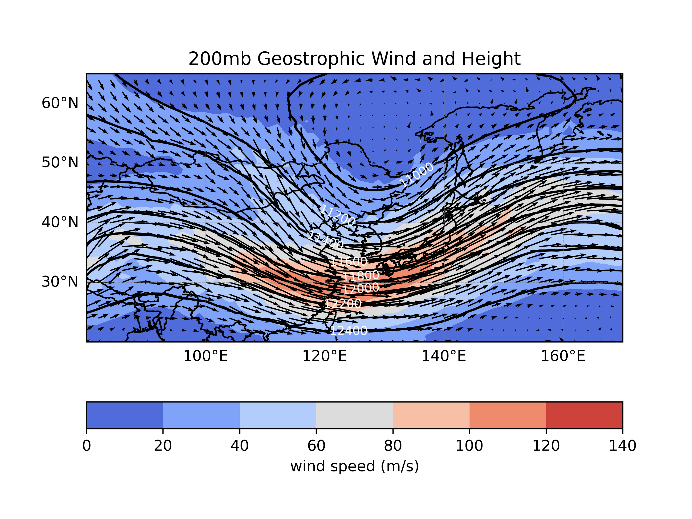
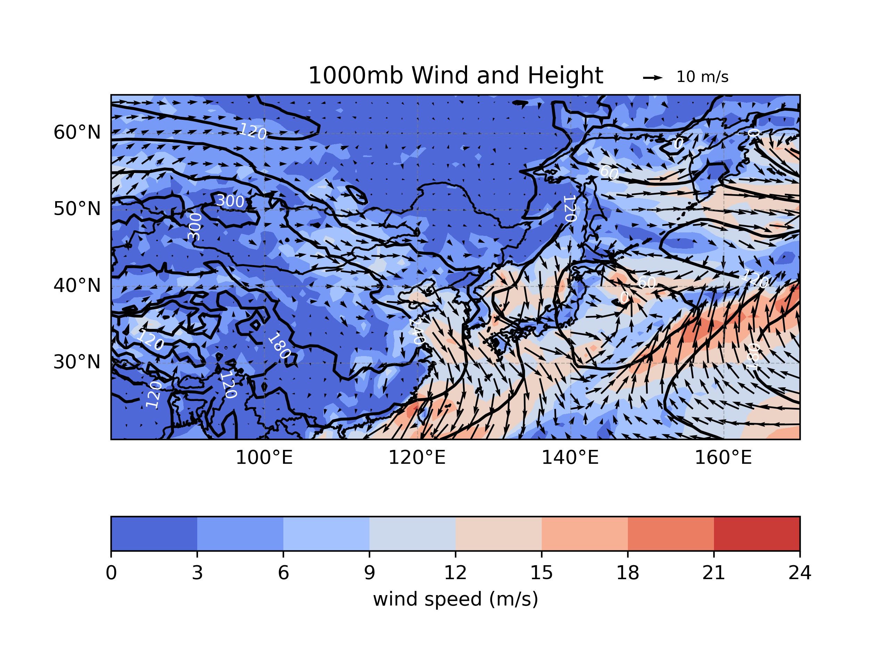

# 1121 天氣學與天氣分析（下） --- 作業三

> - 姓名：林群賀
> - 系級：大氣四
> - 學號：109601003

## 執行程式碼
```shell
$ python3 main.py
```

| 200 hPa 地轉風與重力位高度場 | 200 hPa 非地轉風 & 輻合輻散與重力位高度場 |
| :---: | :---: |
|  |  |

| 500 hPa 風場與重力位高度場 (標示槽脊線) | 1000 hPa 風場與高度場 (需附加地面系統標示) |
| :---: | :---: |
|  |  |


## 問題討論：
### 1. 說明此時的天氣系統高層與低層的關係，如 200 hPa噴流軸出區入區，500 hPa 槽脊系統的配置如何對地面天氣系統造成影響。

當在高度場中有一個 200 mb 的極地轉風，我們可以觀察到噴流軸位於台灣的北方。在這種情況下，槽前是噴流的出區，槽後是噴流的入區。

我們知道，位於噴流入區的右側以及出區的左側有利於高層輻散上升運動，而位於入區左側以及出區右側有利於高層輻合下沉運動。然而，在這個特定情況下，這種影響似乎不那麼明顯。更確切地說，我們可以明顯觀察到槽前是輻散區，槽後是輻合區的型態。同時，隨著槽線向東移動，中國陸地上出現高壓區，地面似乎伴隨著冷平流，槽後則有低壓系統形成。

## 程式碼

### 讀取資料

```py
def load_data(filename: str):
    data = np.fromfile(
        filename, 
        dtype='<f4'
    )
    var, nlev, nlat, mlon = 3, 3, 46, 91
    data = data.reshape(
        var, 
        nlev, 
        nlat, 
        mlon
    )

    return data
```

```py
def configure_parameters(data):
    nlat, mlon = 46, 91
    lon = np.linspace(80, 170, mlon)
    lat = np.linspace(20, 65, nlat)
    h = data[0, :, :, :]
    u = data[1, :, :, :]
    v = data[2, :, :, :]

    return lon, lat, h, u, v
```


### 計算地轉風

```py
def count_geowind(h, lat, lon):
    nlev, nlat, mlon = h.shape
    nlat = 46
    mlon = 91
    omega = 7.29 * (10 ** -5)
    dy = 6378000 * np.pi / 180
    geo_wind_U = np.zeros(
        [
            nlev, 
            nlat, 
            mlon
        ]
    )
    geo_wind_V = np.zeros(
        [
            nlev, 
            nlat, 
            mlon
        ]
    )

    for i in range(nlev):
        for j in range(nlat):
            for k in range(mlon):
                f = 2 * omega * np.sin(lat[j] * np.pi / 180)
                dx = dy * np.cos(lat[j] * np.pi / 180)

                if 1 <= j < nlat - 1 and 1 <= k < mlon - 1:
                    x_value = -(h[i, j + 1, k] - h[i, j - 1, k]) / (2 * dy * f)
                    y_value = (h[i, j, k + 1] - h[i, j, k - 1]) / (2 * dx * f)
                else:
                    if j == 0:
                        x_value = -(h[i, j + 1, k] - h[i, j, k]) / (dy * f)
                    elif j == nlat - 1:
                        x_value = -(h[i, j, k] - h[i, j - 1, k]) / (dy * f)
                    else:
                        x_value = -(h[i, j + 1, k] - h[i, j - 1, k]) / (2 * dy * f)

                    if k == 0:
                        y_value = (h[i, j, k + 1] - h[i, j, k]) / (dx * f)
                    elif k == mlon - 1:
                        y_value = (h[i, j, k] - h[i, j, k - 1]) / (dx * f)
                    else:
                        y_value = (h[i, j, k + 1] - h[i, j, k - 1]) / (2 * dx * f)

                geo_wind_U[i, j, k] = 9.8 * x_value
                geo_wind_V[i, j, k] = 9.8 * y_value

    return geo_wind_U, geo_wind_V
```

### 計算非地轉風

```py
def count_nona_geowind(u, v, ug, vg):
    ua = u - ug
    va = v - vg

    return ua, va
```

### 計算相對渦度

```py
def count_divergence(u, v, lat, dy):
    nlev, nlat, mlon = u.shape
    divergence = np.zeros([nlev, nlat, mlon])

    for i in range(nlev):
        for j in range(nlat):
            for k in range(mlon):
                dx = dy * np.cos(lat[j] * np.pi / 180)

                if 1 <= j < nlat - 1 and 1 <= k < mlon - 1:
                    x_value = (u[i, j, k + 1] - u[i, j, k - 1]) / (2 * dx)
                    y_value = (v[i, j + 1, k] - v[i, j - 1, k]) / (2 * dy)
                    divergence[i, j, k] = x_value + y_value
                else:
                    dx = dy * np.cos(lat[j] * np.pi / 180)

                    if k == 0:
                        x_value = (u[i, j, k + 1] - u[i, j, k]) / dx
                    elif k == mlon - 1:
                        x_value = (u[i, j, k] - u[i, j, k - 1]) / dx
                    else:
                        x_value = (u[i, j, k + 1] - u[i, j, k - 1]) / (2 * dx)

                    if j == 0:
                        y_value = (v[i, j + 1, k] - v[i, j, k]) / dy
                    elif j == nlat - 1:
                        y_value = (v[i, j, k] - v[i, j - 1, k]) / dy
                    else:
                        y_value = (v[i, j + 1, k] - v[i, j - 1, k]) / (2 * dy)

                    divergence[i, j, k] = x_value + y_value

    return divergence
```


### Visualization

```py
def visualize_geo_wind_height(lon, lat, u, v, h):
    wspd = (u ** 2 + v ** 2) ** 0.5
    title = "200mb Geostrophic Wind and Height"

    plt.figure(dpi=400)
    ax = plt.axes(
        projection=ccrs.PlateCarree()
    )
    ax.set_extent(
        [80, 170, 20, 65], 
        crs=ccrs.PlateCarree()
    )
    ax.add_feature(cfeature.LAND)
    ax.add_feature(cfeature.COASTLINE)
    ax.add_feature(cfeature.BORDERS)
    ax.set_title(title)

    contourf = plt.contourf(
        lon, 
        lat, 
        wspd, 
        cmap='coolwarm'
    )
    cbar = plt.colorbar(
        contourf, 
        location='bottom', 
        orientation='horizontal'
    )
    cbar.set_label("wind speed (m/s)")

    contour = plt.contour(
        lon,
        lat,
        h[0, :, :],
        levels=np.linspace(
            10600, 
            12800, 
            12
        ),
        colors='black',
    )
    plt.clabel(
        contour,
        inline=True,
        fontsize=8,
        colors='white',
    )

    ax.gridlines(
        draw_labels=[
            True, 
            "x", 
            "y", 
            "bottom", 
            "left"
        ], 
        linewidth=0.5, 
        color='gray', 
        alpha=0.5, 
        linestyle='--',
    )

    plt.quiver(
        lon[::2], 
        lat[::2], 
        u[::2, ::2], 
        v[::2, ::2], 
        scale_units='xy', 
        scale=12, 
        color='black',
    )

    output_file_name = "200mb_geostrophic_wind_and_height"
    os.makedirs(
        output_file_name, 
        exist_ok=True
    )
    output_dir = f"./{output_file_name}/{output_file_name}.png"
    plt.savefig(output_dir)

    # print(f"{title} has been saved in {output_dir}")
    # plt.show()

def visualize_geo_wind_height_divergence(lon, lat, div, u, v, h):
    title = "200mb Geostrophic Wind, Height and Divergence"
    output_file_name = "200mb_geostrophic_wind_height_and_divergence"
    os.makedirs(
        output_file_name,
        exist_ok=True
    )

    plt.figure(dpi=400)
    ax = plt.axes(
        projection=ccrs.PlateCarree()
    )
    ax.set_extent(
        [80, 170, 20, 65], 
        crs=ccrs.PlateCarree()
    )
    ax.add_feature(cfeature.LAND)
    ax.add_feature(cfeature.COASTLINE)
    ax.add_feature(cfeature.BORDERS)
    ax.set_title(title)

    contourf = plt.contourf(
        lon, 
        lat, 
        div, 
        cmap='coolwarm',
    )
    cbar = plt.colorbar(
        contourf, 
        location='bottom', 
        orientation='horizontal',
    )
    cbar.ax.tick_params(
        labelsize=7
    )
    cbar.set_label("Divergence")

    contour = plt.contour(
        lon, 
        lat, 
        h[0, :, :], 
        colors='black'
    )
    plt.clabel(
        contour, 
        inline=True, 
        fontsize=8, 
        colors='white',
    )

    ax.gridlines(
        draw_labels=[
            True, 
            "x", 
            "y", 
            "bottom", 
            "left"
        ], 
        linewidth=0.5, 
        color='gray', 
        alpha=0.5, 
        linestyle='--',
    )

    plt.quiver(
        lon[::2], 
        lat[::2], 
        u[::2, ::2], 
        v[::2, ::2], 
        scale_units='xy', 
        scale=4, 
        color='black'
    )

    output_dir = f"./{output_file_name}/{output_file_name}.png"
    plt.savefig(output_dir)

    # plt.show()

def visualize_wind_height(lon, lat, h, u, v):
    pressure = [
        200, 
        500, 
        1000
    ]
    os.makedirs(
        "wind_and_height", 
        exist_ok=True,
    )
    wspd = (u ** 2 + v ** 2) ** 0.5

    for i in range(len(pressure)):
        wind_level = 20 - 5 * i
        plt.figure(dpi=400)
        ax = plt.axes(
            projection=ccrs.PlateCarree()
        )
        ax.set_extent(
            [80, 170, 20, 65], 
            crs=ccrs.PlateCarree()
        )
        ax.add_feature(cfeature.LAND)
        ax.add_feature(cfeature.COASTLINE)
        ax.add_feature(cfeature.BORDERS)
        title = f"{pressure[i]}mb Wind and Height"
        ax.set_title(title)
        file_name = f"{pressure[i]}mb_wind_and_height.png"

        contourf = plt.contourf(
            lon, 
            lat, 
            wspd[i, :, :], 
            cmap='coolwarm',
        )
        cbar = plt.colorbar(
            contourf, 
            location='bottom', 
            orientation='horizontal',
        )
        cbar.set_label("wind speed (m/s)")

        contour = plt.contour(
            lon, 
            lat, 
            h[i, :, :], 
            colors='black'
        )
        plt.clabel(
            contour, 
            inline=True, 
            fontsize=8, 
            colors='white',
        )

        ax.gridlines(
            draw_labels=[
                True, 
                "x", 
                "y", 
                "bottom", 
                "left"
            ], 
            linewidth=0.5, 
            color='gray', 
            alpha=0.5, 
            linestyle='--'
        )

        q = plt.quiver(
            lon[::2], 
            lat[::2], 
            u[i, ::2, ::2], 
            v[i, ::2, ::2], 
            scale_units='xy', 
            scale=10 - 3 * i, 
            color='black',
        )
        plt.quiverkey(
            q, 
            0.8, 
            1.05, 
            wind_level, 
            str(wind_level) + ' m/s', 
            labelpos='E', 
            coordinates='axes',
            fontproperties={'size': 8}
        )

        output_dir = f"./wind_and_height/{file_name}.png"
        plt.savefig(output_dir)

        # plt.show()
```

### 主程式
```py
def main():
    dy = 6378000 * np.pi / 180
    filename = './data/fnldata.dat'
    data = load_data(filename)
    (
        lon, 
        lat, 
        h, 
        u, 
        v
    ) = configure_parameters(data)
    (
        ug, 
        vg
    ) = count_geowind(
        h, 
        lat, 
        lon
    )
    visualize_geo_wind_height(
        lon, 
        lat, 
        ug[0, :, :], 
        vg[0, :, :], 
        h
    )
    div = count_divergence(
        u, 
        v, 
        lat, 
        dy
    )
    ua, va = count_nona_geowind(
        u, 
        v, 
        ug, 
        vg
    )
    visualize_geo_wind_height_divergence(
        lon, 
        lat, 
        div[0, :, :], 
        ua[0, :, :], 
        va[0, :, :], 
        h
    )
    visualize_wind_height(
        lon, 
        lat, 
        h, 
        u, 
        v
    )
```
