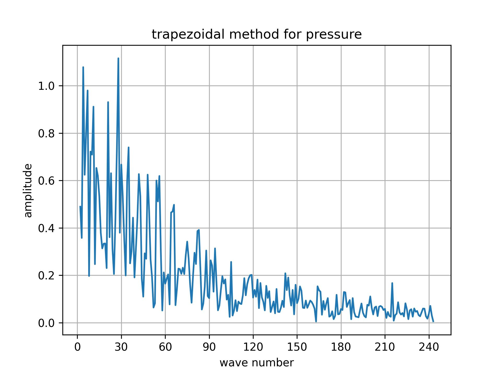
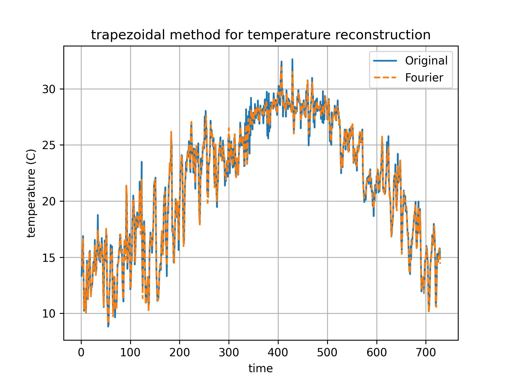
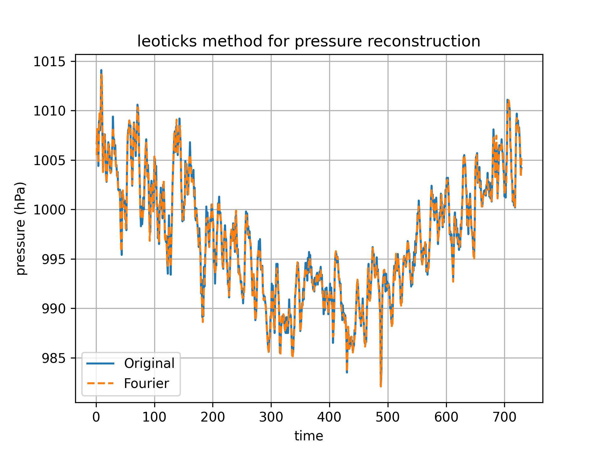

# 1121 天氣學與天氣分析（下） --- 作業四

> - 姓名：林群賀
> - 系級：大氣四
> - 學號：109601003

使用中大測站一年的觀測資料，並用三種不同的數值積分方法求其 Fourier series，求出各波數的係數 $(a0, a1, a2‧‧‧, an; b1, b2,‧‧‧, bn)$。

1. 求出每個波的power spectral並作圖，比較三種數值方法之結果差異與使用上的優缺點。
2. 計算power最大的前五個主波之振幅、相位與日期。
3. 繪出年週期與半年周期的圖形。

**資料檔說明**

- `Ps.dat` (地面氣壓，時間一年，每日2筆資料)
- `T.dat` (地面溫度，時間一年，每日2筆資料)

### Fourier Series


### Hand in 
- 計算與繪圖程式
- Power spectral 圖 2 x 3 = 6 張
- 週期圖 2 x 3 = 6 張
- 文字報告（包含第一、第二小題）


## 執行程式碼
```shell
$ python3 main.py
```

## (一) 求出每個波的 power spectral 並作圖，比較三種數值 方法之結果差異與使用上的優缺點

| method | Pressure | Temperature |
| :----: | :------: | :---------: |
| Trapezoidal |  |        |
| Simpson |  |        |
| Leoticks |  |        |

1. 梯形法在計算時沒有資料點數量的限制，而辛普森法和 Leo Ticks 方法需要資料點為 0 到 2N 中奇數個，且區間為偶數個。
2. 梯形法相較於後兩者有較大的誤差，而辛普森法和 Leo Ticks 方法的誤差相近。
3. 在計算相位時，如果結果為正值，會減去 2pi 以避免出現負數的日期。
4. 辛普森法對於曲線變化較大的函數有更好的逼近能力和較高的精確度，特別對於凹凸型的函數，在某些情況下需要更小的子區間才能達到相同的準確度，而梯形法可能需要更多子區間。
5. 梯形法較為簡單易懂、實作容易，適用於一般函數；而辛普森法則更適用於平滑且具有較高次導數的函數。

## (二) 計算 power 最大的前五個主波之振幅、相位與日期

### 溫度

#### Trapezoida
| 項目／波數 | 震幅 | 相位 | 日期 |
| :--------: | :--: | :--: | :--: |
| 1 | 7.27 | -0.45 | 27 |
| 5 | 0.75 | -0.3 | 1 |
| 2 | 0.74 | -0.05 | 1 |
| 4 | 0.58 | -5.42 | 20 |
| 41 | 0.57 | -0.63 | 1 |

#### Simpson
| 項目／波數 | 震幅 | 相位 | 日期 |
| :--------: | :--: | :--: | :--: |
| 1 | 7.18 | -0.45 | 27 |
| 5 | 0.75 | -0.04 | 1 |
| 2 | 0.75 | -0.26 | 1 |
| 4 | 0.59 | -5.39 | 20 |
| 41 | 0.58 | -0.64 | 1 |

#### Leo Ticks
| 項目／波數 | 震幅 | 相位 | 日期 |
| :--------: | :--: | :--: | :--: |
| 1 | 7.19 | -0.45 | 27 |
| 5 | 0.75 | -0.04 | 1 |
| 2 | 0.75 | -0.27 | 1 |
| 4 | 0.59 | -5.39 | 20 |
| 41 | 0.58 | -0.64 | 1 |

### 壓力

#### Trapezoida
| 項目／波數 | 震幅 | 相位 | 日期 |
| :--------: | :--: | :--: | :--: |
| 1 | 7.51 | -0.2 | 12 |
| 28 | 1.12 | -1.12 | 1 |
| 4 | 1.08 | -0.32 | 2 |
| 7 | 0.98 | -0.35 | 1 |
| 21 | 0.93 | -5.56 | 1 |

#### Simpson
| 項目／波數 | 震幅 | 相位 | 日期 |
| :--------: | :--: | :--: | :--: |
| 1 | 7.48 | -0.2 | 12 |
| 28 | 1.11 | -1.15 | 1 |
| 4 | 1.05 | -0.32 | 2 |
| 7 | 0.97 | -0.34 | 1 |
| 21 | 0.94 | -1.01 | 1 |

#### Leo Ticks
| 項目／波數 | 震幅 | 相位 | 日期 |
| :--------: | :--: | :--: | :--: |
| 1 | 7.49 | -0.2 | 12 |
| 28 | 1.11 | -1.14 | 1 |
| 4 | 1.06 | -0.32 | 2 |
| 7 | 0.97 | -0.35 | 1 |
| 21 | 0.93 | -1.01 | 1 |

## (三) 繪出年週期與半年周期的圖形

| method | Pressure | Temperature |
| :----: | :------: | :---------: |
| Trapezoidal |  |        |
| Simpson |  |        |
| Leoticks |  |        |


**透過傅立葉還原：**

| method | Pressure | Temperature |
| :----: | :------: | :---------: |
| Trapezoidal |  |        |
| Simpson |  |        |
| Leoticks |  |        |