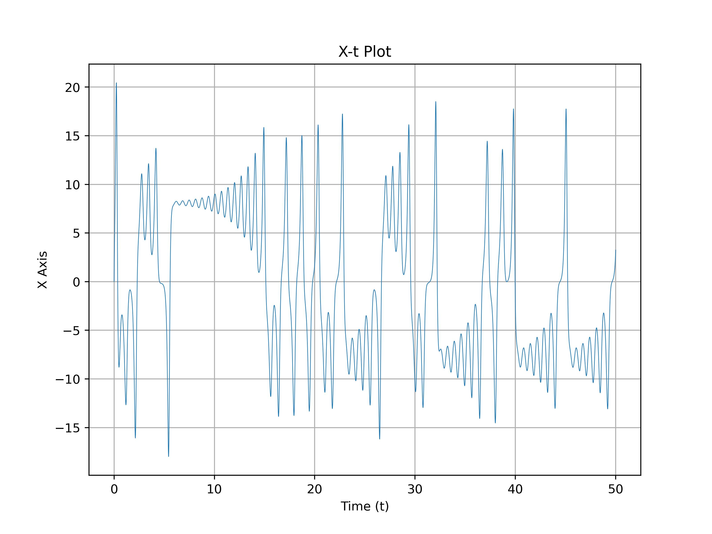
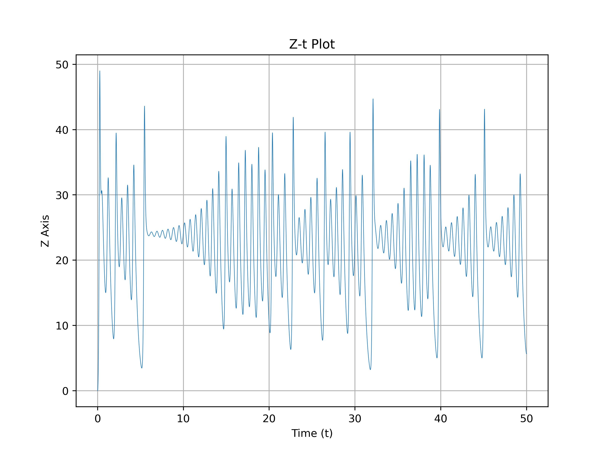
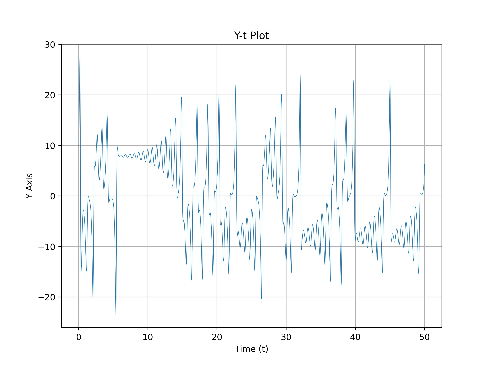
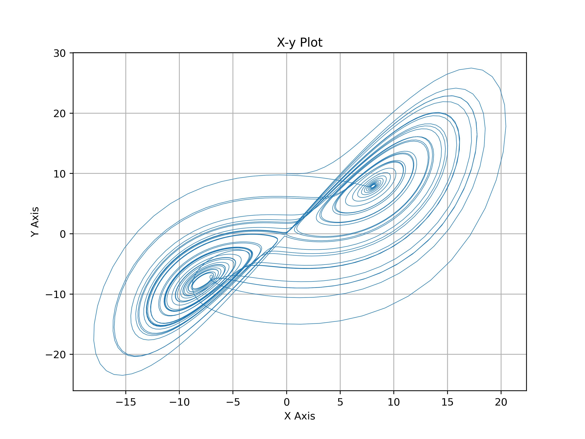
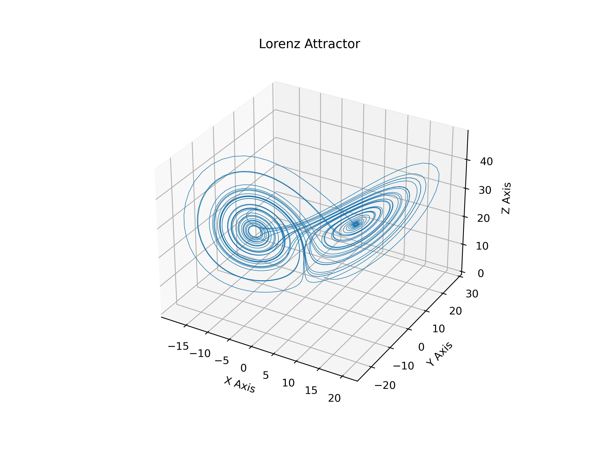

# 1121 天氣學與天氣分析（下） --- 作業五

> - 姓名：林群賀
> - 系級：大氣四
> - 學號：109601003

## 執行程式碼
```shell
$ python3 main.py
```

## (一) 分別畫出 `x-t plot, x-z plot, z-t plot, z-y plot, y-t plot, and x-y plot` 共 6 張圖

| x-t plot | x-z plot | z-t plot |
| :---: | :----: | :----: |
|  |  |  |

| z-y plot | y-t plot | x-y plot |
| :----: | :----: | :----: |
|  |  |  |


**3D Lorenz Attractor**

<!--  -->


## (二) 藉由 lorenz 方程討論數值積分非線性方程時出現的問題，對數值天氣預報會有甚麼問題？

當處理數值積分的非線性方程時，Lorenz 方程呈現了混沌行為，即微小的初始條件變化可能會導致系統行為的巨大變化。這種對初始條件極度敏感的性質被稱為混沌敏感性。對於數值模擬來說，混沌現象可能產生以下問題：

1. 數值不穩定性： 由於混沌性質，系統對初始條件微小變化極度敏感，這可能使得數值積分變得不穩定，導致模擬結果的不確定性。
2. 長期預測的不確定性： 由於混沌效應，長期的天氣預報可能變得極其難以精確預測。微小誤差可能在模擬開始後迅速擴大，造成預測結果與實際天氣出現巨大的差異。
3. 計算成本增加： 處理混沌系統的數值積分通常需要更高的計算精度和更小的時間步長，這將增加模擬的計算成本。
4. 數值耗散和離散化效應： 在數值模擬中，經常需要對Lorenz 方程進行離散化處理，這可能導致能量在模擬中的遺失，即數值耗散。
5. 模型不確定性： Lorenz 方程本身是一個簡化的模型，無法涵蓋所有大氣系統的複雜性。這種簡化可能導致模型的不確定性，進一步增加天氣預報的不確定性。

## 程式碼

### Import
```python
import os
import matplotlib.pyplot as plt
import numpy as np

os.makedirs(
    f"./imgs/",
    exist_ok=True
)
```

### Lorenz 方程
```python
def lorenz(
        xyzth, 
        theta, 
        s=10., 
        r=24.74, 
        b=2.6666667, 
        f=2.5
    ) -> np.array:

    x, y, z = xyzth
    x_dot = s * (y - x) + f * np.cos(theta)
    y_dot = r * x - y - x * z + f * np.sin(theta)
    z_dot = x * y - b * z

    return np.array(
        [x_dot, y_dot, z_dot]
    )

pi = np.pi
dt = 0.01
num_steps = 5001
theta = 45 / 180 * np.pi
xyzs = np.empty((num_steps + 1, 3))
xyzs[0] = (0., 10., 0.)

for i in range(num_steps):
    theta = theta + pi * dt / 180
    xyzs[i + 1] = xyzs[i] + lorenz(xyzs[i], theta) * dt
```

### Plot
```python
# Plot 3D Lorenz Attractor
fig = plt.figure(figsize=(8, 6), dpi=400)
ax = fig.add_subplot(111, projection='3d')
ax.plot(*xyzs.T[0:3], lw=0.5)
ax.set_xlabel("X Axis")
ax.set_ylabel("Y Axis")
ax.set_zlabel("Z Axis")
ax.set_title("Lorenz Attractor")
plt.savefig("./imgs/lorenz_attractor_3d.jpg")
plt.close()

# Plot X-t
plt.figure(figsize=(8, 6), dpi=400)
plt.plot(dt * np.arange(num_steps + 1), xyzs[:, 0], lw=0.5)
plt.grid("--")
plt.xlabel("Time (t)")
plt.ylabel("X Axis")
plt.title("X-t Plot")
plt.savefig("./imgs/x_t_plot.jpg")
plt.close()

# Plot X-z
plt.figure(figsize=(8, 6), dpi=400)
plt.plot(xyzs[:, 0], xyzs[:, 2], lw=0.5)
plt.grid("--")
plt.xlabel("X Axis")
plt.ylabel("Z Axis")
plt.title("X-z Plot")
plt.savefig("./imgs/x_z_plot.jpg")
plt.close()

# Plot Z-t
plt.figure(figsize=(8, 6), dpi=400)
plt.plot(dt * np.arange(num_steps + 1), xyzs[:, 2], lw=0.5)
plt.grid("--")
plt.xlabel("Time (t)")
plt.ylabel("Z Axis")
plt.title("Z-t Plot")
plt.savefig("./imgs/z_t_plot.jpg")
plt.close()

# Plot Z-y
plt.figure(figsize=(8, 6), dpi=400)
plt.plot(xyzs[:, 2], xyzs[:, 1], lw=0.5)
plt.grid("--")
plt.xlabel("Z Axis")
plt.ylabel("Y Axis")
plt.title("Z-y Plot")
plt.savefig("./imgs/z_y_plot.jpg")
plt.close()

# Plot Y-t
plt.figure(figsize=(8, 6), dpi=400)
plt.plot(dt * np.arange(num_steps + 1), xyzs[:, 1], lw=0.5)
plt.grid("--")
plt.xlabel("Time (t)")
plt.ylabel("Y Axis")
plt.title("Y-t Plot")
plt.savefig("./imgs/y_t_plot.jpg")
plt.close()

# Plot X-y
plt.figure(figsize=(8, 6), dpi=400)
plt.plot(xyzs[:, 0], xyzs[:, 1], lw=0.5)
plt.grid("--")
plt.xlabel("X Axis")
plt.ylabel("Y Axis")
plt.title("X-y Plot")
plt.savefig("./imgs/x_y_plot.jpg")
plt.close()
```
