# 天氣學分析結報 (2023/10/11 - 2023/10/17)

> 組別：第五組  
> 分析日期：2023/10/11 - 2023/10/17  

**組員以及工作分配**

| 學號 | 班級 | 姓名 | 工作內容 |
| :---: | :---: | :---: | :---: |
| 109601003 | 大氣四 | 林群賀 | 一週、預報空污、結報整理 |
| 109601006 | 大氣四 | 葉少彬 | 一週、預報天氣分析 |
| 109601202 | 大氣四 | 陳霈娟 | 一週、預報天氣分析 |

**Table of Contents**
- [天氣學分析結報 (2023/10/11 - 2023/10/17)](#天氣學分析結報-20231011---20231017)
  - [Overview](#overview)
    - [高壓](#高壓)
    - [溫度](#溫度)
    - [風向風速](#風向風速)
    - [空品](#空品)
    - [降水](#降水)
  - [10/11~14](#101114)
    - [天氣圖](#天氣圖)
    - [10/14](#1014)
    - [日累積雨量](#日累積雨量)
    - [溫度分布圖](#溫度分布圖)
    - [空氣品質](#空氣品質)
  - [10/15~10/17](#10151017)
    - [10/17](#1017)
    - [10/15~10/17 雨量](#10151017-雨量)
    - [三巴颱風](#三巴颱風)
    - [空氣品質](#空氣品質-1)
  - [預報](#預報)
    - [降雨量](#降雨量)
    - [高低溫](#高低溫)
    - [空品預報](#空品預報)
  - [QA Part](#qa-part)
    - [11~13 號水氣差滿多的原因](#1113-號水氣差滿多的原因)
    - [21 至 22 號預報上有迎風面降雨 22 相對減弱，除了東北風偏弱轉東風，還有其他可能性讓水氣往東南方偏的原因](#21-至-22-號預報上有迎風面降雨-22-相對減弱除了東北風偏弱轉東風還有其他可能性讓水氣往東南方偏的原因)
    - [10/17 的降水在台灣東南部山區雷達回波看起來有帶狀雲系是否跟南亞高壓有關](#1017-的降水在台灣東南部山區雷達回波看起來有帶狀雲系是否跟南亞高壓有關)
    - [三巴颱風水氣從南海移項台灣，是受到何種影響可以看出水氣移向台灣。](#三巴颱風水氣從南海移項台灣是受到何種影響可以看出水氣移向台灣)
    - [十三十四號有個槽前槽後的關係，水氣影響](#十三十四號有個槽前槽後的關係水氣影響)
  - [總結](#總結)

## Overview
本周環境整體真的是非常穩定，全部處於東北風主導的環境，我們將本周分別分為兩段時間，分別是 10/11~14 延續上一周的東北季風並且持續減弱，且 14 日當天可以看到氣壓值在低點，可以對應道等下天氣圖，14 日位於槽前。並且可以看到 10/15~10/16 高壓東移，東北季風加強，氣壓以及風速都有有上升，並且在 10/17 高壓逐漸出海。

| 溫度濕度 | 風向風速 | 氣壓與降雨 | 輻射量與比濕 |
|:---:|:---:|:---:|:---:|
|  |  | 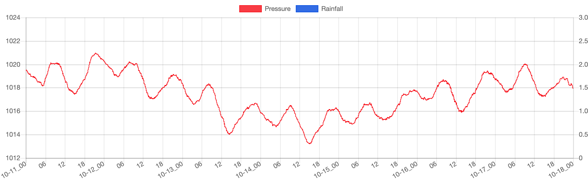 | 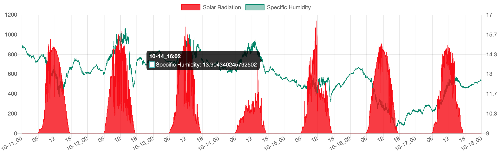 |

### 高壓

| 日期 | 10/11~10/12 | 10/13~10/15 | 10/16 | 10/17 |
| :---: | :---: | :---: | :---: | :---: |
| 總結 | 在較高緯度東移 | 東移 | 逐漸出海 | 出海 |

### 溫度

| 日期 | 10/11~10/15 | 10/16~10/17 |
| :---: | :---: | :---: |
| 總結 | 清晨西半部沿海輻射冷卻，整體日夜溫差較大 | 受南海低壓影響，西南部雲量增加白天最高溫下降 |

### 風向風速
| 日期 | 10/11~10/14 | 10/15~10/16 | 10/17 |
| :---: | :---: | :---: | :---: |
| 總結 | 東北風 | 東風 | 東北→東風 |

### 空品
| 日期 | 10/11~10/13 | 10/14 | 10/15~10/17 |
| :---: | :---: | :---: | :---: |
| 總結 | 西南部位於尾流弱風區空氣品質較差 | 南部處尾流弱風區較差 | 境外汙染移入 |

### 降水
| 日期 | 10/11 | 10/12~10/16 | 10/15~10/17 |
| :---: | :---: | :---: | :---: |
| 總結 | 迎風面降水及西南部對流降水 | 西南部對流及東部山區零星降水 | 西南部零星降水 |

## 10/11~14

### 天氣圖

我們先看到 10/11~14 日的地面天氣圖以及 500hPa 天氣圖，可以看到 500hPa 槽線掠過台灣北方，由於槽線後方牽引的高壓，所以台灣這幾日主要都為東北季風的天氣，可以看到槽線位置以及高壓主要位置還是離台灣稍有距離，而且高壓中心的氣壓值都還是偏低的，所以台灣的東北季風也因此算是相當弱的。 

| 地面天氣圖 | 500 hPa 天氣圖 |
| :---: | :---: |
| 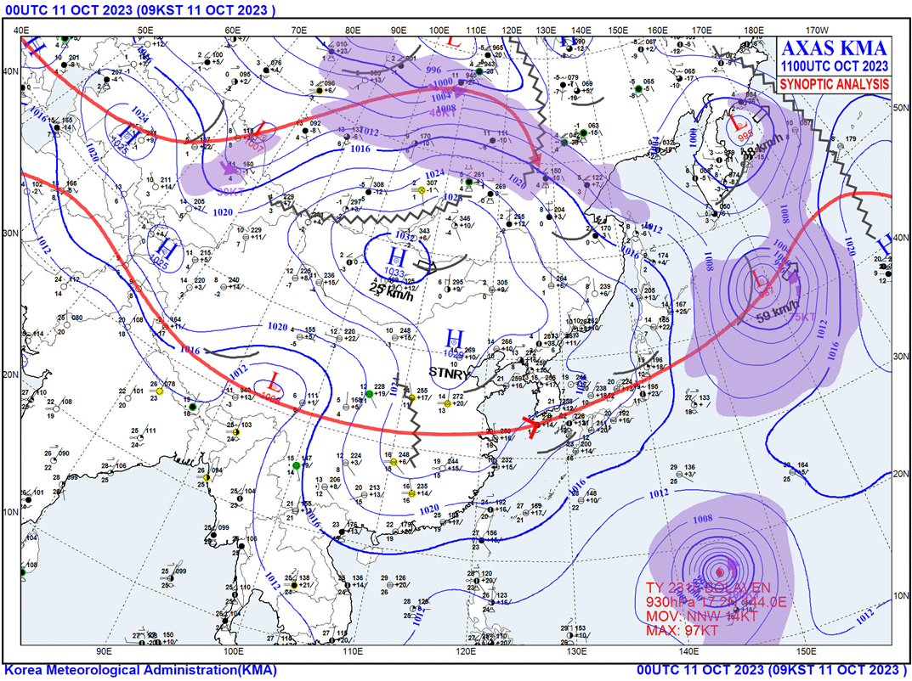 |  |

### 10/14 

| 探空圖 | 500 hPa 天氣圖 |
| :---: | :---: |
| 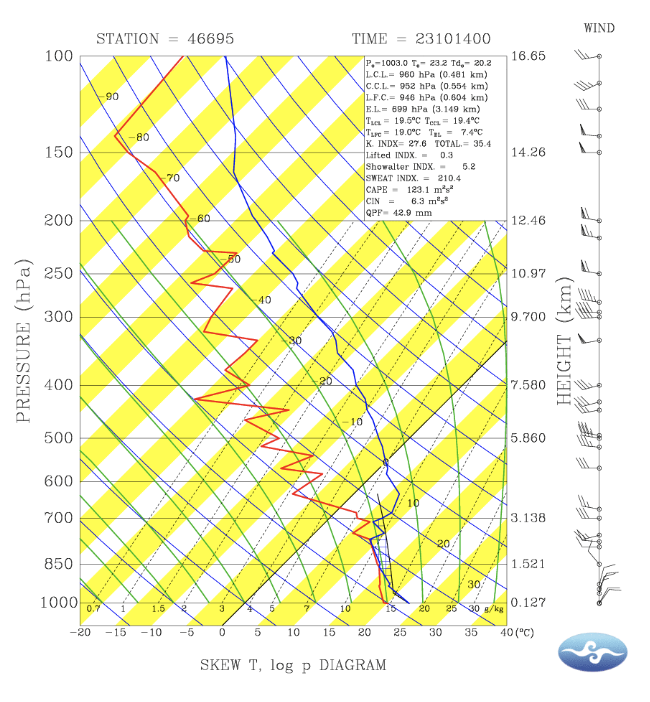 | 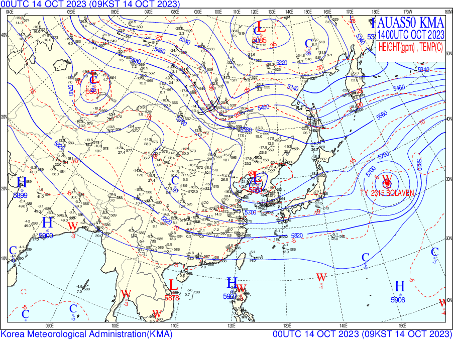 |

我們可以看到 14 號當天早八的探空圖，我們是採用彭佳嶼的資料，我們可以看到底層大氣水氣相當充足，且此時台灣位於槽前，整體環境較不穩定雲量較多，因此導致 14 號中大測站輻射量較少所以氣溫也其他日低。

 
 
 
 
 
 
 
 

### 日累積雨量

| 10/11 | 10/12 | 10/13 | 10/14 |
| :---: | :---: | :---: | :---: |
| 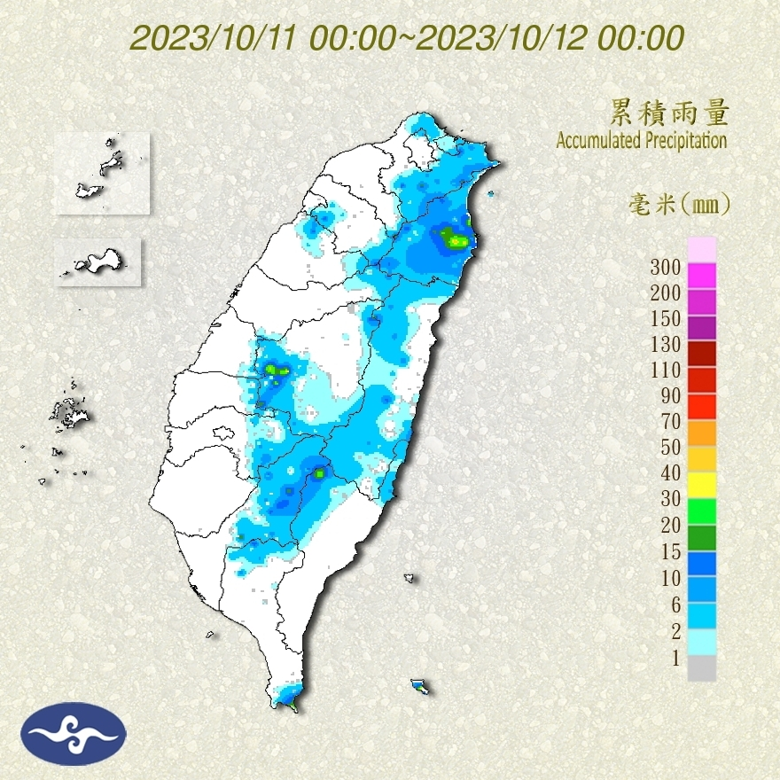 | 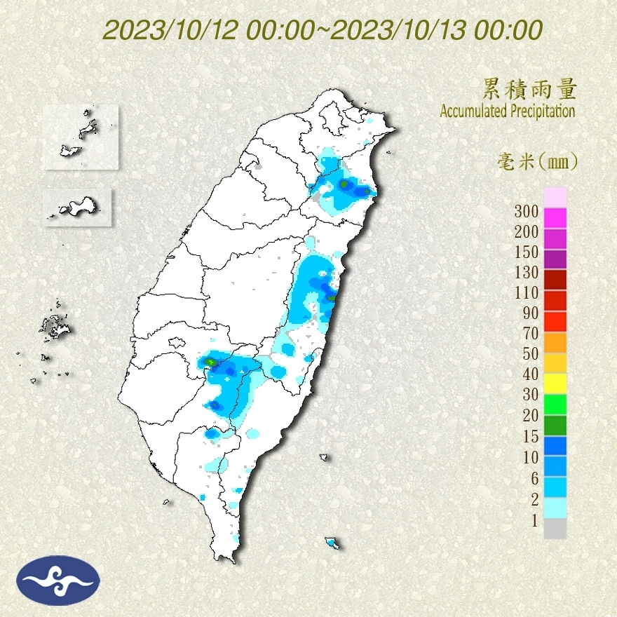 | 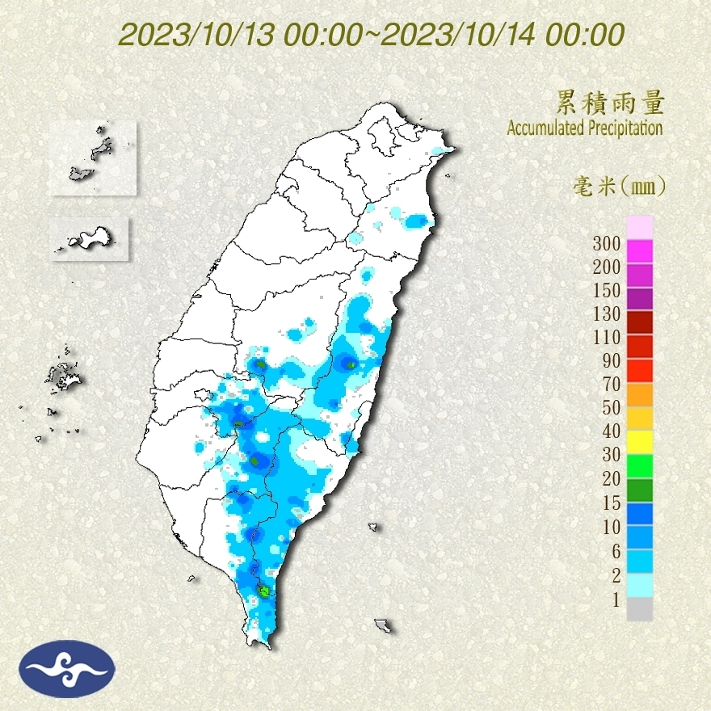 | 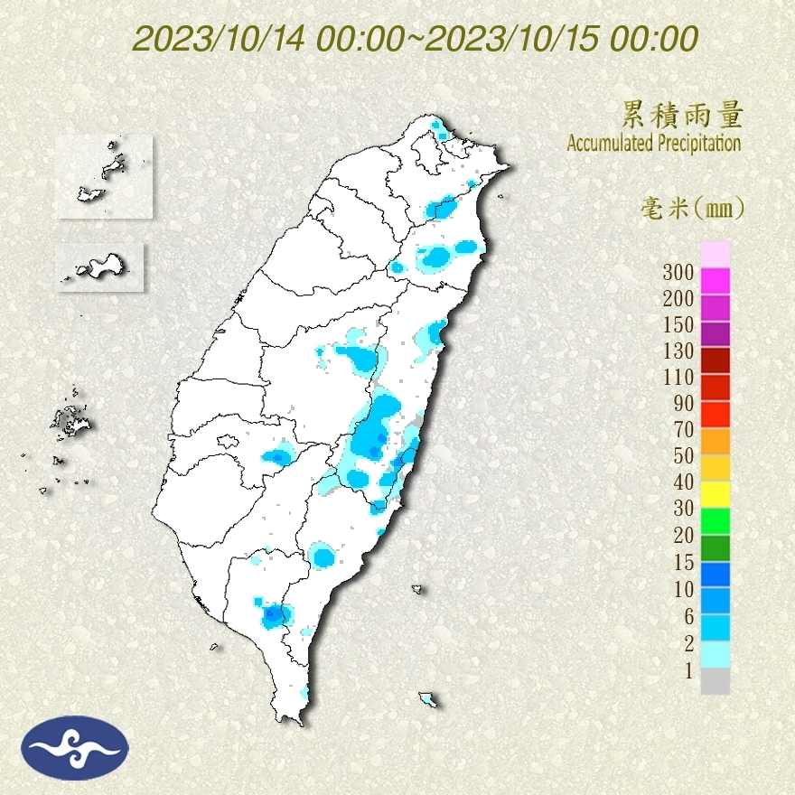 |

這四天的日累積雨量，延續前一波颱風殘存的水氣量，11 日當天的迎風面降水還是比較明顯的，我們看到後面幾天，迎風面降水明顯減少，而中南部則主要皆為山區的午後對流，各地降水量都不多，大致都小於 10mm，至於為甚麼會迎風面降水會減少這麼多，我們可以從風向、風速還有水氣來討論的話，由於風速風向都沒有明顯的變化，所以我們從水氣來討論，左下圖是 850hPa 的相對濕度及流場圖，我們可以看到 11~13 號的水氣量有顯著的下降，然後另外兩張是彭佳嶼的探空協溫圖，可以看到水氣量確實在 11~13 日也有明顯的變化，底層水氣量的減少也導致迎風面降水明顯下降。

| 850 hPa 相對濕度、流場 | (10/11) 彭佳嶼的探空協溫圖 | (10/13) 彭佳嶼的探空協溫圖 |
| :---: | :---: | :---: |
| 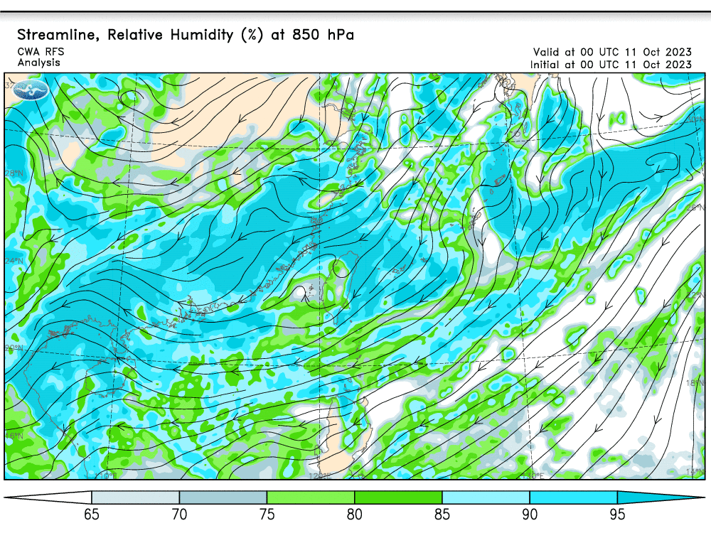 | 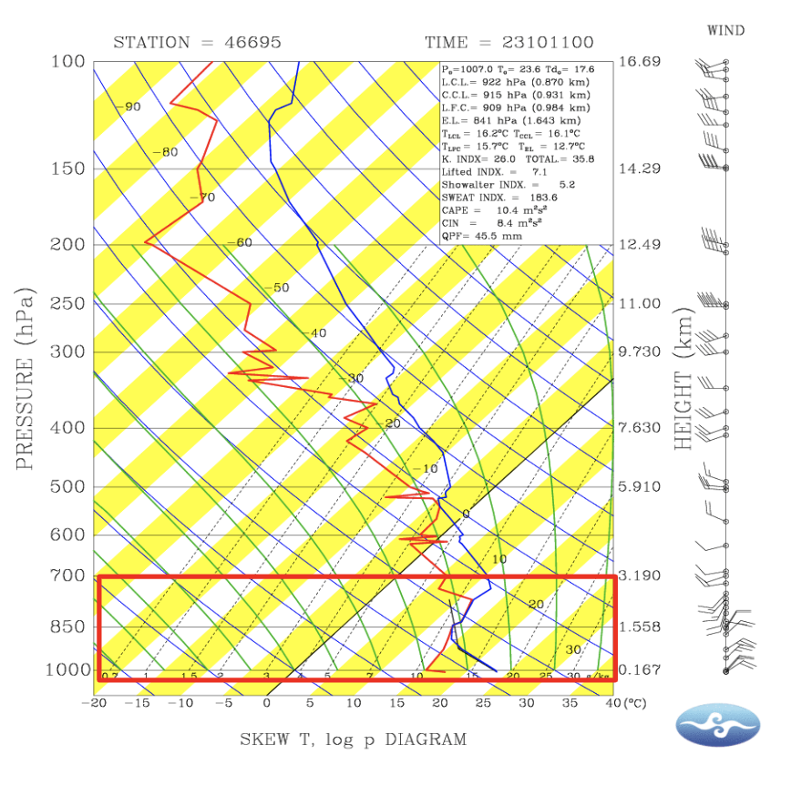 |  |

中南部山區午後對流我們對照雷達回波以及 CAPE 值也確實可以看出，西南部 CAPE 值較高，同時地面的風速較弱，所以較為適合對流發展。

| 雷達回波 | CAPE值 |
|:-:|:-:|
|  |  |

 
 

### 溫度分布圖

我們可以從溫度分布圖看出東北風的強度變弱，雖然迎風面的整體溫度有稍微下降，但西南部地區整體氣溫都還是偏高的，但我們主要要討論的是可以看到竹苗一帶的清晨最低溫明顯比較低，其實主要是輻射冷卻的影響，我們從真實色衛星雲圖，看竹苗一代雲量較少以及地面風場風速也非常的小，以上都滿足輻射冷卻的條件，所以才會看到最低溫幾乎清一色都在竹苗一帶。

| 06:00 | 14:00 |
|:-:|:-:|
|  | 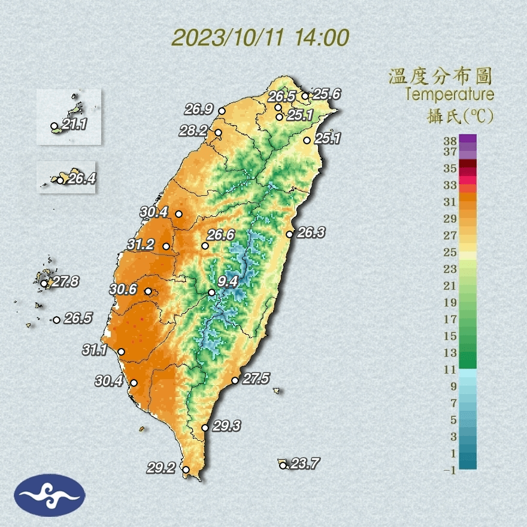 |

### 空氣品質
本周主要都是受東北風影響，可以看到東北方整體空氣品質還是較佳的，但西南部處於尾流弱風區，擴散條件較差，然後由於東北風逐漸減弱，所以我們也可以看到空氣品質較差的區域有逐漸北移。

但 14 日，我們可以看到境外移入汙染物，透過富貴角的 PM2.5 的時序圖可以看到，晚上六點的時後 PM2.5 的濃度大量上升，從 14 號下半天開始，台灣整體空氣品質持續受到顯著的境外移入影響。

| 11~13 號 | 14 號境外移入 |
|:-:|:-:|
| 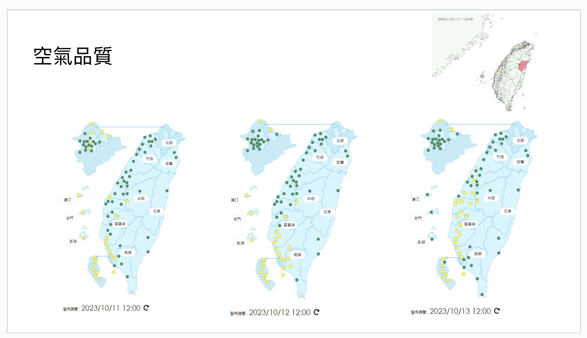 |  |

## 10/15~10/17

| 地面天氣圖 | 500 hPa 天氣圖 |
| :---: | :---: |
|  |  |

首先看到 500 百帕天氣圖，原先14號在較北邊的槽線移動的較快，所以在天氣圖中會看到15號有兩條較相鄰的槽線接連東移，所以 15 號到 16 號主要受東北風影響，到了 17 號地面高壓出海，使地面風場轉東風，後方的這條槽線就是主要影響週五即將南下的東北季風的槽線，後面會在預報看到更詳細的動向。另外在在南海部分 15 號時是有一個低壓存在，並且在 17 日的時候轉為熱帶性低氣壓。

### 10/17 

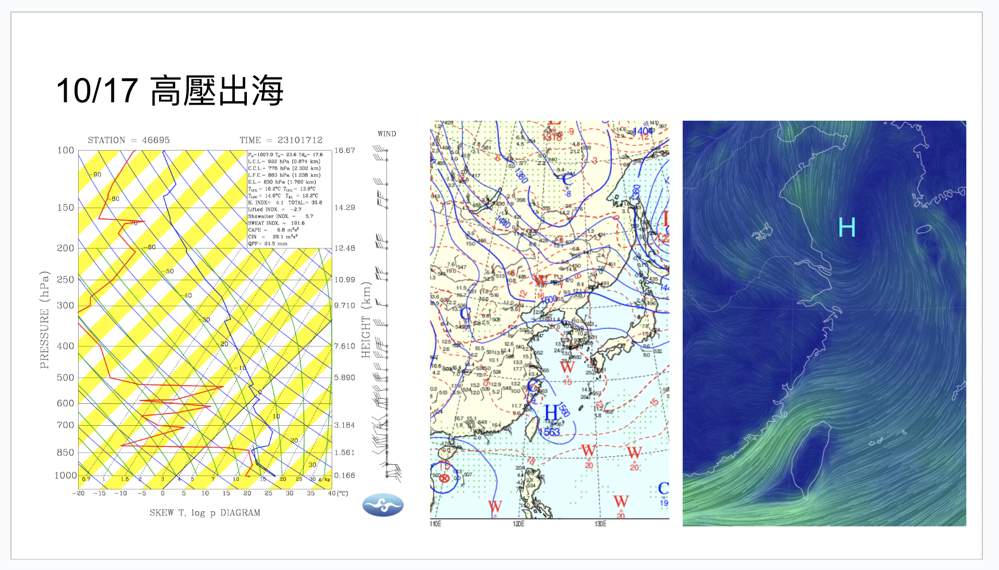

由於地面高壓在 17 出海，從彭佳嶼探空圖可以看到底層開始吹東風，高壓出海台灣也開始會受到高壓迴流的影響，整體環境風場逐漸轉為東風，就是昨天跟今天主要的天氣，從探空圖中可以看到有明顯的沉降逆溫，判斷應該是有高壓所造成的，我們看 850hPa 天氣圖也的確符合。

### 10/15~10/17 雨量

前兩日主要為東部山區零星降水以及西南部，雖然東北風風速有稍微增強，但透過前一張彭佳嶼探空圖也可以得知，水氣量並沒有很充足，所以迎風面也沒有明顯的降水，僅有東部山區出現零星陣雨，但 10/17 日的降水集中在南部主要是因為前面看到的低壓。

不過整體水氣量不多且熱力作用較有限，因此降雨情況影響不大，多局限於山區，高溫普遍仍有 30 度左右，而在局部空曠的沿海或平地區低溫則有 19-22 度出現，日夜溫差較大。而迎風面的北部及東半部則為多雲或陰的天氣，早晚會有些涼意，局部地區也將有地形降雨機會，不過期間仍有些微小變化，如今日整體水氣量不多，故降雨還算零星，而明天東北季風風速略有些增強並前緣挾帶些水氣，雖然降雨區再有些擴大，不過累積降雨量可能都不是太多，而且很快地下週一二隨著乾空氣移入、水氣減少，迎風面的降雨又再更為零星了。

### 三巴颱風

越南東方的低壓，10/17 早上正式宣布為熱帶性低氣壓，並且在 10/18 日形成第 16 號颱風三巴颱風，路徑上主要往海南島前進對台灣沒有直接影響，但低壓的水氣量會由中高層的西南風逐漸帶來台灣，導致台灣中南部中層水氣量充沛。

這個颱風的生成可以從流場圖看到有來自赤道南方的東南信風跨赤道流的西南信風與東北信風輻合，使空氣被抬升，加上南海的海溫在26度以上是有利颱風發展的條件。

不過由於南海地區颱風發展的空間有限，在行程後馬上會碰觸到陸地，所以通常在南中國海形成的颱風強度都較弱，氣象署預測在 36 小時內就會轉成熱帶性低氣壓。

從 17 日早上八點的屏東探空圖可以看到 500 到 700 百帕環境是比較溼的此外也可以看到這個高度區間吹西南風，加上雷達回波圖可以發現回波主要從西南方向東方傳送，所以我們推估 17 號的降水主要是受到越南東方的熱帶性低氣壓外圍中高層的環流影響造成的降雨。

| 屏東探空圖 | 雷達回波圖 |
|:-:| :-: |
|  | 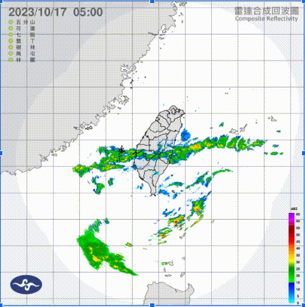 |

溫度分布的部分，北部隨著東北風的減弱，從 15 號開始緩慢升溫，而西南部 15~17 日同樣由於越南東方的低氣壓所帶來的水氣，整體西南部地區的雲量有明顯的上升，從真實色衛星雲圖可以看到雲層變厚，另外從色調強化圖也可以發現雲高變高了，所以 15 日以及 17 日的雲量有明顯差異，因此也導致最高溫的部分，在西南部地區有持續下降的情形，大約差了兩度。

| 衛星雲圖 & 色調強化雲圖 | 溫度變化 |
|:-:|:-:|
|  | 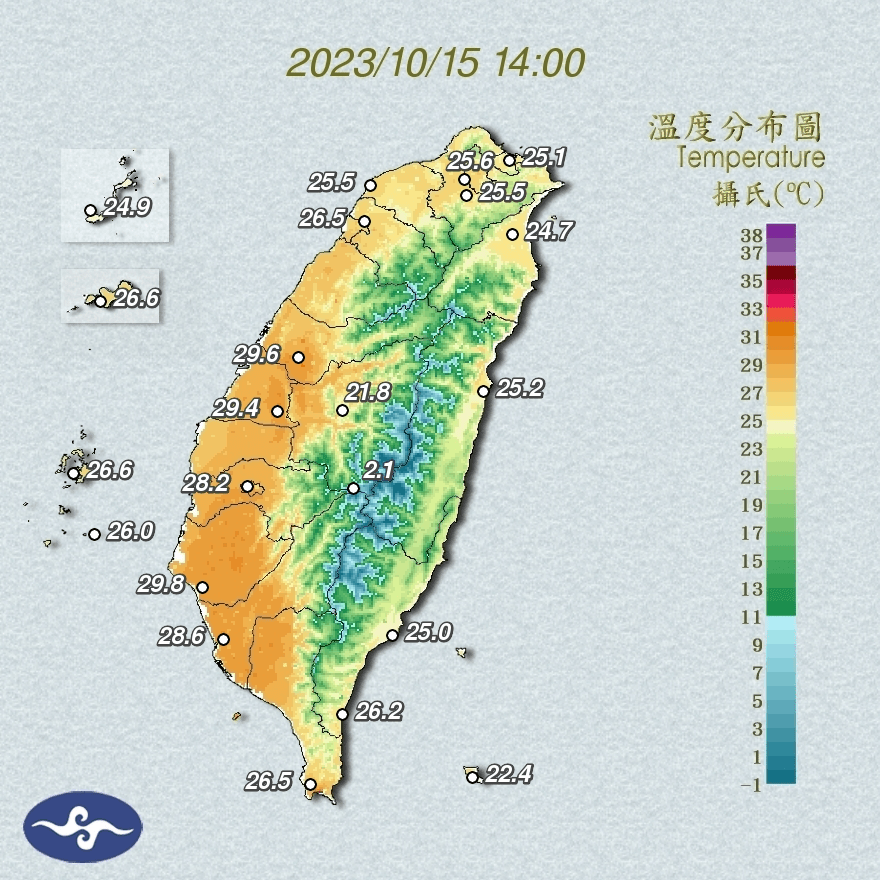|

### 空氣品質

| 15 ~ 17 空品 | 境外移入 |
|:-:|:-:|
| 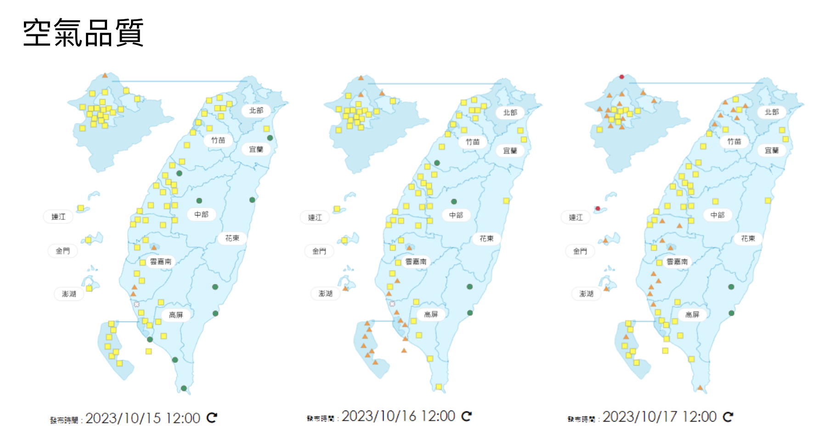 |  |

三日由於境外移入的影響，其中富貴角測站最明顯，整體空氣品質自 14 日後境外移入都受到明顯的影響，17 日由於高壓逐漸出海東北風減弱，風向逐漸轉為東風，可以看到整體西半部的空氣品質又更加糟，且背風側擴散條件最差的區域由台南逐漸移往嘉義。

三日隨高壓接近並且出海，同時汙染物隨東北季風帶來台灣同時可以看到汙染物持續堆積並且在 17 日的迎風面情況最嚴重。

 
 
 
 
 

## 預報

> 日期：10/18-22  
> 模式：EC & WRFD  
> 初始場：10/17 00z

這張是 500 百帕高度場以及地面氣壓場，shaded 的是地面氣壓，藍色的 H 指的是地面高壓位置，18 號台灣北方的高壓出海後，形成高壓迴流的天氣型態，天氣趨於穩定，可以看到後面有一條新的槽線生成，我們推測這一波東北季風會比前一波更為強勁，相較出海的這個高壓中心值是 1024，後面新的高壓中心值是 1034，隨著槽線的東移，預估東北季風從禮拜五的下半天開始報到。

因此我們預估 21 號會是這波東北季風影響最劇烈的時候，槽線會在周五到周六通過台灣北邊，高壓隨著槽線東移，在 22 號出海，再轉為高壓迴流的天氣型態。

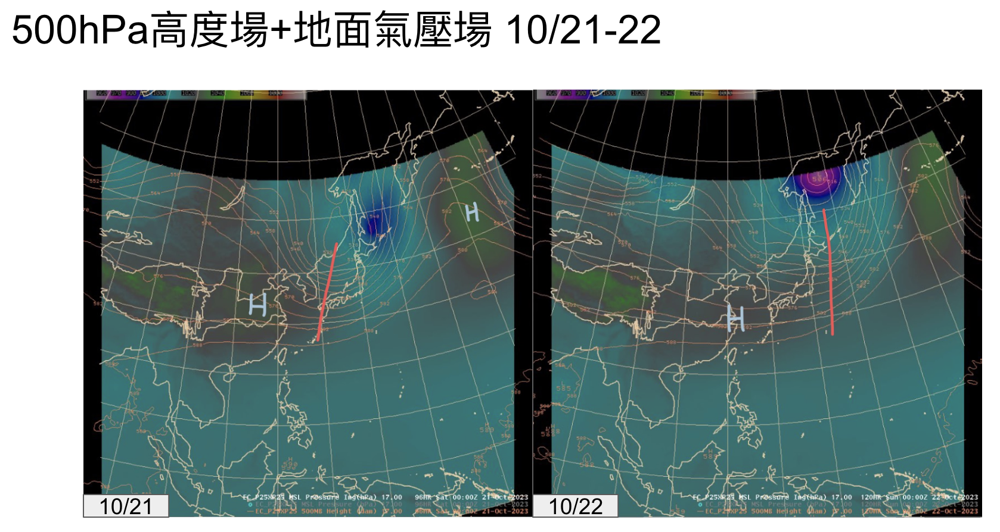

受到西南方的三巴颱風影響，台灣西南部仍有水氣存在，同時北方高壓出海，可以看到日本一帶的水氣同樣乾燥許多，整體比較乾燥的空氣隨著西風帶有往東移的趨勢。

10/20 早上預估東北季風尚未報到，且此時台灣水氣量和前兩日相近，此時較潮濕的水氣集中在大陸地區，但 10/21 東北季風影響台灣最劇烈，台灣迎風面 700hPa 混和比有明顯上升，預估在 21 日東北方出現較強降水，22 日整體迎風面還是非常潮濕。
透過中心氣壓值跟水氣量我們推測這波東北季風在東北部會有比前一波更明顯的迎風面降雨與降溫。

### 降雨量

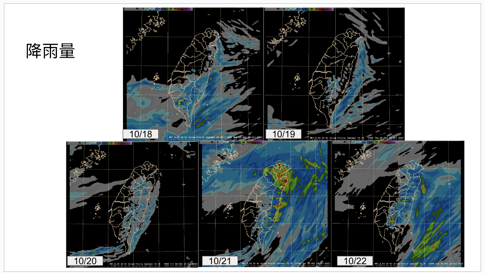

由天氣圖可以看到高壓逐漸出海，台灣轉為偏東風的環境，東部的山區迎風面會出現短暫陣雨的情況，中南部山區受到南方低壓所帶來的水氣影響，也有降水的可能性，一值來到週五下一波東北季風報到，但可以前一張 700hPa 混和比中看出，水氣量還沒有明顯增加，所以周五的降水還不會這麼明顯，但 21 號我們預估東北季風影響最劇烈的時候，迎風面吹北北東風所以在北部有較明顯降雨，再來 10/22 風向轉向東北風至東豐，東部地區會持續出現降水的情形。

### 高低溫

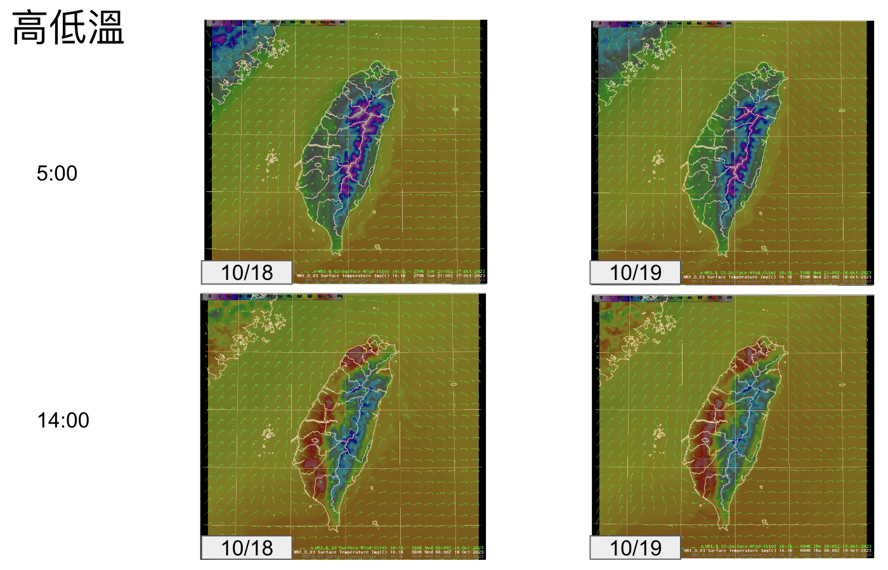

以上為 10/18~10/19 早上 5 點以及下午 2 點的氣溫，前兩日仍以高壓迴流環境風場以東風為主，弱綜觀系統，全台溫度偏高中南部高溫可到 30 度左右。

清晨溫度與前兩天大致相同，但槽線掠過台灣北方，所以從 21 號下半天開始東北季風增強，可以看到北部迎風面的最高溫明顯下降，由前一天的 27-29 度下降到 22 度，清晨平地低溫為 18 度，一路到 10/22 高壓逐漸出海北部氣溫才開始回升。在風速方面西部沿海會出現較強的風。

 

### 空品預報

前兩日因高壓出海環境吹東風，所以西半部違背封側，擴散條件較差，加上弱綜觀系統使天氣較為晴朗，午後光化作用明顯，導致西半部空氣品質較差，10/20 開始東北季風開始增強，北部迎風面風速增加，空氣品質較前兩日有改善，21 日東北風影響最劇烈，整體南部依舊處於尾流弱風區，空氣品質依舊是比較差的。

## QA Part

### 11~13 號水氣差滿多的原因

透過我們當初比對的水氣量 10/08 是小犬颱風，用以下降水量的圖，我們可以看出小犬颱風過後還是有大量水氣量殘留，11 號東北風吹下來降水量是相對豐沛的，之後隨東北風減弱，整體帶過來的水氣量減少

### 21 至 22 號預報上有迎風面降雨 22 相對減弱，除了東北風偏弱轉東風，還有其他可能性讓水氣往東南方偏的原因

高壓剛出海位置是相對台灣的偏北風儘管台灣當時有吹東北風，但還是偏北，可以說是北北東風，我們可以看到高壓逐漸出海，降水主要集中在北部。

### 10/17 的降水在台灣東南部山區雷達回波看起來有帶狀雲系是否跟南亞高壓有關

主要判斷由屏東的探空圖，中高層水氣是比較充足，加上水氣充足。

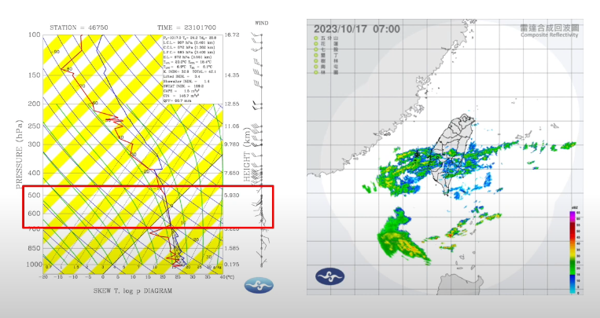

### 三巴颱風水氣從南海移項台灣，是受到何種影響可以看出水氣移向台灣。

從我們看到的模式資料中，，500 ~ 700 hPa 是吹西南風。

### 十三十四號有個槽前槽後的關係，水氣影響

同樣是前一波殘存的水氣，我們也可以看出水氣隨時間減少，大上環境屬於槽前的狀態，是相對不穩定的我們也有比對探空圖的底層資料。

## 總結

這次我們為了準備這次的天氣觀測以及預報，花了較多的心思在比對不同層的關係（看探空的資料），我們也因此有了不同的收穫，期許我們能夠在未來的預報上有更多的進步。

季節的轉換，秋天的季節，北邊的系統慢慢的起來，南邊稍微慢一點，我們應多注意中緯度系統，一般的情況下，水氣大多從 900 到 800 hPa 要到 700 hPa 會有其他熱帶的擾動，另外如果有水氣，我們通常可以看到迎風面開始下雨通常在 100 到 500 公尺。

如果是冬天在看，南北溫度梯度變大，西風隨高度增強，除非有颱風我們很難看到東風，特別是 700 hPa 以上，大部分是西南季風或是西風。

