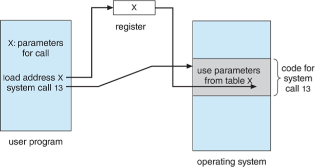
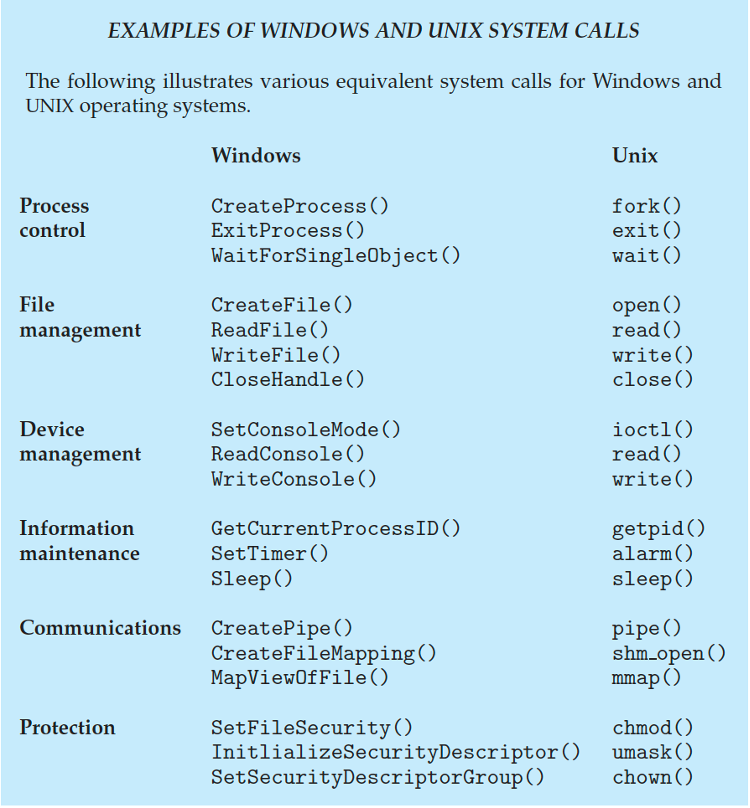
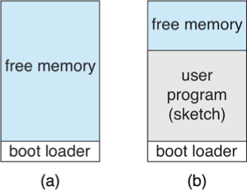
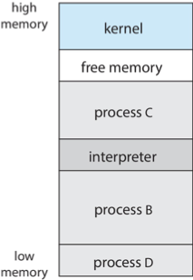

# Chapter 2:  Operating-System Structures

## 2.1 Operating-System Services

Provide an environment for execution of programs and services to programs and users.

### One set of operating-system services provides functions that are helpful to the user:
- **User Interface**: CLI, GUI, Batch, Touch Screen
- **Program Execution**: be able to load a program into memory and ensure it can run successfully or handle any errors that occur.
- **I/O Operations**: A running program may require I/O, which may involve a file or an I/O device.
- **File-system Manipulation**: Programs need to read and write files and directories, create and delete them, search them, list file Information, permission management.
- **Communications**: Processes may exchange information, on the same computer or between computers over a network or shared memmory or tgrough message passing.
- **Error detection**: OS needs to be constantly aware of possible errors.
  - May occur in the CPU and memory hardware, in I/O devices, in user program. 
  - For each type of error, OS should take the appropriate action to ensure correct and consistent computing.
  - Debugging facilities can greatly enhance the user’s and programmer’s abilities to efficiently use the system

### Another set of OS functions exists for ensuring the efficient operation of the system itself via resource sharing

- **Resource allocation**: When multiple users or multiple jobs running concurrently, resources must be allocated to each of them.
  - Many types of resources:  CPU cycles, main memory, file storage, I/O devices.
- **Logging:** To keep track of which users use how much and what kinds of computer resources
- **Protection and security:** The owners of information stored in a multiuser or networked computer system may want to control use of that information, concurrent processes should not interfere with each other
  - Protection involves ensuring that all access to system resources is controlled
  - Security of the system from outsiders requires user authentication, extends to defending external I/O devices from invalid access attempts

### Command Line Interface (CLI)

- CLI allows direct command entry
- Sometimes implemented in kernel, sometimes by systems program
- Sometimes multiple flavors implemented – shells
- Primarily fetches a command from user and executes it
- Sometimes commands built-in, sometimes just names of programs
  - If the latter, adding new features doesn’t require shell modification

### User Operating System Interface

- User-friendly desktop metaphor interface
  - Usually mouse, keyboard, and monitor
  - Icons represent files, programs, actions, etc
  - Various mouse buttons over objects in the interface cause various actions (provide information, options, execute function, open directory (known as a folder)
  - Invented at Xerox PARC
- Many systems now include both CLI and GUI interfaces
  - Microsoft Windows is GUI with CLI “command” shell
  - Apple Mac OS X is “Aqua” GUI interface with UNIX kernel underneath and shells available
  - Unix and Linux have CLI with optional GUI interfaces (CDE, KDE, GNOME)

### Touch Screen

- Touchscreen devices require new interfaces
  - Mouse not possible or not desired
  - Actions and selection based on gestures
  - Virtual keyboard for text entry
- Voice commands

### System Calls

- Programming interface to the services provided by the OS
- Typically written in a high-level language (C or C++)
- Mostly accessed by programs via a high-level Application Programming Interface (API) rather than direct system call use
- Three most common APIs are Win32 API for Windows, POSIX API for POSIX-based systems (including virtually all versions of UNIX, Linux, and Mac OS X), and Java API for the Java virtual machine (JVM)

> [!NOTE]
> the system-call names used throughout this text are generic

| Example of System Calls             | Example of Standard API         |
| ----------------------------------- | ------------------------------- |
|  |  |

#### Implementation of System Calls

- Typically, a number is associated with each system call
  - **System-call interface** maintains a table indexed according to these numbers
- The system call interface invokes the intended system call in OS kernel and returns status of the system call and any return values
- The caller need know nothing about how the system call is implemented
  - Just needs to obey API and understand what OS will do as a result call
  - Most details of  OS interface hidden from programmer by API  
    - Managed by run-time support library (set of functions built into libraries included with compiler)

#### System Call Parameter Passing

- Often, more information is required than simply identity of desired system call
  - Exact type and amount of information vary according to OS and call
- Three general methods used to pass parameters to the OS
  - Simplest:  pass the parameters in registers
    -  In some cases, may be more parameters than registers
  - Parameters stored in a block, or table, in memory, and address of block passed as a parameter in a register 
    - This approach taken by Linux and Solaris
  - Parameters placed, or pushed, onto the stack by the program and popped off the stack by the operating system
  - Block and stack methods do not limit the number or length of parameters being passed

Parameters Passing via Table:

#### Types of System Calls

| Category   | Operations |
| ---------- | ---------- |
| Process control | <ul><li>end, abort</li><li>load, execute</li><li>create process, terminate process</li><li>get process attributes, set process attributes</li><li>wait for time</li><li>wait event, signal event</li><li>allocate and free memory</li><li>dump memory if error</li><li>debugger for determining bugs, single step execution</li><li>locks for managing access to shared data between processes</li></ul> |
| File management | <ul><li>create file, delete file</li><li>open, close file</li><li>read, write, reposition</li><li>get and set file attributes</li></ul> |
| Device management | <ul><li>request device, release device</li><li>read, write, reposition</li><li>get device attributes, set device attributes</li><li>logically attach or detach devices</li></ul> |
| Information maintenance | <ul><li>get time or date, set time or date</li><li>get system data, set system data</li><li>get and set process, file, or device attributes</li></ul> |
| Communications | <ul><li>create, delete communication connection</li><li>send, receive messages if message passing model to host name or process name</li><li>shared-memory model create and gain access to memory regions</li><li>transfer status information</li><li>attach and detach remote devices</li></ul> |
| Protection | <ul><li>control access to resources</li><li>get and set permissions</li><li>allow and deny user access</li></ul> |

| Example of Windows and Unix System call | Standard C Library Example |
| ----------------------------------- | ------------------------------- |
|  |  |

C program invoking `printf()` library call, which calls `write()` system call

#### Ardunio

- Single-tasking
- No operating system
- Programs (sketch) loaded via USB into flash memory
- Single memory space
- Boot loader loads program
- Program exit -> shell reloaded

#### Free BSD

- Unix variant
- Multitasking
- User login -> invoke user’s choice of shell
- Shell executes `fork()` system call to create process
  - Executes `exec()` to load program into process
  - Shell waits for process to terminate or continues with user commands
- Process exits with:
  - code = 0 – no error 
  - code > 0 – error code

