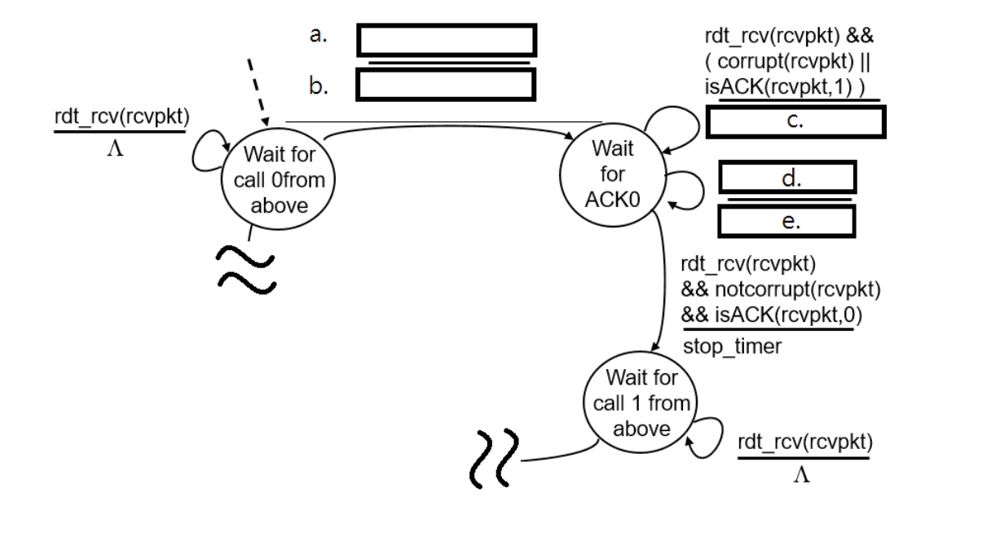

# 2021

### Q1
(3 marks) Naming in the Internet uses a hierarchical scheme called the ___?

**Answer:**
Domain Name System (DNS)

### Q2
- The UDP server described needed only one socket, whereas the TCP server needed two sockets. Why?
- If the TCP server were to support $n$ simultaneous connections, each from a different client host, how many sockets would the TCP server need?


**Answer:**
TCP is connection-oriented, so it needs a socket to listen for connection requests and another socket to handle the connection. UDP is connectionless, so it only needs one socket to handle all requests.

### Q3
(2 marks) What encryption services are provided by HTTP?

**Answer:**
None

### Q4
(3 marks) Which system call attaches a local address to a socket?

**Answer:**
bind

### Q5
(2 marks) Which system call is to specify queu size for a server socket?

**Answer:**

### Q6
(10 marks) How long does it take a packet of length $1,000 bytes$ to propagate over a link of distance $2,500 km$, propagation speed $2.5 × 10^8 m/s$, and transmission rate $2 Mbps$? 

**Answer:**

### Q7
(10 marks) DNS resource record format is (name, value, type, ttl). A diferent type has the corresponding name and value which has the different meaning. What are the meanings of name and value when the types is "A" (5 marks) and "NS" (5 marks) respectively?

**Answer:**


### Q8
(2 marks) If a web server wants to save the user login name in the client side, then the client can send back the user login name at later access, which method can it use?

**Answer:**

### Q9
(3 marks) In the TCP/IP model, which layer deals with reliability, flowm control, and error congestion?

**Answer:**

### Q10
(10 marks) Following is a DNS database for `ncu.edu.tw`:

```shell
ncu.edu.tw 86400 IN MX mail.ncu.edu.tw
ncu.edu.tw 86400 IN MX smtp.ncu.edu.tw
mail.ncu.edu.tw 86400 IN A 140.115.54.87
smpt.ncu.edu.tw 86400 IN A 140.115.12.21
theworld.ncu.edu.tw 86400 IN A 140.4.87.63
cs.ncu.edu.tw 86400 IN A 140.115.13.24
cs.ncu.edu.tw 86400 IN MX dio.ncu.edu.tw
dio.ncu.edu.tw 86400 IN CAME theworld.ncu.edu.tw
```

What is the mail server address for `jojo@cs.ncu.edu.tw`?


**Answer:**

`140.4.87.63`

### Q11
(10 marks) Suppose that UDP reciever computes the Internet checksum for the received UDP segment and finds that it matches the value carried in the checksum field. Can the receiver be absolutely certain that no bit errors have occurred? Explain.

**Answer:**

### Q12
(10 marks) Is it possible for an applicstion to enjoy reliable data transfer even when the application runs over UDP? If so, how?

**Answer:**


### Q13 
Q: Suppose Host A wants to send a larfe file to Host B. The path from Host A to Host B has three links, of rates $R1 = 500 kbps$, $R2 = 2 Mbps$, and $R3 = 1 Mbps$.

- (5 marks) Assuming no other traffic in the network, what is the thoughput for the file transfer?
- (5 marks) Suppose the file is $4 × 10^6 bytes$ Dividing the file size by the throughput, roughly how long will it take to transfer the file to Host B?


**Answer:**

### Q14
Q: The picture below is part of rdt 3.0 finite state machine, fill in th blank below, please write down your answer on the answer sheet. (3 marks for each a, b, c, d, e.)



**Hint:**
- The main change from rdt 1.0 to 2.9: ACK, checksum.
- The main change from rdt 2.0 to 3.0: Timer.

**Answer:**


