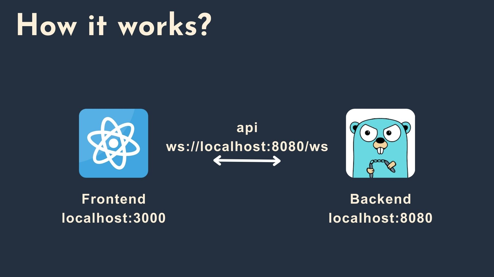

# Online Anonymous Multi-User Message Board


[](https://github.com/1chooo/multi-message-board)
[](https://golang.org "Go to Go homepage")
[](https://reactjs.org "Go to ReactJS homepage")
[](../LICENSE "Go to license section")

**Table of Contents**
- [Online Anonymous Multi-User Message Board](#online-anonymous-multi-user-message-board)
  - [Get Started](#get-started)
    - [Frontend with ReactJS](#frontend-with-reactjs)
    - [Backend with GO](#backend-with-go)
  - [Introduction](#introduction)
  - [Features](#features)
  - [Languages and Tools](#languages-and-tools)
  - [Project Structure](#project-structure)
    - [Backend](#backend)
    - [Frontend](#frontend)
  - [License](#license)


## Get Started

### Frontend with ReactJS
```shell
$ mkdir frontend
$ cd frontend
$ npm install -g create-react-app
$ npx create-react-app .
$ yarn add node-sass
```

### Backend with GO
```shell
$ mkdir backend
$ cd backend
$ go mod init github.com/1chooo/socket-programming
$ go get github.com/gorilla/websocket
```

## Introduction



## Features


## Languages and Tools


## Project Structure

### Backend
```
backend/
├── pkg/websocket
│   ├── client.go
│   ├── pool.go
│   └── websocket.go
├── Dockerfile
├── go.mod
├── go.sum
└── main.go
```

### Frontend
```
frontend/
├──   :
├──   :
├── src/
│   ├── api/
│   │   └── index.js
│   ├── components/
│   │   ├── ChatHistory/
│   │   │   ├── ChatHistory.jsx
│   │   │   ├── ChatHistory.scss
│   │   │   └── index.js
│   │   ├── ChatInput/
│   │   │   ├── ChatInput.jsx
│   │   │   ├── ChatInput.scss
│   │   │   └── index.js
│   │   ├── Footer/
│   │   │   ├── Footer.jsx
│   │   │   ├── Footer.scss
│   │   │   └── index.js
│   │   ├── Header/
│   │   │   ├── Header.jsx
│   │   │   ├── Header.scss
│   │   │   └── index.js
│   │   ├── Message/
│   │   │   ├── Message.jsx
│   │   │   ├── Message.scss
│   │   │   └── index.js
│   │   ├── App.css
│   │   ├── App.js
│   │   ├──   :
│   │   └──   :
├──   :
└──   :
```

## License
Released under [MIT](../LICENSE) by [Hugo ChunHo Lin](https://github.com/1chooo).

This software can be modified and reused without restriction.
The original license must be included with any copies of this software.
If a significant portion of the source code is used, please provide a link back to this repository.
