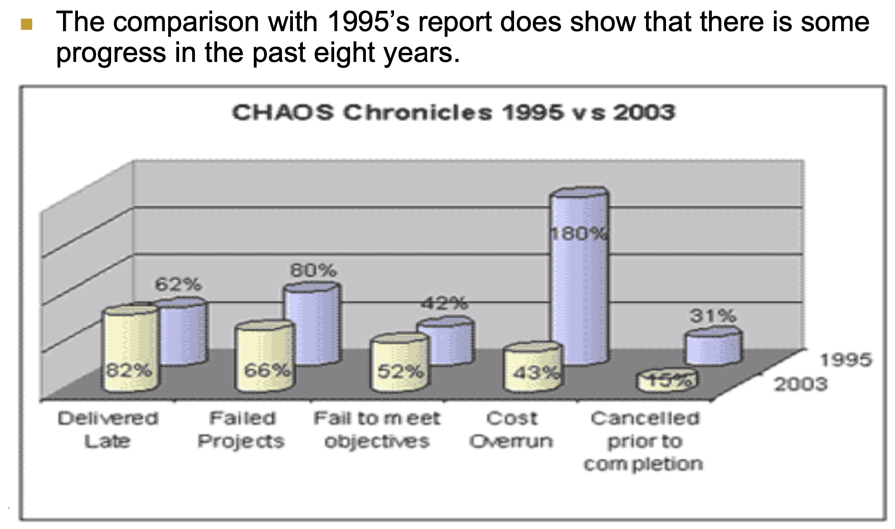

# Week 3 (CH2 Software Engineering History)

> [SE6005] Software Engineering
> 
> Year: 2024 Spring   
> Lecturer: 鄭永斌 (YPC), 梁德容 (DRL), 莊永裕 (YYZ) 業界師資 (EL) 等教授  
> Department of Atmospheric Sciences  
> Student: 林群賀  
> Student ID: 109601003

在這週的作業中，我選擇了第四個討論題目，命題為：「投影片第 17 頁描繪出了 1995 年到 2003 年軟體專案管理的進步，請問 2010 年之後有什麼新的變化？改進還是退步？抑或是出現了新的議題？」來進行以下討論。

<!-- 
    
  

 -->

我們可以從圖中觀察到從 1995 年到 2003 年的軟體專案管理的進步，其中包括了以下：

- Failed Projects
- Cost Overruns
- Cancelled prior to completion

而我們又可以看到管理的退步，包括了：
- Delivered Late
- Fail to meet objectives

我們可以看出軟體專案，我們越來越能掌握什麼樣的專案會失敗，我想這樣也是因為可以看出哪些專案的花費已經過高了，可以直接把專案給廢棄掉，同時也更能分析出產品是否可以在最後一刻確實上線。但是反觀我們也看到了軟體工程的交付時間越來越晚，同時也有越來越多的專案無法達到目標。我覺得會有這樣的原因是因為軟體的發展會導致規模越來越大，而且時代每天都在變化，也就是迭代會越來越快，所以客戶可能昨天要 A 方案，但是今天就突然臨時換成 B 方案，如此造成開發時程的延宕，也造成了工程師無法符合原先討論出的目標，甚至有些案例可能會導致產品都要上線了才發現整個方向是不對的，如此更增加了產品製作的難度。

接著我想參考報告的內容：

<!-- 
    
  

 -->

在 2010 年代，有更多的大規模開發框架，像是敏捷框架，`Large-Scale Scrum (LeSS)` 這個框架的出現無非是要讓工作流程變得更簡化，並且有更多的快速修正機會。

在這個例子中，我想要分享我之前在業界實習中實際有接觸到的敏捷開發，當初聽到敏捷 Agile 這個名詞的時候，我覺得這個名詞非常新穎，因為之前也沒聽過，單從字面上的意思，第一時間也聯想到很快的反應，不過這也確實是其中很重要的核心，因為現在時代的軟體產品規模都越來越大，也就是說，不只工作量繁重，也要應應時代快速的變動，當時的開發團隊適用 AI Model 去做產品，甚至開發出平台，但是光 AI 在去年的案例中，ChatGPT 的出現，讓很多 AI 產品的方向都變了，甚至團隊的管理角色也要快速決策去應應產業的變動，因為突然哪天冒出了個對手，把現在功能給實現，那勢必產品的方向及優勢可能要重新定位，這樣的情況下，敏捷開發就變得非常重要，因為這樣的開發方式可以讓團隊更快速的做出決策，並且快速的修正方向。同時也有比較小的試錯成本，因為一旦出現問題就馬上去解決掉。

甚至我還有看到有些公司為了讓產品能夠更快上線，更縮短開發時程，有些工程團隊寧願直接重構現有架構，讓兼容性變的更為重要，如此就把軟體給 divide 成非常多的小專案，就像是之前演算法學到的 `Divide and Conquer` 一樣，再透過底層的兼容性來整合產品，讓團隊不會因為一個需求改變，而需要重新釐清專案當初的設計架構，如此只要把需要改變方向的內容做更改，就可以直接上線，這樣的方式也讓產品的開發時程變得更為短暫。

最後想講講我的心得，那就是聽了兩個禮拜的課程，我開始覺得越來越多的產品上線是需要突破重重地困難，這個時代真的變得太快了，不只開發時程是緊湊，甚至是開發方向可能因為一個當代爆炸性的產品出現而整個作廢都有可能，因此我覺得這個世代若要能夠讓產品上線確實，需要保持快速應變能力，也就是說不只要對市場精準，連退路、多方發展都要考慮進去，甚至因為技術日新月異，同樣要保持高效的學習能力，並且還要有好的 Leadership 去引領團隊。
