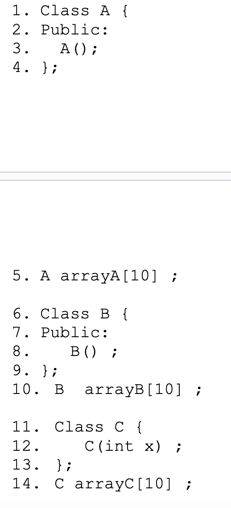

# Material 01 - Classes and Object

### Homework - Lab 01

Please write a correct programmer/manager class in C++

**PPT Source Code:**
```cpp
#include <iostream>
using namespace std;
class Employee
{
public:
    Employee(char *name, int id);
    ~Employee();
    char *getName() { return _name; }
    // Other Accessor methods
private:
    int _id;
    char *_name;
};
Employee::Employee(char *name, int id)
{
    _id = id;
    _name = new char[strlen(name) + 1];
    // Allocates an character array object
    strcpy(_name, name);
}

Employee::~Employee()
{
    delete[] _name;
}
int main()
{
    Employee programmer("John", 22);
    cout << programmer.getName() << endl;
    return 0;
}
```


```cpp
class Employee
{
public:
    Employee(char *name, int id);
    Employee(Employee &rhs);
    ~Employee();
    char *getName() { return _name; }
    int getId() { return _id; }
    // Other Accessor methods
private:
    int _id;
    char *_name;
};
Employee::Employee(char *name, int id)
{
    _id = id;
    _name = new char[strlen(name) + 1];
    // Allocates an character array object
    strcpy(_name, name);
}

Employee::~Employee()
{
    delete[] _name;
}
Employee::Employee(Employee &rhs)
{
    _id = rhs.getId();
    _name = new char[strlen(rhs.getName()) + 1];
    strcpy(_name, rhs._name);
}
```


### Homework - Lab 07

假設有以下兩個 class，請幫我們實作 Foo 類別的解構子，複製建構子和賦值運算子 (相信我，這題不像看起來的那麼簡單，請考慮 exception-safe和memory leak的各種可能問題) (參考：http://isocpp.github.io/CppCoreGuidelines/CppCoreGuidelines#S-ctor)


```cpp
#include <array>

class Bar {
private:
    std::array<int, 30> not_important_;
};

class Foo {
public:
    Foo()
        : bar_{new Bar{}} {}

    // Rule of three!
    Foo(const Foo& rhs) {
        // TODO: Not yet implemented.
        std::terminate();
    }

    Foo&
    operator=(const Foo& rhs) {
        // TODO: Not yet implemented.
        std::terminate();
    }

    ~Foo() {
        // TODO: Not yet implemented.
        std::terminate();
    }

private:
    // XXX: Well, this is not doing well in practical...
    // but hey, this is just some exercise. Please use
    // std::unique_ptr or std::shared_ptr instead.
    //
    // The Foo object will "own" this Bar pointer.
    Bar* bar_{nullptr};
};
```

### Homework - Lab 12

There is a compile error with the C++ code. Please point out the line number and explain why



### Homework - Lab 14

當你在撰寫 assign operator 時，其格式上大致如下 (以 String 型別為例)

```cpp
String& String::operator=(const String& rhs)
{
    ...
    return *this ;
}
```

請問說明為何這個 method 要回傳自己?

